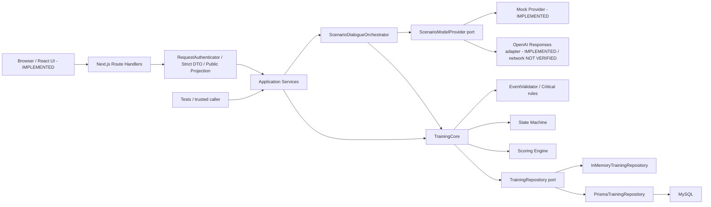

# Architecture

STATUS: IMPLEMENTED TECHNICAL DESIGN — Core / Mock / Persistence / HTTP / Credentials / Frontend / OpenAI adapter (network NOT VERIFIED)

[กลับ README](../README.md) · [Demo Assumptions](demo-assumptions.md)

## Reference policy

| ประเภทข้อมูล | ความหมาย |
|---|---|
| Proposal Requirement | สาระที่ตรวจพบใน Proposal v4; อาจยังไม่ได้ implement |
| Demo Assumption | รายละเอียด MVP ที่ผู้ใช้อนุมัติเพิ่ม ไม่ใช่ข้อกำหนดที่พิสูจน์จาก Proposal |
| Implemented Technical Design | พฤติกรรมที่อ่านยืนยันได้จากโค้ดปัจจุบัน |
| Planned / Not Implemented | งานอนาคต ไม่มี implementation ใน milestone นี้ |

อ้างอิง `Proposal_mitjee_revised_turnitin_v4.docx` ที่อยู่ใน `output/docx/`
ของ workspace ต้นทาง โดยไม่คัดลอกไฟล์เข้า code repository หรือแก้ไขไฟล์นั้น
ตรวจเดิมวันที่ 15 กันยายน และตรวจส่วนบัญชี/Auth ซ้ำวันที่ 18 กันยายน 2026; SHA-256:
`A41018AE9DBB7F15C252F90128CCF61A8FEF1FA9A64C5D11EF07E2F6E0207EF5`
โฟลเดอร์ `sources/` ของ workspace ว่าง ณ วันที่ตรวจ จึงไม่มีไฟล์เพิ่มเติมให้ยืนยัน
ผู้ที่อ่านจาก GitHub ต้องเข้าถึง reference ต้นทางแยกต่างหาก ไม่ได้แนบ private Proposal ในเอกสารนี้

| สาระจาก Proposal v4 | ตำแหน่ง | สถานะใน MVP |
|---|---|---|
| D/W/S, น้ำหนัก 50/30/20, ผ่านตั้งแต่ 70, Critical Failure override | Proposal v6 4.1.4 และ 5.3.6 | เก็บไว้เฉพาะผล template รุ่น 1–2; รุ่นใหม่ใช้กฎ categorical ตาม [Decision Evaluation](decision-evaluation.md) |
| Backend กำกับลำดับและ AI ไม่มีสิทธิ์สร้าง State/ข้ามขั้นตอนเอง | 5.3.4 | Implemented ด้วย Demo State Model |
| แนะนำเนื้อหาจากทักษะต่ำสุด โดยไม่ปรับความยากอัตโนมัติ | 4.1.4 และ 5.3.6 | คืน recommendation metadata แล้ว; เนื้อหาเต็มยัง Planned |
| แนวโน้มคะแนนย้อนหลังไม่เกิน 3 ครั้ง | 4.1.4 และ 5.3.6 | Planned; Core คิดผลของ Session ปัจจุบันเท่านั้น |
| ระบบเว็บ, สถานการณ์ 9 ประเภท, ข้อความและเสียงเฉพาะ Call Center | 4.1.5 และขอบเขตโครงงาน | ทำเฉพาะ SMS fixture + Mock/OpenAI text adapter; ส่วนอื่น Planned |
| Signup/login, Auth.js Session/Cookie, bcrypt hash/compare, Zod email/password, MySQL user data | Backend/MySQL และ Auth.js, bcrypt, Zod | Implemented; exact policy values เป็น Demo Assumptions |
| Moderation, การปิดบังข้อมูลและการทดสอบ Prompt Injection | 5.3.5 | มี local redaction/authority boundary บางส่วน ไม่ใช่ production implementation |

### ข้อขัดแย้งของแหล่งอ้างอิงที่รายงานแล้ว

คำสั่ง milestone นี้ให้จัดชื่อ enum ทั้งหกเป็น Demo Assumption และไม่อ้างว่า Proposal ระบุชื่อโดยตรง
แต่ไฟล์ v4 ที่ตรวจจริงในหัวข้อ 5.3.4 มีชื่อทั้งหกอยู่ในข้อความ
เอกสารนี้จึงคง **การจัดประเภทของ MVP ตามคำสั่งผู้ใช้** โดยไม่กล่าวอ้างว่าไฟล์ไม่มีชื่อเหล่านั้น
ดู [State Model](state-machine.md#demo-state-model); ต้องยืนยันฉบับอ้างอิงก่อนแก้ attribution ถาวร
ไม่มีการเปลี่ยน Proposal หรือ State Machine เพื่อแก้ความขัดแย้งนี้

## Component view

ลูกศรทึบแสดงการเรียกใช้/implementation ที่มีแล้ว; ลูกศรประแสดงส่วนที่ Planned
นี่คือมุมมอง module ภายใน backend และ Next.js API process ไม่ใช่ microservices ที่ deploy แยกกัน
ถ้า renderer ไม่รองรับ Mermaid ให้ใช้ตารางหน้าที่และ flow ข้อความด้านล่าง

| Component | หน้าที่ / authority |
|---|---|
| Next.js Server pages + interactive Client Components | Thai presentation, auth UX, public DTO fetch/mutations; no state/scoring/identity authority |
| Next.js Route Handlers | HTTP adapter; authenticate, validate transport, invoke application service, map safe errors |
| RequestAuthenticator | Auth.js verified session → minimal principal; Credentials + verified JWT/cookie; session resolver mock อยู่เฉพาะ tests |
| Application service / catalog | เลือก playable v2/DEFAULT, derive domain command จาก opaque public action ID; project public response |
| Composition root | lazy singleton ต่อ worker, ประกอบ Prisma → Repository → Core/Dialogue → Service และมี close/dispose |
| TrainingCore | start/resume, validate command, ประสาน Event/Opportunity/State/Result และ CAS commit |
| Template Validator | ตรวจ schema, graph, score mappings และ D/W/S บนทุก Safe Resolution path |
| EventValidator + Critical rules | ตรวจ explicit actions; candidate เป็น hint ไม่มีสิทธิ์สร้าง Event |
| State Machine | ตรวจ transition ID, required checkpoints และ event guards |
| Evaluation Engine | รุ่น 3 ตัดสิน categorical outcome จาก checkpoint ที่พบจริง; รุ่นเก่าคง D/W/S และ weakestSkills ตามประวัติ |
| Dialogue Orchestrator | ตรวจ request/session, สร้าง context, รอ Provider, validate/sanitize/fallback แล้วส่งให้ Core commit |
| Model Provider | คืน AICharacterResponse เท่านั้น ไม่ได้รับ callback หรือ reference ไป Core |
| OpenAI outer adapter | allowlisted context → Responses API non-streaming → strict schema; ไม่มี state/event/score authority |
| TrainingRepository | asynchronous port สำหรับ published versions และ Session aggregate |
| InMemory / Prisma adapters | คง ownership, identity, history และ atomic persistence semantics |

## Boundaries and data flow

HTTP request → RequestAuthenticator → strict Zod DTO → TrainingApplicationService
→ Core/Dialogue → repository → explicit public response projection
ownerId มาจาก authenticator เท่านั้น; catalog เป็น presentation/application policy ไม่ใช่ scoring rules
Template ไม่มี label ของ decision options จึงเพิ่ม label ใน catalog โดยไม่แก้ published configuration
คำขอเริ่มใช้ expectedRevision=0 และ startId; Session ใหม่เริ่ม revision 0 ตาม Core เดิม

Explicit action → Core.submit → parseAction → ownership/lifecycle/idempotency/revision
→ EventValidator → Opportunity/State Machine/Scoring → repository.save → result

Message → Orchestrator validation/sanitize → resume + version/state context
→ Provider → response schema/safety flags/sanitize หรือ fallback
→ Core.commitDialogueTurn → candidate inspection + FREE_TEXT validation → atomic save

Domain ไม่ import PrismaClient; port ใช้ types ของระบบเอง
Frontend/public contracts ถูกตรวจ transitive imports ใน architecture tests เพิ่มแล้ว:
ห้ามเข้าถึง Core, templates, server Auth, Prisma, bcrypt หรือข้อมูล environment
รวมถึง OpenAI SDK, provider implementation และ prompt; ตรวจ source dependency graph และ production client artifacts
Public Zod DTO และ account policy ใช้ schema เดียวกับ Backend ผ่าน module ที่ browser-safe
ดูรายละเอียด Server/Client Components, retry และหน้าเว็บใน [Frontend](frontend.md)
อย่างไรก็ตาม Core อ้าง dialogue response schema และ persistence contract ใช้ sanitizer จาก dialogue
จึงไม่อ้างว่า package แยกขาดจากกันทุกทิศทาง ประเด็นที่แยกชัดคือไม่มี Prisma dependency ใน Core
Provider context ไม่มี transitions, answer keys หรือ scoring rules และถูก freeze แบบลึก
Repository ไม่ตัดสินคะแนนแทน Scoring Engine; trusted caller ต้องเรียกผ่าน Core

## Evidence and scope

- [Core](../src/core.ts), [Domain model](../src/domain/types.ts), [Template Validator](../src/domain/template-validator.ts)
- [Dialogue](../src/dialogue/orchestrator.ts), [Repository port](../src/domain/training-repository.ts)
- [Prisma adapter](../src/persistence/prisma-repository.ts), [shared repository tests](../tests/repository-contract.ts)

HTTP/API, Email/Password Credentials, Frontend และ OpenAI adapter implement แล้ว (network NOT VERIFIED)
Voice/WebSocket ยังไม่ implement
ดู [API contract](api.md), [Security limitations](security.md) และ [Assumptions](demo-assumptions.md)
หลักฐานเพิ่ม: [Application](../src/application/training-service.ts), [Runtime](../src/server/runtime.ts),
[HTTP adapter](../src/http/handler.ts), [HTTP tests](../tests/http.integration.test.ts)

## Enforced dependency direction (Architecture Cleanup)

The baseline application imported HTTP request types, Zod response schemas and ApiError,
and kept the concrete HTTP/Prisma runtime in src/application/. That reverse dependency
is removed; this is an architecture refactor, not a Domain behavior change.

- Application owns [plain contracts](../src/application/contracts.ts): AuthenticatedPrincipal,
  StartTrainingInput, SendMessageInput, SubmitActionInput, QuitTrainingInput and public view models.
- [ApplicationError](../src/application/errors.ts) has semantic codes only. DomainError stays
  in Domain; [HTTP errors](../src/http/errors.ts) alone assign status/envelope/message.
- [HTTP mapping](../src/http/mapping.ts) copies validated DTOs into application inputs and
  validates public application views using HTTP-owned response schemas. No contract changes.
- Catalog/projections retain opaque action/option IDs and hidden-rule protection without
  importing HTTP. Local catalog Zod validation is application-owned payload-shape checking,
  not reuse of transport schemas and not scoring/transition authority.
- [Server runtime](../src/server/runtime.ts) is the outer composition root. HTTP invokes it;
  Application does not import HTTP, Auth.js, Next or concrete Prisma adapters.
- [Architecture tests](../tests/architecture.test.ts) scan literal imports/re-exports and
  transitive local dependencies: Application cannot reach HTTP/Auth/server/routes; Core,
  Domain, Dialogue and Persistence cannot reach Application or those outer layers.
  The conservative scanner has self-tests, rejects computed imports and requires review if
  path aliases are introduced; it is not a general-purpose TypeScript compiler.

Auth.js verified session → outer RequestAuthenticator → application principal → Core ownerId.
Core and persistence do not import Auth.js or know how the user signed in. The existing
Core/dialogue cross-references documented above are unchanged; no blanket claim of a
perfectly acyclic graph is made. [Approved Credentials design and source attribution](authentication.md)
remain explicit. No bypass or dependency-test exception was introduced.

## Account integration (18 September 2026)

Registration HTTP / Credentials authorize → AccountService → AccountRepository port
→ PrismaAccountRepository → MySQL UserAccount; PasswordHasher port → BcryptPasswordHasher.
Training continues through its existing independent service/Core/repository path.
Only the verified opaque UUID crosses into Training as ownerId, never email or password.

AccountService/ports have no Auth.js/HTTP/Prisma/Training imports; concrete adapters live outside.
Architecture tests additionally prohibit Core/Domain/Dialogue from reaching account/hash/persistence
implementations. Shared server/database.ts owns one lazy pool; training and account runtimes
compose independent services. No HTTP or server imports enter Application.
Published templates, scoring, Event authority, CAS and Dialogue behavior remain unchanged.
