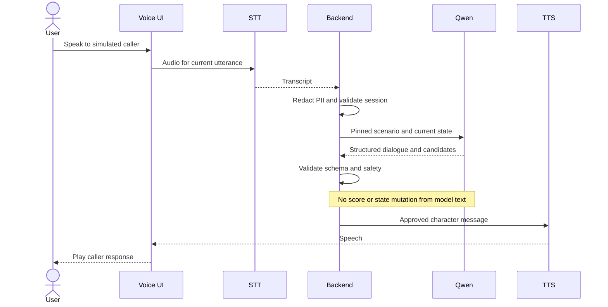
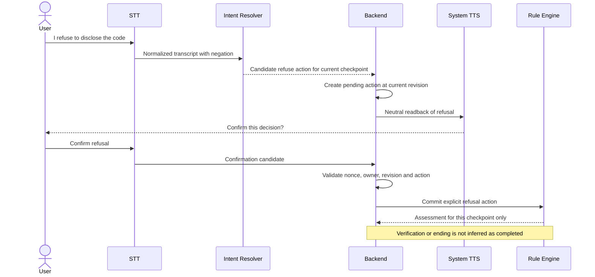
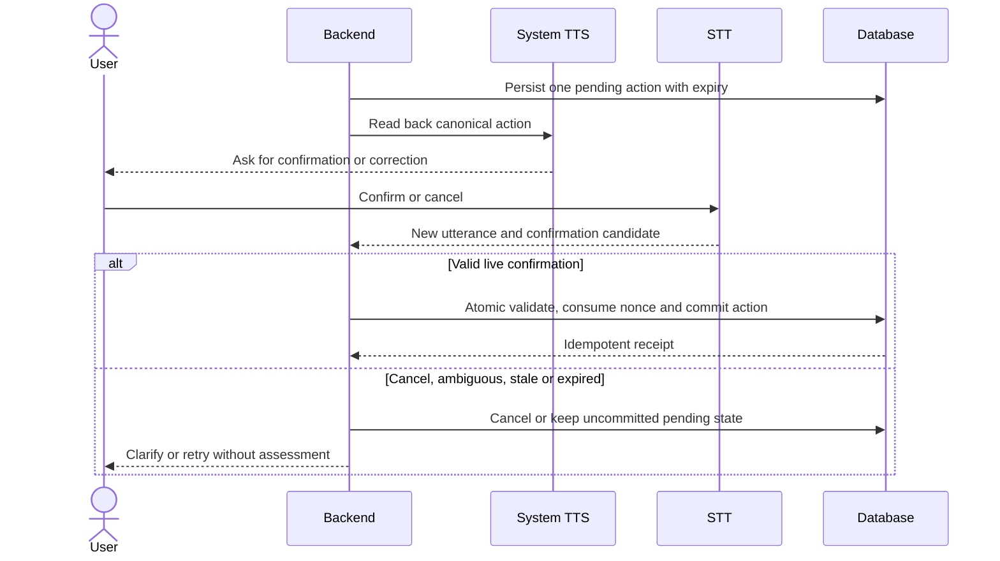
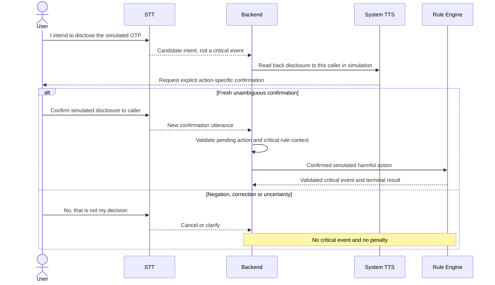
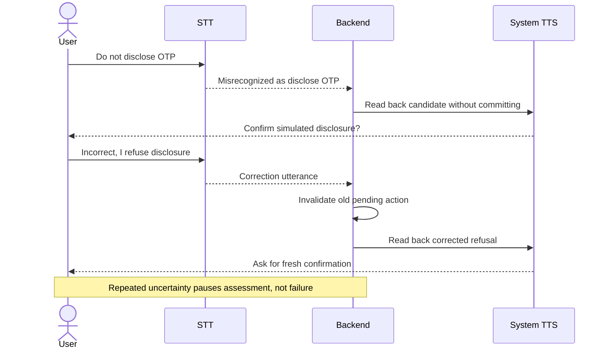
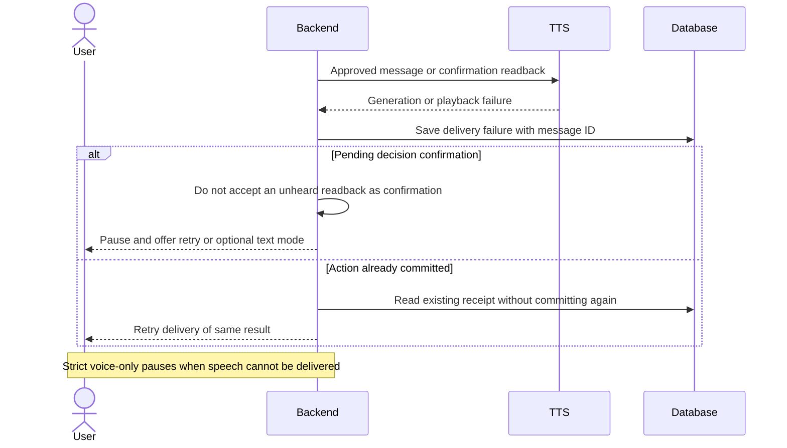

# MITJEE: Full Qwen Proposal and Architecture Recheck

Review date: 2026-09-27 (Asia/Bangkok). Review only; no implementation, model download, training, migration, or provider change.

> **Historical baseline — ไม่ใช่สถานะ runtime ล่าสุด:** ป้าย `[CURRENT CODE]` และผลทดสอบในรายงานนี้อ้างถึงการตรวจวันที่ 27 กันยายน 2026 เท่านั้น เก็บไว้เพื่อรักษาที่มาของการวิเคราะห์ ไม่ควรนำข้อความว่า Voice/WebSocket หรือ NORMAL_CALL ยังไม่ทำไปใช้เป็นสถานะปัจจุบัน
>
> ตรวจ alignment วันที่ 2 ตุลาคม 2026 ที่ `7ce29f87d247c457789489a3e0e7091e005c24b2`: มี Mock/OpenAI/Groq adapters, backend NORMAL/SCAM 50/50, Azure speech adapters, Voice UI และ WebSocket แล้ว แต่ไม่มี Qwen-specific serving adapter หรือ voice-only confirmed-action workflow; Game/Knowledge Base ยังเป็น planned domains ดู [สถานะการทดสอบจริง](realtime-verification.md)
>
> Runtime NORMAL_CALL เป็นเจ้าหน้าที่ห้องสมุดสมมตินัดรับหนังสือ ไม่ใช่ CC-N01/CC-N02 เป้าหมายใหม่ ดู [Current runtime alignment](scenario-story-bank.md#18-current-runtime-alignment) ข้อเสนอขยาย 9/21/30 เรื่องในรายงานเก่านี้เป็นชุดการวางแผนเดิม ไม่ใช่หลักฐานว่า target ปัจจุบัน 19 scam families + 2 normal controls เล่นได้ครบแล้ว

## 1. Executive Summary

**[RECOMMENDATION] Verdict: เดินหน้าตามแนวทาง Qwen ได้ แต่ต้องแก้รายละเอียด proposal และผ่าน pilot ก่อนกล่าวอ้างว่าใช้งานได้ตามเป้าหมาย** ไม่จำเป็นต้องเปลี่ยน Rule Engine ทั้งชุด และไม่จำเป็นต้องใช้โมเดลฟังเสียงของ Qwen ร่วมกับ Qwen ที่สร้างบทสนทนา

| Finding | Verdict | หลักฐาน/ข้อจำกัด |
|---|---|---|
| GOOD: Qwen candidate | เหมาะแก่การทดลองแบบจำกัดบทบาท | [OFFICIAL FACT] รุ่นมีอยู่จริง; [RECOMMENDATION] ให้สร้างข้อความและ candidate เท่านั้น |
| HIGH: คุณภาพภาษาไทย/latency | ยังไม่ผ่านการพิสูจน์สำหรับ MITJEE | [CURRENT CODE] ไม่มีผลทดลอง Qwen บน RTX 5060 ที่ตรวจพบ |
| MEDIUM: Local inference | **FIT WITH CONSTRAINTS** | [PROJECT ASSUMPTION] Q4_K_M, context 2K–4K, ผู้ใช้พร้อมกัน 1 คน, STT ไม่แย่ง GPU |
| HIGH: Fine-tuning | เป็นการทดลอง ไม่ใช่สิ่งที่รับประกันว่าจะดีขึ้น | [RECOMMENDATION] เปรียบเทียบ A/B/C/D ก่อนเลือก final artifact |
| HIGH: Database | **NEEDS MAJOR EXTENSION สำหรับขอบเขตใหม่ทั้งหมด** | [CURRENT CODE] ฐานเดิมใช้ต่อได้ แต่ขาด provenance, voice confirmation, game และ lesson domain |
| HIGH: Rule policy | **KEEP WITH CHANGES** | [CURRENT CODE] categorical engine มีอยู่; label และ optional/early-exit semantics ต้องชัด |
| BLOCKER: Voice-only readiness | ทำได้ในเชิงออกแบบ แต่ยังไม่พร้อมใช้จริง | [CURRENT CODE] ไม่มี voice pipeline/pending confirmation; [RECOMMENDATION] เพิ่มก่อนประเมินจากเสียง |
| HIGH: Scope | เอกสารใหม่กับ roadmap ปัจจุบันขัดกัน | [SOURCE REQUIREMENT] เกม 8 คดีและบทเรียน 16 เรื่องกลับเข้าขอบเขตแล้ว |

### Evidence boundary

- **[SOURCE REQUIREMENT]** แหล่งหลัก: `MITJEE_Proposal_Update_Qwen_Game_2026-09-26.docx` ใน `output/docx/` ของ parent workspace (นอก Git checkout `mitjee-rule-based`); SHA-256 `55b41b0a383348f30a905dcfbd3c41abdcf7ed77bee323ad8c1f2795f05f227b`. ไม่ได้คัดลอกหรือแก้ DOCX ในรอบนี้
- **[CURRENT CODE]** ตรวจ repository `9Tanaka/Project_mitjee`, branch `feat/rule-based-evaluation`, baseline commit `db7b0bba34a75ca8844211d1bb1eb93aa80f1ba3`. ลิงก์ไฟล์ในรายงานอ้าง snapshot นี้; report commit เกิดภายหลังและเปลี่ยนเฉพาะไฟล์นี้
- **[SOURCE REQUIREMENT]** เอกสารเก่า `Proposal_mitjee_revised_turnitin_v6.docx` ใช้เป็น baseline ความต่าง ไม่ใช้ลบล้าง proposal ใหม่; decisions เก่าใน recovery/roadmap เป็นหลักฐานประวัติ ไม่ใช่ scope ปัจจุบันโดยอัตโนมัติ
- **[MEASURED RESULT]** รอบนี้รัน unit/fixture tests 6 files: `decision-rules`, `additional-scenarios`, `scenario-authority`, `quiz`, `quiz.snapshot`, `prisma-assessment-decoding`: **62 passed**, ไม่มี skipped ในชุดที่เลือก (Vitest รายงาน 4.04 s). ไม่ใช่ model benchmark, native MySQL integration หรือ browser/voice E2E
- **[CURRENT CODE]** [Recovery verification](recovery-verification.md) เคยรายงาน 475 passed/48 skipped; ตัวเลขนี้เป็นผลย้อนหลัง ไม่ใช่ผลรัน full suite ในรอบนี้
- **[RECOMMENDATION]** ใช้ป้าย `SOURCE REQUIREMENT`, `CURRENT CODE`, `OFFICIAL FACT`, `PROJECT ASSUMPTION`, `MEASURED RESULT`, `RECOMMENDATION` แยกที่มา; severity `BLOCKER/HIGH/MEDIUM/LOW/GOOD` ไม่ใช่คะแนนคุณภาพเชิงตัวเลข

## 2. Proposal Update vs Current Repository

**[SOURCE REQUIREMENT + CURRENT CODE + RECOMMENDATION]** ตารางนี้แยกความขัดแย้ง โดยไม่ได้เปลี่ยน requirement หรือไฟล์ต้นฉบับแทนผู้ใช้

**[GOOD / SOURCE REQUIREMENT]** เอกสารใหม่ระบุอยู่แล้วว่าเป็นแผนทดลอง ไม่ใช่ผลสำเร็จ, hyperparameters เป็น pilot, throughput เป็นประมาณการ และ JSON ไม่รับประกันความปลอดภัย. รายงานนี้ให้คงคำเตือนเหล่านั้นไว้และเพิ่มหลักฐาน/รายละเอียดที่ยังขาด ไม่ได้พบว่าเอกสารอ้างผลทดลองสำเร็จแล้ว

| หัวข้อ | OLD PROPOSAL | NEW PROPOSAL UPDATE | CURRENT CODE | RECOMMENDED FINAL VERSION |
|---|---|---|---|---|
| AI | GPT-5.4 mini; กล่าวถึง backup | Qwen3-4B-Instruct-2507 + QLoRA + local GGUF | mock/OpenAI adapter; roadmap กล่าวถึง Luna จาก approval เก่า | Qwen เป็น target; คง authority boundary; ระบุ migration ยังไม่ทำ |
| State/result | มี weighted score และ model output เสนอ next_state | engine คุม state; categorical results | current contract ไม่มี model-authoritative next_state/score; มี DECISION_RULES_V1 | ใช้ backend state/decision validation เดิมเป็นฐาน |
| Score | D50/W30/S20, ผ่าน 70 | SAFE/REVIEW/UNASSESSED และ critical override | categorical สำหรับ playable templates; legacy modes ยังอยู่เพื่อประวัติ | ห้ามแปลง categorical เป็นคะแนน 0–100 หรือเขียนทับผลเก่า |
| Voice | cloud STT/TTS | Whisper small CPU pilot; Azure STT alternative; Azure TTS | ยังไม่มี voice; recovery docs ระบุ Azure STT/TTS | แยก STT/LLM/TTS; ตัดสินจาก confirmed action; voice-only เป็นข้อเสนอเพิ่มเติม |
| Call variant | มีแนวคิด normal/scam ในแนวทางเดิม | เน้นผู้โทรแอบอ้าง ไม่บังคับ normal-call | SCAM_CALL text; NORMAL_CALL + 50/50 อยู่ใน docs แต่ไม่ implement | ไม่ถือ NORMAL_CALL เป็น requirement ใหม่; ต้องอนุมัติ policy ก่อน |
| Game | เกม 8 คดีเดิมมีเนื้อหาทับบาง scenario | 8 investigation cases ชุดใหม่ | ไม่มี game; docs ระบุ excluded | คืนเข้าขอบเขตใน proposal แต่บอกว่ายังไม่สร้าง |
| Knowledge | 16 lessons | 9 category + 7 skill lessons | recommendation keys มี แต่ lesson module ไม่มี; docs excluded | คืน 16 lessons พร้อม version/tags และเส้นทาง recommendation |
| Quiz | อย่างน้อย 200; pre/post/review | 210, 7 กลุ่ม, 20 ต่อรอบ, frozen baseline/review answers | pre/post, snapshots, receipts มี; standalone review mode ไม่ใช่สิ่งเดียวกับดูเฉลย | แยก review เฉลยออกจากโหมดฝึกซ้ำ; อย่าเพิ่มโหมดโดยตีความเอง |
| Data dictionary | เคยวางจำนวนตารางไว้ล่วงหน้า | ต้อง trace model/rules/game และไม่ล็อกจำนวน | Prisma มี 12 models ไม่ใช่ 30 | ออกแบบจาก concepts/relations; ห้ามยืนยัน field หรือตารางเท่าเดิม |
| Timeline/cost | cloud runtime model | ประมาณ training + local inference | ไม่มี Qwen training/deployment benchmark | แยกค่า training, integration, content, user study และ recurring audio |

**[CURRENT CODE] Evidence:** [provider selection](../src/server/scenario-provider.ts), [OpenAI adapter](../src/providers/openai-scenario-provider.ts), [dialogue contract](../src/dialogue/contracts.ts), [scoring](../src/domain/scoring.ts), [Prisma](../prisma/schema.prisma), [roadmap](implementation-roadmap.md), [Quiz](quiz.md). Roadmap บรรทัด 16, 36–38 และ recovery บรรทัด 18–20, 95 เป็นหลักฐาน scope conflict ไม่ใช่คำสั่งให้ใช้ scope เก่าต่อ

## 3. Qwen Feasibility

### Model identity and compatibility

**[OFFICIAL FACT]** ชื่อที่ตรวจคือ `Qwen/Qwen3-4B-Instruct-2507` ไม่ใช่ Qwen3-4B รุ่น thinking เดิมหรือ Qwen3.5. เป็น dense causal decoder, 4.0B parameters (non-embedding 3.6B), 36 layers, GQA 32 query/8 KV heads, native context 262,144, non-thinking instruct และ Apache-2.0. [Official model card](https://huggingface.co/Qwen/Qwen3-4B-Instruct-2507), [exact configuration](https://huggingface.co/Qwen/Qwen3-4B-Instruct-2507/blob/main/config.json).

**[OFFICIAL FACT]** Qwen3 family ระบุรองรับภาษาไทยในชุดภาษาหลากหลาย; รุ่น 2507 มีผลประเมิน multilingual และ instruction following รวม แต่ไม่ใช่ผลทดสอบบทสนทนาหลอกลวงภาษาไทยของ MITJEE. **[RECOMMENDATION]** ต้องตรวจภาษาไทยจริงโดยผู้ประเมินก่อนยืนยันว่าเหมาะสม ห้ามเอาคะแนน benchmark รวมมารับรองความสามารถเฉพาะงาน. [Qwen3 language coverage](https://qwenlm.github.io/blog/qwen3/).

**[OFFICIAL FACT]** llama.cpp มี Qwen3 implementation และ Qwen มีคู่มือแปลง/ใช้ GGUF. การใช้รุ่นนี้กับ tokenizer/chat template ของรุ่นอื่นอาจทำให้ format/EOS ผิด; ต้อง pin model revision, tokenizer files, conversion script และ llama.cpp commit. Transformers ที่เก่ากว่า 4.51.0 ไม่รองรับตามคำเตือน model card; เลือกเวอร์ชันที่ทดสอบร่วมกัน ไม่เพียงตั้ง minimum. [Qwen llama.cpp guide](https://qwen.readthedocs.io/en/latest/run_locally/llama.cpp.html), [Qwen3 implementation](https://github.com/ggml-org/llama.cpp/blob/master/src/models/qwen3.cpp).

**[OFFICIAL FACT]** llama.cpp รองรับ JSON-schema-constrained generation บางส่วนของ JSON Schema; นี่ควบคุมรูปแบบ ไม่พิสูจน์ความหมายหรือความถูกต้องของ event. API ปัจจุบันมีทั้ง Chat Completions และ Responses compatibility จึงไม่ควรอ้างว่าไม่รองรับ Responses เลย. **[RECOMMENDATION]** ทำ adapter contract test กับ build ที่ pin จริง; current OpenAI client hardcodes endpoint และ request/response assumptions จึงเปลี่ยนเพียง model name ไม่พอ. [Grammar limitations](https://github.com/ggml-org/llama.cpp/blob/master/grammars/README.md), [server API](https://github.com/ggml-org/llama.cpp/blob/master/tools/server/README.md).

**[RECOMMENDATION]** Tool/function calling ไม่จำเป็นต่อ core use case นี้ แม้โมเดลมีความสามารถด้าน tool use; ให้คืน allowlisted candidate ผ่าน schema และไม่ให้เรียกโอนเงิน เปลี่ยน state หรือบันทึกผลด้วยตนเอง

### Is 4B enough?

**[RECOMMENDATION]** Verdict ต่อไปนี้เป็นการประเมินความเหมาะสมเชิงสถาปัตยกรรม ไม่ใช่ผลวัด Qwen จริง; GOOD ENOUGH หมายถึงสมเหตุสมผลที่จะเริ่ม pilot ไม่ใช่ production acceptance

| Use case | Verdict | เหตุผล/เงื่อนไข |
|---|---|---|
| ข้อความไทยสั้นภายในหนึ่ง state | GOOD ENOUGH | งานแคบกว่าผู้ช่วยทั่วไป; ต้องผ่าน Thai review |
| คงน้ำเสียง/ตัวละครเฉพาะโครงงาน | POSSIBLE WITH FINE-TUNING | B อาจพอแล้ว; C ใช้เมื่อพบข้อผิดพลาดที่ dataset แก้ได้ |
| ใช้ recent history สั้นโดยไม่สร้างเรื่องใหม่ | GOOD ENOUGH | ส่ง structured state facts และจำกัด history |
| รักษา state ด้วย prompt เพียงอย่างเดียว | RISKY | ตรวจ state และ allowed behavior ฝั่ง server เสมอ |
| รับมือ prompt injection โดยโมเดลลำพัง | RISKY | prompt/FT ไม่ใช่ security boundary; quarantine/fallback |
| Structured response | GOOD ENOUGH | grammar + strict schema + semantic validation; วัด raw validity แยก fallback |
| Candidate intent/event | GOOD ENOUGH | เป็นข้อเสนอที่ผู้ใช้และ backend ต้องยืนยัน; ไม่ให้คะแนน |
| ตอบสั้นทันเวลาใน Call Center | RISKY | p95 ยังไม่วัด; STT/TTS รวมทำให้ช้ากว่า text |
| เป็นผู้ตัดสิน score/state/critical | NOT SUITABLE | ไม่ใช่หน้าที่ของโมเดล ไม่ว่าจะ 4B หรือใหญ่กว่า |

### Quality gates

**[SOURCE REQUIREMENT]** เป้าหมายเดิม schema >=95%, p95 <=10 s สำหรับ 1 user. **[RECOMMENDATION]** 95% ใช้เป็น pilot floor ได้ แต่ต่ำไปสำหรับ interactive acceptance: 20 turns ที่แต่ละ turn ถูก 95% จะมีโอกาสมีผิดอย่างน้อยหนึ่งครั้งประมาณ `1 - 0.95^20 = 64.2%` ภายใต้สมมติฐานอิสระ; เป็นภาพประกอบ ไม่ใช่การคาดการณ์ error distribution จริง

| Metric | Proposed gate [RECOMMENDATION] | Definition |
|---|---|---|
| Raw schema validity | >=99%; รายงาน numerator/denominator | ก่อน retry/fallback, รวม truncated/malformed failures |
| Accepted response validity | 100% ใน test suite | invalid ห้ามถึง UI/engine; fallback แยกจาก model success |
| Model state violation | <=1% pilot release target | ผู้ตรวจให้ label จาก allowed/forbidden behavior; backend illegal transition = 0 |
| Unsafe authoritative commits | 0 ใน adversarial/voice regression suite | ไม่ตีความว่า failure rate ในโลกจริงเป็นศูนย์ |
| Fallback rate | <=5% pilot; ต้องแจกแจงสาเหตุ | timeout, schema, safety, semantic mismatch แยกกัน |
| Thai quality | >=90% rated >=4/5 เป็นเป้าทดลอง | สองผู้ประเมิน blind; รายงาน agreement และตัดสินข้อขัดแย้ง |
| Thai reviewer agreement | weighted kappa target >=0.6 | metric/threshold เป็น project choice; ไม่ซ่อน raw distribution |
| Text latency | p95 <=10 s เป็น stretch acceptance target | ตั้งแต่รับ request จนข้อความที่ผ่าน validation พร้อมแสดง; รวม retry/fallback |
| Voice latency | วัดแยกและยังไม่รับประกัน 10 s | end of utterance ถึงเริ่มเล่นเสียง และถึงจบเสียงแยกกัน |

**[RECOMMENDATION]** แยก unsafe request rate เป็น (1) solicitation ของข้อมูลจริง/นอก sandbox ซึ่งต้องไม่แสดง และ (2) คำขอสมมติที่กำหนดในบทฝึก ซึ่งเป็นเนื้อหาที่อนุญาต ไม่ควรถูกนับเป็น safety failure ทั้งหมด; ทดสอบทั้ง over-refusal และ under-refusal

## 4. Fine-Tuning Feasibility

### Experiment design

**[SOURCE REQUIREMENT + RECOMMENDATION]** ใช้ held-out set เดียวกัน; “Base” ในที่นี้คือ Instruct-2507 ที่ยังไม่ fine-tune โดยโครงงาน ไม่ใช่ pretrained-only checkpoint

| Arm | Model/prompt | Purpose |
|---|---|---|
| A | Original Instruct + minimal scenario prompt | baseline |
| B | Original Instruct + compact improved prompt/schema | แยกประโยชน์ prompt/schema จาก training |
| C | QLoRA adapter merged into original model + B prompt | วัดผลของ adaptation |
| D | C converted to GGUF Q4_K_M + เทียบเท่า B prompt | วัด quantization/deployment impact |

**[RECOMMENDATION]** Tune ด้วย validation เท่านั้น แล้ว lock prompt/config/checkpoint ก่อนเปิด test. A–D ใช้ test cases/turns, sampling budget และ output cap เดียวกัน. วัด Thai naturalness, role consistency, state compliance, out-of-state rate, schema validity, safety/refusal, fallback, median/p95 latency, peak RAM/VRAM, prompt-processing และ generation tokens/sec แยกกัน

**[RECOMMENDATION]** ทดสอบ quality A–D บนเครื่อง cloud เดียวกันก่อน; FP16/BF16 4B + runtime ไม่ควรถูกบังคับใส่ 8 GB เพื่อให้ตารางดูเทียบได้. รายงาน local D performance ต่างหาก. เพิ่ม B-Q4 control หากทรัพยากรพอ เพื่อเทียบ B-Q4 กับ D บน RTX 5060 เดียวกัน. ใช้ llama.cpp F16 เทียบ Q4 ของ merged model หากต้องการแยก quantization ออกจาก runtime; Transformers C vs llama.cpp D มี runtime confound ต้องระบุ

**[RECOMMENDATION]** ใช้ paired evaluation ต่อ story family, สอง Thai reviewers ไม่เห็น arm, รายงาน disagreement/CI และผลราย category ไม่ใช่ค่าเฉลี่ยอย่างเดียว. เก็บ seed, prompt hash, tokenizer, max tokens, temperature, context, driver, library/build versions. วัด latency warm/cold แยก และอย่างน้อย 100 representative turns ต่อ configuration เป็น pilot; ไม่ตีความ p95 จากตัวอย่างไม่กี่รอบ

**[RECOMMENDATION]** หาก B ผ่านเกณฑ์และ C/D ไม่ดีขึ้นอย่างมีนัยเชิงงาน ให้เลือก baseline ที่ผ่านและรายงาน negative FT result อย่างตรงไปตรงมา; objective ควรเป็น “ศึกษาและประเมินการปรับแต่ง” ไม่รับประกัน “fine-tune แล้วแม่นยำขึ้น”

### Dataset sufficiency and leakage

**[SOURCE REQUIREMENT]** 3,600 short-context/target examples, 400/category; split 2,880/360/360. **[RECOMMENDATION]** พอเป็น pilot สำหรับ style/schema/task adaptation แต่จำนวนไม่พิสูจน์ความครอบคลุม และไม่ใช่ 3,600 เรื่องใหม่

**[CURRENT CODE]** มี underlying story เดียว/category. ทำ 400 paraphrases จากเรื่องเดียวแล้วสุ่มแบ่ง rows จะทำให้ผลดีเกินจริง. **[RECOMMENDATION]** สร้าง story families อิสระและ group split ก่อน augmentation; เก็บทุก turn/paraphrase/เสียงที่ถอดมาจากเรื่องเดียวใน split เดียวกัน รวม near-duplicate ข้าม category ด้วย

**[PROJECT ASSUMPTION]** ตัวอย่างที่ตรวจเลขได้: 20 families/category x 20 examples = 400; split families 16/2/2 ทำให้ได้ 320/40/40 ต่อ category รวม 2,880/360/360. แต่ test เพียง 2 families/category ยังมี coverage ต่ำ; เพิ่ม independent evaluation families เมื่อเวลาอำนวย ไม่อ้าง generalization กว้างจากชุดนี้

**[RECOMMENDATION]** Stratify state, tactic, safe/review/critical-candidate, early exit, ambiguous intent, Thai negation, STT typo, injection, out-of-scope และ fallback. Category balance 400 เท่ากันไม่เท่ากับ state/behavior balance; 8 templates ที่มีโครงเหมือนกันเสี่ยงเรียน shortcut. Target ต้องเป็นข้อความสมมติ ไม่ฝึกโมเดลออก authoritative score/next_state หรือข้อมูลส่วนบุคคลจริง

**[RECOMMENDATION]** Validate JSON targets, version ของ prompt/definition, deduplicate, human-check train samples และตรวจ val/test ทั้งหมด; track train/val loss ควบคู่ task metrics, early stopping, ดูอาการลืมคำสั่ง/จำชื่อเหตุการณ์/over-refusal. ห้ามนำ user-study post-test cases ไป fine-tune

### Hyperparameters and export

| Setting | Evaluation [RECOMMENDATION] | Small test/search |
|---|---|---|
| Cloud >=24 GB | reasonable pilot capacity, ไม่ใช่ guarantee | 4090 24 GB; measure peak allocation/reserved memory |
| QLoRA 4-bit | เหมาะสำหรับลด base-weight memory | NF4 + double quantization; BF16 compute เมื่อ stack รองรับ |
| Sequence 2048 | เริ่มได้เมื่อ examples ไม่ถูกตัด target | ตรวจ token length distribution; test 3072 เมื่อจำเป็น |
| Microbatch 1, accumulation 16 | effective batch 16 บน GPU เดียว | เทียบ effective 8/16 หาก validation แกว่ง |
| Rank 16 | reasonable pilot default | r8/r16; r32 เฉพาะเมื่อพบ underfitting |
| LR 1e-4 | pilot ไม่ใช่ validated optimum | 5e-5 vs 1e-4 ก่อน ไม่ทำ full grid |
| Epochs 1–3 | เลือก checkpoint จาก validation | ประเมินทุก epoch; หยุดก่อนเมื่อ overfit |
| Gradient checkpointing | ช่วย memory แลก compute | benchmark time/peak memory เปิดไว้เป็น baseline |
| ยังไม่ระบุใน proposal | ต้องบันทึกเพิ่ม | LoRA targets/alpha/dropout, optimizer, warmup, scheduler, seed, loss mask, packing |

**[OFFICIAL FACT]** PEFT รองรับการฝึก adapters บน quantized base; TRL รองรับ completion/assistant-only loss และ packing. Assistant-only loss ต้องตรวจ chat-template generation mask; TRL ปัจจุบันมี patch สำหรับบางตระกูลรวม Qwen3 แต่ต้องตรวจรุ่นที่ pin. [PEFT quantization](https://huggingface.co/docs/peft/developer_guides/quantization), [TRL SFT](https://huggingface.co/docs/trl/sft_trainer).

**[RECOMMENDATION]** Export flow: เก็บ adapter ต้นฉบับ -> โหลด base revision เดิมใน precision ที่เหมาะสมบน cloud -> merge adapter -> validate merged outputs -> export tokenizer/chat template -> convert GGUF -> quantize Q4_K_M -> evaluate D อีกครั้ง. NF4 training quantization ไม่ใช่ GGUF Q4_K_M; อย่าอธิบายว่าเปลี่ยนนามสกุลไฟล์ก็ใช้ได้. เผื่อ host RAM และ disk สำหรับ base/adapter/merged/F16 GGUF/Q4 หลายสำเนา; 50 GB อาจพอ pilot แต่ต้องตรวจ artifacts จริง. [PEFT merge](https://huggingface.co/docs/peft/v0.21.0/package_reference/lora#merge-lora-weights-into-the-base-model).

### Cost and time audit

**[SOURCE REQUIREMENT + PROJECT ASSUMPTION]** ตรวจคณิตศาสตร์ได้ดังนี้ แต่ throughput 250–800 tokens/sec ยังไม่ใช่ MEASURED RESULT:

```text
Useful training tokens = 2,880 x 1,200 x 3 = 10,368,000
At 800 tokens/s = 3.60 hours
At 250 tokens/s = 11.52 hours
Full-run allowance in proposal = 5–15 hours (estimated, not guaranteed)
If every example is padded to 2,048:
  processed positions = 2,880 x 2,048 x 3 = 17,694,720
  same throughput basis => 6.14–19.66 hours before evaluation/export
```

**[HIGH / RECOMMENDATION]** 250–800 เป็นช่วงสมมติที่ยังยืนยันกับ 4090/4B/NF4/seq2048 ไม่ได้; packing, padding, checkpointing, kernel, optimizer, mask และ I/O ทำให้ต่างมาก. ต้องระบุว่า tokens/sec นับ non-padding input positions หรือ padded compute positions; assistant loss tokens ไม่เท่ากับ compute ทั้ง sequence. Pilot หลัง warmup 50–100 optimizer steps เก็บ wall time/peak memory/eval overhead แล้ว extrapolate จากจำนวน steps ที่เหลือ

**[OFFICIAL FACT]** หน้าราคา Runpod ที่ตรวจ 27 Sep 2026 แสดง RTX 4090 24 GB ที่ $0.74/hour และ standard network volume ต่ำกว่า 1 TB ที่ $0.07/GB/month; availability/region/product อาจต่าง ให้ใช้ checkout quote ก่อนเช่า. [Runpod pricing](https://www.runpod.io/pricing).

**[PROJECT ASSUMPTION]** งบตัวอย่างเดิมคิด pilot 1–3 h + full runs สองครั้ง 10–30 h + merge/test 3–7 h = **14–40 GPU-hours**. ที่ราคาอ้างอิงและ 50 GB หนึ่งเดือน:

```text
GPU:       14–40 x $0.74        = $10.36–29.60
Storage:   50 x $0.07          = $3.50
Subtotal:                       $13.86–33.10
With 30% reserve:               $18.02–43.03
At assumed 35 THB/USD:          about 631–1,506 THB
```

**[RECOMMENDATION]** งบ 2,000 บาทสมเหตุสมผลเป็น provisional training budget สำหรับ pilot + limited runs ไม่ใช่ราคาเหมาทั้งโครงงานหรือ exhaustive A/B/hyperparameter search. อัตรา 35 บาทเป็น conversion assumption ไม่ใช่อัตราแลกเปลี่ยนปัจจุบัน. ไม่รวมภาษี, bandwidth/volume อื่น, idle GPU, failed runs, API เสียง, hosting, data labeling และ user study. หาก effective throughput ต่ำกว่าที่ตั้ง งบนี้ต้องปรับ

**[HIGH / RECOMMENDATION]** แยก “เวลาฝึก GPU” ออกจาก “เวลาพัฒนา”. 3,600 examples ใช้ตรวจ 1–3 นาที/example ก็เป็น 60–180 person-hours เฉพาะการตรวจ (PROJECT ASSUMPTION), ยังไม่รวมแต่ง story families. แผนย่อยสามช่วง 1–2 สัปดาห์รวมเป็น 3–6 สัปดาห์ ไม่ใช่ 4–6 เว้นแต่ระบุ buffer. 4–6 สัปดาห์อาจเป็น ML workstream เมื่อข้อมูลพร้อม ไม่ควรรับรองทั้ง voice, เกม 8 คดี, lessons 16, DB, integration และ study โดยไม่ทราบทีม/ชั่วโมงทำงาน

## 5. Local RTX 5060 Deployment

### Memory and speed

**[RECOMMENDATION] Verdict: FIT WITH CONSTRAINTS** สำหรับหนึ่ง concurrent generation, Q4_K_M, context 2048–4096, offload ให้มากที่สุดและไม่รัน STT บน GPU เดียวกันโดยไม่วัดก่อน. ไม่ใช่คำรับรองว่าเครื่องผู้ใช้ถูก benchmark แล้ว

**[OFFICIAL FACT]** Configuration ระบุ 36 layers, 8 KV heads, head dimension 128. สำหรับ FP16 KV cache หนึ่ง sequence:

```text
KV bytes = 2 (K,V) x 36 x 8 x 128 x 2 bytes x context_tokens
         = 147,456 bytes/token
2,048 => 288 MiB = 0.28125 GiB
3,072 => 432 MiB = 0.421875 GiB
4,096 => 576 MiB = 0.5625 GiB
```

**[RECOMMENDATION]** ตัวเลขนี้เป็น theoretical KV storage ไม่รวม alignment/runtime buffers และไม่ใช้ 32 query heads แทน 8 KV heads. ดู [official config](https://huggingface.co/Qwen/Qwen3-4B-Instruct-2507/blob/main/config.json).

| Component | Estimated footprint [PROJECT ASSUMPTION unless noted] |
|---|---|
| Q4 weights | ประมาณ 2.3–2.7 GiB; 4B x 4 bits เป็น floor ไม่ใช่ขนาดจริง |
| KV 2K/4K | 0.281/0.563 GiB จากสูตรข้างต้น |
| Compute/workspace/runtime | เผื่อ 0.5–1.5 GiB; ขึ้นกับ batch/ubatch/build |
| Windows/display/other apps reserve | เผื่อ 0.5–1.5 GiB; ต้องวัดเครื่องจริง |
| Planning total | ราว 3.6–6.3 GiB; ไม่ใช่ measured peak และอาจสูงกว่านี้ |
| Host RAM | 16 GB เป็น pilot starting point, 32 GB สบายกว่าสำหรับ web+DB+CPU STT; ไม่ใช่ vendor minimum |

**[OFFICIAL FACT: artifact metadata, third-party publisher]** ไฟล์ `Qwen_Qwen3-4B-Instruct-2507-Q4_K_M.gguf` ของ bartowski มีขนาด 2,497,280,736 bytes (~2.326 GiB) ตาม HF metadata ที่ตรวจ; ใช้ประกอบ estimate ขนาดเท่านั้น ไม่ใช่ official Qwen quantization หรือ proof คุณภาพของ adapter ที่จะฝึกเอง. ไม่มีการดาวน์โหลด weights ใน review นี้. [Artifact publisher](https://huggingface.co/bartowski/Qwen_Qwen3-4B-Instruct-2507-GGUF/tree/main).

**[OFFICIAL FACT]** NVIDIA ระบุ RTX 5060 เป็น compute capability 12.0. **[RECOMMENDATION]** ใช้ CUDA driver/toolchain และ llama.cpp build ที่รองรับ Blackwell; pin build และ smoke-test จริง. เมื่อ memory ไม่พอให้ลด context/ubatch หรือบาง GPU layers; CPU offload ลดแรงกดดัน VRAM แต่ latency อาจแย่ลง. ตั้ง context ชัดเจน อย่าปล่อย runtime จัดสรรตาม 262K ของ model. [NVIDIA GPU list](https://developer.nvidia.com/cuda/gpus), [llama.cpp build](https://github.com/ggml-org/llama.cpp/blob/master/docs/build.md).

**[PROJECT ASSUMPTION]** ยังไม่มี tokens/sec ที่รับรองได้สำหรับเครื่องนี้. เพื่อทดสอบ sensitivity เท่านั้น: ถ้า generation 15/30/60 tokens/sec, output 120 tokens จะใช้ decode 8/4/2 s; ยังไม่รวม prompt evaluation, queuing, validation หรือ STT/TTS. ไม่ใช่การคาดว่า RTX 5060 จะทำได้ในช่วงนี้. วัด prompt throughput และ generation throughput แยกจาก end-to-end p95

### Context budget

**[PROJECT ASSUMPTION]** ตัวอย่าง budget รวม input + output ไม่ใช้จำนวนตัวอักษรไทยแทน token:

| Component | 2048 budget | 3072 budget | 4096 budget |
|---|---:|---:|---:|
| System/safety instructions | 350 | 450 | 500 |
| Persona + current state + allowed actions | 300 | 400 | 500 |
| Schema/format instructions | 250 | 300 | 350 |
| Backend factual summary | 150 | 220 | 300 |
| Recent dialogue | 450 | 900 | 1400 |
| Current user message | 200 | 250 | 300 |
| Reserved output | 250 | 300 | 400 |
| Template/control-token margin | 98 | 252 | 346 |
| Total | 2048 | 3072 | 4096 |

**[HIGH / CURRENT CODE]** [Orchestrator](../src/dialogue/orchestrator.ts) lines 84–85 เก็บ 12 messages x 2,000 characters; [request builder](../src/providers/openai-prompt.ts) line 42 ตั้ง output 1,200 tokens. ไม่ใช่ budget ที่รับรองว่าจะใส่ context 2,048 ได้; timeout 20 s x 2 attempts ยังอาจใช้เกือบ 40 s ก่อน fallback ต่างจาก p95 target

**[RECOMMENDATION]** เริ่ม 2048 เฉพาะ compact scenario ที่วัดด้วย tokenizer ของ revision จริงแล้ว. ทดลอง 3072 เป็นตัวเลือกกลาง/4096 เมื่อ history จำเป็น; KV เพิ่มไม่มากตามสูตรแต่ prefill cost เพิ่ม. ส่งเฉพาะ current-state facts, last 2–4 relevant turns, server-built summary; เก็บ safety/current decision constraints เสมอ ตัด oldest dialogue ก่อน. หาก current turn เกิน budget ให้ขอผู้ใช้พูดสั้นลง ไม่ตัดคำปฏิเสธ/ส่วนสำคัญเงียบ ๆ. ใช้ request token preflight รวม chat template/schema และ output reserve; ห้ามอ้างว่าตารางนี้เป็นผล tokenize จริง

## 6. Database Adequacy

**[CURRENT CODE]** [Prisma schema](../prisma/schema.prisma) มี 12 models: Scenario, ScenarioTemplateVersion, TrainingSession, TrainingAction, SessionOpportunity, TrainingEvent, DialogueTurnReceipt, TrainingMessage, TrainingResult, UserAccount, QuizAttempt, QuizReceipt. จำนวนนี้เป็น code fact ไม่ใช่การยืนยัน normalization ครบทุก requirement ใหม่

| New requirement | Current support [CURRENT CODE] | Gap / recommendation |
|---|---|---|
| Template version | composite templateId/version/variant + configuration JSON | GOOD; ใช้ immutable version และ hash เพิ่มได้ |
| Model/version | ไม่มี field ใน session/turn receipt | HIGH; model repo+revision+artifact hash |
| Adapter/quantization | ไม่มี | HIGH; adapter hash, merge ancestry, Q4_K_M/build config |
| Prompt version | template context มี แต่ไม่มี exact prompt assembly version | HIGH; prompt/schema/tokenizer version และ hash |
| Evaluation version | evaluationMode เช่น DECISION_RULES_V1 + template config | MEDIUM; exact rule policy/evaluator code revision ยังต้อง trace |
| Training history/results | session/actions/events/result/checkpoint assessment มี | GOOD; หมายถึงประวัติผู้เรียน ไม่ใช่ ML training experiments |
| Critical events | backend-validated event fields มี | GOOD; voice confirmation provenance ยังไม่มี |
| Quiz frozen/pre-post | QuizAttempt snapshot/answers/result/bankVersion/blueprint; QuizReceipt | GOOD; ตรวจ semantics ตาม quiz tests; ไม่ต้องเขียนใหม่ |
| Voice pending/confirmation | ไม่มี lifecycle record | BLOCKER สำหรับ resume/replay-safe voice decisions |
| Game versions/evidence/session/mission result | ไม่มี domain | HIGH; ห้ามใส่ใน TrainingSession แบบไม่มี domain distinction |
| Lessons and recommendation target | recommendation JSON/keys มี; lesson entity/catalog ไม่มี | HIGH; ต้อง resolve key ไป published lesson version ได้ |
| ML dataset/experiment/evaluation registry | ไม่มี | MEDIUM; Git manifests + artifact folder พอเริ่มได้ |

### Minimal provenance design (conceptual only)

**[RECOMMENDATION]** มี immutable `ModelDeploymentManifest` ใน Git/experiment folder: base repo/revision, tokenizer revision, dataset version/split hash, adapter ID/hash (nullable เมื่อ baseline), merged hash, GGUF hash, quantization, conversion/runtime commit, context/output limits, decoding config, training/evaluation report references. ไม่เก็บ weights ใน MySQL

**[RECOMMENDATION]** Session pin `deploymentManifestId/hash`, `promptVersion/hash`, `outputSchemaVersion`, `evaluationPolicyVersion`, `evaluatorBuildCommit`. Turn receipt ระบุ actual deployment reference ถ้าระบบอนุญาตเปลี่ยนระหว่าง session; ทางง่ายกว่าคือไม่เปลี่ยนจนจบรอบ. Retry/fallback ต้องบอก model attempt/failure reason ไม่อ้าง scripted fallback เป็นคำตอบของโมเดล. ประวัติที่ไม่มี metadata ระบุ `unknown_legacy` ไม่เติมชื่อโมเดลย้อนหลังจาก env ปัจจุบัน

**[RECOMMENDATION]** ใช้ combination: Git JSON/YAML manifests สำหรับ configuration/split/checksums; experiment folders/object storage สำหรับ metrics/checkpoints; MySQL สำหรับ learner sessions และ references. ไม่ต้องเริ่มด้วย MLflow/Kubernetes/model-weight tables. ไม่ commit PII, secrets หรือ raw study transcripts ลง Git

### Game and lesson storage (conceptual only)

**[RECOMMENDATION]** เนื้อหา 8 cases แบบคงที่เริ่มจาก versioned JSON manifests ได้: `GameCase + GameCaseVersion + EvidenceDefinition` เป็น immutable definitions พร้อม validation/hash. ถ้าต้องมี editor/publish workflow ค่อยแยก relational definition tables

**[RECOMMENDATION]** Runtime ควรมี relational `GameSession` (owner, case/version/hash, lifecycle, revision), `GameAction/Receipt` (idempotency, inspected/collected evidence IDs, verification action, decision/reason), `MissionResult` (rules version, outcome/feedback). `CollectedEvidence` และ `InvestigationDecision` อาจเป็น action types หรือ normalized child tables ตาม query needs ไม่บังคับต้องสร้างครบ 7 tables ตามชื่อแนวคิด. Frozen snapshot ใน session ช่วย replay แม้ case ถูกแก้; immutable evidence definition ไม่ควรคัดลอกซ้ำทุก click

**[RECOMMENDATION]** Lessons 16 เรื่องใช้ versioned content manifest + stable lesson IDs/skill tags ได้ก่อน; user completion/bookmark ต้องมี runtime storage หากอยู่ใน scope. Voice เพิ่ม pending action/confirmation receipt ที่ผูก session revision/owner/expiry/nonce และ consumption transaction; ควรเก็บ canonical action/provenance ไม่จำเป็นต้องเก็บ raw audio

**[RECOMMENDATION] Verdict: NEEDS MAJOR EXTENSION** เมื่อรวมทุก scope ใหม่; เฉพาะ Qwen provenance เป็น **NEEDS SMALL EXTENSION**. ไม่ได้หมายถึงทิ้ง 12 models หรือเพิ่มจนได้ 30. ID ใหม่เป็น `CHAR(n)` ได้ตาม convention ที่เลือก แต่ schema เดิมมี VARCHAR/CHAR ผสม จึงไม่ควรเปลี่ยนความยาว/ชนิดทั้งหมดในงาน review

## 7. Rule-Based Review

### Logical soundness

**[SOURCE REQUIREMENT]** ให้ `A` เป็น encountered assessment checkpoints หลังยกเว้น checkpoint ที่มีเหตุผล, `r_i in {SAFE, REVIEW, UNASSESSED}`, `U = sum(1[r_i=REVIEW])`, `N = sum(1[r_i=UNASSESSED])`, `C` เป็น validated critical bit และ `T` เป็น safe terminal bit

```text
C = 1                              => CRITICAL_FAILURE
C = 0 and (T = 0 or N > 0)          => UNASSESSED
C = 0 and T = 1 and N = 0 and U > 0 => NEEDS_PRACTICE
C = 0 and T = 1 and N = 0 and U = 0 => PASSED
```

**[GOOD / RECOMMENDATION]** สูตร mutually exclusive และ exhaustive เมื่อ C/T เป็น Boolean, U/N เป็น nonnegative integers และทุก r_i อยู่ใน enum. แบ่ง C ก่อน; ถ้า C=0 แบ่ง incomplete vs complete; complete แบ่ง U=0 หรือ >0 ครบทุกกรณี. Critical precedence สมเหตุสมผล ไม่ให้ข้อดีอื่นเฉลี่ยกลบการกระทำเสี่ยงที่ยืนยันแล้ว

**[CURRENT CODE]** [scoring.ts](../src/domain/scoring.ts) lines 21–22 ไม่สร้าง official result ให้ active/abandoned/expired; categorical result lines 70–78 สอดคล้อง core precedence. [core.ts](../src/core.ts) lines 151–179 แยก quit, safeResolution และ terminal result. `T` ไม่ได้เก็บตรง ๆ แต่เกิดจาก trusted transition และ COMPLETED/end_scenario; ต้องรักษา invariant นี้ ไม่ให้ client/LLM ส่ง T

| Edge case | Review [RECOMMENDATION] |
|---|---|
| ACTIVE / ABANDONED / EXPIRED | แสดง incomplete lifecycle ไม่ใช่ “สอบตก”; ไม่มี official result เว้นแต่มี committed critical ที่ engine จบ FAILED แล้ว |
| C=1 และ checkpoint อื่นยังไม่ตอบ | Critical มี precedence; ไม่จำเป็นบังคับตอบให้ครบก่อนแสดงผล |
| Safe exit ก่อนตอบ checkpoint | ยกเว้นเฉพาะเหตุที่ template กำหนดและบันทึก exemption reason ไม่ลบประวัติ REVIEW เก่า |
| A ว่าง, T=1, C=0 | PASSED เฉพาะ safe-exit path ทำได้ตามสูตร; แสดง coverage 0 และ “ยุติอย่างปลอดภัย ยังไม่ได้ประเมินทักษะอื่น” ไม่แสดง mastery |
| Optional checkpoint ไม่เคยเปิด | ไม่อยู่ใน A; ไม่เสียผล |
| Optional checkpoint เปิดแล้วไม่ตอบ | ต้องกำหนดชัดว่าอยู่ A หรือ exempt; ปัจจุบันเปิดแล้วนับ UNASSESSED แม้ navigation ไม่บังคับตอบ |
| ข้อมูลผิด enum/negative counts | invalid data ไม่ควรถูกตีเป็น PASSED; fail closed/incomplete และแจ้งระบบ |

**[HIGH / CURRENT CODE]** SMS `w-extra` เป็น `required:false` แต่เมื่อเข้า create_pressure แล้วเปิด checkpoint และออกโดยไม่ตอบ จะยังถูกนับ UNASSESSED ใน result. คำว่า optional ใน navigation จึงไม่เท่ากับ optional assessment. **[RECOMMENDATION]** เลือกหนึ่ง policy ก่อนล็อก: required-if-encountered แล้ว UI/voice ต้องให้ตอบ หรือ optional-exempt ที่บันทึกเหตุข้ามและไม่เข้า A; รายงานนี้ไม่เปลี่ยนเอง

### SAFE versus REVIEW across all categories

**[CURRENT CODE]** [eight-category factory](../src/fixtures/scam-scenarios.ts) ใช้ d1 verify=SAFE, wait/trust=REVIEW; w1 ต้องเลือก warnings ครบและไม่เลือก neutral; d2 refuse=SAFE, ask-caller/continue=REVIEW; s1 verify-end-report/end-contact=SAFE แต่ dismiss=REVIEW. [SMS v3](../src/fixtures/sms-phishing-decision-rules.ts) แปลง rating safe -> SAFE และอื่น -> REVIEW, v4 เพิ่ม feedback

| Category | SAFE mapped actions | REVIEW mapped actions / validity issue |
|---|---|---|
| Call Center | verify, refuse OTP, end/report | wait/ask caller/continue; คำว่า wait ไม่พิสูจน์ว่าไม่ปลอดภัย |
| Investment | verify provider, refuse transfer, end/report | waiting/asking recruiter; ควรแยกชะลอโอนเพื่อตรวจจากรอคำชักจูง |
| Romance | verify identity, refuse money, end/report | asking contact/waiting; การชะลอความสัมพันธ์ไม่ใช่ unsafe โดยตัวมันเอง |
| E-commerce | verify store, refuse off-platform payment, end/report | wait/continue; ตรวจราคาหรือเปรียบเทียบอย่างอิสระควรมี action ต่างหาก |
| SMS/Phishing | source verification, refuse, official-channel decision, safe end | hesitant/trust, ask sender/continue, ask friend/ignore, dismiss; ต้องแยกถามคนช่วยตรวจจากเชื่อเพื่อนแทนหลักฐาน |
| Task | verify job, refuse deposit, end/report | wait/continue; feedback ต้องบอกเรื่องจ่ายเพื่อถอน ไม่กล่าวโทษการรอ |
| Fake Loan | verify provider, refuse app, end/report | current refusal event เป็น REFUSE_SENSITIVE_INFO ไม่สื่อ app โดยตรง |
| Recovery | official verification, refuse remote access, end/report | current refusal event เป็น REFUSE_SENSITIVE_INFO ไม่สื่อ remote control โดยตรง |
| Job | verify company, refuse fee, end/report | generic factory ไม่ได้ประเมิน money-mule action แม้ description กล่าวถึงบัญชี |

**[HIGH / RECOMMENDATION]** REVIEW ควรหมายถึง “ยังไม่มีหลักฐานว่าทำครบตามเกณฑ์ของ checkpoint นี้/ควรฝึกเพิ่ม” ไม่ใช่ทุก choice ที่ไม่ใช่คำตอบที่ผู้เขียนชอบเป็นอันตราย. ปรับ wait ให้มี context ชัด: รอคำตอบจากผู้ติดต่อเดิมโดยไม่ตรวจ vs หยุดธุรกรรมเพื่อค้นช่องทางอิสระ. อย่าเก็บพฤติกรรมที่เทียบเท่ากันคนละผลเพียงเพราะ wording

**[HIGH / CURRENT CODE]** `end-contact` SAFE กับ `dismiss` REVIEW ใน 8 categories ต่างส่ง END_CONTACT; SMS `end-only` กับ `dismiss-without-checking` มีปัญหาคล้ายกัน. **[RECOMMENDATION]** ถ้าต้องการแยกให้ระบุ observable action/obligation ที่ต่างจริง เช่น ignore known compromise vs end suspicious unsolicited contact; มิฉะนั้น unify assessment ใน policy revision ใหม่โดยรักษาประวัติเดิม

**[MEDIUM / CURRENT CODE]** [event-validator.ts](../src/domain/event-validator.ts) lines 60–73 ให้ W SAFE เมื่อเลือกครบทุก warning และไม่มี false positives เป็น all-or-nothing. **[RECOMMENDATION]** คง categorical ได้ แต่ feedback ต้องบอก missed/incorrect evidence รายชิ้น ไม่กล่าวว่าไม่รู้เลยเพราะพลาดหนึ่งข้อ; อย่าอ้าง psychometric validity จากการมี rule อย่างเดียว

### Critical actions and final policy

**[CURRENT CODE]** [critical validator](../src/domain/critical-failure.ts) ตรวจ explicit confirmed SIMULATED_ACTION, state, open checkpoint, allowed event และ rule. ข้อความอิสระไม่ authoritative. Five critical behaviors มีพื้นฐานเหมาะกับสถานการณ์สมมติ แต่ไม่ใช่ว่าการโอน/ติดตั้งแอป/remote access ทุกกรณีในโลกจริงเป็น Critical

**[RECOMMENDATION]** OTP/password ต้องเป็นการเลือกเปิดเผยให้ผู้ติดต่อ/หน้า phishing ในบริบทที่นิยาม; unverified transfer ต้องตรง target ที่ยังไม่ผ่าน verification; app และ remote control ต้องเป็นแหล่งไม่เชื่อถือใน case นี้. ตรวจ negation, quotation, hypothetical, “อย่าทำ”, past reports และ STT errors ก่อนเสนอ action; คำว่า “โอเค” ไม่เท่ากับ confirmed harm

**[RECOMMENDATION] Rule verdict: KEEP WITH CHANGES.** Final conceptual pseudocode (ไม่ใช่การแก้ source):

```text
validate template/rule versions and persisted state invariants
if invalid: return SYSTEM_REVIEW_REQUIRED; never infer PASSED
if validated committed critical event exists:
    require compatible terminal lifecycle
    return CRITICAL_FAILURE
if lifecycle in ACTIVE, ABANDONED, EXPIRED:
    return no_official_result(lifecycle, assessment_status=UNASSESSED)
require trusted terminal transition, not model-proposed completion
A = opened checkpoints minus explicit versioned exemptions
normalize unanswered checkpoints as UNASSESSED
assert each assessment is SAFE, REVIEW or UNASSESSED
T = backend-confirmed safe terminal reached
U = count REVIEW in A
N = count UNASSESSED in A
if not T or N > 0: return UNASSESSED
if U > 0: return NEEDS_PRACTICE
return PASSED with assessed_coverage, exemptions and path-limited explanation
```

**[RECOMMENDATION]** `SYSTEM_REVIEW_REQUIRED` ใน pseudocode เป็น error handling concept ไม่ใช่ outcome ใหม่ที่อนุมัติแล้ว. PASSED หมายถึงผ่าน path ที่ประเมินเท่านั้น; แสดง template/story/version, encountered/assessed/exempt counts และไม่ให้ badge mastery จาก early exit อย่างเดียว. ให้ผู้เชี่ยวชาญตรวจ mapping และ pilot กับผู้เรียนก่อนใช้กล่าวอ้างความเที่ยงตรง

## 8. Voice-Only Decision Architecture

### Authority and confirmation

**[RECOMMENDATION]** ทำ voice-only โดยไม่มี decision buttons ได้: `Mic -> STT -> normalized transcript -> Intent Resolver -> pending candidate -> system readback -> explicit voice confirmation -> backend validation -> Rule Engine`. Qwen/ classifier/ deterministic patterns เป็น candidate resolver ได้ทั้งหมด แต่ไม่มี authority ให้ SAFE/critical/next_state

**[SOURCE REQUIREMENT]** Proposal ใหม่กำหนด confirmed action และยกปุ่มเป็นตัวอย่าง. **[RECOMMENDATION]** เพิ่ม voice-confirmed action เป็นข้อกำหนดใหม่อย่างชัดเจน ไม่เขียนว่า repo รองรับแล้ว. Action จะ authoritative เมื่อ backend validate/commit สำเร็จ ไม่ใช่เพราะ STT ได้คำว่า “ยืนยัน” เพียงคำเดียว

**[RECOMMENDATION]** Normalization ห้ามทิ้งคำปฏิเสธ เช่น ไม่/อย่า/ยังไม่. Resolver ใช้ state-scoped action vocabulary, negation/quotation checks และ ambiguity outcome; confidence ใช้เรียก clarification ไม่ใช้เป็นคะแนน. Critical candidates ต้องผ่าน readback เสมอ และใช้คำยืนยันที่เฉพาะเจาะจงกว่า “ใช่” เมื่อมีความเสี่ยง

**[HIGH / RECOMMENDATION]** ตัวอย่าง “ไม่บอกรหัส เดี๋ยวโทรกลับเอง” สนับสนุน candidate REFUSE_OTP และ intention to verify/end แต่ **ยังไม่พิสูจน์ VERIFY_SOURCE และ END_CONTACT ที่ดำเนินการแล้ว**. ห้าม bundle ข้าม checkpoint ที่ยังไม่เปิด. ใน current request_action ให้ยืนยัน refusal ที่อนุญาตก่อน; verification/end ต้องเป็น action/transition ที่ template กำหนด. จะมี compound voice action ได้เมื่อ template ใหม่ระบุ semantics และ atomic validation ของทั้งชุด ไม่ใช่เพราะ LLM เสนอสาม event

**[RECOMMENDATION]** แยกเสียง “ระบบยืนยันการตัดสินใจ” จากเสียง caller ชัดเจน และพัก caller generation ระหว่าง confirmation. Readback เป็น deterministic system text ไม่ผ่าน Qwen; ไม่บอกว่า action ถูกหรือผิดก่อนผู้ใช้ตัดสินใจ เพราะจะ coaching ผล study. ใช้ OTP สมมติหรือ placeholder ไม่อ่านข้อมูลจริงกลับ

**[RECOMMENDATION]** Pending action ต้องผูก owner/session, current state, template/rule versions, revision, action IDs/candidate hash, utterance ID, nonce, expiry และสถานะ pending/confirmed/cancelled/expired/consumed. มี pending เดียว/session; commit แบบ idempotent + revision checked transaction. Confirm หลัง state เปลี่ยน, หลัง expiry, replay หรือจาก owner อื่นต้อง reject. Persist canonical action และ confirmation receipt เช่นเดียวกับปุ่ม พร้อม origin=VOICE; ไม่ต้องเก็บ raw audio

**[RECOMMENDATION]** Critical confirmation barrier คือ utterance แรกเสนอ action + system readback + utterance ใหม่ยืนยันแบบเฉพาะเจาะจง; หากใช้สองชั้น ต้องเป็นคนละ live turn ไม่ reuse transcript “ยืนยัน” เดิม. ไม่จำเป็นถามซ้ำทุก action ปกติจนเหนื่อย. ปิดรับไมค์ขณะ system TTS เล่นหรือใช้ echo-aware input gating, utterance boundaries และ playback IDs เพื่อไม่ให้เสียงระบบยืนยันตัวเอง; เริ่มจาก half-duplex ง่ายกว่า barge-in

**[RECOMMENDATION]** STT ผิด “ไม่ให้ OTP” -> “ให้ OTP”: readback -> ผู้ใช้พูด “ไม่ใช่/แก้ไข” -> cancel pending -> ขอพูดใหม่; ไม่มี event/penalty ระหว่างนี้. จำกัด retry แล้ว pause/offer optional text fallback. ถ้า strict voice-only จริง ให้ pause/retry แทนบังคับใช้ text; fallback ที่เป็นข้อความเป็น accessibility option และต้องระบุว่าออกจาก strict voice-only. เก็บ correction count เพื่อประเมิน usability ไม่หักคะแนนความรู้

**[RECOMMENDATION]** Confirmation barrier ลดความเสี่ยงแต่ไม่ทำให้ STT ถูกต้องเสมอ: คำยืนยันครั้งที่สองอาจถอดผิดได้เช่นกัน. สำหรับ critical ให้ใช้ action-specific phrase, ตรวจคำปฏิเสธ/คำขอแก้ไขก่อน positive match, reject เมื่อมีหลายความหมาย และวัด false acceptance ของ confirmation แยกจาก transcription CER. เมื่อไม่มั่นใจให้คง uncommitted/pause ไม่ใช้ confidence สูงแทน explicit confirmation

**[HIGH / RECOMMENDATION]** Warning-evidence checkpoint ปัจจุบันเป็นการเลือกหลักฐานบนจอ; voice-only ต้องมี auditory evidence IDs/readout และยืนยันรายการที่เลือกให้เทียบเท่ากัน ไม่ให้ Qwen สรุปว่า “พบสัญญาณครบ” เอง. ทดสอบว่าการอ่านตัวเลือกไม่เฉลย warning ให้ผู้เรียนก่อนตอบ

**[SOURCE REQUIREMENT + CURRENT CODE] NORMAL_CALL:** เอกสารใหม่ไม่บังคับ; docs เดิมเสนอ normal/scam 50/50 แต่ normal policy ยังไม่กำหนด. **[RECOMMENDATION / NEW IMPLEMENTATION DECISION]** อาจช่วยลดการตอบ “ทุกสายคือ scam” แต่ต้องอนุมัติ labels, evidence และ false-positive policy ใหม่ก่อน; ไม่รวม normal ในจำนวน stories/เวลา/ผลปัจจุบัน

### 8.1 Scam voice conversation

**[RECOMMENDATION]** ทุก diagram ด้านล่างเป็น target architecture ไม่ใช่ implementation ปัจจุบัน



### 8.2 Safe decision



### 8.3 Voice confirmation



### 8.4 Critical decision confirmation



### 8.5 STT correction



### 8.6 Qwen failure

```mermaid
sequenceDiagram
    actor U as User
    participant B as Backend
    participant Q as Qwen
    participant T as TTS
    participant D as Database
    U->>B: Dialogue turn
    B->>Q: Bounded request
    Q-->>B: Timeout or invalid structured output
    B->>B: Limited retry within total turn deadline
    alt Valid retry
        B->>T: Validated character message
    else Retry fails or budget exhausted
        B->>D: Record fallback reason, no assessment from failure
        B->>T: Authored current-state fallback or pause notice
    end
    T-->>U: Play approved response
    Note over B,D: Preserve committed actions; failure never invents a result
```

### 8.7 TTS failure



## 9. Nine Scenario Content Diversity

### Actual repository inventory

**[CURRENT CODE]** นับจาก [catalog](../src/application/catalog.ts), [composition](../src/application/composition.ts), [eight-category factory](../src/fixtures/scam-scenarios.ts) และ SMS v1/v2/v3/v4. “Template identity” ไม่เท่ากับ version และการเปลี่ยน feedback ไม่ใช่ story ใหม่

| Category | Template identity | Registered versions / playable | Variant | Underlying stories | Current state/checkpoint definitions |
|---|---|---|---|---:|---|
| Call Center | call-center-scam | v1 / v1 | SCAM_CALL | 1 | 5 states / 4 checkpoints |
| Investment | investment-scam | v1 / v1 | DEFAULT | 1 | 5 / 4 |
| Romance | romance-scam | v1 / v1 | DEFAULT | 1 | 5 / 4 |
| E-commerce | ecommerce-scam | v1 / v1 | DEFAULT | 1 | 5 / 4 |
| SMS/Phishing | sms-phishing-demo | v1–v4 / v4 | DEFAULT | 1 | 6 / 6; normal route encounters 5 |
| Task | task-scam | v1 / v1 | DEFAULT | 1 | 5 / 4 |
| Fake Loan | fake-loan-scam | v1 / v1 | DEFAULT | 1 | 5 / 4 |
| Recovery | recovery-scam | v1 / v1 | DEFAULT | 1 | 5 / 4 |
| Job | job-scam | v1 / v1 | DEFAULT | 1 | 5 / 4 |

**[CURRENT CODE]** รวม 9 template identities, 12 registered template-version entries, 9 currently playable entries, 9 identity/variant pairs แต่ variant labels มี 2 แบบ (DEFAULT/SCAM_CALL), 9 underlying stories. SMS v2 เพิ่ม dialogue, v3 categorical, v4 feedback ไม่ใช่ 4 เรื่อง. นี่คือ runtime registration จาก code ไม่ใช่ผล query ฐานข้อมูลที่ deploy แล้ว. Voice implementation และ NORMAL_CALL story มี 0

**[HIGH / RECOMMENDATION]** หนึ่งเรื่อง/category เพียงพอสำหรับ functional demo และ fixture regression แต่ไม่พออ้างการประยุกต์ความรู้ต่อเรื่องใหม่. เล่นซ้ำรู้คำตอบได้แม้ Qwen เปลี่ยนถ้อยคำ. Content diversity ต้องต่างใน evidence, pressure, request, verification route และ consequence ไม่ใช่เปลี่ยนชื่อ/จำนวนเงิน. User study แบบหนึ่ง exposure ยังทำได้ แต่ต้องจำกัดข้อสรุปและใช้ independent transfer test

### Suggested authored story counts and titles

**[RECOMMENDATION]** Minimum คือ demo ไม่ใช่ evaluation-ready. Recommended เป็น independent authored playable stories; dataset training families อีกชั้นหนึ่ง ไม่ควรนับ 400 rows เป็น 400 sub-scenarios. Nice-to-have ไม่เป็น scope commitment ใหม่

| Category | Minimum | Recommended for evaluation | Nice-to-have | Candidate titles only |
|---|---:|---:|---:|---|
| Call Center | 1 | 3 | 4 | สายตรวจสอบบัญชีธนาคาร; สายอ้างคดีจากเจ้าหน้าที่; สายพัสดุและศุลกากร; สายอ้างระงับบริการโทรคมนาคม |
| Investment | 1 | 3 | 4 | กลุ่มรับประกันกำไร; แพลตฟอร์มคริปโตถอนเงินไม่ได้; ที่ปรึกษาลงทุนแอบอ้าง; ค่าปลดล็อกกำไร |
| Romance | 1 | 2 | 3 | คนรู้จักออนไลน์กับเหตุฉุกเฉิน; ความสัมพันธ์ที่นำไปสู่การลงทุน; ของขวัญจากคนรักกับค่ารับพัสดุ |
| E-commerce | 1 | 2 | 3 | ร้านลดราคาชวนจ่ายนอกระบบ; ผู้ซื้อกับสลิปปลอม; พรีออร์เดอร์ที่เร่งเก็บมัดจำ |
| SMS/Phishing | 1 | 3 | 4 | พัสดุค้างส่ง; แจ้งบัญชีต้องยืนยัน; เงินคืนภาษีผ่านลิงก์; QR พาเข้าหน้าชำระเงินเลียนแบบ |
| Task | 1 | 2 | 3 | ภารกิจกดออร์เดอร์ต้องสำรองเงิน; ยอดถอนถูกล็อกเพราะทำผิดขั้นตอน; ภารกิจกลุ่มที่กดดันให้เติมเงิน |
| Fake Loan | 1 | 2 | 3 | สินเชื่ออนุมัติแต่ต้องจ่ายก่อน; แอปเงินกู้ขอสิทธิ์เกินจำเป็น; อ้างเลขบัญชีผิดเพื่อเรียกเงินแก้ไข |
| Recovery | 1 | 2 | 3 | ผู้ติดตามเงินคืนขอควบคุมเครื่อง; ทนายสมมติรับประกันเงินคืน; ค่าปลดล็อกทรัพย์สินที่อ้างว่าตามพบ |
| Job | 1 | 2 | 3 | งานที่เรียกค่าฝึกอบรม; งานรับและส่งต่อเงิน; งานต่างประเทศกับค่าดำเนินการล่วงหน้า |
| Total | 9 | 21 | 30 | ไม่รวม normal-call ที่ยังไม่อนุมัติ |

**[RECOMMENDATION]** จัด scenario IDs/version ใหม่เมื่อ evidence/rules เปลี่ยน, test ทุกเส้นทาง, ไม่ reuse ชุดที่เพิ่งเฉลยเป็น post-training transfer measurement. Recommended 21 เรื่องเพิ่มภาระ authoring/QA ชัดเจน; หากทีมทำไม่ทัน ให้ล็อก 9 demo + independent assessment แล้วรายงาน limitation แทนสัญญา 21 โดยไม่วางเวลา

## 10. Play-Time Estimation

**[PROJECT ASSUMPTION]** ต่อไปนี้เป็น design estimates ไม่ใช่ measured play time และ Max หมายถึง slow-user planning allowance ไม่ใช่ hard maximum. Critical/early exit อาจจบเร็วกว่าค่า Min; network failure/การช่วยเหลืออาจนานกว่า Max

```text
Ttotal = Tintro + Tdialogue + Tdecision + Tinspection
       + Tconfirmation + Tlatency + Tresult

Tdialogue (text)  = อ่านบทสนทนา + พิมพ์คำตอบ
Tdialogue (voice) = เวลาพูดผู้ใช้ + playback เสียง caller
Tdecision        = คิด/เลือกการกระทำ ไม่รวมเวลายืนยัน
Tinspection      = ตรวจหลักฐานที่ยังไม่ถูกนับใน dialogue
Tconfirmation    = system readback playback + คิด/พูด confirm/correct
Tlatency         = เวลารอ STT/resolver/Qwen/TTS/commit ที่ยังไม่ถูกนับ
Tresult          = อ่านผลและสะท้อนการตัดสินใจ
```

**[RECOMMENDATION]** รวมเฉพาะ user-visible waiting บน critical path; หาก streaming/processing ซ้อนกับ playback ห้ามบวกซ้ำ. STT/TTS generation เป็น latency แต่เสียงที่เล่นเป็น dialogue หรือ confirmation ตามชนิดข้อความ. Confirmation ไม่เรียก Qwen ซ้ำโดยไม่มีเหตุ จึงไม่คูณ model latency ทุก yes/no

### Example time budgets

**[PROJECT ASSUMPTION]** Typical text 5 นาที: intro 15 s + อ่าน/พิมพ์ 110 s + decision 35 s + inspection 45 s + confirmation 10 s + latency 35 s + result 50 s = 300 s. ประมาณ 4–6 AI turns และ short replies; ผู้ใช้ไม่ต้องเขียนยาวทุก checkpoint

**[PROJECT ASSUMPTION]** Typical Call Center voice 8 นาที: intro 20 s + user/caller speech 145 s + decision 35 s + auditory inspection 45 s + confirmation speech/thinking 70 s + latency 85 s + result 80 s = 480 s. Latency ตัวอย่าง 85 s อาจแบ่ง STT 25, resolver/commit 5, Qwen 40, TTS generation 15; ต้องแทนด้วย trace จริงภายหลัง ไม่ใช่ benchmark service

### Per-category target table

**[PROJECT ASSUMPTION]** เลือกหนึ่ง sub-scenario/category ใกล้ current content. States นับรวม terminal; checkpoints หมายถึง assessment checkpoints ไม่ใช่จำนวนปุ่ม. AI turns เป็น caller responses, confirmation turns เป็นรอบ system readback + user confirm ไม่รวมใน AI turns. Text confirmation 0–1 ใช้เฉพาะ explicit harmful-action branch; voice 4–6 รวม safe/evidence confirmation และอาจมี correction

| Category | Suggested sub-scenario | Mode | States | Decision checkpoints | Expected AI turns | Expected confirmation turns | Min minutes | Typical minutes | Max minutes |
|---|---|---|---:|---:|---:|---:|---:|---:|---:|
| Call Center | สายอ้างตรวจสอบบัญชี | Voice target | 5 | 4 | 4–6 | 4–6 | 4 | 8 | 14 |
| Investment | กำไรสูงแต่ต้องจ่ายปลดล็อก | Text | 5 | 4 | 4–6 | 0–1 | 3 | 5 | 9 |
| Romance | เหตุฉุกเฉินจากคนรู้จักออนไลน์ | Text, ย่อเวลาเป็นตอน | 5 | 4 | 6–8 | 0–1 | 4 | 7 | 12 |
| E-commerce | ร้านชวนจ่ายนอกแพลตฟอร์ม | Text | 5 | 4 | 4–6 | 0–1 | 3 | 5 | 9 |
| SMS/Phishing | พัสดุตกค้างและลิงก์ปลอม | Text | 6 | 5–6 | 4–6 | 0–1 | 3 | 5 | 10 |
| Task | เติมเงินเพื่อถอนค่าภารกิจ | Text | 5 | 4 | 4–6 | 0–1 | 3 | 5 | 9 |
| Fake Loan | แอปสินเชื่อขอสิทธิ์เครื่อง | Text | 5 | 4 | 4–6 | 0–1 | 3 | 5 | 9 |
| Recovery | ผู้ช่วยตามเงินคืนขอ remote access | Text | 5 | 4 | 4–6 | 0–1 | 3 | 5 | 9 |
| Job | ค่าอบรมก่อนเริ่มงาน | Text | 5 | 4 | 4–6 | 0–1 | 3 | 5 | 9 |
| Total: one per category | 9 sessions | 1 voice + 8 text | — | — | — | — | **29** | **50** | **90** |

**[PROJECT ASSUMPTION]** หาก Call Center เป็น text เหมือน current implementation ให้แทนแถวนั้นด้วย 2/5/9 นาที: รวม 27/47/85 นาที. ห้ามนำ target voice total ไปอ้างว่าเป็นเวลาใช้จริงของ repo

| Study component | Min | Typical | Slow-user allowance |
|---|---:|---:|---:|
| Pre-test 20 questions | 6 | 10 | 15 |
| 9 scenarios, voice target included | 29 | 50 | 90 |
| Post-test 20 questions | 6 | 10 | 15 |
| Subtotal minutes | **41** | **70** | **120** |
| Setup/consent/break allowance | 5 | 10 | 15 |
| Planned appointment minutes | **46** | **80** | **135** |

**[HIGH / RECOMMENDATION]** ไม่ควรวางแผนว่าจบทั้งหมดใน session สั้น 30–45 นาที. Typical 80 นาทีเสี่ยง fatigue โดยเฉพาะ voice confirmation. แนะนำ 2 appointments ประมาณ 35–45 นาที หรือ 3 blocks ครั้งละ 3 categories พร้อมพัก; pre ก่อน block แรก, post หลัง block สุดท้าย. กำหนดเวลาห่างและ feedback exposure ให้เหมือนกัน และบันทึก break/abandonment. หากเลือกเพียง subset ด้วย counterbalancing ให้แก้ study claim ว่าไม่ใช่ทุกคนได้ฝึกครบ 9

**[RECOMMENDATION]** Target gameplay text 4–6 นาที, Romance 6–8 นาที, voice 6–9 นาทีเป็น design budget; instrument timestamps แยกคิด/อ่าน/รอ/confirm ก่อน finalize proposal. อย่าใช้ time pressure ของเรื่องจำลองบังคับให้ผู้เรียนรีบยืนยันการโอนหรือเสียผลเมื่อ service ช้า

## 11. Investigation Game Review

**[SOURCE REQUIREMENT]** New proposal คืนเกมสืบสวน 8 cases; **[CURRENT CODE]** roadmap/recovery ยังเขียน Game excluded และไม่มี Phaser dependency/game storage/module ใน code ที่ตรวจ. **[HIGH / RECOMMENDATION]** ต้องแก้ scope statement ใน proposal ก่อนสั่ง implement; ไม่รายงานว่า 8 คดีเสร็จแล้ว

| New case | Investigation mechanic [RECOMMENDATION] | Overlap control |
|---|---|---|
| BEC invoice | เทียบ invoice, email domain, account-change history, independent callback record | ต่างจาก call dialogue: reconstruct evidence trail และ approval chain |
| Duplicate event ticket | เปรียบเทียบ ticket IDs/listings/ownership records แล้วตัดสิน | ไม่ใช้ chatซื้อสินค้าแบบเดียวกับ E-commerce |
| Tour/booking | เทียบ booking voucher กับทะเบียนจองสมมติและตัวตนผู้ขาย | independent in-game verification ไม่ใช่แค่กดปฏิเสธผู้ขาย |
| Rental/deposit | เชื่อมประกาศซ้ำ สิทธิ์ผู้ให้เช่า และเงื่อนไขมัดจำ | แยก asset/ownership evidence จากหน้าร้าน |
| Scholarship/course | ตรวจผู้จัด หลักสูตร เงื่อนไขทุน และใบแจ้งชำระ | ไม่ใช้ค่าฝึกอบรม Job story เดิมซ้ำทั้งชุด |
| Fake insurance | เทียบตัวแทน กรมธรรม์ และช่องทางยืนยันในโลกสมมติ | ไม่อ้างว่านโยบาย/กฎหมายจริงถูกจำลองครบ |
| Prize/donation | สืบแหล่งที่มารายชื่อผู้ได้รางวัลหรือโครงการและบัญชีรับเงิน | สองกลโกงไม่ใช่อย่างเดียวกัน: ทำ 1 case หลัก + branch ที่มีเหตุผล หรือเลือกหนึ่งธีมก่อน authoring |
| Synthetic media | ตรวจ provenance, independent channel และความสอดคล้องของคำขอ | ไม่ใช้ “จับรอยภาพ AI” เป็นคำตอบหลัก; ไม่ทำ conversational deepfake ซ้ำ |

**[GOOD / RECOMMENDATION]** ต่างจาก scenario mode ได้เพียงพอเมื่อ core loop เป็น `inspect -> collect -> connect contradictions -> independent verification -> verdict + reason -> feedback` ไม่ใช่ quiz สวมกรอบเกมหรือ chat เพิ่มอีก 8 เรื่อง. แชร์ทักษะได้ แต่ห้ามแชร์ story/evidence/answer ที่เพิ่งใช้วัด post-test. ใช้ case/evidence IDs ตรวจ overlap อย่างเป็นระบบ

**[RECOMMENDATION]** Case objective ควรระบุ evidence ขั้นต่ำและทางเลือกที่ยอมรับได้, red herrings ที่ไม่ใช่ proof, insufficient-evidence outcome, safe action หลังตัดสิน และ deterministic rubric. ให้ unknown/not enough evidence ได้เมื่อข้อมูลไม่พอ ไม่บังคับสรุปจากภาพเดียว. Qwen เป็น optional hints ที่ไม่เฉลย; ไม่ต้องเรียกทุก click และไม่ให้ตัดสิน outcome หลัก

**[OFFICIAL FACT]** Phaser เป็น framework สำหรับเกม 2D บน browser. **[RECOMMENDATION]** เหมาะเมื่อมี scene interaction/animation/drag evidence board แต่ไม่จำเป็นสำหรับ evidence cards/forms ที่ React ทำได้; Phaser เพิ่มภาระ accessibility/responsive/keyboard navigation. ยึด Phaser ตาม proposed scopeได้ แต่เริ่ม vertical slice 1 คดีและพิสูจน์ gameplay ก่อน 8 คดี ไม่เปลี่ยน stack เองรอบนี้. [Phaser overview](https://docs.phaser.io/phaser/getting-started/what-is-phaser).

**[RECOMMENDATION]** เกมใช้ domain result แยก (`mission status`, evidence sufficiency, decision reasoning) แม้จะแชร์คำว่า SAFE/REVIEW ได้. ห้ามเรียก TrainingCore แล้วปลอม game click เป็น scam decision เพื่อเลี่ยงออกแบบฐานข้อมูล

## 12. Knowledge Base Review

**[SOURCE REQUIREMENT]** 16 lessons = 9 category lessons + 7 cross-cutting lessons. **[CURRENT CODE]** มี recommendation key/reason แต่ยังไม่มี lesson content/version/catalog ที่รับประกันปลายทาง; docs ปัจจุบัน excluded knowledge. **[HIGH / RECOMMENDATION]** คืนเข้าขอบเขตตามแหล่งใหม่และแยกสถานะ planned ไม่ใช้ doc เก่าตัดทิ้ง

**[RECOMMENDATION]** 9 lessons ผูก category IDs ของ Call Center, Investment, Romance, E-commerce, SMS/Phishing, Task, Fake Loan, Recovery, Job. แต่ละเรื่องมีคำอธิบายสั้น, tactics, signals, verification, safe response และเหตุผลจาก case สมมติ

**[RECOMMENDATION]** 7 skill lessons ที่เสนอเพื่อให้ mapping ชัด: (1) แรงกดดัน/วิศวกรรมสังคม (2) ตรวจตัวตนและแหล่งข้อมูล (3) URL/QR/เอกสารและหลักฐานดิจิทัล (4) credentials/PII (5) แอป/สิทธิ์/อุปกรณ์ (6) ตรวจธุรกรรมก่อนจ่าย (7) หยุดเหตุ เก็บหลักฐาน รายงานและป้องกันถูกหลอกซ้ำ. ชื่อเหล่านี้เป็น design recommendation ไม่ใช่ claim ว่าไฟล์เนื้อหา 16 เรื่องมีแล้ว

**[RECOMMENDATION]** ใช้ stable lesson ID/version, category/skill tags, learning objective, reviewed sources, reviewer/date และ content hash. Rule assessment ส่ง specific misconception tags ไป lesson; critical ก่อน, missed evidence และ REVIEW ตามลำดับที่อธิบายได้. ไม่ใช้ `min(D,W,S)` เมื่อไม่มี numeric skill scores แล้ว

**[MEDIUM / CURRENT CODE]** Current categorical recommendation เลือก REVIEW opportunity แรกตามลำดับ ([scoring.ts](../src/domain/scoring.ts), line 78 onward), ไม่ใช่ “วิเคราะห์จุดอ่อนทั้งหมด” หรือ mastery model. **[RECOMMENDATION]** wording proposal ต้องตรง หรือเพิ่ม multi-tag prioritized recommendation ใน phase ต่อไป; previewผลทุก ruleว่ามี lessonปลายทางก่อนปล่อยใช้

## 13. Cross-System Consistency

| Contract | Required consistency [RECOMMENDATION] | Current boundary/gap [CURRENT CODE] |
|---|---|---|
| Qwen -> Dialogue Engine | validated message + non-authoritative candidate only | GOOD: strict contract/authority separation มี; Qwen adapter ยังไม่มี |
| Template -> runtime | state/action IDs/version เดียวกัน | GOOD: template pinning มี; token-budget projection ต้องเพิ่ม |
| Voice -> Core | confirmed canonical action ใช้ validation เดียวกับ button | HIGH: pending lifecycle/provenance ไม่มี; transcript อย่างเดียวใช้ไม่ได้ |
| Core -> DB -> replay | outcome มาจาก persisted actions/rule version | GOOD: actions/events/results มี; exact evaluator/model build trace ขาด |
| Quiz -> dashboard | percentage เฉพาะ quiz พร้อม baseline snapshot | GOOD: separate domain; ห้ามเฉลี่ยกับ categorical scenario outcomes |
| Game -> results | case/rubric version และ evidence-based result | HIGH: domain ใหม่ ไม่ใช้ Rule Engine เดิมโดยไม่กำหนด semantics |
| Rule/Game -> lessons | stable skill tags resolve published lesson version | HIGH: key มีแต่ content target ไม่ครบ |
| STT -> PII handling | ขอไม่ใช้ข้อมูลจริงและ redact ก่อน LLM/log | MEDIUM: no-raw-audio retention ไม่เท่ากับไม่มี data processing; cloud STT ได้รับเสียงก่อน local redaction |
| Local model -> services | Qwen local ไม่ได้แปลว่าทั้งระบบ offline | MEDIUM: Azure TTS/STT alternative เป็น external service; ต้องมี notice/retention policy |
| Historical results -> new versions | ห้าม recompute/ตีความของเก่าด้วย rubric ใหม่เงียบ ๆ | GOOD: legacy evaluation modes แยกอยู่; provenance ใหม่ต้อง preserve unknown legacy |

**[RECOMMENDATION]** ห้ามใช้ `PASSED=100, NEEDS_PRACTICE=50` แล้วเฉลี่ยกับ quiz. Dashboard แสดง scenario outcomes/coverage, quiz pre/post %, game mission results และ lesson progress แยกกัน. กำหนดการแสดง pre-test feedback ให้ชัดใน study protocol เพราะการเห็นเฉลยก่อน training อาจปนกับผล intervention; ไม่ได้แปลว่าต้องลบ review answers จาก product

**[RECOMMENDATION]** กำหนด error taxonomy ร่วม (model timeout, invalid schema, semantic violation, STT ambiguity, TTS delivery failure, stale revision) แยกจาก learner errors. Failure ของบริการไม่สร้าง REVIEW/critical ให้ผู้เรียน. “Moderation/PII Redaction” เป็นมาตรการลดความเสี่ยง ไม่ใช่รับประกันตรวจข้อมูลสำคัญได้ 100%; current sanitization ไม่ควรถูกอ้างเป็น full policy service

**[RECOMMENDATION]** Model provenance, voice confirmation และ game snapshots ต้องมี retention/access control; logs หลีกเลี่ยง raw transcript/credentials แม้ MySQL ใช้ในเครื่องเดียว. Server-side auth/ownership/revision checks ต้องไม่ถูก bypass เมื่อเพิ่ม localhost Qwen

## 14. Findings by Severity

**[RECOMMENDATION]** BLOCKER ในรายงานหมายถึงห้ามอ้าง feature พร้อมใช้งาน/ปล่อยประเมินแบบนั้นก่อนแก้ ไม่ได้หมายถึงต้องหยุดทำรายงานหรือทิ้งโครงงาน. Findings ทั้งหมด below grounded in cited code/source, ไม่ได้แก้ในรอบนี้

| ID | Severity | Finding and source type | Evidence | Impact / required response |
|---|---|---|---|---|
| F01 | BLOCKER | Voice-only ไม่มี confirmation lifecycle [CURRENT CODE] | Prisma; provider/catalog; recovery line 19 | ห้ามส่ง transcript/candidate เข้า critical authority; ออกแบบ/ทดสอบก่อน |
| F02 | HIGH | Proposal Qwen แต่ runtime เป็น mock/OpenAI [CURRENT CODE + SOURCE REQUIREMENT] | scenario-provider.ts; openai-scenario-provider.ts:20 | ระบุ planned migration และ compatibility gate ไม่อ้างแค่เปลี่ยน model string |
| F03 | HIGH | ไม่มี experiment บน Qwen/5060 ที่พิสูจน์ quality/latency [CURRENT CODE] | checked tests/docs/stack | A–D pilot; ห้ามรับประกัน Thai/p95/throughput |
| F04 | HIGH | History/output budgets ขัดกับ context2048; retryยาวกว่าเป้า [CURRENT CODE] | orchestrator.ts:48,84–98; openai-prompt.ts:42 | tokenizer-based budget และ total deadline |
| F05 | HIGH | ขาด model/adapter/prompt/runtime provenance [CURRENT CODE] | schema.prisma:29,106,142 | immutable manifests + pinned refs; unknown legacy |
| F06 | HIGH | wait/end/dismiss semantics ไม่แยกพฤติกรรมชัด [CURRENT CODE] | scam-scenarios.ts; SMS decision-rules | expert review mappings; version change ไม่แก้ผลย้อนหลัง |
| F07 | HIGH | optional checkpoint ออกจาก state ได้แต่ค้าง unassessed [CURRENT CODE] | sms-phishing.ts:69; state-machine.ts:9; scoring.ts:70–78 | required-if-encountered หรือ explicit exemption ต้องเลือก |
| F08 | HIGH | 1 story/category ไม่ใช่ diversity จาก 400 paraphrases [CURRENT CODE + RECOMMENDATION] | catalog/composition/fixtures | group split independent story families; limit claims |
| F09 | HIGH | Game/Knowledge scope conflict และ runtime storageขาด [CURRENT CODE + SOURCE REQUIREMENT] | roadmap:16,38; recovery:95; schema | update scope wording; separate phase/domain design |
| F10 | HIGH | training time/costและ4–6weeks ถูกตีความเกินหลักฐานได้ [PROJECT ASSUMPTION] | proposal training/time sections; section4 arithmetic | pilot throughput, include padding/labor, separate workstreams |
| F11 | HIGH | 9 scenarios+pre/post ใช้เวลานาน [PROJECT ASSUMPTION] | section10 = typical70 + overhead10 | study split/breaks and timing pilot |
| F12 | MEDIUM | schema95% ต่ำเมื่อสะสมหลาย turns [RECOMMENDATION] | section3 reliability illustration | raise release target; validation100%; reportfallback |
| F13 | MEDIUM | SAFE exit coverage0 ไม่แปล mastery [CURRENT CODE + RECOMMENDATION] | scoring.ts earlyExit logic | display coverage/exemptions, path-specific wording |
| F14 | MEDIUM | refusal eventsของ app/remote และ recommendationกว้างเกิน [CURRENT CODE] | scam-scenarios.ts refusalCode; scoring.ts:78 | event/skill taxonomy ให้ตรงพฤติกรรม; resolve lessons |
| F15 | MEDIUM | NORMAL_CALL เป็น pending decision ไม่ใช่ new-doc requirement [CURRENT CODE + SOURCE REQUIREMENT] | recovery:18,79 | ห้ามเพิ่ม50/50จนอนุมัติ normal rubric |
| F16 | MEDIUM | QLoRA/quantizationอาจไม่เพิ่มคุณภาพ [OFFICIAL FACT + RECOMMENDATION] | PEFT/TRL; proposed experiment | compare A–D; no guaranteed improvement wording |
| F17 | MEDIUM | cloud audio/privacy และ service failure semantics ยังต้องกำหนด [RECOMMENDATION] | new voice plan; no voice implementation | no real credentials/audio retention; corrections not penalties |
| F18 | LOW | จำนวน30tables/ทุกidCHAR/Phaserจำเป็น ไม่ใช่ currentfact [CURRENT CODE + RECOMMENDATION] | Prisma12 models; package.json | เอกสารต้องแยก technology choice จาก requirement |
| F19 | GOOD | Modelไม่ใช่ scoring authority [CURRENT CODE + MEASURED RESULT] | event-validator.ts:30–36; contracts; authority tests | preserve boundary เมื่อเพิ่ม Qwen/voice |
| F20 | GOOD | categorical precedence ใช้ได้และ quizแยกdomain [CURRENT CODE + MEASURED RESULT] | scoring; quiz/snapshot tests | KEEP WITH CHANGES; ไม่ย้อนกลับweighted score |
| F21 | GOOD | templateversion/actionreceipt เป็นฐานต่อยอดได้ [CURRENT CODE] | Prisma; composition | extend ไม่ต้อง rewrite core/DBทั้งหมด |

### Verification performed and remaining gaps

**[MEASURED RESULT]** Focused command (local bundled Node + existing dependencies):

```text
vitest run tests/decision-rules.test.ts tests/additional-scenarios.test.ts
  tests/scenario-authority.test.ts tests/quiz.test.ts
  tests/quiz.snapshot.test.ts tests/prisma-assessment-decoding.test.ts
Result: 6 files passed; 62 tests passed.
```

**[CURRENT CODE / REVIEW LIMITATION]** ไม่รัน live providers, native MySQL integration, browser E2E, STT/TTS, training, GPU inference หรือ user study ในรอบนี้. ไม่ดาวน์โหลดโมเดลใหญ่และไม่ติดตั้ง/เปลี่ยน dependencies. ผ่าน unit tests ไม่พิสูจน์ UX validity ของ labels หรือประสิทธิภาพจริง

**[MEASURED RESULT]** ตรวจโครงสร้างรายงานครบ 17 sections, Q1–Q18, sequence diagrams 7 ชุด, relative file links มีปลายทาง และผลรวมตารางเวลา/จำนวน training tokens ตรงตามสูตร. ตรวจ participants และ code fences ของ Mermaid แล้ว แต่ไม่ได้ render diagrams ด้วย Mermaid renderer ในรอบนี้

## 15. Required Proposal Corrections

**[RECOMMENDATION]** รายการนี้สำหรับนำไปแก้ proposal ฉบับหลักภายหลัง; ไม่ได้แก้ DOCX ในรอบนี้

1. **HIGH: แยก target กับ implemented.** ระบุ Qwen3-4B-Instruct-2507 เป็น primary candidate ที่จะทดสอบ; runtime ปัจจุบันยังไม่มี Qwen/voice/game/lessons ครบ
2. **HIGH: แก้ objective การฝึก.** ใช้ “ศึกษาและเปรียบเทียบ base/prompt/QLoRA/quantization” ไม่รับประกัน FT ดีกว่า. เก็บ Qwen เป็นโมเดลหลัก ไม่แทนด้วย Luna/Groq
3. **HIGH: กำหนด serving budget.** 2048 เป็น initial test ไม่ใช่ข้อจำกัดตายตัว; มีตัวเลือก 3072/4096 และ tokenizer/history policy, output cap, total timeout
4. **HIGH: คงคำเตือนเรื่องประมาณการและขยายรายละเอียด.** 250–800 tokens/s, 5–15 ชั่วโมงต่อรอบ, 14–40 GPU-hours และงบ 2,000 บาท เป็น assumptions พร้อมวันที่ราคา; แสดงผลของ padding และค่าแรง/บริการที่ไม่รวม
5. **HIGH: แยก schedule.** แยกเวลาประมวลผลฝึก ข้อมูล การเชื่อมระบบ/เนื้อหา และการศึกษาผู้ใช้; แก้สามช่วง ช่วงละ 1–2 สัปดาห์ให้รวมตรง หรืออธิบาย buffer
6. **HIGH: Dataset plan.** ระบุ independent story-family split, augmentation หลังแบ่งชุด, dedup ข้ามหมวด, balance state/tactic และไม่ใช้ held-out test ปรับโมเดล
7. **HIGH: Quality protocol.** A–D ใช้ held-out เดียวกัน; ผู้ประเมินไทยจริง; วัด schema/fallback/state/safety/latency/memory แยกกัน; 10 วินาทีเป็น text target แยกจาก voice
8. **HIGH: Rule semantics.** นิยาม A/exemptions/T, lifecycle vs outcome, wait/end/dismiss, optional-if-encountered และ PASSED เฉพาะเส้นทางที่เล่น; ไม่มีคะแนนตัวเลขสำหรับ scenario
9. **BLOCKER: Voice authority.** เพิ่ม pending voice action, readback, fresh explicit confirmation, critical barrier, backend validation, expiry/replay/revision/echo protection และการแก้คำถอดเสียงไม่หักคะแนน
10. **HIGH: Compound intent.** “จะตรวจสอบ” ไม่เท่ากับตรวจแล้ว; คำพูดว่าจะจบไม่เท่ากับ terminal transition; ห้ามสร้างหลาย events ข้าม state เพียงเพราะ Qwen เสนอ
11. **MEDIUM: Normal calls.** ระบุ NEW IMPLEMENTATION DECISION ถ้าจะทำ; ไม่อ้างว่าเอกสารใหม่กำหนด 50/50 แล้ว
12. **HIGH: Data traceability.** เก็บ exact model/tokenizer/adapter/quantization/prompt/evaluator versions และ manifests; แยก game/voice/lesson storage ไม่ล็อก 30 tables
13. **HIGH: Game/KB scope reconciliation.** 8 investigation cases ใหม่ + 16 lessons เป็น planned scope; อธิบายความต่างจาก dialogue และปรับ docs ที่เขียน out-of-scope ในงานถัดไปที่อนุมัติ
14. **MEDIUM: Recommendations.** ใช้ misconception tags ไป lesson versions ไม่ใช้ min(D,W,S); การเลือก REVIEW แรกในโค้ดไม่เท่ากับวิเคราะห์ทุกจุดอ่อน
15. **HIGH: User-study timing.** ระบุประมาณ 70 นาทีไม่รวม setup/break สำหรับ pre-test + 9 scenarios + post-test; จัดช่วงพัก/แบ่งนัดและควบคุมช่วงเวลาให้เฉลย
16. **MEDIUM: Privacy and failure UX.** Qwen ในเครื่องไม่ใช่ offline ทั้งระบบ; แจ้งการประมวลผลเสียงบน cloud; ไม่ใช้ OTP/PII จริง, ใช้ sanitized logs; scripted fallback/pause ไม่ใช่ความผิดของผู้เรียน

## 16. Recommended Implementation Order

**[RECOMMENDATION]** เป็นแผนสำหรับรอบที่ได้รับอนุญาตในอนาคต ไม่เริ่มทำจากรายงานนี้

| Order | Work | Exit gate |
|---|---|---|
| 1 | Approve scope + rule/content semantics | Qwen target, 9 categories, game 8, KB 16, quiz 210; voice-only/normal-call decision ชัด |
| 2 | Freeze evaluation corpus and manifests | independent families; no leakage; Thai reviewers; versioned rule/prompt/schema |
| 3 | Pilot original Qwen A/B + local Q4 | วัด tokenizer/context/VRAM/latency; ตรวจ scripted fallback |
| 4 | Decide QLoRA then C/D if warranted | เลือก checkpoint จาก validation; รายงานผล FT/quantization และค่าใช้จริง |
| 5 | Add provider/provenance persistence | adapter contract tests, deployment references, immutable receipts; ไม่ลด authority protection |
| 6 | Fix approved rubric/content versions | wait/end/optional/early-exit semantics; ปรับ tests; รักษาผลประวัติเดิม |
| 7 | Voice vertical slice on one SCAM_CALL | STT negation/correction, pending confirmation, critical barrier, TTS failure, replay tests |
| 8 | Expand stories and auditory evidence | diversity targets; path coverage รายเรื่อง; ผู้เขียน/ผู้ตรวจยอมรับ |
| 9 | Build one game case + lesson mapping then scale | evidence loop ที่ใช้งานได้, accessible controls, game storage; จากนั้นเพิ่มเป็น 8 cases/16 lessons |
| 10 | End-to-end integration and timed pilot | native MySQL, auth, browser, Qwen+STT+TTS จริง, failure/resume; แยก scenario/quiz/game |
| 11 | User study after freeze | pre/post protocol, breaks, privacy consent, version-locked cohorts, วิเคราะห์พร้อม coverage |

**[RECOMMENDATION]** หาก pilot B ผ่านแต่ FT ไม่ช่วย ให้รายงานผลและใช้ baseline ที่ผ่านโดยขออนุมัติถ้อยคำ objective; หาก voice ช้าหรือ error สูง ให้ text scenario เป็น fallback ที่ระบุชัด ไม่อ้างว่าทดสอบ voice สำเร็จ. หากเวลาไม่พอ ให้ขอปรับจำนวนเรื่องหรือแบ่ง phase เกมอย่างเปิดเผย แทนลด confirmation barrier หรือความปลอดภัย

## 17. Direct Answers Q1–Q18

**Q1. Qwen3-4B-Instruct-2507 เพียงพอหรือไม่?**

**[RECOMMENDATION]** มีศักยภาพสำหรับบทสนทนาไทยสั้นภายใต้ template/state ที่ server ควบคุม จึงเหมาะเริ่ม pilot; ยังรับรองคุณภาพจริงไม่ได้. ไม่เหมาะเป็น authority ของ score/state/critical ไม่ว่าทำ FT หรือไม่

**Q2. RTX 5060 8 GB + Q4_K_M + llama.cpp ใช้งานจริงได้ไหม?**

**[PROJECT ASSUMPTION + RECOMMENDATION]** มีโอกาสใช้งานได้ในระดับ **FIT WITH CONSTRAINTS**: 1 user, context 2K–4K, ตอบสั้น, ไม่แย่ง GPU กับ STT. Memory budget ราว 3.6–6.3 GiB ไม่ใช่ benchmark; ต้องวัด peak/latency จริง

**Q3. จำเป็นต้อง fine-tune หรือ base+prompt พอ?**

**[RECOMMENDATION]** Base Instruct + prompt/schema อาจพอ. เปรียบเทียบ A/B/C/D; ทำ FT เมื่อมีข้อผิดพลาดที่ชุดข้อมูลเฉพาะสามารถช่วยแก้ได้ และวัดว่าดีขึ้นจริงหรือไม่

**Q4. 3,600 examples พอหรือไม่?**

**[RECOMMENDATION]** พอสำหรับ pilot adaptation ไม่พอรับประกัน generalization. ต้องมี independent families, labels ที่ตรวจแล้ว และ state/tactic diversity; 400 paraphrases ของเรื่องเดียวไม่พอ

**Q5. QLoRA configuration สมเหตุสมผลไหม?**

**[RECOMMENDATION]** สมเหตุสมผลเป็น pilot defaults ไม่ใช่ค่าที่พิสูจน์แล้วว่าเหมาะที่สุด. เริ่ม sequence 2048, batch 1, accumulation 16, rank 16, LR 1e-4, 1–3 epochs และ checkpointing; ทดลองช่วงเล็กตาม section 4 พร้อมตรวจ loss mask/packing/target truncation

**Q6. p95 <=10 sec เหมาะไหม?**

**[RECOMMENDATION]** เหมาะเป็น text stretch target ที่วัด end-to-end และรวม retry; ยังไม่ยืนยันว่า 5060 ทำได้. Voice ต้องวัด STT/Qwen/TTS และ time-to-first-audio แยก; current timeout 20 วินาทีสอง attempts ไม่สอดคล้องเป้านี้โดยตรง

**Q7. Database ขาดอะไร?**

**[CURRENT CODE]** ขาด model/adapter/quantization/prompt/exact evaluator provenance, voice pending-confirmation records, game case/session/evidence/decision/result และ lesson content registry. Scenario/quiz พื้นฐานมีแล้ว; ทั้ง scope ใหม่เป็น **NEEDS MAJOR EXTENSION** ไม่ใช่ rewrite ทั้งหมด

**Q8. บันทึก model/adapter/prompt/evaluation version อย่างไร?**

**[RECOMMENDATION]** ใช้ immutable deployment manifest + hash ใน Git/artifact store และ pin references ใน session/turn/result ตามจริง. Weights ไม่อยู่ MySQL; dataset/experiment manifests อยู่ Git และ metrics ใน experiment folder; ประวัติที่ไม่รู้รุ่นให้ระบุ unknown

**Q9. Rule-Based ใหม่ make sense ไหม?**

**[RECOMMENDATION]** ใช้ได้ สูตรครบและไม่ทับกันใน valid domain โดย critical มี precedence. Verdict **KEEP WITH CHANGES**; ไม่ต้องย้อนกลับสูตร weighted 0–100

**Q10. อะไรควรแก้ก่อนล็อกสูตร?**

**[RECOMMENDATION]** นิยาม A/exemption/optional, T และ lifecycle, zero-coverage early exit, wait/end/dismiss, contextual critical และ path-limited PASSED. แก้ความหมายของพฤติกรรมให้ชัดก่อน ไม่ใช่เพิ่มน้ำหนักตัวเลข

**Q11. Call Center voice-only ไม่มี decision buttons ได้ไหม?**

**[RECOMMENDATION]** ได้ แต่ต้องสร้าง intent resolver + system readback + voice confirmation + backend validation และ auditory evidence workflow. Current repo ยังไม่มี และ NORMAL_CALL ไม่จำเป็นต่อการทำ SCAM_CALL แบบ voice-only

**Q12. Voice confirmation เป็น explicit backend action ได้ไหม?**

**[RECOMMENDATION]** ได้เมื่อยืนยัน canonical pending action ที่ผูก owner/session/state/revision/expiry/nonce และ backend commit สำเร็จ; STT คำว่า “ยืนยัน” ลอย ๆ หรือ Qwen บอก SAFE ไม่พอ

**Q13. Critical จากเสียงต้องมี barrier ไหม?**

**[RECOMMENDATION]** ต้องมี neutral readback และคำยืนยันใหม่ที่ระบุ action ชัด พร้อม cancel/correct. “ไม่ให้ OTP” ที่ STT ผิดต้องไม่ทำให้ critical ทันที; ห้ามใช้เสียง TTS ของระบบหรือ transcript เดิมยืนยันตัวเอง

**Q14. แต่ละหมวดควรมีกี่ sub-scenarios?**

**[RECOMMENDATION]** Demo 1/category = 9; evaluation แนะนำ Call Center/Investment/SMS อย่างละ 3 ที่เหลืออย่างละ 2 รวม 21; nice-to-have 30 ตาม section 9. ไม่ใช่ scope เพิ่มที่อนุมัติแล้ว และไม่รวม NORMAL_CALL

**Q15. หนึ่ง sub-scenario ใช้กี่นาที?**

**[PROJECT ASSUMPTION]** Text ส่วนใหญ่ 4–6 นาที, Romance 6–8, voice 6–9. Planning table ใช้ typical 5/7/8 ตามชนิด; early exit สั้นกว่านี้และผู้ใช้ที่ใช้เวลามากอาจนานกว่า ต้อง pilot จริง

**Q16. Pre-test + 9 scenarios + Post-test นานเท่าไร?**

**[PROJECT ASSUMPTION]** Target 1 voice + 8 text รวม 50 นาที; pre/post อย่างละ 10 รวม **70 นาที**, บวก setup/break 10 เป็น **80 นาที**. Planning range รวม overhead 46–135 นาที; แนะนำแบ่ง 2 นัดหรือ 3 blocks ไม่บังคับยาวรวดเดียว

**Q17. Game 8 cases ต่างจาก scenario พอไหม?**

**[RECOMMENDATION]** พอเมื่อเล่นสืบหลักฐาน เชื่อมความขัดแย้ง ตรวจแหล่งอิสระและให้เหตุผล ไม่ใช่ chat เรื่องเดิม. แยก prize/donation ให้ชัดและหลีกเลี่ยง synthetic media ที่สอนจับภาพปลอมจากหน้าตาอย่างเดียว. Phaser เหมาะแต่ไม่ใช่เงื่อนไขจำเป็นของ mechanic

**Q18. อะไรผิด/คลุมเครือ/ต้องแก้ก่อนใช้ proposal?**

**[RECOMMENDATION]** จุดหลักคือความพร้อมของ Qwen/voice ที่ยังต้องทดลอง, training throughput และ timeline ที่เป็น assumptions, context budget ที่ยังไม่ตรง code, provenance ที่ขาด, SAFE/REVIEW และ optional ที่กำกวม, voice confirmation authority, game/KB scope conflict, content diversity และเวลา study. ใช้รายการแก้ 16 ข้อใน section 15; คงคำเตือนในเอกสารเดิมว่า performance ยังไม่ใช่ผลสำเร็จที่วัดแล้ว

**[RECOMMENDATION] Final disposition:** รายงานนี้เห็นควรให้ใช้แนวทาง **Qwen + backend-authoritative categorical rules + confirmed voice actions + separate investigation game/quiz/knowledge domains** เป็นแผนที่นำไปทำ pilot ได้ หลังปรับ proposal ตาม findings. ไม่ได้รับรองว่า features เหล่านี้มีใน repo หรือผ่านการทดลองแล้ว และไม่มีการเริ่ม implementation ในรอบ review นี้
