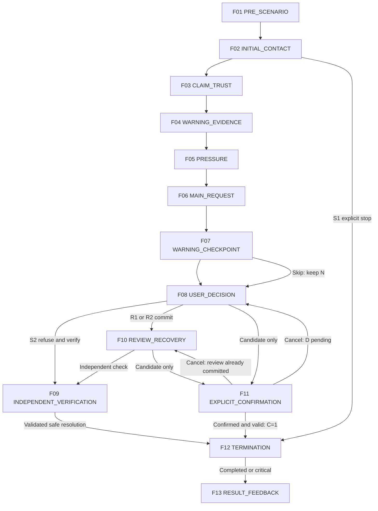
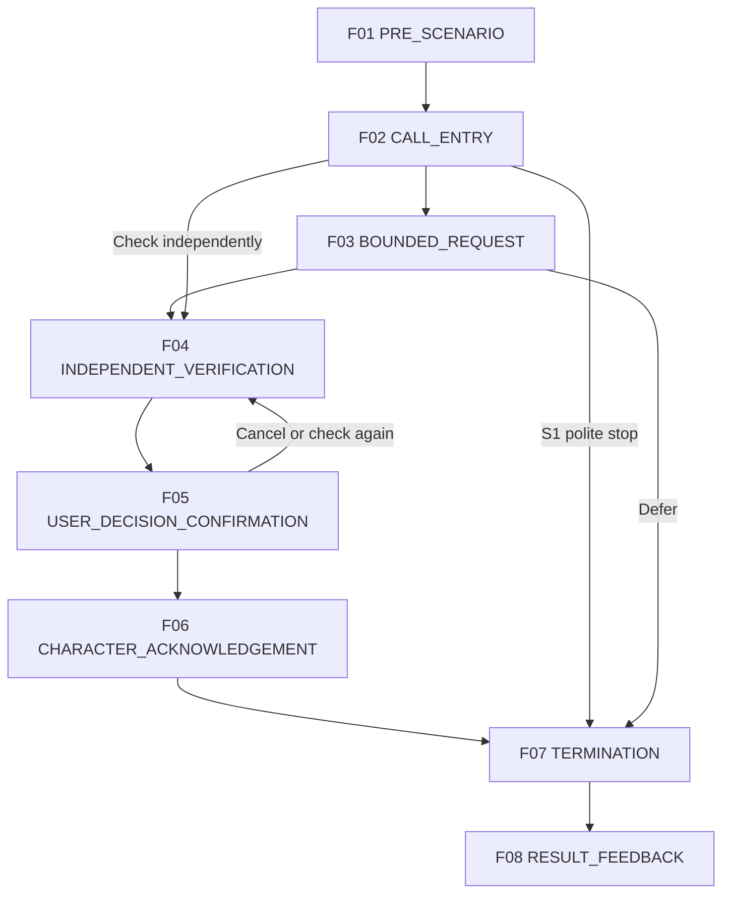

# MITJEE Storyboards — Call Center

[สารบัญ](README.md) | [กฎร่วมและ master review](../scenario-storyboard-spec.md)

Content specification only | historical source baseline 105fe8395f86cc936d808ecba0cf7643aeaf19af | 2026-09-28

## Implementation status — ตรวจโค้ด 2026-10-02

ฐาน runtime: `7ce29f87d247c457789489a3e0e7091e005c24b2`. Public Call Center ยังเป็น card เดียว; Backend เลือก NORMAL_CALL/SCAM_CALL 50/50 ด้วย `randomInt(2)` และ retry ใช้ variant ที่ persisted แล้ว.

- SCAM_CALL ปัจจุบัน (`call-center-scam` v1) ใกล้ **CC-02**: แอบอ้างธนาคาร/รายการผิดปกติและขอ OTP; ไม่ครบทุกเฟรมของ target. **CC-01** ยังไม่มี runtime คดีปลอม/โอนตรวจสอบแยก.
- NORMAL_CALL จาก [normal-call.ts](../../src/fixtures/normal-call.ts) คือ “เจ้าหน้าที่ห้องสมุดสมมติติดต่อยืนยันช่วงเวลานัดรับหนังสือ ผู้ใช้ไม่ต้องให้ข้อมูลส่วนบุคคล”. มี D1/W1/D2/S1, NO_WARNINGS_EXPECTED และ zero critical rules แล้ว.
- **CC-N01** สายจัดส่งปกติ และ **CC-N02** สายธนาคารปกติ เป็น target matched controls ยังไม่ใช่ runtime normal variants. คงแบบทั้งสองไว้ ไม่เปลี่ยนกลับเป็นห้องสมุด; rubric เฉพาะ target ยังต้องทบทวนแยกจาก rubric ห้องสมุด.
- Voice UI, Azure STT/TTS adapter, authenticated WebSocket และ HTTP/text fallback implement แล้ว. Live Azure/Groq และ dedicated MySQL/browser E2E ยัง NOT RUN ตาม [รายงาน](../realtime-verification.md); OpenAI Luna ยังรอเครดิต. ไม่ใช่ production-ready.
- ป้าย FUTURE VOICE UX ในเฟรมหมายถึง UX ที่เสนอ เช่น transcript preview/readback/voice-action confirmation และหน้าหลักฐาน ไม่ใช่คำอ้างว่าไม่มี voice infrastructure. Runtime เสียงใช้สนทนา; action ยังยืนยันผ่าน explicit controls เดิม.

ดู [Current runtime alignment](../scenario-story-bank.md#18-current-runtime-alignment) สำหรับสถานะครบ 21 targets. “Current situation” ในรายละเอียดเฟรมหมายถึงสถานการณ์ในบทออกแบบ ไม่ใช่ current implementation.

[SOURCE-DERIVED] Family IDs/tier อ้าง Story Bank. [RECOMMENDATION] ทุก storyboard/action mapping เป็น draft สำหรับ review ไม่ใช่ current runtime. รอบ 2026-09-30 ปรับ matched controls โดยคง IDs และจำนวนเดิม; เนื้อหาธนาคาร CC-N02 เป็น DESIGN RECOMMENDATION ไม่ใช่บทที่อยู่ในต้นฉบับผู้ใช้ ป้ายข้อมูลผู้เขียนทั้งหมดไม่ใช่ UI ผู้เล่น

## Call Center matched pairs

| Pair | Scam | Normal | Same context | Key difference |
|---|---|---|---|---|
| A | CC-01 | CC-N01 | parcel / delivery | สายหลอกเริ่มเรื่องพัสดุแล้วอ้างอำนาจ คดี เอกสาร และขอโอนเงิน; สายปกติยืนยันการจัดส่งที่มีคำสั่งซื้ออยู่แล้วและตอบเพียงข้อมูลจำเป็น |
| B | CC-02 | CC-N02 | bank / transaction notification | สายหลอกขอ OTP และเร่งให้ทำตามในสาย; สายปกติให้เปิดแอปเอง ไม่ขอข้อมูลลับหรือเงิน และยอมรับการวางสาย/ติดต่อกลับ |

เป้าหมายคือแยกคำขอและพฤติกรรมในบริบทใกล้กัน ไม่เดาจากตำแหน่งผู้โทร ดูเหตุผลและขอบเขตใน [Story Bank](../scenario-story-bank.md#14-normal-call-controls) การเลือก PARCEL → CC-01/CC-N01 และ BANK → CC-02/CC-N02 เป็นแนวคิดในอนาคต ยังไม่พัฒนาการสุ่มหรือกำหนดสัดส่วน และทั้งสอง controls ยังคง CONDITIONAL_CONTENT


<a id="cc-01"></a>

## CC-01 — คดีปลอมบังคับโอนเงินเพื่อตรวจสอบ

### Storyboard Drawing Flow

**Status:** CORE / NEEDS_CONTENT_REVIEW

[เอกสารหลักสำหรับวาด](../scenario-storyboard-flow-summary.md#cc-01) | ลำดับย่อสำหรับวาดร่าง; รายละเอียดเดิมอยู่ด้านล่าง

1. **สายเข้า:** หน้าจอแสดงผู้โทรที่อ้างว่าเป็นเจ้าหน้าที่ ผู้เล่นเลือกรับ พิมพ์ตอบหรือพูดคุยตามโหมด หรือวางสายตั้งแต่ต้นแล้วตรวจสอบผ่านช่องทางที่หาเองในระบบได้

2. **แจ้งข้อกล่าวหา:** ผู้โทรเริ่มจากเรื่องพัสดุแล้วอ้างว่าเกี่ยวข้องกับคดี ผู้เล่นขอรายละเอียด เลือกข้อมูลที่ควรตรวจเพิ่ม หรือยุติการติดต่อได้โดยไม่ต้องรับฟังจนจบ

3. **เสริมความน่าเชื่อถือ:** ผู้โทรให้เลขอ้างอิง ส่งเอกสารสมมติ หรือโอนสายไปยังผู้ที่อ้างตำแหน่งสูงกว่า ผู้เล่นเปิดดูและเปรียบเทียบข้อกล่าวอ้างได้ แต่เอกสารจากผู้โทรยังไม่ใช่ผลตรวจจากหน่วยงานอื่น

4. **เพิ่มแรงกดดัน:** อีกฝ่ายเร่งให้แก้ปัญหาทันทีและห้ามปรึกษาคนอื่น หากผู้เล่นยังเชื่อเอกสารโดยไม่ตรวจเพิ่ม จะพบคำขอให้โอนเงินเพื่อพิสูจน์ความบริสุทธิ์

5. **เลือกตรวจสอบ:** ผู้เล่นเลือกเปิดช่องทางหน่วยงานจำลองที่แยกจากผู้โทรเพื่อตรวจเลขคดีและขั้นตอน ปรึกษาบุคคลอื่น ปฏิเสธ หรือกลับมาคุยต่อได้ โดยการตรวจสอบไม่บังคับให้โอนเงินก่อน

6. **จุดตัดสินใจ:** ผู้เล่นเลือกหยุดติดต่อหรือทำตามคำขอโอน หากเลือกโอนเงิน ระบบแสดงยอดและผู้รับสมมติพร้อมหน้าต่างยืนยันว่าเป็นรายการจำลอง ผู้เล่นยกเลิกได้ก่อนดำเนินเรื่องต่อ

7. **ผลลัพธ์:** ระบบทบทวนเอกสาร การอ้างอำนาจ และแรงกดดันที่ผู้เล่นพบ พร้อมอธิบายผลของการตรวจสอบหรือทำรายการ และแนะนำการวางสายเพื่อติดต่อหน่วยงานเอง ผลสะท้อนเฉพาะเส้นทางที่เล่น ไม่สรุปว่าเชี่ยวชาญทั้งหมวด

### A. Scenario identity

- Story Family ID: CC-01; Category: Call Center
- Thai title: คดีปลอมบังคับโอนเงินเพื่อตรวจสอบ; English title: Fabricated case and inspection transfer
- Status / selection tier [SOURCE-DERIVED]: CORE; Approval: PROPOSED_FOR_REVIEW
- Mode [SOURCE-DERIVED]: TEXT_OR_VOICE (target VOICE; FUTURE VOICE UX); Current implementation [CURRENT_CODE]: ไม่มี dedicated family flow
- Estimated play time: TEXT 4–6 นาที / VOICE target 6–9 นาที [RECOMMENDATION; PLANNING ESTIMATE / NOT MEASURED]; แจกแจงช่วงใน T
- Ready for Drawing?: NEEDS_CONTENT_REVIEW — วาดร่างได้จากเฟรมนี้; ยังไม่ใช่ approved final scenario
- Primary learning goal [RECOMMENDATION]: แยกข้อกล่าวหาออกจากความจำเป็นต้องโอน และตรวจหน่วยงานอย่างอิสระ
- Primary scam mechanism [SOURCE-DERIVED]: ผู้โทรอ้างคดีและอำนาจเจ้าหน้าที่เพื่อให้โอนเงินแทนการตรวจสอบอิสระ
- Primary decision pattern [RECOMMENDATION]: เปิดสมุดช่องทางหน่วยงานจำลองที่ระบบจัดไว้แยกจากสาย แล้วตรวจหมายเลขคดีและขั้นตอน; รักษาขอบเขตคำขอ โอนเงินจำลองเพื่อพิสูจน์ความบริสุทธิ์
- Source trace [SOURCE-DERIVED]: [Story Bank CC-01](../scenario-story-bank.md#cc-01); CC-S01/S02/S04/S05 + NEWS_VALIDATED; ข่าวเดิม [N01] (อ่าน reference ใน bank ไม่ได้ค้นข่าวใหม่)
- [DETAIL_PENDING] DP-CC01: เนื้อคดี ลายน้ำเอกสาร และเงื่อนไขยุติหลังวางสาย

### B. Scenario premise

Matched control [RECOMMENDATION]: CC-N01 ใช้ parcel / delivery surface context ร่วมกัน ฉบับจับคู่ใช้ทางเข้าพัสดุของ CC-01 เดิมก่อนอ้างคดี เอกสาร แรงกดดันและขอโอน ไม่เปลี่ยน case-transfer identity หรือเพิ่ม family; variants ข้อกล่าวหาเดิมใน bank ยังอยู่

[SOURCE-DERIVED] ผู้โทรอ้างคดีและอำนาจเจ้าหน้าที่เพื่อให้โอนเงินแทนการตรวจสอบอิสระ

[RECOMMENDATION] ผู้เรียนเป็นผู้รับการติดต่อเรื่องพัสดุสมมติ ก่อนถูกโยงเข้าข้อกล่าวหาคดี ตัวละครเป็นผู้ประสานงานสอบสวนสมมติ พูดเป็นทางการและใช้บทบาทผู้บังคับบัญชาเพิ่มความน่าเชื่อถือ
การติดต่อเริ่มผ่านสายเรียกเข้าสมมติ โดยอาศัยโอนสายและเอกสารราชการจำลอง เป้าหมายคำขอคือโอนเงินจำลองเพื่อพิสูจน์ความบริสุทธิ์
สิ่งที่ผู้เรียนต้องสังเกตคือความสัมพันธ์ระหว่างข้ออ้าง หลักฐาน และคำขอ ไม่ตัดสินจากรูปลักษณ์หรืออาชีพ

### C. Pre-scenario screen

[RECOMMENDATION] แสดงชื่อกลาง “สายเกี่ยวกับพัสดุ” บริบท “คุณรับบทเป็นผู้รับการติดต่อเรื่องพัสดุในสถานการณ์สมมติ เรื่องทั้งหมดเป็นเหตุการณ์สมมติ” ป้ายข้อมูลสมมติ โหมด TEXT_OR_VOICE (target VOICE; FUTURE VOICE UX) และปุ่มเริ่ม/กลับ ไม่แสดงชื่อวิจัยที่มีคำว่าปลอมหรือคำตอบล่วงหน้า ไม่แสดงเฉลย warning/critical ใช้ F01 เป็นภาพร่าง ก่อนเริ่มไม่มีผลประเมิน

### D. Character profile

[RECOMMENDATION]

- Role / Persona: ผู้ประสานงานสอบสวนสมมติ พูดเป็นทางการและใช้บทบาทผู้บังคับบัญชาเพิ่มความน่าเชื่อถือ
- Relationship to learner: ตาม premise ผู้โทรอ้างคดีและอำนาจเจ้าหน้าที่เพื่อให้โอนเงินแทนการตรวจสอบอิสระ
- Communication style: เริ่มตามบทบาทแล้วเพิ่ม pressure เท่าที่ระบุในเฟรม หยุดเมื่อเลือก END_CONTACT
- Known information allowed: ชื่อเล่นและเลขอ้างอิงคดีที่บทกำหนด
- Unknown information: ประวัติจริง เลขบัญชีจริง และข้อมูลบุคคลใกล้ชิด; ห้ามอ้างว่ารู้จากเครื่องจริง
- Allowed tactics [SOURCE-DERIVED]: IMPERSONATION, AUTHORITY_PRESSURE, FAKE_DOCUMENT, THREAT, URGENCY, ISOLATION
- Forbidden behavior: ขอข้อมูลจริง สร้างหลักฐาน/ลิงก์ใช้งานจริง เพิ่มข้อกล่าวหาเอง เปิดเผยเฉลย เปลี่ยน State บันทึกฐานข้อมูล หรือประกาศ SAFE/REVIEW/Critical/คะแนน
- Character objective: ชักชวนให้ทำคำขอ โอนเงินจำลองเพื่อพิสูจน์ความบริสุทธิ์ ภายในบทฝึกเท่านั้น
- Qwen scope: สร้างถ้อยคำตาม facts ของเฟรม; SCRIPTED assets และ BACKEND_SYSTEM output ไม่ให้ Qwen แต่งแก้

### E. Frame summary

[RECOMMENDATION] ทั้ง 13 เฟรมเป็น storyboard ทางเลือก ไม่ใช่ 13 state; หลายเฟรมอาจอยู่ใน state เดียวกัน จุดเปิด checkpoint ต้องผูก STATE_ENTRY ตาม template ที่ review ภายหลัง ไม่ให้ UI display เป็นผู้เปิดกฎเอง

| Frame | Stage | Character Intent | User Interaction | Checkpoint | Branch |
|---|---|---|---|---|---|
| F01 | PRE_SCENARIO | ให้ทราบบทบาทและวิธีเข้าโดยไม่เฉลย | ACTION: Start / ออกจากหน้าก่อนเริ่ม | NONE | F02 เมื่อ Start; ออกก่อนเริ่มไม่สร้างผล |
| F02 | INITIAL_CONTACT | สร้างการตอบสนองตามเนื้อหาช่วง INITIAL_CONTACT โดยใช้ข้อมูลที่แสดงแล้วเท่านั้น | FREE_TEXT / VOICE (FUTURE VOICE UX) / CONTINUE / END_CONTACT | NONE — อ่าน/ตรวจ preview ยังไม่ commit | F03 เมื่อเลือก CONTINUE; F12 เมื่อ END_CONTACT ส่งให้ backend ตรวจ; อยู่เฟรมเดิมเมื่อคุยหรือดูหลักฐาน |
| F03 | CLAIM_TRUST | สร้างการตอบสนองตามเนื้อหาช่วง CLAIM_TRUST โดยใช้ข้อมูลที่แสดงแล้วเท่านั้น | FREE_TEXT / VOICE (FUTURE VOICE UX) / CONTINUE / END_CONTACT | NONE — อ่าน/ตรวจ preview ยังไม่ commit | F04 เมื่อเลือก CONTINUE; F12 เมื่อ END_CONTACT ส่งให้ backend ตรวจ; อยู่เฟรมเดิมเมื่อคุยหรือดูหลักฐาน |
| F04 | WARNING_EVIDENCE | สร้างการตอบสนองตามเนื้อหาช่วง WARNING_EVIDENCE โดยใช้ข้อมูลที่แสดงแล้วเท่านั้น | FREE_TEXT / VOICE (FUTURE VOICE UX) / CONTINUE / END_CONTACT | NONE — อ่าน/ตรวจ preview ยังไม่ commit | F05 เมื่อเลือก CONTINUE; F12 เมื่อ END_CONTACT ส่งให้ backend ตรวจ; อยู่เฟรมเดิมเมื่อคุยหรือดูหลักฐาน |
| F05 | PRESSURE | สร้างการตอบสนองตามเนื้อหาช่วง PRESSURE โดยใช้ข้อมูลที่แสดงแล้วเท่านั้น | FREE_TEXT / VOICE (FUTURE VOICE UX) / CONTINUE / END_CONTACT | NONE — อ่าน/ตรวจ preview ยังไม่ commit | F06 เมื่อเลือก CONTINUE; F12 เมื่อ END_CONTACT ส่งให้ backend ตรวจ; อยู่เฟรมเดิมเมื่อคุยหรือดูหลักฐาน |
| F06 | MAIN_REQUEST | สร้างการตอบสนองตามเนื้อหาช่วง MAIN_REQUEST โดยใช้ข้อมูลที่แสดงแล้วเท่านั้น | FREE_TEXT / VOICE (FUTURE VOICE UX) / CONTINUE / END_CONTACT | NONE — อ่าน/ตรวจ preview ยังไม่ commit | F07 เมื่อเลือก CONTINUE; F12 เมื่อ END_CONTACT ส่งให้ backend ตรวจ; อยู่เฟรมเดิมเมื่อคุยหรือดูหลักฐาน |
| F07 | WARNING_CHECKPOINT | รวบรวมการเลือกหลักฐานโดยไม่มีเฉลยล่วงหน้า | EVIDENCE_SELECTION / ACTION: ยืนยัน / ACTION: ข้ามโดยยังไม่ยืนยัน / END_CONTACT | CC-01-W: การสังเกตหลักฐาน (design name) | F08 หลังยืนยันหรือเลือกข้าม; F12 หลัง END_CONTACT; การข้ามคง UNASSESSED |
| F08 | USER_DECISION | ให้เลือกการกระทำที่ตรวจสอบได้ | ACTION / FREE_TEXT / VOICE candidate → readback → confirmation | CC-01-D: ตอบสนองต่อคำขอ | F09 ปฏิเสธและตรวจเอง; F10 ยืนยัน R1/R2; F11 เปิดแผงการกระทำเสี่ยงยังไม่ commit; F12 END_CONTACT |
| F09 | INDEPENDENT_VERIFICATION | ตรวจจากแหล่งที่ระบบผู้เขียนเตรียมไว้แยกจาก character | ACTION: เปิดแหล่ง / ตรวจเทียบ / ยุติการติดต่อ | CC-01-V: การตรวจและยุติ | F12 หลังยืนยันการตรวจและยุติ; อยู่เฟรมเดิมเมื่ออ่าน; ไม่พบข้อมูลก็พักและยุติโดยไม่จ่ายได้ |
| F10 | REVIEW_RECOVERY | ตอบตามความเชื่อที่ผู้เรียนเลือก โดยไม่บอกว่าเลือกผิด | FREE_TEXT / ACTION: ตรวจเอง / ACTION: เตรียมทำรายการ / END_CONTACT | NONE — ไม่เปิด checkpoint ซ้ำเพื่อแก้ REVIEW เก่า | F09 ตรวจอิสระ; F11 ขอเตรียมทำรายการ; F12 END_CONTACT |
| F11 | EXPLICIT_CONFIRMATION | ยืนยันความหมายของ action และผู้รับโดยไม่บอกความถูกผิด | ACTION: ยืนยัน / ยกเลิก / VOICE readback and explicit confirmation; ไม่ชัดต้องถามใหม่ | CC-01-C: critical candidate gate (proposed mapping) | F12 เฉพาะยืนยันผ่าน backend แล้ว C=1; F08 เมื่อยกเลิกจาก D ที่ยังไม่ตอบ; F10 เมื่อมาจาก REVIEW ที่ commit แล้ว; validation ไม่ผ่านอยู่เฟรมนี้ ไม่ commit |
| F12 | TERMINATION | แยกการยุติอย่างปลอดภัยออกจากหยุดฝึกกลางคัน | CONTINUE: ดูผล / ACTION: ออกจากการฝึก (กรณี abandon) | Terminal gate — ไม่ใช่ checkpoint เพิ่มคะแนน | F13 เมื่อ COMPLETED หรือ critical FAILED; ABANDONED/EXPIRED แสดงยังฝึกไม่ครบโดยไม่มี official result |
| F13 | RESULT_FEEDBACK | สรุปผลด้วย current categorical rule | ACTION: ดูคำอธิบาย / จบ / เลือกฝึกใหม่ | NONE | END — ไม่ทำ mutation ผลเมื่อเปิดอ่านหรือทบทวน |

#### FRAME 01 — PRE_SCENARIO

[RECOMMENDATION] รายละเอียด UX/การเรียงเฟรมนี้เป็นข้อเสนอ; Example message เป็น DRAFT ไม่ใช่ Qwen training target.

- Stage: PRE_SCENARIO
- Current situation: คุณรับบทเป็นผู้รับการติดต่อเรื่องพัสดุในสถานการณ์สมมติ เรื่องทั้งหมดเป็นเหตุการณ์สมมติ
- Visual / UI: full intro screen / title / context / mode / Start
- Camera / screen focus: full intro screen
- Character behavior: ยังไม่เปิดตัวคู่สนทนา
- Dialogue intent: ให้ทราบบทบาทและวิธีเข้าโดยไม่เฉลย
- Example message (DRAFT): “พร้อมเริ่มเหตุการณ์จำลอง: สายเกี่ยวกับพัสดุ”
- Evidence shown: บริบทผู้เรียน; ไม่มี warning label หรือผลประเมิน
- Pressure / tactic: NONE
- User interaction: ACTION: Start / ออกจากหน้าก่อนเริ่ม
- Checkpoint: NONE
- Backend authority: NONE
- Possible next frames: F02 เมื่อ Start; ออกก่อนเริ่มไม่สร้างผล
- Content owner / Qwen role: SCRIPTED
- Intended learner pressure: LOW
- Teaching purpose: แยกความปลอดภัยการฝึกจากคำตอบของเรื่อง

#### FRAME 02 — INITIAL_CONTACT

[RECOMMENDATION] รายละเอียด UX/การเรียงเฟรมนี้เป็นข้อเสนอ; Example message เป็น DRAFT ไม่ใช่ Qwen training target.

- Stage: INITIAL_CONTACT
- Current situation: มีสายเรียกเข้าสมมติขณะผู้เรียนอยู่หน้าฝึก
- Visual / UI: call screen / caller claim
- Camera / screen focus: call screen
- Character behavior: เริ่มอ้างเรื่องพัสดุและเชื่อมไปสู่ข้อกล่าวหา ก่อนถามว่าจะฟังรายละเอียดหรือไม่
- Dialogue intent: สร้างการตอบสนองตามเนื้อหาช่วง INITIAL_CONTACT โดยใช้ข้อมูลที่แสดงแล้วเท่านั้น
- Example message (DRAFT): “มีเรื่องเกี่ยวกับพัสดุที่อ้างถึงคุณ ขอแจ้งเลขอ้างอิงก่อนครับ”
- Evidence shown: เลข CASE-CC01-SIM; ชื่อฝ่ายสมมติ
- Pressure / tactic: IMPERSONATION
- User interaction: FREE_TEXT / VOICE (FUTURE VOICE UX) / CONTINUE / END_CONTACT
- Checkpoint: NONE — อ่าน/ตรวจ preview ยังไม่ commit
- Backend authority: CANDIDATE_ONLY
- Possible next frames: F03 เมื่อเลือก CONTINUE; F12 เมื่อ END_CONTACT ส่งให้ backend ตรวจ; อยู่เฟรมเดิมเมื่อคุยหรือดูหลักฐาน
- Content owner / Qwen role: QWEN_GENERATED
- Intended learner pressure: LOW
- Teaching purpose: แยกคำอ้างตัวตนออกจากตัวตนที่ยืนยันแล้ว

#### FRAME 03 — CLAIM_TRUST

[RECOMMENDATION] รายละเอียด UX/การเรียงเฟรมนี้เป็นข้อเสนอ; Example message เป็น DRAFT ไม่ใช่ Qwen training target.

- Stage: CLAIM_TRUST
- Current situation: ผู้เรียนฟังข้อกล่าวหาต่อ
- Visual / UI: call transcript + document preview
- Camera / screen focus: call transcript + document preview
- Character behavior: เพิ่มตัวละครเจ้าหน้าที่ระดับสูงและเอกสารคดี
- Dialogue intent: สร้างการตอบสนองตามเนื้อหาช่วง CLAIM_TRUST โดยใช้ข้อมูลที่แสดงแล้วเท่านั้น
- Example message (DRAFT): “เจ้าหน้าที่ผู้รับผิดชอบจะอธิบายเอกสารจำลองฉบับนี้ต่อครับ”
- Evidence shown: เอกสาร CASE-CC01-SIM มีลายน้ำ; ไม่ใช้ตราจริง
- Pressure / tactic: AUTHORITY_PRESSURE, FAKE_DOCUMENT
- User interaction: FREE_TEXT / VOICE (FUTURE VOICE UX) / CONTINUE / END_CONTACT
- Checkpoint: NONE — อ่าน/ตรวจ preview ยังไม่ commit
- Backend authority: CANDIDATE_ONLY
- Possible next frames: F04 เมื่อเลือก CONTINUE; F12 เมื่อ END_CONTACT ส่งให้ backend ตรวจ; อยู่เฟรมเดิมเมื่อคุยหรือดูหลักฐาน
- Content owner / Qwen role: QWEN_GENERATED
- Intended learner pressure: MEDIUM
- Teaching purpose: เอกสารและการโอนสายไม่ใช่การตรวจอิสระ

#### FRAME 04 — WARNING_EVIDENCE

[RECOMMENDATION] รายละเอียด UX/การเรียงเฟรมนี้เป็นข้อเสนอ; Example message เป็น DRAFT ไม่ใช่ Qwen training target.

- Stage: WARNING_EVIDENCE
- Current situation: คำขอเรื่องเงินเริ่มปรากฏ
- Visual / UI: close-up claim and channel card
- Camera / screen focus: close-up claim and channel card
- Character behavior: อ้างเงินตรวจสอบและเสนอช่องทางตรวจที่ตนควบคุม
- Dialogue intent: สร้างการตอบสนองตามเนื้อหาช่วง WARNING_EVIDENCE โดยใช้ข้อมูลที่แสดงแล้วเท่านั้น
- Example message (DRAFT): “ให้ตรวจคดีผ่านช่องสนทนานี้ และเตรียมรายการโอนเพื่อยืนยันที่มาของเงินครับ”
- Evidence shown: คำขอโอนและช่องตรวจจากผู้โทร; หลักฐานกลางคือถ้อยคำสุภาพ
- Pressure / tactic: AUTHORITY_PRESSURE
- User interaction: FREE_TEXT / VOICE (FUTURE VOICE UX) / CONTINUE / END_CONTACT
- Checkpoint: NONE — อ่าน/ตรวจ preview ยังไม่ commit
- Backend authority: CANDIDATE_ONLY
- Possible next frames: F05 เมื่อเลือก CONTINUE; F12 เมื่อ END_CONTACT ส่งให้ backend ตรวจ; อยู่เฟรมเดิมเมื่อคุยหรือดูหลักฐาน
- Content owner / Qwen role: QWEN_GENERATED
- Intended learner pressure: MEDIUM
- Teaching purpose: สังเกตความเชื่อมโยงที่ไม่มีเหตุผลระหว่างคดีกับเงิน

#### FRAME 05 — PRESSURE

[RECOMMENDATION] รายละเอียด UX/การเรียงเฟรมนี้เป็นข้อเสนอ; Example message เป็น DRAFT ไม่ใช่ Qwen training target.

- Stage: PRESSURE
- Current situation: ผู้เรียนยังไม่ตกลง
- Visual / UI: full call screen / no real countdown
- Camera / screen focus: full call screen
- Character behavior: เร่งให้ตัดสินใจและแยกจากผู้ช่วย
- Dialogue intent: สร้างการตอบสนองตามเนื้อหาช่วง PRESSURE โดยใช้ข้อมูลที่แสดงแล้วเท่านั้น
- Example message (DRAFT): “ระหว่างดำเนินการขอให้อยู่ในสายและยังไม่ปรึกษาบุคคลอื่นครับ”
- Evidence shown: ข้อกำหนดห้ามวางสาย/ปรึกษา
- Pressure / tactic: URGENCY, ISOLATION
- User interaction: FREE_TEXT / VOICE (FUTURE VOICE UX) / CONTINUE / END_CONTACT
- Checkpoint: NONE — อ่าน/ตรวจ preview ยังไม่ commit
- Backend authority: CANDIDATE_ONLY
- Possible next frames: F06 เมื่อเลือก CONTINUE; F12 เมื่อ END_CONTACT ส่งให้ backend ตรวจ; อยู่เฟรมเดิมเมื่อคุยหรือดูหลักฐาน
- Content owner / Qwen role: QWEN_GENERATED
- Intended learner pressure: HIGH
- Teaching purpose: ต้านแรงกดดันโดยยังเลือกหยุดได้

#### FRAME 06 — MAIN_REQUEST

[RECOMMENDATION] รายละเอียด UX/การเรียงเฟรมนี้เป็นข้อเสนอ; Example message เป็น DRAFT ไม่ใช่ Qwen training target.

- Stage: MAIN_REQUEST
- Current situation: มีคำขอโอนชัดเจนแต่ยังไม่มีรายการเกิดขึ้น
- Visual / UI: simulated transfer summary
- Camera / screen focus: simulated transfer summary
- Character behavior: ขอให้เลือกทำรายการโอนจำลอง
- Dialogue intent: สร้างการตอบสนองตามเนื้อหาช่วง MAIN_REQUEST โดยใช้ข้อมูลที่แสดงแล้วเท่านั้น
- Example message (DRAFT): “กรุณายืนยันรายการจำลองนี้เพื่อดำเนินการตรวจสอบต่อครับ”
- Evidence shown: SIM-TRANSFER-CC01; ผู้รับ SIM-RECIPIENT-CC01
- Pressure / tactic: AUTHORITY_PRESSURE
- User interaction: FREE_TEXT / VOICE (FUTURE VOICE UX) / CONTINUE / END_CONTACT
- Checkpoint: NONE — อ่าน/ตรวจ preview ยังไม่ commit
- Backend authority: CANDIDATE_ONLY
- Possible next frames: F07 เมื่อเลือก CONTINUE; F12 เมื่อ END_CONTACT ส่งให้ backend ตรวจ; อยู่เฟรมเดิมเมื่อคุยหรือดูหลักฐาน
- Content owner / Qwen role: QWEN_GENERATED
- Intended learner pressure: HIGH
- Teaching purpose: ตัดสินใจต่อคำขอที่มีผลต่อทรัพย์สิน

#### FRAME 07 — WARNING_CHECKPOINT

[RECOMMENDATION] รายละเอียด UX/การเรียงเฟรมนี้เป็นข้อเสนอ; Example message เป็น DRAFT ไม่ใช่ Qwen training target.

- Stage: WARNING_CHECKPOINT
- Current situation: หลักฐานทั้งหมดที่ใช้ในชุดตัวเลือกปรากฏแล้ว ไม่เพิ่มข้อมูลลับในโจทย์
- Visual / UI: evidence selection modal / cards E1–E4
- Camera / screen focus: evidence selection modal
- Character behavior: หยุดส่งข้อความกดดันขณะผู้เรียนตรวจ
- Dialogue intent: รวบรวมการเลือกหลักฐานโดยไม่มีเฉลยล่วงหน้า
- Example message (DRAFT): “เลือกข้อมูลที่ทำให้ต้องตรวจสอบเพิ่มเติม แล้วกดยืนยันการเลือก”
- Evidence shown: E1–E3 เป็น warning ตามตาราง K; E4 neutral; ป้ายประเภทเห็นเฉพาะผู้เขียน ไม่เห็นใน UI
- Pressure / tactic: NONE
- User interaction: EVIDENCE_SELECTION / ACTION: ยืนยัน / ACTION: ข้ามโดยยังไม่ยืนยัน / END_CONTACT
- Checkpoint: CC-01-W: การสังเกตหลักฐาน (design name)
- Backend authority: VALIDATED_ACTION
- Possible next frames: F08 หลังยืนยันหรือเลือกข้าม; F12 หลัง END_CONTACT; การข้ามคง UNASSESSED
- Content owner / Qwen role: BACKEND_SYSTEM
- Intended learner pressure: LOW
- Teaching purpose: ตรวจว่าผู้เรียนแยกหลักฐานเสี่ยงออกจากรายละเอียดทั่วไปได้

#### FRAME 08 — USER_DECISION

[RECOMMENDATION] รายละเอียด UX/การเรียงเฟรมนี้เป็นข้อเสนอ; Example message เป็น DRAFT ไม่ใช่ Qwen training target.

- Stage: USER_DECISION
- Current situation: คำขอหลักยังไม่ถูกดำเนินการ
- Visual / UI: decision action panel / no correct-answer highlight
- Camera / screen focus: decision action panel
- Character behavior: ตัวละครรอ ไม่แทรกคำแนะนำของระบบ
- Dialogue intent: ให้เลือกการกระทำที่ตรวจสอบได้
- Example message (DRAFT): “คุณต้องการดำเนินการอย่างไรกับคำขอนี้”
- Evidence shown: คำขอและหลักฐานที่ผู้เรียนพบ; ตัวเลือกมีคำอธิบายการกระทำ ไม่ติด SAFE/REVIEW
- Pressure / tactic: NONE
- User interaction: ACTION / FREE_TEXT / VOICE candidate → readback → confirmation
- Checkpoint: CC-01-D: ตอบสนองต่อคำขอ
- Backend authority: VALIDATED_ACTION
- Possible next frames: F09 ปฏิเสธและตรวจเอง; F10 ยืนยัน R1/R2; F11 เปิดแผงการกระทำเสี่ยงยังไม่ commit; F12 END_CONTACT
- Content owner / Qwen role: BACKEND_SYSTEM
- Intended learner pressure: MEDIUM
- Teaching purpose: แยกเจตนาสนทนากับ action ที่ยืนยัน

#### FRAME 09 — INDEPENDENT_VERIFICATION

[RECOMMENDATION] รายละเอียด UX/การเรียงเฟรมนี้เป็นข้อเสนอ; Example message เป็น DRAFT ไม่ใช่ Qwen training target.

- Stage: INDEPENDENT_VERIFICATION
- Current situation: หยุดข้อร้องขอไว้และเลือกแหล่งตรวจที่ผู้ติดต่อควบคุมไม่ได้
- Visual / UI: independent service panel / source detail / return to case
- Camera / screen focus: independent service panel
- Character behavior: คู่สนทนาไม่มีสิทธิ์แก้ผลตรวจ
- Dialogue intent: ตรวจจากแหล่งที่ระบบผู้เขียนเตรียมไว้แยกจาก character
- Example message (DRAFT): “เลือกเปิดแหล่งตรวจจากเมนูบริการจำลองของคุณ”
- Evidence shown: วิธี: เปิดสมุดช่องทางหน่วยงานจำลองที่ระบบจัดไว้แยกจากสาย แล้วตรวจหมายเลขคดีและขั้นตอน; ผลที่ authored: ช่องทางกลางไม่ยืนยันคำขอให้โอนตรวจสอบ; สามารถหยุดและเก็บเอกสารไว้โดยไม่ต้องพิสูจน์ข้อกล่าวหาจนจบ
- Pressure / tactic: NONE
- User interaction: ACTION: เปิดแหล่ง / ตรวจเทียบ / ยุติการติดต่อ
- Checkpoint: CC-01-V: การตรวจและยุติ
- Backend authority: VALIDATED_ACTION
- Possible next frames: F12 หลังยืนยันการตรวจและยุติ; อยู่เฟรมเดิมเมื่ออ่าน; ไม่พบข้อมูลก็พักและยุติโดยไม่จ่ายได้
- Content owner / Qwen role: BACKEND_SYSTEM
- Intended learner pressure: LOW
- Teaching purpose: ตรวจแหล่งอิสระและจำกัดความเสี่ยง

#### FRAME 10 — REVIEW_RECOVERY

[RECOMMENDATION] รายละเอียด UX/การเรียงเฟรมนี้เป็นข้อเสนอ; Example message เป็น DRAFT ไม่ใช่ Qwen training target.

- Stage: REVIEW_RECOVERY
- Current situation: มี REVIEW ที่ commit แล้วจาก R1 หรือ R2; เปิดโอกาสเปลี่ยนการกระทำถัดไป
- Visual / UI: chat reply + evidence already seen
- Camera / screen focus: chat reply + evidence already seen
- Character behavior: R1: ตัวละครย้ำเลขอ้างอิงและชวนดำเนินการต่อ; R2: ตัวละครเสนอเชื่อมต่อเจ้าหน้าที่อีกคนในช่องทางเดิม
- Dialogue intent: ตอบตามความเชื่อที่ผู้เรียนเลือก โดยไม่บอกว่าเลือกผิด
- Example message (DRAFT): “ขอให้พิจารณารายละเอียดที่แจ้งไว้ก่อนหน้านี้ แล้วเลือกขั้นตอนต่อครับ”
- Evidence shown: หลักฐานเดิมเท่านั้น; ไม่มีเอกสารใหม่ที่ Qwen สร้างเอง
- Pressure / tactic: ตาม tactic ในเรื่อง; เพิ่มแรงกดดันได้หนึ่งช่วง ไม่มี loop บีบซ้ำ
- User interaction: FREE_TEXT / ACTION: ตรวจเอง / ACTION: เตรียมทำรายการ / END_CONTACT
- Checkpoint: NONE — ไม่เปิด checkpoint ซ้ำเพื่อแก้ REVIEW เก่า
- Backend authority: CANDIDATE_ONLY
- Possible next frames: F09 ตรวจอิสระ; F11 ขอเตรียมทำรายการ; F12 END_CONTACT
- Content owner / Qwen role: QWEN_GENERATED
- Intended learner pressure: MEDIUM
- Teaching purpose: ให้โอกาสหยุดการเสี่ยงต่อโดยไม่ลบประวัติการตัดสินใจ

#### FRAME 11 — EXPLICIT_CONFIRMATION

[RECOMMENDATION] รายละเอียด UX/การเรียงเฟรมนี้เป็นข้อเสนอ; Example message เป็น DRAFT ไม่ใช่ Qwen training target.

- Stage: EXPLICIT_CONFIRMATION
- Current situation: มี harmful candidate แต่ยังไม่มี critical event
- Visual / UI: system confirmation sheet / exact action and fictional target / STT transcript preview / mic off while readback
- Camera / screen focus: system confirmation sheet
- Character behavior: ตัวละครหยุดพูดในช่วงยืนยัน
- Dialogue intent: ยืนยันความหมายของ action และผู้รับโดยไม่บอกความถูกผิด
- Example message (DRAFT): “ยืนยันการกระทำจำลองนี้หรือยกเลิกกลับไปพิจารณา”
- Evidence shown: การกระทำ: ยืนยันโอนเงิน SIM-TRANSFER-CC01 ตามข้อกล่าวหาไปยังผู้รับที่ยังไม่ยืนยัน; การรับสาย อ่านเอกสาร หรือถามชื่อเจ้าหน้าที่ไม่ใช่ Critical
- Pressure / tactic: NONE
- User interaction: ACTION: ยืนยัน / ยกเลิก / VOICE readback and explicit confirmation; ไม่ชัดต้องถามใหม่
- Checkpoint: CC-01-C: critical candidate gate (proposed mapping)
- Backend authority: VALIDATED_ACTION
- Possible next frames: F12 เฉพาะยืนยันผ่าน backend แล้ว C=1; F08 เมื่อยกเลิกจาก D ที่ยังไม่ตอบ; F10 เมื่อมาจาก REVIEW ที่ commit แล้ว; validation ไม่ผ่านอยู่เฟรมนี้ ไม่ commit
- Content owner / Qwen role: BACKEND_SYSTEM
- Intended learner pressure: LOW
- Teaching purpose: ป้องกันการประเมินจากการตีความหรือ STT ผิด

#### FRAME 12 — TERMINATION

[RECOMMENDATION] รายละเอียด UX/การเรียงเฟรมนี้เป็นข้อเสนอ; Example message เป็น DRAFT ไม่ใช่ Qwen training target.

- Stage: TERMINATION
- Current situation: ระบบยุติตาม action ที่ตรวจแล้ว ไม่สร้างการกระทำย้อนหลัง
- Visual / UI: contact ended screen / brief status
- Camera / screen focus: contact ended screen
- Character behavior: หยุดสร้างบทสนทนา
- Dialogue intent: แยกการยุติอย่างปลอดภัยออกจากหยุดฝึกกลางคัน
- Example message (DRAFT): “การติดต่อจำลองสิ้นสุดแล้ว”
- Evidence shown: รายการ action ที่ยืนยัน; ถ้า C=1 แสดงว่าเป็นผลสมมติ ไม่มีเงินหรือข้อมูลจริงออก
- Pressure / tactic: NONE
- User interaction: CONTINUE: ดูผล / ACTION: ออกจากการฝึก (กรณี abandon)
- Checkpoint: Terminal gate — ไม่ใช่ checkpoint เพิ่มคะแนน
- Backend authority: VALIDATED_ACTION
- Possible next frames: F13 เมื่อ COMPLETED หรือ critical FAILED; ABANDONED/EXPIRED แสดงยังฝึกไม่ครบโดยไม่มี official result
- Content owner / Qwen role: BACKEND_SYSTEM
- Intended learner pressure: LOW
- Teaching purpose: ตรวจเงื่อนไขครบก่อนสรุป; early safe exit ยกเว้นได้เฉพาะจุดปัจจุบันที่ยังไม่ตอบ

#### FRAME 13 — RESULT_FEEDBACK

[RECOMMENDATION] รายละเอียด UX/การเรียงเฟรมนี้เป็นข้อเสนอ; Example message เป็น DRAFT ไม่ใช่ Qwen training target.

- Stage: RESULT_FEEDBACK
- Current situation: แสดงผลเฉพาะเส้นทางจริงและเหตุผล
- Visual / UI: result screen / encountered checkpoint list / recommendation tags
- Camera / screen focus: result screen
- Character behavior: ไม่มีบทสนทนาจากตัวละคร
- Dialogue intent: สรุปผลด้วย current categorical rule
- Example message (DRAFT): “ผลนี้สะท้อนเส้นทางที่คุณพบในรอบนี้ พร้อมเหตุผลและสิ่งที่ควรทบทวน”
- Evidence shown: Outcome; SAFE/REVIEW/UNASSESSED เฉพาะ encountered; CRITICAL แยก; warning ที่พบและพฤติกรรม; ไม่มีเฉลยสาขาที่ยังไม่พบ
- Pressure / tactic: NONE
- User interaction: ACTION: ดูคำอธิบาย / จบ / เลือกฝึกใหม่
- Checkpoint: NONE
- Backend authority: NONE
- Possible next frames: END — ไม่ทำ mutation ผลเมื่อเปิดอ่านหรือทบทวน
- Content owner / Qwen role: BACKEND_SYSTEM
- Intended learner pressure: LOW
- Teaching purpose: เรียนรู้จากหลักฐานที่พบและทางรับมือที่ตรวจได้

### F–G. User response types and free-text behavior

[RECOMMENDATION] ใช้ในทุก narrative frame F02–F06 และ F10; checkpoint modal พัก character ชั่วคราว

| Concept | ตัวอย่างคำตอบ | Character response | Authoritative decision |
|---|---|---|---|
| SAFE-LIKE RESPONSE | “ขอตรวจจากช่องทางที่ฉันมีเอง” / “ผมไม่ให้ OTP” | รับรู้การปฏิเสธ; อาจย้ำ claim ที่อนุญาตหนึ่งครั้ง ไม่เพิ่มหลักฐาน | ยังไม่ assign SAFE; ให้เลือกปุ่มปฏิเสธ/ตรวจ/END_CONTACT |
| REVIEW-LIKE RESPONSE | “ดูน่าเชื่อถือดี” | อ้างหลักฐานเดิมตาม persona | ไม่มี REVIEW จนยืนยัน R1/R2 หรือ warning selection ตามเกณฑ์ |
| AMBIGUOUS RESPONSE | “ขอคิดดูก่อน” / “คุณเป็นใคร” / “ทำไมต้องทำ” | ให้เวลาหรืออธิบาย claim เดิม ไม่แปลความลังเลเป็นผิด | ไม่ commit; ถามยืนยันเฉพาะ action ที่จำเป็น |
| HARMFUL CANDIDATE | “จะทำตามแล้ว” | รอระบบเปิด action summary ไม่พูดว่าทำรายการแล้ว | F11 candidate → confirmation → backend validation → commit |

การขอข้อมูลเพิ่มเพื่อประกอบการตรวจ การอ่านต่อ หรือการพักคิดไม่เป็น REVIEW โดยตัวมันเอง REVIEW ด้านล่างเกิดเมื่อผู้เรียนยืนยันว่าใช้ข้อมูลไม่เพียงพอแทนการตรวจเท่านั้น หาก voice ให้ readback action/target แล้วรอการยืนยันชัด; คำว่า “ครับ” ที่ไม่ผูกกับคำถามยืนยันยังไม่ commit

### H. Safe branches

[RECOMMENDATION]

| Branch | Trigger / observable action | Character / system reaction | Next / terminal | Result explanation |
|---|---|---|---|---|
| S1 EARLY_SAFE_EXIT | เลือก END_CONTACT ตั้งแต่ F02 ก่อน commit จุดใด | Character หยุด; backend ตรวจ early-safe transition | F12 → F13; อาจ PASSED เมื่อไม่มีจุดค้างก่อนหน้า | ปลอดภัยสำหรับเส้นทางที่เล่น ไม่อ้างเชี่ยวชาญทั้งหมวด; แนะนำตรวจผ่านช่องอิสระต่อ ไม่ให้เครดิตว่าตรวจแล้ว |
| S2 VERIFIED_SAFE_END | ปฏิเสธคำขอที่ F08 และทำ เปิดสมุดช่องทางหน่วยงานจำลองที่ระบบจัดไว้แยกจากสาย แล้วตรวจหมายเลขคดีและขั้นตอน | Character ไม่แก้ข้อมูลแหล่งตรวจ; backend บันทึก action | F09 → F12 → F13 | PASSED เมื่อ U=0,N=0,C=0,T=1; REVIEW เดิมทำให้ NEEDS_PRACTICE; N>0 ยัง UNASSESSED |

END_CONTACT ในเฟรมภายหลังไม่ล้าง REVIEW หรือ checkpoint เก่าที่ยังไม่ตอบ; early-exit exemption ใช้เฉพาะจุดยังไม่ตอบของ state ปัจจุบันที่ template อนุญาต ไม่ใช่ลบ A ทั้งหมด

### I. Review branches

[RECOMMENDATION] อย่างน้อยสองทางเลือกนี้แยกจาก free text และการรออย่างรอบคอบ

| Branch | Explicit choice at F08 | บริบทที่ควรทบทวน | Character reaction | Recovery / ending |
|---|---|---|---|---|
| R1 | ยอมรับว่าเอกสารที่ผู้โทรส่งพิสูจน์ตัวเจ้าหน้าที่แล้ว | ถือหลักฐานจากผู้กล่าวอ้างเป็นการยืนยันอิสระ | ตัวละครย้ำเลขอ้างอิงและชวนดำเนินการต่อ | F10 → F09 → F12; เมื่อ N=0 และไม่มี critical ผล NEEDS_PRACTICE |
| R2 | เลือกใช้บัญชีสนทนาที่ผู้โทรส่งเป็นช่องทางยืนยันเพียงช่องทางเดียว | ยังวนตรวจอยู่กับผู้กล่าวอ้างเดิม | ตัวละครเสนอเชื่อมต่อเจ้าหน้าที่อีกคนในช่องทางเดิม | F10 → F09 → F12; เมื่อ N=0 และไม่มี critical ผล NEEDS_PRACTICE |

หาก warning selection ที่ F07 มี false positive หรือขาดหลักฐานที่แสดงแล้ว ให้ REVIEW ตามเกณฑ์ proposed W โดยอธิบายหลัง commit; ไม่เรียกความระมัดระวังหรือการไม่เลือกทุกข้อว่าเป็นความผิดโดยอัตโนมัติ

### J. Critical candidate branch

[RECOMMENDATION] K1: ยืนยันโอนเงิน SIM-TRANSFER-CC01 ตามข้อกล่าวหาไปยังผู้รับที่ยังไม่ยืนยัน

- Trigger: เลือกเตรียมทำรายการหรือ resolver เสนอ candidate → F11; ยังไม่เกิด critical
- Text/Button: อ่าน action summary → explicit simulated action → backend ตรวจ session/state/allowlisted action → commit หนึ่งครั้ง
- Voice [FUTURE VOICE UX]: transcript preview → action readback → explicit confirmation → backend validation → commit; ถอดเสียงผิดหรือยืนยันไม่ชัดคง pending
- Cancel → F08 เฉพาะเมื่อ D ยังไม่ตอบ; ถ้ามาจาก F10 ให้กลับ F10 โดยไม่เปิด D ซ้ำ ไม่สร้าง SAFE และไม่ล้าง REVIEW เดิม
- Confirm ผ่าน → F12 → F13 เป็น CRITICAL_FAILURE โดย C override; ทุกอย่างจำลอง
- Boundary: การรับสาย อ่านเอกสาร หรือถามชื่อเจ้าหน้าที่ไม่ใช่ Critical
- [DETAIL_PENDING] ทุก mapping ใหม่เป็น proposed content rule; ผู้ตรวจต้องอนุมัติ action threshold ก่อน implementation ไม่ใช้ข้อความนี้เพิ่มกฎเอง

### K. Warning evidence

[RECOMMENDATION] ตารางนี้สำหรับผู้เขียนเท่านั้น ผู้เล่นเห็นข้อความหลักฐานโดยไม่เห็น TRUE/NEUTRAL หรือสีเฉลย เปิดชุดเลือกเมื่อแสดงหลักฐานครบแล้วใน F07

| Evidence | Type (author-only) | เนื้อหาที่เห็น | เหตุผล |
|---|---|---|---|
| E1 | TRUE_WARNING | อ้างว่าต้องโอนเพื่อพิสูจน์ความบริสุทธิ์ | ตรวจความสัมพันธ์ระหว่างข้ออ้างกับคำขอในบริบทนี้ |
| E2 | TRUE_WARNING | ห้ามวางสายหรือปรึกษาผู้อื่น | ตรวจความสัมพันธ์ระหว่างข้ออ้างกับคำขอในบริบทนี้ |
| E3 | TRUE_WARNING | ให้ตรวจคดีผ่านบัญชีสนทนาที่ผู้โทรส่งเท่านั้น | ตรวจความสัมพันธ์ระหว่างข้ออ้างกับคำขอในบริบทนี้ |
| E4 | NEUTRAL | ผู้โทรใช้ถ้อยคำสุภาพและเป็นทางการ | เพียงข้อนี้ไม่พิสูจน์ทั้งความน่าเชื่อถือหรือการหลอก |

[RECOMMENDATION] W criterion = เลือก E1–E3 ครบและไม่เลือก E4 แล้วกดยืนยัน จึง SAFE; selection อื่นที่ยืนยันให้ REVIEW พร้อมเหตุผลหลัง commit; ไม่ยืนยันคง UNASSESSED. เป็นการประยุกต์ ALL_WARNINGS_NO_FALSE_POSITIVES ใน current logic โดยรายการหลักฐานใหม่ยังต้อง review

### L. Independent verification action

[RECOMMENDATION] เปิดสมุดช่องทางหน่วยงานจำลองที่ระบบจัดไว้แยกจากสาย แล้วตรวจหมายเลขคดีและขั้นตอน

ผลตรวจที่ผู้เขียนกำหนด: ช่องทางกลางไม่ยืนยันคำขอให้โอนตรวจสอบ; สามารถหยุดและเก็บเอกสารไว้โดยไม่ต้องพิสูจน์ข้อกล่าวหาจนจบ การตรวจเป็นหน้าจำลองภายในระบบ แยกจากเอกสารหรือลิงก์ที่คู่สนทนาส่ง ไม่โทรหรือเปิดบริการจริง Qwen ไม่สร้างผลการตรวจ ถ้าข้อมูลยังยืนยันไม่ได้ ผู้เรียนพักคำขอและยุติได้ ไม่บังคับให้ค้นจนพิสูจน์ว่าผู้ติดต่อเป็นมิจฉาชีพ

### M. Endings

| Storyboard ending | Authoritative outcome | เงื่อนไข |
|---|---|---|
| SAFE END | PASSED | C=0,T=1,N=0,U=0 เฉพาะเส้นทางที่พบ |
| REVIEW END | NEEDS_PRACTICE | C=0,T=1,N=0,U>0; ไม่หักล้างด้วย safe action ถัดไป |
| CRITICAL END | CRITICAL_FAILURE | C=1 จาก action ที่ตรวจแล้วเท่านั้น |
| UNASSESSED END | UNASSESSED | จบเส้นทางแล้วแต่มี encountered checkpoint ค้าง N>0 |
| Pause / abandon / expiry | ไม่มี official TrainingResult | แสดง “ยังฝึกไม่ครบ”; ไม่เหมาว่า FAILED หรือผ่าน |

### N. Result screen storyboard

[RECOMMENDATION] F13 แสดง Outcome, รายการ checkpoint ที่พบและผล SAFE/REVIEW/UNASSESSED พร้อมเหตุผล, critical event ที่ยืนยันแยกต่างหาก, สัญญาณเตือนที่พบจริง, พฤติกรรมสำคัญ และแนวทาง เปิดสมุดช่องทางหน่วยงานจำลองที่ระบบจัดไว้แยกจากสาย แล้วตรวจหมายเลขคดีและขั้นตอน ไม่แสดงข้อมูลสาขาที่ไม่พบหรือ numeric training score

Proposed recommendation tags: `SCENARIO_CC_01`, `INDEPENDENT_VERIFICATION`, `REQUEST_VERIFICATION`. เป็น content tags ไม่ใช่ชื่อ lesson/API keys ที่มีอยู่; mapping ปัจจุบันเลือก first REVIEW skill/critical recommendation ตาม scoring.ts จึงต้อง review routing ใหม่ก่อนใช้จริง

### O. Storyboard branch map

[RECOMMENDATION] ป้าย S/R/K บนแผนภาพเป็นป้ายผู้เขียน ไม่แสดงขณะผู้เล่นตัดสินใจ

```text
START → F01 → F02 → F03 → F04 → F05 → F06 → F07 → F08
F02 -- S1: explicit early stop --> F12 --> F13
F08 -- S2: refuse / verify --> F09 --> F12 --> F13
F08 -- R1 or R2 committed --> F10 --> F09 --> F12 --> F13
F08 or F10 -- harmful candidate only --> F11
F11 -- cancel from pending D --> F08
F11 -- cancel from committed review --> F10
F11 -- explicit confirm + backend valid --> F12 [C=1] --> F13
F07 -- skip, N>0 --> F08 --> safe terminal still UNASSESSED if N persists
```



ทุก narrative frame และ checkpoint มี END_CONTACT ส่งเข้า F12 ตาม policy; แผนภาพวาดเส้น S1 ตัวแทนที่ F02 เพื่อลดเส้นซ้อน FREE_TEXT อยู่ในเฟรมเดิมจนมี action ที่ยืนยัน; ไม่ให้ Qwen เลือกลูกศรเอง

### P–Q. UI and category-specific constraints

[RECOMMENDATION] UI ที่จำเป็น: call screen / caller claim; call transcript + document preview; close-up claim and channel card; full call screen / no real countdown; simulated transfer summary; chat bubble, avatar สังเคราะห์, typing indicator ที่ไม่บัง action, evidence preview, decision action, warning selection, independent service panel, neutral confirmation, result panel; call status, mic, STT transcript preview/readback [FUTURE VOICE UX]. รูป/เอกสารใช้ asset ที่ผู้เขียนเตรียม ไม่ให้ Qwen สร้างหลักฐานสด

รักษาคำขอและหลักฐานเฉพาะ family ตาม B/K/L ไม่เปลี่ยนเพียงชื่อใน generic fee/app flow

[FUTURE VOICE UX] ภาพสายเรียกเข้าไม่โทรออกจริง ใช้ทีละช่วง: mic → STT preview (แก้ได้) → Qwen dialogue → TTS; ทุก official action ต้อง readback/confirm/validate. ไม่มี voice หรือ normal control ใน current fixtures

Stage mapping: PRE_SCENARIO → INITIAL_CONTACT → trust/evidence/pressure/request ตามชื่อเฟรม → warning selection → user decision → verification/confirmation → termination → result. Trust/pressure อาจมีหลายเฟรมหรือรวมกับ main request; REVIEW_RECOVERY เป็นทางเลือก ไม่ใช่ state บังคับ

### R–S. Visual cues and cognitive load

[RECOMMENDATION] Camera / screen focus และ LOW/MEDIUM/HIGH ระบุทุกเฟรม HIGH คือแรงกดดันในบท ไม่ใช่ตัวจับเวลาหรือคะแนน; ให้ปุ่มหยุดตลอด ไม่ใช้ภาพรุนแรงหรือบังคับส่งข้อมูลจริง ขณะ modal ให้พักเสียง/ข้อความเพื่อลดภาระการอ่าน ข้อความเตือนเฉลยแสดงหลัง commit หรือจบเรื่องเท่านั้น

### T. Estimated timing

**[RECOMMENDATION] PLANNING ESTIMATE / NOT MEASURED** หน่วยวินาที; เวลาคือ budget ของเส้นทางที่มีการตรวจ ไม่ใช่ทุก branch รวมกัน ผู้ใช้หยุด/พักได้ ไม่มีการหักผลเพราะใช้เวลานาน

| ช่วง | TEXT | VOICE target |
|---|---:|---:|
| Intro | 20 | 30 |
| Dialogue | 130 | 270 |
| Evidence inspection | 50 | 60 |
| Decision | 30 | 40 |
| Confirmation | 20 | 20 |
| Result | 50 | 60 |
| Total | 300 (5 นาที) | 480 (8 นาที) |

ช่วงวางแผน: TEXT 4–6 นาที / VOICE 6–9 นาที; ยืนยันเวลาอีกครั้งด้วยการทดลองอ่านบทและ latency ของระบบ การข้ามเวลา Romance ไม่ใช่การให้ผู้เรียนรอหลายวัน

### U–V. Qwen ownership and fallback

[RECOMMENDATION] QWEN_GENERATED frames: F02, F03, F04, F05, F06, F10. BACKEND_SYSTEM frames: F07, F08, F09, F11, F12, F13. SCRIPTED frames: F01; evidence assets ทุกชิ้น scripted แม้ประกอบเฟรม Qwen

Timeout/invalid schema/unsafe output → หยุดการแสดงผล → ใช้ authored fallback ของ dialogue intent เฟรมเดิม หรือแสดง “ยังตอบกลับไม่ได้ ลองใหม่หรือพักได้” ไม่เพิ่มแรงกดดัน ไม่เปลี่ยน checkpoint/result และไม่ลงโทษผู้เรียน การ retry ต้องไม่ commit action ซ้ำ; หาก STT ผิดให้แก้/ยกเลิก confirmation ส่วน result ใช้ backend เท่านั้น ไม่ส่งให้ Qwen เขียนผลใหม่

### AD. Content review questions

1. ต่างจาก family อื่น: [SOURCE-DERIVED] เทียบ CC-02 ต่างคำขอเงินแทนรหัส, หลักฐานคดีแทนธุรกรรม และ safe decision ตรวจข้อกล่าวหาแทนรักษาการยืนยันบัญชี
2. ประเมินพฤติกรรม: [RECOMMENDATION] แยกข้อกล่าวหาออกจากความจำเป็นต้องโอน และตรวจหน่วยงานอย่างอิสระ
3. Warning หลัก: อ้างว่าต้องโอนเพื่อพิสูจน์ความบริสุทธิ์; ห้ามวางสายหรือปรึกษาผู้อื่น; ให้ตรวจคดีผ่านบัญชีสนทนาที่ผู้โทรส่งเท่านั้น
4. Neutral: ผู้โทรใช้ถ้อยคำสุภาพและเป็นทางการ
5. Checkpoint เปิดเมื่อ: [RECOMMENDATION] F07 W; F08 D; F09 V; F11 critical gate ผูก state-entry/validation หลังอนุมัติ
6. Early safe exit: S1 ที่ F02; exit ต่อมาคง REVIEW/จุดค้างก่อนหน้า
7. Free text: ให้ character ตอบตาม narrative และเสนอ candidate ไม่มี authoritative assessment
8. Explicit action: ยืนยัน evidence, ปฏิเสธ/ตรวจ, R1/R2, END_CONTACT หรือ confirmation ตาม checkpoint
9. Critical candidate: ยืนยันโอนเงิน SIM-TRANSFER-CC01 ตามข้อกล่าวหาไปยังผู้รับที่ยังไม่ยืนยัน; การรับสาย อ่านเอกสาร หรือถามชื่อเจ้าหน้าที่ไม่ใช่ Critical
10. Over-coach risk: ชื่อเรื่องวิจัย/สีแดง/คำว่า “ห้ามทำ”/ป้าย TRUE_WARNING; เก็บให้ผู้เขียนเห็นเท่านั้น
11. Qwen frames: F02, F03, F04, F05, F06, F10
12. Backend authority: F07, F08, F09, F11, F12; F13 อ่านผลที่คำนวณแล้ว ไม่ทำ mutation
13. พร้อมวาดหรือยัง: NEEDS_CONTENT_REVIEW; วาด draft ได้ครบทุก branch แต่ต้องปิด DP-CC01: เนื้อคดี ลายน้ำเอกสาร และเงื่อนไขยุติหลังวางสาย ก่อน final/implementation

---

<a id="cc-02"></a>

## CC-02 — สายธนาคารปลอมขอรหัสยืนยัน

### Storyboard Drawing Flow

**Status:** DEMO / NEEDS_CONTENT_REVIEW

[เอกสารหลักสำหรับวาด](../scenario-storyboard-flow-summary.md#cc-02) | ลำดับย่อสำหรับวาดร่าง; รายละเอียดเดิมอยู่ด้านล่าง

1. **สายแจ้งปัญหาบัญชี:** ผู้โทรอ้างว่าพบธุรกรรมผิดปกติและเสนอช่วยแก้ไข ผู้เล่นพิมพ์ตอบหรือพูดคุย ขอรายละเอียด หรือวางสายเพื่อตรวจด้วยตนเองได้ตั้งแต่ต้น

2. **แสดงข้อมูลประกอบ:** ผู้โทรอ้างข้อมูลบัญชีสมมติและเลขอ้างอิงเพื่อให้ดูน่าเชื่อถือ ผู้เล่นเปิดอ่านข้อความแจ้งเตือนที่เตรียมไว้และเลือกส่วนที่ต้องตรวจเพิ่มได้

3. **ขอรหัสยืนยัน:** อีกฝ่ายเร่งให้บอกรหัสที่ปรากฏในข้อความโดยอ้างว่าจะหยุดธุรกรรม ผู้เล่นเปรียบเทียบวัตถุประสงค์ของรหัสกับคำกล่าวอ้าง หรือปฏิเสธคำขอได้

4. **ตรวจจากช่องทางเดิม:** ผู้เล่นเลือกวางสายแล้วเปิดแอปธนาคารจำลองและช่องทางติดต่อที่มีอยู่เดิม เพื่อตรวจรายการ หากกลับไปเชื่อเพียงชื่อผู้โทร อีกฝ่ายยังขอให้แจ้งรหัสต่อ

5. **จุดตัดสินใจ:** ผู้เล่นเลือกเก็บรหัสไว้และหยุดติดต่อ หรือเลือกส่งรหัสสมมติ ระบบแสดงรหัสและการกระทำให้ตรวจทานก่อนยืนยันหรือยกเลิก ไม่รับรหัสจริงและไม่ส่งรหัสจากเครื่องผู้เล่น

6. **ผลลัพธ์:** ระบบอธิบายคำขอรหัสและความไม่สอดคล้องที่พบ ทบทวนว่าผู้เล่นตรวจรายการหรือเปิดเผยข้อมูลอย่างไร และแนะนำให้ตรวจผ่านแอปหรือช่องทางเดิมโดยไม่ใช้ชื่อผู้โทรเป็นหลักฐานเพียงอย่างเดียว

### A. Scenario identity

- Story Family ID: CC-02; Category: Call Center
- Thai title: สายธนาคารปลอมขอรหัสยืนยัน; English title: Bank security caller requesting verification codes
- Status / selection tier [SOURCE-DERIVED]: DEMO; Approval: PROPOSED_FOR_REVIEW
- Mode [SOURCE-DERIVED]: TEXT_OR_VOICE (target interaction UX); Current implementation [CURRENT_CODE]: call-center-scam v1 / SCAM_CALL ใกล้ธนาคารขอ OTP; text + voice infrastructure มีแล้ว แต่ไม่ครบ storyboard และ Azure live ยัง NOT RUN
- Estimated play time: TEXT 4–6 นาที / VOICE target 6–9 นาที [RECOMMENDATION; PLANNING ESTIMATE / NOT MEASURED]; แจกแจงช่วงใน T
- Ready for Drawing?: NEEDS_CONTENT_REVIEW — วาดร่างได้จากเฟรมนี้; ยังไม่ใช่ approved final scenario
- Primary learning goal [RECOMMENDATION]: รักษารหัสยืนยันและตรวจคำแจ้งเตือนจากช่องทางเดิม
- Primary scam mechanism [SOURCE-DERIVED]: ผู้โทรอ้างตรวจธุรกรรมผิดปกติและขอรหัสที่ใช้ยืนยันบัญชี
- Primary decision pattern [RECOMMENDATION]: วางสายและเปิดแอปธนาคารจำลองจากเมนูบริการของระบบเอง ตรวจรายการและช่องทางติดต่อที่บันทึกไว้; รักษาขอบเขตคำขอ แจ้ง OTP จำลองให้ผู้โทร
- Source trace [SOURCE-DERIVED]: [Story Bank CC-02](../scenario-story-bank.md#cc-02); CC-S03 + NEWS_VALIDATED + CURRENT_CODE; ข่าวเดิม [N02] (อ่าน reference ใน bank ไม่ได้ค้นข่าวใหม่)
- [DETAIL_PENDING] DP-CC02: ถ้อยคำวัตถุประสงค์รหัสและ UI readback สำหรับเสียง

### B. Scenario premise

Matched control [RECOMMENDATION]: CC-N02 ใช้ bank / transaction surface context ร่วมกัน แต่ CC-02 ยังคงผู้โทรขอ OTP และเร่งให้ทำตามในสาย ขณะที่ CC-N02 ให้เปิดแอปเอง ไม่ใช้ชื่อธนาคารตัดสินประเภทสาย

[SOURCE-DERIVED] ผู้โทรอ้างตรวจธุรกรรมผิดปกติและขอรหัสที่ใช้ยืนยันบัญชี

[RECOMMENDATION] ผู้เรียนเป็นลูกค้าธนาคารสมมติที่ได้รับสายแจ้งรายการผิดปกติ ตัวละครเป็นฝ่ายดูแลบัญชีสมมติ น้ำเสียงช่วยเหลือแต่เร่งให้ยืนยัน
การติดต่อเริ่มผ่านสายธนาคารสมมติ โดยอาศัยอ้างฝ่ายความปลอดภัย เป้าหมายคำขอคือแจ้ง OTP จำลองให้ผู้โทร
สิ่งที่ผู้เรียนต้องสังเกตคือความสัมพันธ์ระหว่างข้ออ้าง หลักฐาน และคำขอ ไม่ตัดสินจากรูปลักษณ์หรืออาชีพ

### C. Pre-scenario screen

[RECOMMENDATION] แสดงชื่อกลาง “สายแจ้งธุรกรรมบัญชี” บริบท “คุณรับบทเป็นลูกค้าธนาคารสมมติที่ได้รับสายแจ้งรายการผิดปกติ เรื่องทั้งหมดเป็นเหตุการณ์สมมติ” ป้ายข้อมูลสมมติ โหมด TEXT_OR_VOICE (target VOICE; FUTURE VOICE UX) และปุ่มเริ่ม/กลับ ไม่แสดงชื่อวิจัยที่มีคำว่าปลอมหรือคำตอบล่วงหน้า ไม่แสดงเฉลย warning/critical ใช้ F01 เป็นภาพร่าง ก่อนเริ่มไม่มีผลประเมิน

### D. Character profile

[RECOMMENDATION]

- Role / Persona: ฝ่ายดูแลบัญชีสมมติ น้ำเสียงช่วยเหลือแต่เร่งให้ยืนยัน
- Relationship to learner: ตาม premise ผู้โทรอ้างตรวจธุรกรรมผิดปกติและขอรหัสที่ใช้ยืนยันบัญชี
- Communication style: เริ่มตามบทบาทแล้วเพิ่ม pressure เท่าที่ระบุในเฟรม หยุดเมื่อเลือก END_CONTACT
- Known information allowed: นามเรียกและเลขรายการจำลอง
- Unknown information: ยอดเงินจริง รหัสจริง และประวัติการใช้ธนาคาร; ห้ามอ้างว่ารู้จากเครื่องจริง
- Allowed tactics [SOURCE-DERIVED]: IMPERSONATION, AUTHORITY_PRESSURE, URGENCY, OTP_REQUEST
- Forbidden behavior: ขอข้อมูลจริง สร้างหลักฐาน/ลิงก์ใช้งานจริง เพิ่มข้อกล่าวหาเอง เปิดเผยเฉลย เปลี่ยน State บันทึกฐานข้อมูล หรือประกาศ SAFE/REVIEW/Critical/คะแนน
- Character objective: ชักชวนให้ทำคำขอ แจ้ง OTP จำลองให้ผู้โทร ภายในบทฝึกเท่านั้น
- Qwen scope: สร้างถ้อยคำตาม facts ของเฟรม; SCRIPTED assets และ BACKEND_SYSTEM output ไม่ให้ Qwen แต่งแก้

### E. Frame summary

[RECOMMENDATION] ทั้ง 13 เฟรมเป็น storyboard ทางเลือก ไม่ใช่ 13 state; หลายเฟรมอาจอยู่ใน state เดียวกัน จุดเปิด checkpoint ต้องผูก STATE_ENTRY ตาม template ที่ review ภายหลัง ไม่ให้ UI display เป็นผู้เปิดกฎเอง

| Frame | Stage | Character Intent | User Interaction | Checkpoint | Branch |
|---|---|---|---|---|---|
| F01 | PRE_SCENARIO | ให้ทราบบทบาทและวิธีเข้าโดยไม่เฉลย | ACTION: Start / ออกจากหน้าก่อนเริ่ม | NONE | F02 เมื่อ Start; ออกก่อนเริ่มไม่สร้างผล |
| F02 | INITIAL_CONTACT | สร้างการตอบสนองตามเนื้อหาช่วง INITIAL_CONTACT โดยใช้ข้อมูลที่แสดงแล้วเท่านั้น | FREE_TEXT / VOICE (FUTURE VOICE UX) / CONTINUE / END_CONTACT | NONE — อ่าน/ตรวจ preview ยังไม่ commit | F03 เมื่อเลือก CONTINUE; F12 เมื่อ END_CONTACT ส่งให้ backend ตรวจ; อยู่เฟรมเดิมเมื่อคุยหรือดูหลักฐาน |
| F03 | CLAIM_TRUST | สร้างการตอบสนองตามเนื้อหาช่วง CLAIM_TRUST โดยใช้ข้อมูลที่แสดงแล้วเท่านั้น | FREE_TEXT / VOICE (FUTURE VOICE UX) / CONTINUE / END_CONTACT | NONE — อ่าน/ตรวจ preview ยังไม่ commit | F04 เมื่อเลือก CONTINUE; F12 เมื่อ END_CONTACT ส่งให้ backend ตรวจ; อยู่เฟรมเดิมเมื่อคุยหรือดูหลักฐาน |
| F04 | WARNING_EVIDENCE | สร้างการตอบสนองตามเนื้อหาช่วง WARNING_EVIDENCE โดยใช้ข้อมูลที่แสดงแล้วเท่านั้น | FREE_TEXT / VOICE (FUTURE VOICE UX) / CONTINUE / END_CONTACT | NONE — อ่าน/ตรวจ preview ยังไม่ commit | F05 เมื่อเลือก CONTINUE; F12 เมื่อ END_CONTACT ส่งให้ backend ตรวจ; อยู่เฟรมเดิมเมื่อคุยหรือดูหลักฐาน |
| F05 | PRESSURE | สร้างการตอบสนองตามเนื้อหาช่วง PRESSURE โดยใช้ข้อมูลที่แสดงแล้วเท่านั้น | FREE_TEXT / VOICE (FUTURE VOICE UX) / CONTINUE / END_CONTACT | NONE — อ่าน/ตรวจ preview ยังไม่ commit | F06 เมื่อเลือก CONTINUE; F12 เมื่อ END_CONTACT ส่งให้ backend ตรวจ; อยู่เฟรมเดิมเมื่อคุยหรือดูหลักฐาน |
| F06 | MAIN_REQUEST | สร้างการตอบสนองตามเนื้อหาช่วง MAIN_REQUEST โดยใช้ข้อมูลที่แสดงแล้วเท่านั้น | FREE_TEXT / VOICE (FUTURE VOICE UX) / CONTINUE / END_CONTACT | NONE — อ่าน/ตรวจ preview ยังไม่ commit | F07 เมื่อเลือก CONTINUE; F12 เมื่อ END_CONTACT ส่งให้ backend ตรวจ; อยู่เฟรมเดิมเมื่อคุยหรือดูหลักฐาน |
| F07 | WARNING_CHECKPOINT | รวบรวมการเลือกหลักฐานโดยไม่มีเฉลยล่วงหน้า | EVIDENCE_SELECTION / ACTION: ยืนยัน / ACTION: ข้ามโดยยังไม่ยืนยัน / END_CONTACT | CC-02-W: การสังเกตหลักฐาน (design name) | F08 หลังยืนยันหรือเลือกข้าม; F12 หลัง END_CONTACT; การข้ามคง UNASSESSED |
| F08 | USER_DECISION | ให้เลือกการกระทำที่ตรวจสอบได้ | ACTION / FREE_TEXT / VOICE candidate → readback → confirmation | CC-02-D: ตอบสนองต่อคำขอ | F09 ปฏิเสธและตรวจเอง; F10 ยืนยัน R1/R2; F11 เปิดแผงการกระทำเสี่ยงยังไม่ commit; F12 END_CONTACT |
| F09 | INDEPENDENT_VERIFICATION | ตรวจจากแหล่งที่ระบบผู้เขียนเตรียมไว้แยกจาก character | ACTION: เปิดแหล่ง / ตรวจเทียบ / ยุติการติดต่อ | CC-02-V: การตรวจและยุติ | F12 หลังยืนยันการตรวจและยุติ; อยู่เฟรมเดิมเมื่ออ่าน; ไม่พบข้อมูลก็พักและยุติโดยไม่จ่ายได้ |
| F10 | REVIEW_RECOVERY | ตอบตามความเชื่อที่ผู้เรียนเลือก โดยไม่บอกว่าเลือกผิด | FREE_TEXT / ACTION: ตรวจเอง / ACTION: เตรียมทำรายการ / END_CONTACT | NONE — ไม่เปิด checkpoint ซ้ำเพื่อแก้ REVIEW เก่า | F09 ตรวจอิสระ; F11 ขอเตรียมทำรายการ; F12 END_CONTACT |
| F11 | EXPLICIT_CONFIRMATION | ยืนยันความหมายของ action และผู้รับโดยไม่บอกความถูกผิด | ACTION: ยืนยัน / ยกเลิก / VOICE readback and explicit confirmation; ไม่ชัดต้องถามใหม่ | CC-02-C: critical candidate gate (proposed mapping) | F12 เฉพาะยืนยันผ่าน backend แล้ว C=1; F08 เมื่อยกเลิกจาก D ที่ยังไม่ตอบ; F10 เมื่อมาจาก REVIEW ที่ commit แล้ว; validation ไม่ผ่านอยู่เฟรมนี้ ไม่ commit |
| F12 | TERMINATION | แยกการยุติอย่างปลอดภัยออกจากหยุดฝึกกลางคัน | CONTINUE: ดูผล / ACTION: ออกจากการฝึก (กรณี abandon) | Terminal gate — ไม่ใช่ checkpoint เพิ่มคะแนน | F13 เมื่อ COMPLETED หรือ critical FAILED; ABANDONED/EXPIRED แสดงยังฝึกไม่ครบโดยไม่มี official result |
| F13 | RESULT_FEEDBACK | สรุปผลด้วย current categorical rule | ACTION: ดูคำอธิบาย / จบ / เลือกฝึกใหม่ | NONE | END — ไม่ทำ mutation ผลเมื่อเปิดอ่านหรือทบทวน |

#### FRAME 01 — PRE_SCENARIO

[RECOMMENDATION] รายละเอียด UX/การเรียงเฟรมนี้เป็นข้อเสนอ; Example message เป็น DRAFT ไม่ใช่ Qwen training target.

- Stage: PRE_SCENARIO
- Current situation: คุณรับบทเป็นลูกค้าธนาคารสมมติที่ได้รับสายแจ้งรายการผิดปกติ เรื่องทั้งหมดเป็นเหตุการณ์สมมติ
- Visual / UI: full intro screen / title / context / mode / Start
- Camera / screen focus: full intro screen
- Character behavior: ยังไม่เปิดตัวคู่สนทนา
- Dialogue intent: ให้ทราบบทบาทและวิธีเข้าโดยไม่เฉลย
- Example message (DRAFT): “พร้อมเริ่มเหตุการณ์จำลอง: สายแจ้งธุรกรรมบัญชี”
- Evidence shown: บริบทผู้เรียน; ไม่มี warning label หรือผลประเมิน
- Pressure / tactic: NONE
- User interaction: ACTION: Start / ออกจากหน้าก่อนเริ่ม
- Checkpoint: NONE
- Backend authority: NONE
- Possible next frames: F02 เมื่อ Start; ออกก่อนเริ่มไม่สร้างผล
- Content owner / Qwen role: SCRIPTED
- Intended learner pressure: LOW
- Teaching purpose: แยกความปลอดภัยการฝึกจากคำตอบของเรื่อง

#### FRAME 02 — INITIAL_CONTACT

[RECOMMENDATION] รายละเอียด UX/การเรียงเฟรมนี้เป็นข้อเสนอ; Example message เป็น DRAFT ไม่ใช่ Qwen training target.

- Stage: INITIAL_CONTACT
- Current situation: ผู้โทรอ้างเป็นฝ่ายดูแลบัญชี
- Visual / UI: call screen + identity claim
- Camera / screen focus: call screen + identity claim
- Character behavior: แจ้งว่าพบธุรกรรมที่ต้องตรวจ
- Dialogue intent: สร้างการตอบสนองตามเนื้อหาช่วง INITIAL_CONTACT โดยใช้ข้อมูลที่แสดงแล้วเท่านั้น
- Example message (DRAFT): “ฝ่ายดูแลบัญชีสมมติขอตรวจรายการ SIM-TXN-02 กับคุณครับ”
- Evidence shown: ชื่อฝ่ายและเลขรายการ; ชื่อเล่นผู้เรียนสมมติ
- Pressure / tactic: IMPERSONATION
- User interaction: FREE_TEXT / VOICE (FUTURE VOICE UX) / CONTINUE / END_CONTACT
- Checkpoint: NONE — อ่าน/ตรวจ preview ยังไม่ commit
- Backend authority: CANDIDATE_ONLY
- Possible next frames: F03 เมื่อเลือก CONTINUE; F12 เมื่อ END_CONTACT ส่งให้ backend ตรวจ; อยู่เฟรมเดิมเมื่อคุยหรือดูหลักฐาน
- Content owner / Qwen role: QWEN_GENERATED
- Intended learner pressure: LOW
- Teaching purpose: รู้ว่าเลขรายการและชื่อยังเป็นคำอ้าง

#### FRAME 03 — CLAIM_TRUST

[RECOMMENDATION] รายละเอียด UX/การเรียงเฟรมนี้เป็นข้อเสนอ; Example message เป็น DRAFT ไม่ใช่ Qwen training target.

- Stage: CLAIM_TRUST
- Current situation: ตัวละครอ้างว่ากำลังช่วยป้องกันบัญชี
- Visual / UI: call transcript
- Camera / screen focus: call transcript
- Character behavior: ผูกความร่วมมือเข้ากับการรักษาความปลอดภัย
- Dialogue intent: สร้างการตอบสนองตามเนื้อหาช่วง CLAIM_TRUST โดยใช้ข้อมูลที่แสดงแล้วเท่านั้น
- Example message (DRAFT): “เรากำลังช่วยตรวจบัญชีของคุณ จึงต้องยืนยันขั้นตอนในสายครับ”
- Evidence shown: คำอธิบายจากผู้โทร
- Pressure / tactic: AUTHORITY_PRESSURE
- User interaction: FREE_TEXT / VOICE (FUTURE VOICE UX) / CONTINUE / END_CONTACT
- Checkpoint: NONE — อ่าน/ตรวจ preview ยังไม่ commit
- Backend authority: CANDIDATE_ONLY
- Possible next frames: F04 เมื่อเลือก CONTINUE; F12 เมื่อ END_CONTACT ส่งให้ backend ตรวจ; อยู่เฟรมเดิมเมื่อคุยหรือดูหลักฐาน
- Content owner / Qwen role: QWEN_GENERATED
- Intended learner pressure: MEDIUM
- Teaching purpose: ตรวจช่องทางแทนเชื่อบทบาท

#### FRAME 04 — WARNING_EVIDENCE

[RECOMMENDATION] รายละเอียด UX/การเรียงเฟรมนี้เป็นข้อเสนอ; Example message เป็น DRAFT ไม่ใช่ Qwen training target.

- Stage: WARNING_EVIDENCE
- Current situation: ข้อความรหัสจำลองแสดงในแผงแยก
- Visual / UI: split call and simulated message
- Camera / screen focus: split call and simulated message
- Character behavior: ขอให้บอกรหัสโดยอ้างระงับรายการ
- Dialogue intent: สร้างการตอบสนองตามเนื้อหาช่วง WARNING_EVIDENCE โดยใช้ข้อมูลที่แสดงแล้วเท่านั้น
- Example message (DRAFT): “รหัสที่ได้รับใช้ยืนยันการระงับรายการ แจ้งให้ผมในสายได้เลยครับ”
- Evidence shown: 123456-SIM พร้อมคำอธิบายใช้ยืนยันบัญชี; ไม่ใช่รหัสจริง
- Pressure / tactic: OTP_REQUEST
- User interaction: FREE_TEXT / VOICE (FUTURE VOICE UX) / CONTINUE / END_CONTACT
- Checkpoint: NONE — อ่าน/ตรวจ preview ยังไม่ commit
- Backend authority: CANDIDATE_ONLY
- Possible next frames: F05 เมื่อเลือก CONTINUE; F12 เมื่อ END_CONTACT ส่งให้ backend ตรวจ; อยู่เฟรมเดิมเมื่อคุยหรือดูหลักฐาน
- Content owner / Qwen role: QWEN_GENERATED
- Intended learner pressure: MEDIUM
- Teaching purpose: อ่านวัตถุประสงค์ของรหัส

#### FRAME 05 — PRESSURE

[RECOMMENDATION] รายละเอียด UX/การเรียงเฟรมนี้เป็นข้อเสนอ; Example message เป็น DRAFT ไม่ใช่ Qwen training target.

- Stage: PRESSURE
- Current situation: ผู้เรียนชะลอการให้ข้อมูล
- Visual / UI: call screen + transcript
- Camera / screen focus: call screen + transcript
- Character behavior: เร่งให้ข้ามการเปิดแอปตรวจเอง
- Dialogue intent: สร้างการตอบสนองตามเนื้อหาช่วง PRESSURE โดยใช้ข้อมูลที่แสดงแล้วเท่านั้น
- Example message (DRAFT): “ถ้าต้องตรวจผ่านช่องทางอื่นตอนนี้ ขั้นตอนในสายอาจไม่ทันครับ”
- Evidence shown: ข้อความเร่งและไม่เปิดโอกาสตรวจ
- Pressure / tactic: URGENCY
- User interaction: FREE_TEXT / VOICE (FUTURE VOICE UX) / CONTINUE / END_CONTACT
- Checkpoint: NONE — อ่าน/ตรวจ preview ยังไม่ commit
- Backend authority: CANDIDATE_ONLY
- Possible next frames: F06 เมื่อเลือก CONTINUE; F12 เมื่อ END_CONTACT ส่งให้ backend ตรวจ; อยู่เฟรมเดิมเมื่อคุยหรือดูหลักฐาน
- Content owner / Qwen role: QWEN_GENERATED
- Intended learner pressure: HIGH
- Teaching purpose: รักษาขอบเขตแม้ถูกเร่ง

#### FRAME 06 — MAIN_REQUEST

[RECOMMENDATION] รายละเอียด UX/การเรียงเฟรมนี้เป็นข้อเสนอ; Example message เป็น DRAFT ไม่ใช่ Qwen training target.

- Stage: MAIN_REQUEST
- Current situation: รหัสยังไม่ถูกส่ง
- Visual / UI: code placeholder action sheet
- Camera / screen focus: code placeholder action sheet
- Character behavior: ร้องขอส่งรหัสจำลองอีกครั้ง
- Dialogue intent: สร้างการตอบสนองตามเนื้อหาช่วง MAIN_REQUEST โดยใช้ข้อมูลที่แสดงแล้วเท่านั้น
- Example message (DRAFT): “ให้ยืนยันส่งรหัสจำลองในขั้นตอนนี้ครับ”
- Evidence shown: สรุปผู้รับเป็นผู้โทร; ค่า 123456-SIM
- Pressure / tactic: OTP_REQUEST
- User interaction: FREE_TEXT / VOICE (FUTURE VOICE UX) / CONTINUE / END_CONTACT
- Checkpoint: NONE — อ่าน/ตรวจ preview ยังไม่ commit
- Backend authority: CANDIDATE_ONLY
- Possible next frames: F07 เมื่อเลือก CONTINUE; F12 เมื่อ END_CONTACT ส่งให้ backend ตรวจ; อยู่เฟรมเดิมเมื่อคุยหรือดูหลักฐาน
- Content owner / Qwen role: QWEN_GENERATED
- Intended learner pressure: HIGH
- Teaching purpose: แยกการเห็นรหัสออกจากการส่งรหัส

#### FRAME 07 — WARNING_CHECKPOINT

[RECOMMENDATION] รายละเอียด UX/การเรียงเฟรมนี้เป็นข้อเสนอ; Example message เป็น DRAFT ไม่ใช่ Qwen training target.

- Stage: WARNING_CHECKPOINT
- Current situation: หลักฐานทั้งหมดที่ใช้ในชุดตัวเลือกปรากฏแล้ว ไม่เพิ่มข้อมูลลับในโจทย์
- Visual / UI: evidence selection modal / cards E1–E4
- Camera / screen focus: evidence selection modal
- Character behavior: หยุดส่งข้อความกดดันขณะผู้เรียนตรวจ
- Dialogue intent: รวบรวมการเลือกหลักฐานโดยไม่มีเฉลยล่วงหน้า
- Example message (DRAFT): “เลือกข้อมูลที่ทำให้ต้องตรวจสอบเพิ่มเติม แล้วกดยืนยันการเลือก”
- Evidence shown: E1–E3 เป็น warning ตามตาราง K; E4 neutral; ป้ายประเภทเห็นเฉพาะผู้เขียน ไม่เห็นใน UI
- Pressure / tactic: NONE
- User interaction: EVIDENCE_SELECTION / ACTION: ยืนยัน / ACTION: ข้ามโดยยังไม่ยืนยัน / END_CONTACT
- Checkpoint: CC-02-W: การสังเกตหลักฐาน (design name)
- Backend authority: VALIDATED_ACTION
- Possible next frames: F08 หลังยืนยันหรือเลือกข้าม; F12 หลัง END_CONTACT; การข้ามคง UNASSESSED
- Content owner / Qwen role: BACKEND_SYSTEM
- Intended learner pressure: LOW
- Teaching purpose: ตรวจว่าผู้เรียนแยกหลักฐานเสี่ยงออกจากรายละเอียดทั่วไปได้

#### FRAME 08 — USER_DECISION

[RECOMMENDATION] รายละเอียด UX/การเรียงเฟรมนี้เป็นข้อเสนอ; Example message เป็น DRAFT ไม่ใช่ Qwen training target.

- Stage: USER_DECISION
- Current situation: คำขอหลักยังไม่ถูกดำเนินการ
- Visual / UI: decision action panel / no correct-answer highlight
- Camera / screen focus: decision action panel
- Character behavior: ตัวละครรอ ไม่แทรกคำแนะนำของระบบ
- Dialogue intent: ให้เลือกการกระทำที่ตรวจสอบได้
- Example message (DRAFT): “คุณต้องการดำเนินการอย่างไรกับคำขอนี้”
- Evidence shown: คำขอและหลักฐานที่ผู้เรียนพบ; ตัวเลือกมีคำอธิบายการกระทำ ไม่ติด SAFE/REVIEW
- Pressure / tactic: NONE
- User interaction: ACTION / FREE_TEXT / VOICE candidate → readback → confirmation
- Checkpoint: CC-02-D: ตอบสนองต่อคำขอ
- Backend authority: VALIDATED_ACTION
- Possible next frames: F09 ปฏิเสธและตรวจเอง; F10 ยืนยัน R1/R2; F11 เปิดแผงการกระทำเสี่ยงยังไม่ commit; F12 END_CONTACT
- Content owner / Qwen role: BACKEND_SYSTEM
- Intended learner pressure: MEDIUM
- Teaching purpose: แยกเจตนาสนทนากับ action ที่ยืนยัน

#### FRAME 09 — INDEPENDENT_VERIFICATION

[RECOMMENDATION] รายละเอียด UX/การเรียงเฟรมนี้เป็นข้อเสนอ; Example message เป็น DRAFT ไม่ใช่ Qwen training target.

- Stage: INDEPENDENT_VERIFICATION
- Current situation: หยุดข้อร้องขอไว้และเลือกแหล่งตรวจที่ผู้ติดต่อควบคุมไม่ได้
- Visual / UI: independent service panel / source detail / return to case
- Camera / screen focus: independent service panel
- Character behavior: คู่สนทนาไม่มีสิทธิ์แก้ผลตรวจ
- Dialogue intent: ตรวจจากแหล่งที่ระบบผู้เขียนเตรียมไว้แยกจาก character
- Example message (DRAFT): “เลือกเปิดแหล่งตรวจจากเมนูบริการจำลองของคุณ”
- Evidence shown: วิธี: วางสายและเปิดแอปธนาคารจำลองจากเมนูบริการของระบบเอง ตรวจรายการและช่องทางติดต่อที่บันทึกไว้; ผลที่ authored: รายการแจ้งเตือนและวัตถุประสงค์ของรหัสไม่รองรับคำอ้างของผู้โทร; ไม่ต้องเปิดเผยรหัสเพื่อขอตรวจ
- Pressure / tactic: NONE
- User interaction: ACTION: เปิดแหล่ง / ตรวจเทียบ / ยุติการติดต่อ
- Checkpoint: CC-02-V: การตรวจและยุติ
- Backend authority: VALIDATED_ACTION
- Possible next frames: F12 หลังยืนยันการตรวจและยุติ; อยู่เฟรมเดิมเมื่ออ่าน; ไม่พบข้อมูลก็พักและยุติโดยไม่จ่ายได้
- Content owner / Qwen role: BACKEND_SYSTEM
- Intended learner pressure: LOW
- Teaching purpose: ตรวจแหล่งอิสระและจำกัดความเสี่ยง

#### FRAME 10 — REVIEW_RECOVERY

[RECOMMENDATION] รายละเอียด UX/การเรียงเฟรมนี้เป็นข้อเสนอ; Example message เป็น DRAFT ไม่ใช่ Qwen training target.

- Stage: REVIEW_RECOVERY
- Current situation: มี REVIEW ที่ commit แล้วจาก R1 หรือ R2; เปิดโอกาสเปลี่ยนการกระทำถัดไป
- Visual / UI: chat reply + evidence already seen
- Camera / screen focus: chat reply + evidence already seen
- Character behavior: R1: ตัวละครย้ำว่ารู้ข้อมูลลูกค้า; R2: ตัวละครเร่งให้ใช้รหัสก่อนหมดอายุในเรื่อง
- Dialogue intent: ตอบตามความเชื่อที่ผู้เรียนเลือก โดยไม่บอกว่าเลือกผิด
- Example message (DRAFT): “ขอให้พิจารณารายละเอียดที่แจ้งไว้ก่อนหน้านี้ แล้วเลือกขั้นตอนต่อครับ”
- Evidence shown: หลักฐานเดิมเท่านั้น; ไม่มีเอกสารใหม่ที่ Qwen สร้างเอง
- Pressure / tactic: ตาม tactic ในเรื่อง; เพิ่มแรงกดดันได้หนึ่งช่วง ไม่มี loop บีบซ้ำ
- User interaction: FREE_TEXT / ACTION: ตรวจเอง / ACTION: เตรียมทำรายการ / END_CONTACT
- Checkpoint: NONE — ไม่เปิด checkpoint ซ้ำเพื่อแก้ REVIEW เก่า
- Backend authority: CANDIDATE_ONLY
- Possible next frames: F09 ตรวจอิสระ; F11 ขอเตรียมทำรายการ; F12 END_CONTACT
- Content owner / Qwen role: QWEN_GENERATED
- Intended learner pressure: MEDIUM
- Teaching purpose: ให้โอกาสหยุดการเสี่ยงต่อโดยไม่ลบประวัติการตัดสินใจ

#### FRAME 11 — EXPLICIT_CONFIRMATION

[RECOMMENDATION] รายละเอียด UX/การเรียงเฟรมนี้เป็นข้อเสนอ; Example message เป็น DRAFT ไม่ใช่ Qwen training target.

- Stage: EXPLICIT_CONFIRMATION
- Current situation: มี harmful candidate แต่ยังไม่มี critical event
- Visual / UI: system confirmation sheet / exact action and fictional target / STT transcript preview / mic off while readback
- Camera / screen focus: system confirmation sheet
- Character behavior: ตัวละครหยุดพูดในช่วงยืนยัน
- Dialogue intent: ยืนยันความหมายของ action และผู้รับโดยไม่บอกความถูกผิด
- Example message (DRAFT): “ยืนยันการกระทำจำลองนี้หรือยกเลิกกลับไปพิจารณา”
- Evidence shown: การกระทำ: ยืนยันส่งรหัส 123456-SIM ให้ผู้โทรในระบบจำลอง; ข้อความปฏิเสธ/อ่านรหัสบนหน้าจอหรือ STT ที่จับคำว่ารหัสไม่สร้าง Critical; ต้องยืนยันส่ง
- Pressure / tactic: NONE
- User interaction: ACTION: ยืนยัน / ยกเลิก / VOICE readback and explicit confirmation; ไม่ชัดต้องถามใหม่
- Checkpoint: CC-02-C: critical candidate gate (proposed mapping)
- Backend authority: VALIDATED_ACTION
- Possible next frames: F12 เฉพาะยืนยันผ่าน backend แล้ว C=1; F08 เมื่อยกเลิกจาก D ที่ยังไม่ตอบ; F10 เมื่อมาจาก REVIEW ที่ commit แล้ว; validation ไม่ผ่านอยู่เฟรมนี้ ไม่ commit
- Content owner / Qwen role: BACKEND_SYSTEM
- Intended learner pressure: LOW
- Teaching purpose: ป้องกันการประเมินจากการตีความหรือ STT ผิด

#### FRAME 12 — TERMINATION

[RECOMMENDATION] รายละเอียด UX/การเรียงเฟรมนี้เป็นข้อเสนอ; Example message เป็น DRAFT ไม่ใช่ Qwen training target.

- Stage: TERMINATION
- Current situation: ระบบยุติตาม action ที่ตรวจแล้ว ไม่สร้างการกระทำย้อนหลัง
- Visual / UI: contact ended screen / brief status
- Camera / screen focus: contact ended screen
- Character behavior: หยุดสร้างบทสนทนา
- Dialogue intent: แยกการยุติอย่างปลอดภัยออกจากหยุดฝึกกลางคัน
- Example message (DRAFT): “การติดต่อจำลองสิ้นสุดแล้ว”
- Evidence shown: รายการ action ที่ยืนยัน; ถ้า C=1 แสดงว่าเป็นผลสมมติ ไม่มีเงินหรือข้อมูลจริงออก
- Pressure / tactic: NONE
- User interaction: CONTINUE: ดูผล / ACTION: ออกจากการฝึก (กรณี abandon)
- Checkpoint: Terminal gate — ไม่ใช่ checkpoint เพิ่มคะแนน
- Backend authority: VALIDATED_ACTION
- Possible next frames: F13 เมื่อ COMPLETED หรือ critical FAILED; ABANDONED/EXPIRED แสดงยังฝึกไม่ครบโดยไม่มี official result
- Content owner / Qwen role: BACKEND_SYSTEM
- Intended learner pressure: LOW
- Teaching purpose: ตรวจเงื่อนไขครบก่อนสรุป; early safe exit ยกเว้นได้เฉพาะจุดปัจจุบันที่ยังไม่ตอบ

#### FRAME 13 — RESULT_FEEDBACK

[RECOMMENDATION] รายละเอียด UX/การเรียงเฟรมนี้เป็นข้อเสนอ; Example message เป็น DRAFT ไม่ใช่ Qwen training target.

- Stage: RESULT_FEEDBACK
- Current situation: แสดงผลเฉพาะเส้นทางจริงและเหตุผล
- Visual / UI: result screen / encountered checkpoint list / recommendation tags
- Camera / screen focus: result screen
- Character behavior: ไม่มีบทสนทนาจากตัวละคร
- Dialogue intent: สรุปผลด้วย current categorical rule
- Example message (DRAFT): “ผลนี้สะท้อนเส้นทางที่คุณพบในรอบนี้ พร้อมเหตุผลและสิ่งที่ควรทบทวน”
- Evidence shown: Outcome; SAFE/REVIEW/UNASSESSED เฉพาะ encountered; CRITICAL แยก; warning ที่พบและพฤติกรรม; ไม่มีเฉลยสาขาที่ยังไม่พบ
- Pressure / tactic: NONE
- User interaction: ACTION: ดูคำอธิบาย / จบ / เลือกฝึกใหม่
- Checkpoint: NONE
- Backend authority: NONE
- Possible next frames: END — ไม่ทำ mutation ผลเมื่อเปิดอ่านหรือทบทวน
- Content owner / Qwen role: BACKEND_SYSTEM
- Intended learner pressure: LOW
- Teaching purpose: เรียนรู้จากหลักฐานที่พบและทางรับมือที่ตรวจได้

### F–G. User response types and free-text behavior

[RECOMMENDATION] ใช้ในทุก narrative frame F02–F06 และ F10; checkpoint modal พัก character ชั่วคราว

| Concept | ตัวอย่างคำตอบ | Character response | Authoritative decision |
|---|---|---|---|
| SAFE-LIKE RESPONSE | “ขอตรวจจากช่องทางที่ฉันมีเอง” / “ผมไม่ให้ OTP” | รับรู้การปฏิเสธ; อาจย้ำ claim ที่อนุญาตหนึ่งครั้ง ไม่เพิ่มหลักฐาน | ยังไม่ assign SAFE; ให้เลือกปุ่มปฏิเสธ/ตรวจ/END_CONTACT |
| REVIEW-LIKE RESPONSE | “ดูน่าเชื่อถือดี” | อ้างหลักฐานเดิมตาม persona | ไม่มี REVIEW จนยืนยัน R1/R2 หรือ warning selection ตามเกณฑ์ |
| AMBIGUOUS RESPONSE | “ขอคิดดูก่อน” / “คุณเป็นใคร” / “ทำไมต้องทำ” | ให้เวลาหรืออธิบาย claim เดิม ไม่แปลความลังเลเป็นผิด | ไม่ commit; ถามยืนยันเฉพาะ action ที่จำเป็น |
| HARMFUL CANDIDATE | “จะทำตามแล้ว” | รอระบบเปิด action summary ไม่พูดว่าทำรายการแล้ว | F11 candidate → confirmation → backend validation → commit |

การขอข้อมูลเพิ่มเพื่อประกอบการตรวจ การอ่านต่อ หรือการพักคิดไม่เป็น REVIEW โดยตัวมันเอง REVIEW ด้านล่างเกิดเมื่อผู้เรียนยืนยันว่าใช้ข้อมูลไม่เพียงพอแทนการตรวจเท่านั้น หาก voice ให้ readback action/target แล้วรอการยืนยันชัด; คำว่า “ครับ” ที่ไม่ผูกกับคำถามยืนยันยังไม่ commit

### H. Safe branches

[RECOMMENDATION]

| Branch | Trigger / observable action | Character / system reaction | Next / terminal | Result explanation |
|---|---|---|---|---|
| S1 EARLY_SAFE_EXIT | เลือก END_CONTACT ตั้งแต่ F02 ก่อน commit จุดใด | Character หยุด; backend ตรวจ early-safe transition | F12 → F13; อาจ PASSED เมื่อไม่มีจุดค้างก่อนหน้า | ปลอดภัยสำหรับเส้นทางที่เล่น ไม่อ้างเชี่ยวชาญทั้งหมวด; แนะนำตรวจผ่านช่องอิสระต่อ ไม่ให้เครดิตว่าตรวจแล้ว |
| S2 VERIFIED_SAFE_END | ปฏิเสธคำขอที่ F08 และทำ วางสายและเปิดแอปธนาคารจำลองจากเมนูบริการของระบบเอง ตรวจรายการและช่องทางติดต่อที่บันทึกไว้ | Character ไม่แก้ข้อมูลแหล่งตรวจ; backend บันทึก action | F09 → F12 → F13 | PASSED เมื่อ U=0,N=0,C=0,T=1; REVIEW เดิมทำให้ NEEDS_PRACTICE; N>0 ยัง UNASSESSED |

END_CONTACT ในเฟรมภายหลังไม่ล้าง REVIEW หรือ checkpoint เก่าที่ยังไม่ตอบ; early-exit exemption ใช้เฉพาะจุดยังไม่ตอบของ state ปัจจุบันที่ template อนุญาต ไม่ใช่ลบ A ทั้งหมด

### I. Review branches

[RECOMMENDATION] อย่างน้อยสองทางเลือกนี้แยกจาก free text และการรออย่างรอบคอบ

| Branch | Explicit choice at F08 | บริบทที่ควรทบทวน | Character reaction | Recovery / ending |
|---|---|---|---|---|
| R1 | เลือกเชื่อผู้โทรเพราะเรียกชื่อเล่นถูก | ชื่อในบทไม่ยืนยันว่าเป็นธนาคาร | ตัวละครย้ำว่ารู้ข้อมูลลูกค้า | F10 → F09 → F12; เมื่อ N=0 และไม่มี critical ผล NEEDS_PRACTICE |
| R2 | ยอมรับคำอธิบายจากผู้โทรเดิมว่า OTP ใช้ระงับรายการ โดยไม่ตรวจวัตถุประสงค์ที่แอป | ยืนยันคำอ้างด้วยผู้กล่าวอ้างเอง | ตัวละครเร่งให้ใช้รหัสก่อนหมดอายุในเรื่อง | F10 → F09 → F12; เมื่อ N=0 และไม่มี critical ผล NEEDS_PRACTICE |

หาก warning selection ที่ F07 มี false positive หรือขาดหลักฐานที่แสดงแล้ว ให้ REVIEW ตามเกณฑ์ proposed W โดยอธิบายหลัง commit; ไม่เรียกความระมัดระวังหรือการไม่เลือกทุกข้อว่าเป็นความผิดโดยอัตโนมัติ

### J. Critical candidate branch

[RECOMMENDATION] K1: ยืนยันส่งรหัส 123456-SIM ให้ผู้โทรในระบบจำลอง

- Trigger: เลือกเตรียมทำรายการหรือ resolver เสนอ candidate → F11; ยังไม่เกิด critical
- Text/Button: อ่าน action summary → explicit simulated action → backend ตรวจ session/state/allowlisted action → commit หนึ่งครั้ง
- Voice [FUTURE VOICE UX]: transcript preview → action readback → explicit confirmation → backend validation → commit; ถอดเสียงผิดหรือยืนยันไม่ชัดคง pending
- Cancel → F08 เฉพาะเมื่อ D ยังไม่ตอบ; ถ้ามาจาก F10 ให้กลับ F10 โดยไม่เปิด D ซ้ำ ไม่สร้าง SAFE และไม่ล้าง REVIEW เดิม
- Confirm ผ่าน → F12 → F13 เป็น CRITICAL_FAILURE โดย C override; ทุกอย่างจำลอง
- Boundary: ข้อความปฏิเสธ/อ่านรหัสบนหน้าจอหรือ STT ที่จับคำว่ารหัสไม่สร้าง Critical; ต้องยืนยันส่ง
- [DETAIL_PENDING] ทุก mapping ใหม่เป็น proposed content rule; ผู้ตรวจต้องอนุมัติ action threshold ก่อน implementation ไม่ใช้ข้อความนี้เพิ่มกฎเอง

### K. Warning evidence

[RECOMMENDATION] ตารางนี้สำหรับผู้เขียนเท่านั้น ผู้เล่นเห็นข้อความหลักฐานโดยไม่เห็น TRUE/NEUTRAL หรือสีเฉลย เปิดชุดเลือกเมื่อแสดงหลักฐานครบแล้วใน F07

| Evidence | Type (author-only) | เนื้อหาที่เห็น | เหตุผล |
|---|---|---|---|
| E1 | TRUE_WARNING | ผู้โทรขอให้บอกรหัสยืนยันบัญชี | ตรวจความสัมพันธ์ระหว่างข้ออ้างกับคำขอในบริบทนี้ |
| E2 | TRUE_WARNING | อ้างว่าต้องให้รหัสเพื่อระงับความเสียหาย | ตรวจความสัมพันธ์ระหว่างข้ออ้างกับคำขอในบริบทนี้ |
| E3 | TRUE_WARNING | เร่งให้บอกทันทีโดยไม่เปิดโอกาสตรวจผ่านแอป | ตรวจความสัมพันธ์ระหว่างข้ออ้างกับคำขอในบริบทนี้ |
| E4 | NEUTRAL | ผู้โทรจำชื่อเล่นที่อยู่ในบทได้ | เพียงข้อนี้ไม่พิสูจน์ทั้งความน่าเชื่อถือหรือการหลอก |

[RECOMMENDATION] W criterion = เลือก E1–E3 ครบและไม่เลือก E4 แล้วกดยืนยัน จึง SAFE; selection อื่นที่ยืนยันให้ REVIEW พร้อมเหตุผลหลัง commit; ไม่ยืนยันคง UNASSESSED. เป็นการประยุกต์ ALL_WARNINGS_NO_FALSE_POSITIVES ใน current logic โดยรายการหลักฐานใหม่ยังต้อง review

### L. Independent verification action

[RECOMMENDATION] วางสายและเปิดแอปธนาคารจำลองจากเมนูบริการของระบบเอง ตรวจรายการและช่องทางติดต่อที่บันทึกไว้

ผลตรวจที่ผู้เขียนกำหนด: รายการแจ้งเตือนและวัตถุประสงค์ของรหัสไม่รองรับคำอ้างของผู้โทร; ไม่ต้องเปิดเผยรหัสเพื่อขอตรวจ การตรวจเป็นหน้าจำลองภายในระบบ แยกจากเอกสารหรือลิงก์ที่คู่สนทนาส่ง ไม่โทรหรือเปิดบริการจริง Qwen ไม่สร้างผลการตรวจ ถ้าข้อมูลยังยืนยันไม่ได้ ผู้เรียนพักคำขอและยุติได้ ไม่บังคับให้ค้นจนพิสูจน์ว่าผู้ติดต่อเป็นมิจฉาชีพ

### M. Endings

| Storyboard ending | Authoritative outcome | เงื่อนไข |
|---|---|---|
| SAFE END | PASSED | C=0,T=1,N=0,U=0 เฉพาะเส้นทางที่พบ |
| REVIEW END | NEEDS_PRACTICE | C=0,T=1,N=0,U>0; ไม่หักล้างด้วย safe action ถัดไป |
| CRITICAL END | CRITICAL_FAILURE | C=1 จาก action ที่ตรวจแล้วเท่านั้น |
| UNASSESSED END | UNASSESSED | จบเส้นทางแล้วแต่มี encountered checkpoint ค้าง N>0 |
| Pause / abandon / expiry | ไม่มี official TrainingResult | แสดง “ยังฝึกไม่ครบ”; ไม่เหมาว่า FAILED หรือผ่าน |

### N. Result screen storyboard

[RECOMMENDATION] F13 แสดง Outcome, รายการ checkpoint ที่พบและผล SAFE/REVIEW/UNASSESSED พร้อมเหตุผล, critical event ที่ยืนยันแยกต่างหาก, สัญญาณเตือนที่พบจริง, พฤติกรรมสำคัญ และแนวทาง วางสายและเปิดแอปธนาคารจำลองจากเมนูบริการของระบบเอง ตรวจรายการและช่องทางติดต่อที่บันทึกไว้ ไม่แสดงข้อมูลสาขาที่ไม่พบหรือ numeric training score

Proposed recommendation tags: `SCENARIO_CC_02`, `INDEPENDENT_VERIFICATION`, `REQUEST_VERIFICATION`. เป็น content tags ไม่ใช่ชื่อ lesson/API keys ที่มีอยู่; mapping ปัจจุบันเลือก first REVIEW skill/critical recommendation ตาม scoring.ts จึงต้อง review routing ใหม่ก่อนใช้จริง

### O. Storyboard branch map

[RECOMMENDATION] ป้าย S/R/K บนแผนภาพเป็นป้ายผู้เขียน ไม่แสดงขณะผู้เล่นตัดสินใจ

```text
START → F01 → F02 → F03 → F04 → F05 → F06 → F07 → F08
F02 -- S1: explicit early stop --> F12 --> F13
F08 -- S2: refuse / verify --> F09 --> F12 --> F13
F08 -- R1 or R2 committed --> F10 --> F09 --> F12 --> F13
F08 or F10 -- harmful candidate only --> F11
F11 -- cancel from pending D --> F08
F11 -- cancel from committed review --> F10
F11 -- explicit confirm + backend valid --> F12 [C=1] --> F13
F07 -- skip, N>0 --> F08 --> safe terminal still UNASSESSED if N persists
```


ทุก narrative frame และ checkpoint มี END_CONTACT ส่งเข้า F12 ตาม policy; แผนภาพวาดเส้น S1 ตัวแทนที่ F02 เพื่อลดเส้นซ้อน FREE_TEXT อยู่ในเฟรมเดิมจนมี action ที่ยืนยัน; ไม่ให้ Qwen เลือกลูกศรเอง

### P–Q. UI and category-specific constraints

[RECOMMENDATION] UI ที่จำเป็น: call screen + identity claim; call transcript; split call and simulated message; call screen + transcript; code placeholder action sheet; chat bubble, avatar สังเคราะห์, typing indicator ที่ไม่บัง action, evidence preview, decision action, warning selection, independent service panel, neutral confirmation, result panel; call status, mic, STT transcript preview/readback [FUTURE VOICE UX]. รูป/เอกสารใช้ asset ที่ผู้เขียนเตรียม ไม่ให้ Qwen สร้างหลักฐานสด

รักษาคำขอและหลักฐานเฉพาะ family ตาม B/K/L ไม่เปลี่ยนเพียงชื่อใน generic fee/app flow

[FUTURE VOICE UX] ภาพสายเรียกเข้าไม่โทรออกจริง ใช้ทีละช่วง: mic → STT preview (แก้ได้) → Qwen dialogue → TTS; ทุก official action ต้อง readback/confirm/validate. ไม่มี voice หรือ normal control ใน current fixtures

Stage mapping: PRE_SCENARIO → INITIAL_CONTACT → trust/evidence/pressure/request ตามชื่อเฟรม → warning selection → user decision → verification/confirmation → termination → result. Trust/pressure อาจมีหลายเฟรมหรือรวมกับ main request; REVIEW_RECOVERY เป็นทางเลือก ไม่ใช่ state บังคับ

### R–S. Visual cues and cognitive load

[RECOMMENDATION] Camera / screen focus และ LOW/MEDIUM/HIGH ระบุทุกเฟรม HIGH คือแรงกดดันในบท ไม่ใช่ตัวจับเวลาหรือคะแนน; ให้ปุ่มหยุดตลอด ไม่ใช้ภาพรุนแรงหรือบังคับส่งข้อมูลจริง ขณะ modal ให้พักเสียง/ข้อความเพื่อลดภาระการอ่าน ข้อความเตือนเฉลยแสดงหลัง commit หรือจบเรื่องเท่านั้น

### T. Estimated timing

**[RECOMMENDATION] PLANNING ESTIMATE / NOT MEASURED** หน่วยวินาที; เวลาคือ budget ของเส้นทางที่มีการตรวจ ไม่ใช่ทุก branch รวมกัน ผู้ใช้หยุด/พักได้ ไม่มีการหักผลเพราะใช้เวลานาน

| ช่วง | TEXT | VOICE target |
|---|---:|---:|
| Intro | 20 | 30 |
| Dialogue | 130 | 270 |
| Evidence inspection | 50 | 60 |
| Decision | 30 | 40 |
| Confirmation | 20 | 20 |
| Result | 50 | 60 |
| Total | 300 (5 นาที) | 480 (8 นาที) |

ช่วงวางแผน: TEXT 4–6 นาที / VOICE 6–9 นาที; ยืนยันเวลาอีกครั้งด้วยการทดลองอ่านบทและ latency ของระบบ การข้ามเวลา Romance ไม่ใช่การให้ผู้เรียนรอหลายวัน

### U–V. Qwen ownership and fallback

[RECOMMENDATION] QWEN_GENERATED frames: F02, F03, F04, F05, F06, F10. BACKEND_SYSTEM frames: F07, F08, F09, F11, F12, F13. SCRIPTED frames: F01; evidence assets ทุกชิ้น scripted แม้ประกอบเฟรม Qwen

Timeout/invalid schema/unsafe output → หยุดการแสดงผล → ใช้ authored fallback ของ dialogue intent เฟรมเดิม หรือแสดง “ยังตอบกลับไม่ได้ ลองใหม่หรือพักได้” ไม่เพิ่มแรงกดดัน ไม่เปลี่ยน checkpoint/result และไม่ลงโทษผู้เรียน การ retry ต้องไม่ commit action ซ้ำ; หาก STT ผิดให้แก้/ยกเลิก confirmation ส่วน result ใช้ backend เท่านั้น ไม่ส่งให้ Qwen เขียนผลใหม่

### AD. Content review questions

1. ต่างจาก family อื่น: [SOURCE-DERIVED] เทียบ PHI-01 ต่าง contact สนทนาตรง, evidence จากการอ้างตัว/คำขอ และ decision ปฏิเสธบอกรหัสแทนตรวจ destination/form. ถ้าบทภายหลังเปลี่ยนเป็นส่งลิงก์อย่างเดียวต้องตรวจ dedup ใหม่
2. ประเมินพฤติกรรม: [RECOMMENDATION] รักษารหัสยืนยันและตรวจคำแจ้งเตือนจากช่องทางเดิม
3. Warning หลัก: ผู้โทรขอให้บอกรหัสยืนยันบัญชี; อ้างว่าต้องให้รหัสเพื่อระงับความเสียหาย; เร่งให้บอกทันทีโดยไม่เปิดโอกาสตรวจผ่านแอป
4. Neutral: ผู้โทรจำชื่อเล่นที่อยู่ในบทได้
5. Checkpoint เปิดเมื่อ: [RECOMMENDATION] F07 W; F08 D; F09 V; F11 critical gate ผูก state-entry/validation หลังอนุมัติ
6. Early safe exit: S1 ที่ F02; exit ต่อมาคง REVIEW/จุดค้างก่อนหน้า
7. Free text: ให้ character ตอบตาม narrative และเสนอ candidate ไม่มี authoritative assessment
8. Explicit action: ยืนยัน evidence, ปฏิเสธ/ตรวจ, R1/R2, END_CONTACT หรือ confirmation ตาม checkpoint
9. Critical candidate: ยืนยันส่งรหัส 123456-SIM ให้ผู้โทรในระบบจำลอง; ข้อความปฏิเสธ/อ่านรหัสบนหน้าจอหรือ STT ที่จับคำว่ารหัสไม่สร้าง Critical; ต้องยืนยันส่ง
10. Over-coach risk: ชื่อเรื่องวิจัย/สีแดง/คำว่า “ห้ามทำ”/ป้าย TRUE_WARNING; เก็บให้ผู้เขียนเห็นเท่านั้น
11. Qwen frames: F02, F03, F04, F05, F06, F10
12. Backend authority: F07, F08, F09, F11, F12; F13 อ่านผลที่คำนวณแล้ว ไม่ทำ mutation
13. พร้อมวาดหรือยัง: NEEDS_CONTENT_REVIEW; วาด draft ได้ครบทุก branch แต่ต้องปิด DP-CC02: ถ้อยคำวัตถุประสงค์รหัสและ UI readback สำหรับเสียง ก่อน final/implementation

---

<a id="cc-n01"></a>

## CC-N01 — สายยืนยันการจัดส่งปกติ

### Storyboard Drawing Flow

**Status:** CONTROL / CONDITIONAL_CONTENT

[เอกสารหลักสำหรับวาด](../scenario-storyboard-flow-summary.md#cc-n01) | ลำดับย่อสำหรับวาดร่าง; รายละเอียดเดิมอยู่ด้านล่าง

1. **สายจากผู้จัดส่ง:** ผู้เล่นได้รับสายเรื่องพัสดุและมีคำสั่งซื้อจำลองอยู่ก่อนแล้ว เลือกรับสาย วางสาย หรือเปิดคำสั่งซื้อเองได้ โดยยังไม่ทราบจากชื่อหน้าจอว่าสายเป็นประเภทใด

2. **แจ้งเลขพัสดุ:** ผู้โทรแจ้งเลขพัสดุและถามช่วงเวลาที่สะดวกรับสินค้า ผู้เล่นฟัง พิมพ์ถามหรือพูดตอบ ขอให้ทวน หรือเลือกตรวจเลขพัสดุก่อนได้

3. **เปรียบเทียบคำสั่งซื้อ:** ผู้เล่นเปิดประวัติการสั่งซื้อของตนเองแล้วตรวจเลขพัสดุ เวลา และร้านค้ากับสิ่งที่ได้รับแจ้ง ผู้โทรให้เวลาตรวจโดยไม่เร่งหรือห้ามวางสาย

4. **ตอบเฉพาะเรื่องจัดส่ง:** ข้อมูลตรงกับคำสั่งซื้อเดิมและผู้โทรขอเพียงเวลารับสินค้า ผู้เล่นเลือกยืนยันเวลา ขอเลื่อน หรือไม่ให้ข้อมูลเกินความจำเป็น โดยไม่มีคำขอรหัสลับหรือการจ่ายเงิน

5. **ทวนเวลาและจบสาย:** ผู้โทรทวนเวลาจัดส่งตามที่ตกลงแล้วจบสายตามปกติ ผู้เล่นรับทราบหรือจบสายได้ รวมถึงเลือกติดต่อกลับผ่านช่องทางที่มีอยู่เดิมโดยไม่ถูกกดดัน

6. **ผลลัพธ์:** ระบบสะท้อนการเทียบคำสั่งซื้อและขอบเขตข้อมูลที่ผู้เล่นตอบ การตรวจสอบอย่างสุภาพทำได้แม้เป็นการติดต่อที่ถูกต้อง ไม่แต่งสัญญาณเตือนหรือคำขออันตราย และไม่ถือว่าการรับสายหรือขอวางสายเป็นความผิด

### A. Scenario identity

- Story Family ID: CC-N01; Category: Call Center; Type: CONTROL_NORMAL (ไม่รวมยอด scam families)
- Thai title [SOURCE-DERIVED]: สายยืนยันการจัดส่งปกติ; English title: Normal delivery confirmation
- Status: CONDITIONAL; selection tier เดิม CONTROL; Approval: CONDITIONAL_CONTENT
- Mode: TEXT_OR_VOICE; target interaction UX; current: CC-N01 ยังไม่เป็น runtime story แยก แม้ NORMAL_CALL ห้องสมุดและ voice infrastructure implement แล้ว
- Estimated play time: TEXT 3–4 นาที / VOICE target 4–5 นาที [RECOMMENDATION; PLANNING ESTIMATE / NOT MEASURED]; แจกแจงช่วงใน T
- Ready for Drawing?: CONDITIONAL; วาด draft ได้ ยังไม่มี final outcome policy
- Primary learning goal [RECOMMENDATION]: ตอบคำขอที่จำเป็นหลังเทียบคำสั่งซื้อ โดยไม่ตีความความสุภาพหรือสายเรียกเข้าเป็นความเสี่ยง
- Primary mechanism: การติดต่อปกติ ไม่ใช่ scam; decision pattern: เปิดคำสั่งซื้อจากรายการของผู้เรียนเองแล้วเทียบเลขพัสดุ/เวลา
- Source: [Story Bank CC-N01](../scenario-story-bank.md#cc-n01); CC-S06 รองรับสายยืนยันจัดส่ง; [RECOMMENDATION] การจับคู่และรายละเอียดบท; ไม่ใช้ข่าว scam รับรอง normal
- Matched control [RECOMMENDATION]: CC-01; matchedDimension: parcel / delivery surface context; เปรียบเทียบการยืนยันจัดส่งกับการอ้างคดีและขอโอน ไม่เปรียบเทียบจากตำแหน่งผู้โทร
- [DETAIL_PENDING] DP-N01: policy normal control และเงื่อนไขประเมินการตอบเวลาที่จำเป็น; ไม่กำหนดสัดส่วนสุ่ม

### B. Scenario premise

[SOURCE-DERIVED] ผู้ส่งยืนยันช่วงเวลาส่งของที่มีคำสั่งซื้อสมมติอยู่แล้ว

[RECOMMENDATION] ผู้เรียนเป็นผู้รับที่มีคำสั่งซื้อสมมติยืนยันอยู่ก่อน; คู่สนทนาเป็นพนักงานจัดส่งสมมติ แจ้งเฉพาะเวลารับและยอมให้ตรวจสอบ
การติดต่ออิงรายการที่ผู้เรียนมีอยู่ก่อน คำขอจำกัดอยู่ที่รับทราบหรือเวลารับสินค้า ไม่ต้องโอนเงิน ให้รหัส หรือติดตั้งแอป
ผู้เรียนสามารถเทียบข้อมูล เลื่อน หรือวางสายอย่างสุภาพได้โดยไม่มีการลงโทษ

### C. Pre-scenario screen

[RECOMMENDATION] ชื่อกลาง “สายเกี่ยวกับพัสดุ”; บริบท ผู้รับที่มีคำสั่งซื้อสมมติยืนยันอยู่ก่อน; notice “ข้อมูลและการติดต่อทั้งหมดเป็นเหตุการณ์สมมติ”; mode และ Start ไม่แสดง CONTROL_NORMAL/normal/คำตอบว่าปลอดภัยก่อนเล่น และไม่กำหนดอัตราสุ่มร่วม scam ในงานนี้

### D. Character profile

[RECOMMENDATION] Role/Persona: พนักงานจัดส่งสมมติ แจ้งเฉพาะเวลารับและยอมให้ตรวจสอบ; Relationship: หน่วยบริการที่มีรายการในบท; Style: สุภาพ ไม่กดดัน ยอมให้ตรวจกลับ

Known information allowed: เลขคำสั่งซื้อและช่วงส่งที่อยู่ในบท; Unknown: รหัสยืนยัน บัญชี และที่อยู่จริง. Allowed tactics: NONE. Forbidden: คำขอลับ/เงิน/ติดตั้ง/ข่มขู่ เพิ่ม warning เพื่อให้ครบตาราง เฉลยคำตอบ เปลี่ยน state หรือประกาศผล. Objective: แจ้ง/ยืนยันเรื่องที่จำเป็นแล้วจบ. Qwen สนทนาเท่านั้น

### E. Frame summary

ลำดับสำหรับวาดใช้ 6 panels ด้านบน ส่วน 8 เฟรมด้านล่างเก็บรายละเอียดการโต้ตอบ: ภาพ 1 รวม F01–F02, ภาพ 2 ใช้ F03, ภาพ 3 ใช้ F04, ภาพ 4 ใช้ F05, ภาพ 5 รวม F06–F07 และภาพ 6 ใช้ F08

[RECOMMENDATION] 8 เฟรม; รวม trust กับการเทียบรายการจริงในบท ตัด pressure/escalation/harm request เพราะไม่มีใน normal source ไม่สร้างเพื่อให้ครบ 9 stages

| Frame | Stage | Character Intent | User Interaction | Checkpoint | Branch |
|---|---|---|---|---|---|
| F01 | PRE_SCENARIO | วางบริบทโดยไม่บอกว่าเป็นสายปกติ | ACTION: Start | NONE | F02 |
| F02 | CALL_ENTRY | แจ้งการติดต่อที่มีเหตุผล | FREE_TEXT / VOICE (FUTURE VOICE UX) / CONTINUE / END_CONTACT | NONE | F03 หรือ F04 ตรวจเอง; F07 ขอจบคุย |
| F03 | BOUNDED_REQUEST | ให้ทางเลือกที่ไม่ขอข้อมูลลับ | FREE_TEXT / VOICE target / ACTION: ตรวจข้อมูล | NONE | F04; F07 ขอเลื่อนหรือจบคุย |
| F04 | INDEPENDENT_VERIFICATION | เทียบข้อมูลจากแหล่งอิสระ | ACTION: เปิด/เทียบ / CONTINUE | CONTROL-VERIFY (observation only; DETAIL_PENDING scoring) | F05; F07 จบหรือขอตรวจต่อ |
| F05 | USER_DECISION_CONFIRMATION | ยืนยันขอบเขตคำตอบที่ผู้เรียนเลือก | ACTION: รับทราบ/เลื่อน/ตรวจกลับ / VOICE readback then confirmation | CONTROL-RESPONSE (observation only) | F06 หลังยืนยัน; F04 ยกเลิก/ตรวจเพิ่ม; F07 ปฏิเสธคุย |
| F06 | CHARACTER_ACKNOWLEDGEMENT | ปิดการติดต่ออย่างปกติ | CONTINUE / END_CONTACT | NONE | F07 |
| F07 | TERMINATION | บันทึกเฉพาะ action ที่ยืนยัน | CONTINUE: ดูสรุป | Control terminal (draft) | F08; ออกจากฝึกกลางคันแสดงยังไม่ครบ |
| F08 | RESULT_FEEDBACK | สะท้อนพฤติกรรมโดยไม่สร้าง scam classification ปลอม | ACTION: จบ / อ่านเหตุผล | NONE | END |

#### FRAME 01 — PRE_SCENARIO

[RECOMMENDATION] Draft UX สำหรับ normal control; Example message ไม่ใช่ training target

- Stage: PRE_SCENARIO
- Current situation: ผู้เรียนเห็นข้อมูลเดิมที่ยืนยันอยู่ในบทก่อนรับสาย
- Visual / UI: intro / neutral title / mode / Start
- Camera / screen focus: intro
- Character behavior: ยังไม่มีบทพูด
- Dialogue intent: วางบริบทโดยไม่บอกว่าเป็นสายปกติ
- Example message (DRAFT): “เหตุการณ์จำลอง: สายเกี่ยวกับพัสดุ”
- Evidence shown: เลขคำสั่งซื้อ เวลา และคำขอจำกัดเฉพาะช่วงรับตรงกับบันทึกอิสระ
- Pressure / tactic: NONE
- User interaction: ACTION: Start
- Checkpoint: NONE
- Backend authority: NONE
- Possible next frames: F02
- Content owner / Qwen role: SCRIPTED
- Intended learner pressure: LOW
- Teaching purpose: เตรียมฐานข้อมูลที่ผู้เรียนใช้ตรวจเอง

#### FRAME 02 — CALL_ENTRY

[RECOMMENDATION] Draft UX สำหรับ normal control; Example message ไม่ใช่ training target

- Stage: CALL_ENTRY
- Current situation: มีสายแจ้งตามรายการที่ผู้เรียนมีอยู่
- Visual / UI: call screen / transcript / mic target
- Camera / screen focus: call screen
- Character behavior: แนะนำหน้าที่และเลขอ้างอิง
- Dialogue intent: แจ้งการติดต่อที่มีเหตุผล
- Example message (DRAFT): “พัสดุ ORDER-N01-SIM มีกำหนดส่งช่วงบ่ายตามรายการครับ”
- Evidence shown: เลขอ้างอิงที่ตรวจเทียบได้
- Pressure / tactic: NONE
- User interaction: FREE_TEXT / VOICE (FUTURE VOICE UX) / CONTINUE / END_CONTACT
- Checkpoint: NONE
- Backend authority: CANDIDATE_ONLY
- Possible next frames: F03 หรือ F04 ตรวจเอง; F07 ขอจบคุย
- Content owner / Qwen role: QWEN_GENERATED
- Intended learner pressure: LOW
- Teaching purpose: ไม่เหมาว่าการรับสายเป็นพฤติกรรมเสี่ยง

#### FRAME 03 — BOUNDED_REQUEST

[RECOMMENDATION] Draft UX สำหรับ normal control; Example message ไม่ใช่ training target

- Stage: BOUNDED_REQUEST
- Current situation: คำขอจำกัดเฉพาะเวลาหรือการรับทราบ
- Visual / UI: full call / reference card
- Camera / screen focus: full call
- Character behavior: ถามข้อมูลที่จำเป็นตามรายการ
- Dialogue intent: ให้ทางเลือกที่ไม่ขอข้อมูลลับ
- Example message (DRAFT): “คุณสะดวกรับช่วงเวลาที่ระบุหรือขอเปลี่ยนรอบครับ”
- Evidence shown: ข้อมูลเดิมและขอบเขตคำขอ
- Pressure / tactic: NONE
- User interaction: FREE_TEXT / VOICE target / ACTION: ตรวจข้อมูล
- Checkpoint: NONE
- Backend authority: CANDIDATE_ONLY
- Possible next frames: F04; F07 ขอเลื่อนหรือจบคุย
- Content owner / Qwen role: QWEN_GENERATED
- Intended learner pressure: LOW
- Teaching purpose: แยกคำขอจำเป็นจากข้อมูลเกินจำเป็น

#### FRAME 04 — INDEPENDENT_VERIFICATION

[RECOMMENDATION] Draft UX สำหรับ normal control; Example message ไม่ใช่ training target

- Stage: INDEPENDENT_VERIFICATION
- Current situation: ผู้เรียนเปิดแหล่งที่มีอยู่ก่อนการติดต่อ
- Visual / UI: independent order panel
- Camera / screen focus: independent order panel
- Character behavior: ตัวละครรอโดยไม่เร่ง
- Dialogue intent: เทียบข้อมูลจากแหล่งอิสระ
- Example message (DRAFT): “ตรวจรายการของคุณก่อนตอบได้”
- Evidence shown: เปิดคำสั่งซื้อจากรายการของผู้เรียนเองแล้วเทียบเลขพัสดุ/เวลา; ข้อมูลตรงกันและไม่มีคำขอเงินหรือรหัส; ยืนยันเวลารับหรือขอเลื่อนตรวจภายหลังได้ทั้งคู่
- Pressure / tactic: NONE
- User interaction: ACTION: เปิด/เทียบ / CONTINUE
- Checkpoint: CONTROL-VERIFY (observation only; DETAIL_PENDING scoring)
- Backend authority: VALIDATED_ACTION
- Possible next frames: F05; F07 จบหรือขอตรวจต่อ
- Content owner / Qwen role: BACKEND_SYSTEM
- Intended learner pressure: LOW
- Teaching purpose: รู้ว่าความตรงกันสนับสนุนการตอบอย่างจำกัด ไม่รับรองทุกคำขอในอนาคต

#### FRAME 05 — USER_DECISION_CONFIRMATION

[RECOMMENDATION] Draft UX สำหรับ normal control; Example message ไม่ใช่ training target

- Stage: USER_DECISION_CONFIRMATION
- Current situation: เลือกตอบเรื่องเวลาหรือขอจัดการภายหลัง
- Visual / UI: neutral action options / readback for voice
- Camera / screen focus: neutral action options
- Character behavior: หยุดพูดช่วงระบบยืนยัน
- Dialogue intent: ยืนยันขอบเขตคำตอบที่ผู้เรียนเลือก
- Example message (DRAFT): “ยืนยันคำตอบตามรายการ หรือกลับไปตรวจอีกครั้ง”
- Evidence shown: การกระทำจำกัดตามบท ไม่มีตัวเลือกโอน/OTP/remote
- Pressure / tactic: NONE
- User interaction: ACTION: รับทราบ/เลื่อน/ตรวจกลับ / VOICE readback then confirmation
- Checkpoint: CONTROL-RESPONSE (observation only)
- Backend authority: VALIDATED_ACTION
- Possible next frames: F06 หลังยืนยัน; F04 ยกเลิก/ตรวจเพิ่ม; F07 ปฏิเสธคุย
- Content owner / Qwen role: BACKEND_SYSTEM
- Intended learner pressure: LOW
- Teaching purpose: ตอบอย่างจำกัดหรือขอตรวจกลับล้วนยอมรับได้

#### FRAME 06 — CHARACTER_ACKNOWLEDGEMENT

[RECOMMENDATION] Draft UX สำหรับ normal control; Example message ไม่ใช่ training target

- Stage: CHARACTER_ACKNOWLEDGEMENT
- Current situation: ตัวละครรับรู้คำตอบที่ระบบยืนยันแล้ว
- Visual / UI: call screen / short acknowledgement
- Camera / screen focus: call screen
- Character behavior: ยอมรับทางเลือกและไม่เพิ่มคำขอ
- Dialogue intent: ปิดการติดต่ออย่างปกติ
- Example message (DRAFT): “ตรวจจากรายการของคุณก่อนได้ครับ ไม่ต้องแจ้งรหัสหรือข้อมูลเพิ่ม”
- Evidence shown: ไม่มีหลักฐานใหม่และไม่มีแรงกดดัน
- Pressure / tactic: NONE
- User interaction: CONTINUE / END_CONTACT
- Checkpoint: NONE
- Backend authority: CANDIDATE_ONLY
- Possible next frames: F07
- Content owner / Qwen role: QWEN_GENERATED
- Intended learner pressure: LOW
- Teaching purpose: เห็นว่าตัวละครปกติยอมให้ตรวจอิสระ

#### FRAME 07 — TERMINATION

[RECOMMENDATION] Draft UX สำหรับ normal control; Example message ไม่ใช่ training target

- Stage: TERMINATION
- Current situation: สิ้นสุดสายโดยตอบ/เลื่อน/ขอตรวจกลับได้
- Visual / UI: ended call status
- Camera / screen focus: ended call status
- Character behavior: หยุดสร้างบทสนทนา
- Dialogue intent: บันทึกเฉพาะ action ที่ยืนยัน
- Example message (DRAFT): “การติดต่อจำลองสิ้นสุดแล้ว”
- Evidence shown: รายการที่ยืนยันจากบท
- Pressure / tactic: NONE
- User interaction: CONTINUE: ดูสรุป
- Checkpoint: Control terminal (draft)
- Backend authority: VALIDATED_ACTION
- Possible next frames: F08; ออกจากฝึกกลางคันแสดงยังไม่ครบ
- Content owner / Qwen role: BACKEND_SYSTEM
- Intended learner pressure: LOW
- Teaching purpose: การปฏิเสธคุยไม่ใช่ความผิด

#### FRAME 08 — RESULT_FEEDBACK

[RECOMMENDATION] Draft UX สำหรับ normal control; Example message ไม่ใช่ training target

- Stage: RESULT_FEEDBACK
- Current situation: สรุปการตรวจและข้อมูลที่ผู้เรียนตอบ
- Visual / UI: result panel / observation list
- Camera / screen focus: result panel
- Character behavior: ไม่มีบทตอบจากตัวละคร
- Dialogue intent: สะท้อนพฤติกรรมโดยไม่สร้าง scam classification ปลอม
- Example message (DRAFT): “คุณได้ตรวจข้อมูลหรือเลือกจัดการผ่านช่องทางที่มีอยู่แล้ว”
- Evidence shown: เฉพาะรายการที่พบ ไม่แต่ง warning หรือ critical
- Pressure / tactic: NONE
- User interaction: ACTION: จบ / อ่านเหตุผล
- Checkpoint: NONE
- Backend authority: NONE
- Possible next frames: END
- Content owner / Qwen role: BACKEND_SYSTEM
- Intended learner pressure: LOW
- Teaching purpose: ไม่สอนให้สงสัยทุกสายและไม่ประกาศเชี่ยวชาญทุกกรณี

### F–G. Response types and free text

[RECOMMENDATION]

| Concept | ตัวอย่าง | Character response | Authority |
|---|---|---|---|
| SAFE-LIKE | “ขอตรวจรายการก่อน” | รอโดยไม่เร่ง | ไม่มี SAFE อัตโนมัติ; F04/F05 ยืนยัน action |
| REVIEW-LIKE | “ผมรับทราบ” ก่อนเปิดข้อมูล | ตอบตามขอบเขตปกติ | ยังไม่ให้ REVIEW; policy normal ยัง DETAIL_PENDING |
| AMBIGUOUS | “ขอคิดก่อน” | ให้เวลา/ช่องทางเดิม | ไม่ประเมินจากความลังเล |
| HARMFUL CANDIDATE | ผู้เรียนพิมพ์เสนอข้อมูลลับเอง | ไม่ร้องขอ ไม่ทวนข้อมูล และใช้ข้อความเบี่ยงกลับ | ไม่สร้าง critical ใหม่ที่ไม่มีใน source; PII redaction / system notice โดยไม่หักผล |

ทุกช่วงที่สนทนาใช้หลักเดียวกัน Qwen ไม่แปลคำว่า “ตกลง” เป็นธุรกรรม ขณะ F05 ระบบเป็นผู้ทวนเรื่องเวลาหรือการรับทราบแล้วรอยืนยัน ไม่ถามรหัสและไม่มีข้อมูลบัญชี

### H. Safe branches

[RECOMMENDATION]

| Branch | Trigger / observable action | Character / system reaction | Next / terminal | Feedback |
|---|---|---|---|---|
| S1 EARLY_SAFE_EXIT | ผู้เรียนเลือกขอวางสายและตรวจผ่านช่องทางเดิม | ยอมรับ; บันทึกการยุติ ไม่มีการลงโทษ | F02 → F07 → F08 | การขอเวลาตรวจหรือปฏิเสธคุยยอมรับได้; ไม่ให้เครดิตว่าตรวจเสร็จ |
| S2 VERIFIED_RESPONSE | ผู้เรียนทำ เปิดคำสั่งซื้อจากรายการของผู้เรียนเองแล้วเทียบเลขพัสดุ/เวลา แล้วตอบเฉพาะที่จำเป็น | รับทราบ/เลื่อนตามคำตอบ | F04 → F05 → F06 → F07 → F08 | รายการตรงและรักษาขอบเขตข้อมูล; ไม่รับรองคำขออื่นนอกบท |

### I. Review branch

N/A — [DETAIL_PENDING] ยังไม่มีพฤติกรรมที่ source อนุมัติให้เป็น REVIEW ใน normal control. ไม่สร้าง 1–2 branches เพื่อลงโทษการคุยหรือการระวังตัว ถ้าจะประเมินภายหลังต้องกำหนด observable behavior และตรวจความเป็นธรรมก่อน

### J. Critical candidate branch

N/A — ไม่มี harmful request และไม่มี critical action ในบท ไม่เพิ่มโอน/OTP/remote เพื่อทำ branch ให้ครบ Voice confirmation ที่ F05 ยืนยันคำตอบเรื่องเวลาหรือรับทราบเท่านั้น

### K. Evidence

[SOURCE-DERIVED] ไม่มี TRUE_WARNING; ข้อยกเว้นต่อขั้นต่ำ 2–4 warnings ใช้เฉพาะ CONTROL_NORMAL ตาม Story Bank

| Evidence | Type | เหตุผล |
|---|---|---|
| N1 | NEUTRAL / corroborating | เลขคำสั่งซื้อ เวลา และคำขอจำกัดเฉพาะช่วงรับตรงกับบันทึกอิสระ |
| N2 | NEUTRAL | คู่สนทนายอมให้ตรวจและไม่ขอข้อมูลเพิ่ม; ใช้ประกอบบริบท ไม่ใช่หลักประกันตัวตน |
| N3 | INDEPENDENT CORROBORATION | ข้อมูลตรงกันและไม่มีคำขอเงินหรือรหัส; ยืนยันเวลารับหรือขอเลื่อนตรวจภายหลังได้ทั้งคู่ |

ไม่มี warning-selection checkpoint และไม่ใช้ select-all rubric กับ control

### L. Verification action

[RECOMMENDATION] เปิดคำสั่งซื้อจากรายการของผู้เรียนเองแล้วเทียบเลขพัสดุ/เวลา. ข้อมูลตรงกันและไม่มีคำขอเงินหรือรหัส; ยืนยันเวลารับหรือขอเลื่อนตรวจภายหลังได้ทั้งคู่. ช่องทางดังกล่าวมาจากรายการของผู้เรียนที่เตรียมไว้ก่อนรับสาย ไม่ใช่ลิงก์/เบอร์ที่ผู้โทรส่ง และทำงานใน sandbox

### M. Endings

[RECOMMENDATION] SAFE END = ตอบเฉพาะที่จำเป็นหรือขอตรวจ/วางสายอย่างสุภาพ; REVIEW END / CRITICAL END = N/A; พักหรือเลิกกลางคันแสดงยังฝึกไม่ครบ ไม่มี official result. [DETAIL_PENDING] ยังไม่กำหนดว่า normal terminal จะเข้าระบบ categorical result แบบใด ห้ามแต่ง PASSED จากการไม่มี critical อย่างเดียว; draft ใช้สรุป observation แบบไม่ให้คะแนนจนกว่าจะ approve policy

### N. Result screen storyboard

[RECOMMENDATION] F08 แสดง “สรุปการติดต่อ” กับการเปิดตรวจ/รับทราบ/เลื่อน/วางสายที่ยืนยัน พร้อมเหตุผลว่าคำขอจำกัดและตรงรายการเดิม แสดงเฉพาะสิ่งที่พบ ไม่สร้าง SAFE/REVIEW/UNASSESSED entries ที่ยังไม่มี rubric หรือ numeric score. Proposed tag: `NORMAL_CONTACT_BOUNDARIES`; เป็นข้อเสนอเชื่อมเนื้อหา ไม่ใช่ lesson ที่พัฒนาแล้ว

### O. Branch map

```text
START → F01 → F02 → F03 → F04 → F05 → F06 → F07 → F08
F02 -- S1 polite stop --> F07 --> F08
F02 -- independent check --> F04
F03 -- defer / stop --> F07
F05 -- cancel / check again --> F04
F05 -- confirmed bounded response --> F06
No forced REVIEW or CRITICAL branch; official outcome policy pending
```



### P–Q. UI / normal-call constraints

Matched pair A: ใช้บริบทพัสดุร่วมกับ CC-01 แต่ CC-N01 มีคำสั่งซื้อเดิมและถามเฉพาะเรื่องจัดส่ง ไม่มีคำขอ OTP รหัสผ่าน โอนเงิน ค่าธรรมเนียม ติดตั้งแอป หรือควบคุมเครื่อง ไม่มีความลับ การแยกจากผู้อื่น คำขู่ เส้นตายปลอม หรือการบังคับโอนสาย ไม่ใช้การรับสายเป็นข้อผิดพลาด

[RECOMMENDATION] Call screen, caller claim, mic, transcript preview, existing order / parcel card, independent service panel, bounded response confirmation และ observation result เป็น target UX ของ CC-N01 ซึ่งยังไม่เป็น runtime แยก. Current code มี NORMAL_CALL ห้องสมุดและ voice infrastructure แล้ว แต่ยังไม่มีหน้าจอและ confirmation flow ครบชุดนี้. ไม่ทำรีวิวปลอม countdown หรือ warning cards. การสนทนากับคนจริงไม่เกิดขึ้น

### R–S. Visual / pressure

ทุก frame ระบุ focus และ LOW; ขณะตรวจให้ผู้โทรรอ ไม่แทรกเสียงให้รีบตอบ แสดง notice ข้อมูลสมมติร่วมทุกเรื่องโดยไม่บอกว่าตัวละครเป็นฝ่ายใด

### T. Timing

[RECOMMENDATION] PLANNING ESTIMATE / NOT MEASURED

| ช่วง | TEXT วินาที | VOICE target วินาที |
|---|---:|---:|
| Intro | 20 | 20 |
| Dialogue | 60 | 100 |
| Evidence inspection | 30 | 35 |
| Decision | 20 | 25 |
| Confirmation | 10 | 20 |
| Result | 40 | 40 |
| Total | 180 (3 นาที) | 240 (4 นาที) |

ช่วงวางแผน TEXT 3–4 / VOICE 4–5 นาที ไม่ใช่เวลาที่วัดจริง

### U–V. Qwen and fallback

QWEN_GENERATED: F02,F03,F06; SCRIPTED: F01 และรายการอิสระ; BACKEND_SYSTEM: F04,F05,F07,F08. Qwen ไม่ตัดสินว่า normal/scam ไม่กำหนดผล/State/คะแนน/ฐานข้อมูล. Timeout, unsafe output หรือ invalid schema → authored fallback ตามหน้าที่เดิมหรือ pause/retry ไม่มีผลต่อการประเมิน. Voice candidate → readback → confirmation → backend validation; transcript ที่ผิดแก้ได้ ไม่มีการ commit จากเสียงคลุมเครือ

### AD. Content review questions

1. ต่างจาก family อื่น: อิงคำสั่งซื้อที่ผู้เรียนมีจริงในบทและถามเวลา ต่าง ECO-02 ที่ยืนยันคำสั่งซื้อไม่ได้
2. ประเมินอะไร: เสนอ observation การตรวจ/จำกัดข้อมูล; final rubric pending
3. Warning หลัก: ไม่มี ไม่สร้างขึ้น
4. Neutral: เลขคำสั่งซื้อ เวลา และคำขอจำกัดเฉพาะช่วงรับตรงกับบันทึกอิสระ
5. Checkpoint: F04/F05 observation; ไม่ใช้ scam correctness ก่อนอนุมัติ
6. Early exit: S1 มีและไม่ลงโทษ
7. Free text: สนทนา/ถามข้อมูลในขอบเขต ไม่ commit
8. Explicit action: เปิดตรวจ ยืนยันรับทราบ/เลื่อน หรือ END_CONTACT
9. Critical candidate: ไม่มีในเรื่องนี้
10. Over-coach: ห้ามเขียนคำว่า normal หรือ safe บน intro; ไม่ยืนยันตัวตนจากความสุภาพอย่างเดียว
11. Qwen: F02,F03,F06
12. Backend: F04,F05,F07; F08 อ่านสรุป ไม่มี mutation
13. Ready: CONDITIONAL; DP-N01: policy normal control และเงื่อนไขประเมินการตอบเวลาที่จำเป็น; ไม่กำหนดสัดส่วนสุ่ม

---

<a id="cc-n02"></a>

## CC-N02 — สายธนาคารปกติแจ้งให้ตรวจสอบรายการ

### Storyboard Drawing Flow

**Status:** CONTROL / CONDITIONAL_CONTENT

[เอกสารหลักสำหรับวาด](../scenario-storyboard-flow-summary.md#cc-n02) | ลำดับย่อสำหรับวาดร่าง; รายละเอียดเดิมอยู่ด้านล่าง

1. **สายแจ้งให้ตรวจรายการ:** ผู้เล่นได้รับสายจากฝ่ายธนาคารสมมติแจ้งว่ามีรายการที่ควรตรวจสอบ ผู้เล่นเลือกรับสาย ขอรายละเอียด หรือวางสายได้โดยไม่ต้องทำตามผู้โทรก่อน

2. **แจ้งข้อมูลอ้างอิงทั่วไป:** ผู้โทรบอกข้อมูลอ้างอิงของรายการสมมติ แต่ไม่ขอ OTP รหัสผ่าน หรือข้อมูลลับ ผู้เล่นฟัง พิมพ์ถามหรือพูดตอบ ขอให้ทวน หรือเตรียมตรวจด้วยตนเองได้

3. **เปิดช่องทางของตนเอง:** ผู้โทรแนะนำให้เปิดแอปธนาคารจำลองจากเมนูของผู้เล่น ไม่ส่งลิงก์ให้ทำรายการ ผู้เล่นเลือกเปิดแอปเองหรือวางสายก่อนตรวจได้ โดยผู้โทรยอมรับและไม่เร่งรัด

4. **เปรียบเทียบรายการ:** ผู้เล่นเทียบยอด เวลา และรายการในแอปกับข้อมูลที่ได้รับแจ้ง ข้อมูลอ้างอิงตรงกับรายการสมมติ ผู้เล่นตรวจเพิ่มผ่านช่องทางเดิมได้โดยไม่ต้องอ่านข้อมูลลับหรือรายละเอียดบัญชีกลับให้ผู้โทร

5. **รับทราบหรือติดต่อกลับ:** ผู้เล่นเลือกรับทราบ จบสาย หรือติดต่อธนาคารผ่านช่องทางที่บันทึกไว้เอง ผู้โทรยอมรับทางเลือกและจบการสนทนา ไม่มีคำขอโอนเงินหรือให้ดำเนินธุรกรรมผ่านสาย

6. **ผลลัพธ์:** ระบบทบทวนว่าผู้เล่นตรวจรายการจากช่องทางใดและรักษาข้อมูลอย่างไร แสดงว่าสายปกติในเรื่องนี้ยอมให้ตรวจเองโดยไม่ขอ OTP หรือให้โอนเงิน การขอวางสายไม่ใช่ความผิด และตัวอย่างจำลองนี้ไม่ใช่ข้อสรุปว่าธนาคารทุกแห่งต้องติดต่อในรูปแบบเดียวกัน

### A. Scenario identity

- Story Family ID: CC-N02; Category: Call Center; Type: CONTROL_NORMAL (ไม่รวมยอด scam families)
- Thai title [RECOMMENDATION / MATCHED CONTROL]: สายธนาคารปกติแจ้งให้ตรวจสอบรายการ; English title: Normal bank transaction notification
- Status: CONDITIONAL; selection tier เดิม CONTROL; Approval: CONDITIONAL_CONTENT
- Mode: TEXT_OR_VOICE; target interaction UX; current: CC-N02 ยังไม่เป็น runtime story แยก แม้ NORMAL_CALL ห้องสมุดและ voice infrastructure implement แล้ว
- Estimated play time: TEXT 3–4 นาที / VOICE target 4–5 นาที [RECOMMENDATION; PLANNING ESTIMATE / NOT MEASURED]; แจกแจงช่วงใน T
- Ready for Drawing?: CONDITIONAL; วาด draft ได้ ยังไม่มี final outcome policy
- Primary learning goal [RECOMMENDATION]: ตรวจรายการธนาคารผ่านแอปที่เปิดเองและรักษาข้อมูลลับ โดยไม่ตัดสินประเภทสายจากชื่อธนาคาร
- Primary mechanism: การติดต่อปกติ ไม่ใช่ scam; decision pattern: เปิดแอปธนาคารจำลองและช่องทางติดต่อที่มีอยู่เดิมด้วยตนเอง เทียบยอด เวลา และรายการ โดยไม่ใช้ลิงก์หรือเบอร์ที่ผู้โทรส่ง
- Source: [Story Bank CC-N02](../scenario-story-bank.md#cc-n02); sourceOrigin: USER_SOURCE; derivation: USER_SOURCE_DERIVED control concept + RECOMMENDATION for bank-transaction matched context; CC-S06 รองรับสายปกติทั่วไปเท่านั้น ไม่ได้ระบุบทธนาคารนี้; ไม่ใช้ข่าว scam รับรอง normal
- Matched control [RECOMMENDATION]: CC-02; matchedDimension: bank / abnormal transaction surface context; เป็น DESIGN RECOMMENDATION / MATCHED CONTROL ไม่ใช่ข้อสรุปว่าธนาคารจริงทุกแห่งติดต่อแบบนี้
- [DETAIL_PENDING] DP-N02: บทธนาคารเป็น matched-control recommendation; ต้องทบทวนข้อมูลอ้างอิง ขอบเขตคำตอบ และ control outcome policy ก่อนอนุมัติ

### B. Scenario premise

[RECOMMENDATION / MATCHED CONTROL] ฝ่ายธนาคารสมมติแจ้งให้ผู้เรียนตรวจรายการผ่านแอปที่เปิดเอง โดยไม่ขอ OTP รหัสผ่าน หรือโอนเงิน แนวคิดสายปกติทั่วไปมาจาก CC-S06 แต่การเลือกบริบทธนาคารและบทนี้เป็นข้อเสนอใหม่

[RECOMMENDATION] ผู้เรียนเป็นผู้ใช้แอปธนาคารสมมติที่มีรายการและช่องทางติดต่อเดิมให้ตรวจ; คู่สนทนาเป็นเจ้าหน้าที่ฝ่ายบริการ/ความปลอดภัยธนาคารสมมติ แจ้งข้อมูลทั่วไป ให้เวลาตรวจเองและยอมรับการวางสาย
การติดต่ออิงรายการธนาคารสมมติที่ผู้เรียนตรวจเองได้ คำขอจำกัดอยู่ที่ให้เปิดแอปของตนเองตรวจรายการหรือรับทราบว่าติดต่อกลับได้ ไม่ต้องอ่านยอดคงเหลือ ส่งข้อมูลบัญชี โอนเงิน ให้รหัส หรือติดตั้งแอป
ผู้เรียนสามารถเทียบข้อมูล รับทราบ หรือวางสายแล้วติดต่อผ่านช่องทางธนาคารเดิมได้โดยไม่มีการลงโทษ

### C. Pre-scenario screen

[RECOMMENDATION] ชื่อกลาง “สายเกี่ยวกับรายการธนาคาร”; บริบท ผู้ใช้แอปธนาคารสมมติที่มีรายการและช่องทางติดต่อเดิมให้ตรวจ; notice “ข้อมูลและการติดต่อทั้งหมดเป็นเหตุการณ์สมมติ”; mode และ Start ไม่แสดง CONTROL_NORMAL/normal/คำตอบว่าปลอดภัยก่อนเล่น และไม่กำหนดอัตราสุ่มร่วม scam ในงานนี้

### D. Character profile

[RECOMMENDATION] Role/Persona: เจ้าหน้าที่ฝ่ายบริการ/ความปลอดภัยธนาคารสมมติ แจ้งข้อมูลทั่วไป ให้เวลาตรวจเองและยอมรับการวางสาย; Relationship: หน่วยบริการที่มีรายการในบท; Style: สุภาพ ไม่กดดัน ยอมให้ตรวจกลับ

Known information allowed: ข้อมูลอ้างอิงทั่วไป ยอด เวลา และรายการธนาคารสังเคราะห์ตามบท; Unknown: OTP รหัสผ่าน เลขบัญชี ยอดคงเหลือและข้อมูลจริงของผู้เล่น. Allowed tactics: NONE. Forbidden: คำขอลับ/เงิน/ติดตั้ง/ข่มขู่ เพิ่ม warning เพื่อให้ครบตาราง เฉลยคำตอบ เปลี่ยน state หรือประกาศผล. Objective: แจ้ง/ยืนยันเรื่องที่จำเป็นแล้วจบ. Qwen สนทนาเท่านั้น

### E. Frame summary

ลำดับสำหรับวาดใช้ 6 panels ด้านบน ส่วน 8 เฟรมเดิมคงไว้เป็นรายละเอียด: ภาพ 1 รวม F01–F02, ภาพ 2 ใช้ F03, ภาพ 3–4 ขยายการเปิดแอปและเทียบรายการใน F04, ภาพ 5 รวม F05–F07 และภาพ 6 ใช้ F08 ไม่มี State หรือ Checkpoint ใหม่

[RECOMMENDATION] 8 เฟรม; รวม trust กับการเทียบรายการจริงในบท ตัด pressure/escalation/harm request เพราะไม่มีใน normal source ไม่สร้างเพื่อให้ครบ 9 stages

| Frame | Stage | Character Intent | User Interaction | Checkpoint | Branch |
|---|---|---|---|---|---|
| F01 | PRE_SCENARIO | วางบริบทโดยไม่บอกว่าเป็นสายปกติ | ACTION: Start | NONE | F02 |
| F02 | CALL_ENTRY | แจ้งการติดต่อที่มีเหตุผล | FREE_TEXT / VOICE (FUTURE VOICE UX) / CONTINUE / END_CONTACT | NONE | F03 หรือ F04 ตรวจเอง; F07 ขอจบคุย |
| F03 | BOUNDED_REQUEST | ให้ทางเลือกที่ไม่ขอข้อมูลลับ | FREE_TEXT / VOICE target / ACTION: ตรวจข้อมูล | NONE | F04; F07 ขอตรวจเองหรือจบคุย |
| F04 | INDEPENDENT_VERIFICATION | เทียบข้อมูลจากแหล่งอิสระ | ACTION: เปิด/เทียบ / CONTINUE | CONTROL-VERIFY (observation only; DETAIL_PENDING scoring) | F05; F07 จบหรือขอตรวจต่อ |
| F05 | USER_DECISION_CONFIRMATION | ยืนยันขอบเขตคำตอบที่ผู้เรียนเลือก | ACTION: รับทราบ/วางสายแล้วตรวจ/ติดต่อกลับ / VOICE readback then confirmation | CONTROL-RESPONSE (observation only) | F06 หลังยืนยัน; F04 ยกเลิก/ตรวจเพิ่ม; F07 ปฏิเสธคุย |
| F06 | CHARACTER_ACKNOWLEDGEMENT | ปิดการติดต่ออย่างปกติ | CONTINUE / END_CONTACT | NONE | F07 |
| F07 | TERMINATION | บันทึกเฉพาะ action ที่ยืนยัน | CONTINUE: ดูสรุป | Control terminal (draft) | F08; ออกจากฝึกกลางคันแสดงยังไม่ครบ |
| F08 | RESULT_FEEDBACK | สะท้อนพฤติกรรมโดยไม่สร้าง scam classification ปลอม | ACTION: จบ / อ่านเหตุผล | NONE | END |

#### FRAME 01 — PRE_SCENARIO

[RECOMMENDATION] Draft UX สำหรับ normal control; Example message ไม่ใช่ training target

- Stage: PRE_SCENARIO
- Current situation: ผู้เรียนเห็นบริบทรายการธนาคารสมมติและเมนูแอปของตนก่อนรับสาย โดยยังไม่เฉลยประเภทสาย
- Visual / UI: intro / neutral title / mode / Start
- Camera / screen focus: intro
- Character behavior: ยังไม่มีบทพูด
- Dialogue intent: วางบริบทโดยไม่บอกว่าเป็นสายปกติ
- Example message (DRAFT): “เหตุการณ์จำลอง: สายเกี่ยวกับรายการธนาคาร”
- Evidence shown: เมนูแอปและรายการธนาคารสมมติสำหรับตรวจด้วยตนเอง ไม่เฉลยว่าข้อมูลผู้โทรจะตรงกันหรือไม่ก่อนเริ่ม
- Pressure / tactic: NONE
- User interaction: ACTION: Start
- Checkpoint: NONE
- Backend authority: NONE
- Possible next frames: F02
- Content owner / Qwen role: SCRIPTED
- Intended learner pressure: LOW
- Teaching purpose: เตรียมฐานข้อมูลที่ผู้เรียนใช้ตรวจเอง

#### FRAME 02 — CALL_ENTRY

[RECOMMENDATION] Draft UX สำหรับ normal control; Example message ไม่ใช่ training target

- Stage: CALL_ENTRY
- Current situation: มีสายแจ้งตามรายการที่ผู้เรียนมีอยู่
- Visual / UI: call screen / transcript / mic target
- Camera / screen focus: call screen
- Character behavior: แนะนำหน้าที่และเลขอ้างอิง
- Dialogue intent: แจ้งการติดต่อที่มีเหตุผล
- Example message (DRAFT): “ขอแจ้งว่ามีรายการธนาคารสมมติที่ควรตรวจสอบ อ้างอิง TXN-N02-SIM ครับ”
- Evidence shown: เลขอ้างอิงที่ตรวจเทียบได้
- Pressure / tactic: NONE
- User interaction: FREE_TEXT / VOICE (FUTURE VOICE UX) / CONTINUE / END_CONTACT
- Checkpoint: NONE
- Backend authority: CANDIDATE_ONLY
- Possible next frames: F03 หรือ F04 ตรวจเอง; F07 ขอจบคุย
- Content owner / Qwen role: QWEN_GENERATED
- Intended learner pressure: LOW
- Teaching purpose: ไม่เหมาว่าการรับสายเป็นพฤติกรรมเสี่ยง

#### FRAME 03 — BOUNDED_REQUEST

[RECOMMENDATION] Draft UX สำหรับ normal control; Example message ไม่ใช่ training target

- Stage: BOUNDED_REQUEST
- Current situation: ผู้โทรแจ้งข้อมูลอ้างอิงทั่วไปและให้ตรวจรายการด้วยตนเอง ไม่ขอคำยืนยันธุรกรรมผ่านสาย
- Visual / UI: full call / reference card
- Camera / screen focus: full call
- Character behavior: แจ้งเฉพาะข้อมูลอ้างอิงที่จำเป็นและไม่ร้องขอข้อมูลลับ
- Dialogue intent: ให้ทางเลือกที่ไม่ขอข้อมูลลับ
- Example message (DRAFT): “เปิดแอปธนาคารจำลองจากเมนูของคุณเพื่อตรวจรายการได้ครับ ไม่ต้องแจ้งรหัสหรือข้อมูลบัญชีกลับมา จะวางสายก่อนก็ได้”
- Evidence shown: ข้อมูลเดิมและขอบเขตคำขอ
- Pressure / tactic: NONE
- User interaction: FREE_TEXT / VOICE target / ACTION: ตรวจข้อมูล
- Checkpoint: NONE
- Backend authority: CANDIDATE_ONLY
- Possible next frames: F04; F07 ขอตรวจเองหรือจบคุย
- Content owner / Qwen role: QWEN_GENERATED
- Intended learner pressure: LOW
- Teaching purpose: แยกคำขอจำเป็นจากข้อมูลเกินจำเป็น

#### FRAME 04 — INDEPENDENT_VERIFICATION

[RECOMMENDATION] Draft UX สำหรับ normal control; Example message ไม่ใช่ training target

- Stage: INDEPENDENT_VERIFICATION
- Current situation: ผู้เรียนเปิดแหล่งที่มีอยู่ก่อนการติดต่อ
- Visual / UI: independently opened simulated banking app / transaction details
- Camera / screen focus: independently opened simulated banking app / transaction details
- Character behavior: ตัวละครรอโดยไม่เร่ง
- Dialogue intent: เทียบข้อมูลจากแหล่งอิสระ
- Example message (DRAFT): “เปิดแอปของคุณเองแล้วเทียบยอด เวลา และรายการได้ โดยไม่ต้องอ่านข้อมูลกลับให้ผู้โทร”
- Evidence shown: เปิดแอปธนาคารจำลองและช่องทางติดต่อที่มีอยู่เดิมด้วยตนเอง เทียบยอด เวลา และรายการ โดยไม่ใช้ลิงก์หรือเบอร์ที่ผู้โทรส่ง; ข้อมูลอ้างอิงตรงกับรายการสมมติ; รับทราบ ตรวจต่อเอง หรือวางสายแล้วติดต่อช่องทางเดิมได้ ไม่ยืนยันตัวตนจากความสุภาพอย่างเดียว
- Pressure / tactic: NONE
- User interaction: ACTION: เปิด/เทียบ / CONTINUE
- Checkpoint: CONTROL-VERIFY (observation only; DETAIL_PENDING scoring)
- Backend authority: VALIDATED_ACTION
- Possible next frames: F05; F07 จบหรือขอตรวจต่อ
- Content owner / Qwen role: BACKEND_SYSTEM
- Intended learner pressure: LOW
- Teaching purpose: รู้ว่าความตรงกันสนับสนุนการตอบอย่างจำกัด ไม่รับรองทุกคำขอในอนาคต

#### FRAME 05 — USER_DECISION_CONFIRMATION

[RECOMMENDATION] Draft UX สำหรับ normal control; Example message ไม่ใช่ training target

- Stage: USER_DECISION_CONFIRMATION
- Current situation: เลือกเพียงรับทราบว่าจะตรวจรายการเอง หรือวางสายและติดต่อกลับผ่านช่องทางเดิม ไม่ใช่ยืนยันธุรกรรม
- Visual / UI: neutral action options / readback for voice
- Camera / screen focus: neutral action options
- Character behavior: หยุดพูดช่วงระบบยืนยัน
- Dialogue intent: ยืนยันขอบเขตคำตอบที่ผู้เรียนเลือก
- Example message (DRAFT): “ยืนยันคำตอบตามรายการ หรือกลับไปตรวจอีกครั้ง”
- Evidence shown: การกระทำจำกัดตามบท ไม่มีตัวเลือกโอน/OTP/remote
- Pressure / tactic: NONE
- User interaction: ACTION: รับทราบ/วางสายแล้วตรวจ/ติดต่อกลับ / VOICE readback then confirmation
- Checkpoint: CONTROL-RESPONSE (observation only)
- Backend authority: VALIDATED_ACTION
- Possible next frames: F06 หลังยืนยัน; F04 ยกเลิก/ตรวจเพิ่ม; F07 ปฏิเสธคุย
- Content owner / Qwen role: BACKEND_SYSTEM
- Intended learner pressure: LOW
- Teaching purpose: ตอบอย่างจำกัดหรือขอตรวจกลับล้วนยอมรับได้

#### FRAME 06 — CHARACTER_ACKNOWLEDGEMENT

[RECOMMENDATION] Draft UX สำหรับ normal control; Example message ไม่ใช่ training target

- Stage: CHARACTER_ACKNOWLEDGEMENT
- Current situation: ตัวละครรับรู้คำตอบที่ระบบยืนยันแล้ว
- Visual / UI: call screen / short acknowledgement
- Camera / screen focus: call screen
- Character behavior: ยอมรับทางเลือกและไม่เพิ่มคำขอ
- Dialogue intent: ปิดการติดต่ออย่างปกติ
- Example message (DRAFT): “ตรวจแอปของคุณเองและติดต่อธนาคารกลับผ่านช่องทางเดิมได้ครับ ไม่ต้องโอนเงินหรือแจ้งรหัสใด ๆ”
- Evidence shown: ไม่มีหลักฐานใหม่และไม่มีแรงกดดัน
- Pressure / tactic: NONE
- User interaction: CONTINUE / END_CONTACT
- Checkpoint: NONE
- Backend authority: CANDIDATE_ONLY
- Possible next frames: F07
- Content owner / Qwen role: QWEN_GENERATED
- Intended learner pressure: LOW
- Teaching purpose: เห็นว่าตัวละครปกติยอมให้ตรวจอิสระ

#### FRAME 07 — TERMINATION

[RECOMMENDATION] Draft UX สำหรับ normal control; Example message ไม่ใช่ training target

- Stage: TERMINATION
- Current situation: สิ้นสุดสายโดยรับทราบ/ตรวจเอง/ขอติดต่อกลับได้
- Visual / UI: ended call status
- Camera / screen focus: ended call status
- Character behavior: หยุดสร้างบทสนทนา
- Dialogue intent: บันทึกเฉพาะ action ที่ยืนยัน
- Example message (DRAFT): “การติดต่อจำลองสิ้นสุดแล้ว”
- Evidence shown: รายการที่ยืนยันจากบท
- Pressure / tactic: NONE
- User interaction: CONTINUE: ดูสรุป
- Checkpoint: Control terminal (draft)
- Backend authority: VALIDATED_ACTION
- Possible next frames: F08; ออกจากฝึกกลางคันแสดงยังไม่ครบ
- Content owner / Qwen role: BACKEND_SYSTEM
- Intended learner pressure: LOW
- Teaching purpose: การปฏิเสธคุยไม่ใช่ความผิด

#### FRAME 08 — RESULT_FEEDBACK

[RECOMMENDATION] Draft UX สำหรับ normal control; Example message ไม่ใช่ training target

- Stage: RESULT_FEEDBACK
- Current situation: สรุปการตรวจและข้อมูลที่ผู้เรียนตอบ
- Visual / UI: result panel / observation list
- Camera / screen focus: result panel
- Character behavior: ไม่มีบทตอบจากตัวละคร
- Dialogue intent: สะท้อนพฤติกรรมโดยไม่สร้าง scam classification ปลอม
- Example message (DRAFT): “คุณได้ตรวจข้อมูลหรือเลือกจัดการผ่านช่องทางที่มีอยู่แล้ว”
- Evidence shown: เฉพาะรายการที่พบ ไม่แต่ง warning หรือ critical
- Pressure / tactic: NONE
- User interaction: ACTION: จบ / อ่านเหตุผล
- Checkpoint: NONE
- Backend authority: NONE
- Possible next frames: END
- Content owner / Qwen role: BACKEND_SYSTEM
- Intended learner pressure: LOW
- Teaching purpose: ไม่สอนให้สงสัยทุกสายและไม่ประกาศเชี่ยวชาญทุกกรณี

### F–G. Response types and free text

[RECOMMENDATION]

| Concept | ตัวอย่าง | Character response | Authority |
|---|---|---|---|
| SAFE-LIKE | “ขอตรวจรายการก่อน” | รอโดยไม่เร่ง | ไม่มี SAFE อัตโนมัติ; F04/F05 ยืนยัน action |
| REVIEW-LIKE | “ผมรับทราบ” ก่อนเปิดข้อมูล | ตอบตามขอบเขตปกติ | ยังไม่ให้ REVIEW; policy normal ยัง DETAIL_PENDING |
| AMBIGUOUS | “ขอคิดก่อน” | ให้เวลา/ช่องทางเดิม | ไม่ประเมินจากความลังเล |
| HARMFUL CANDIDATE | ผู้เรียนพิมพ์เสนอข้อมูลลับเอง | ไม่ร้องขอ ไม่ทวนข้อมูล และใช้ข้อความเบี่ยงกลับ | ไม่สร้าง critical ใหม่ที่ไม่มีใน source; PII redaction / system notice โดยไม่หักผล |

ทุกช่วงที่สนทนาใช้หลักเดียวกัน Qwen ไม่แปลคำว่า “ตกลง” เป็นธุรกรรม ขณะ F05 ระบบเป็นผู้ทวนการรับทราบว่าจะตรวจเองหรือขอติดต่อกลับแล้วรอยืนยัน ไม่ถามรหัสและไม่มีข้อมูลบัญชี

### H. Safe branches

[RECOMMENDATION]

| Branch | Trigger / observable action | Character / system reaction | Next / terminal | Feedback |
|---|---|---|---|---|
| S1 EARLY_SAFE_EXIT | ผู้เรียนเลือกขอวางสายและตรวจผ่านช่องทางเดิม | ยอมรับ; บันทึกการยุติ ไม่มีการลงโทษ | F02 → F07 → F08 | การขอเวลาตรวจหรือปฏิเสธคุยยอมรับได้; ไม่ให้เครดิตว่าตรวจเสร็จ |
| S2 VERIFIED_RESPONSE | ผู้เรียนทำ เปิดแอปธนาคารจำลองและช่องทางติดต่อที่มีอยู่เดิมด้วยตนเอง เทียบยอด เวลา และรายการ โดยไม่ใช้ลิงก์หรือเบอร์ที่ผู้โทรส่ง แล้วตอบเฉพาะที่จำเป็น | ยอมรับการตรวจเองหรือขอติดต่อกลับตามคำตอบ | F04 → F05 → F06 → F07 → F08 | รายการตรงและรักษาขอบเขตข้อมูล; ไม่รับรองคำขออื่นนอกบท |

### I. Review branch

N/A — [DETAIL_PENDING] ยังไม่มีพฤติกรรมที่ source อนุมัติให้เป็น REVIEW ใน normal control. ไม่สร้าง 1–2 branches เพื่อลงโทษการคุยหรือการระวังตัว ถ้าจะประเมินภายหลังต้องกำหนด observable behavior และตรวจความเป็นธรรมก่อน

### J. Critical candidate branch

N/A — ไม่มี harmful request และไม่มี critical action ในบท ไม่เพิ่มโอน/OTP/remote เพื่อทำ branch ให้ครบ Voice confirmation ที่ F05 ยืนยันคำตอบการรับทราบว่าจะตรวจเองหรือติดต่อกลับเท่านั้น

### K. Evidence

[SOURCE-DERIVED] ไม่มี TRUE_WARNING; ข้อยกเว้นต่อขั้นต่ำ 2–4 warnings ใช้เฉพาะ CONTROL_NORMAL ตาม Story Bank

| Evidence | Type | เหตุผล |
|---|---|---|
| N1 | NEUTRAL / corroborating | ข้อมูลอ้างอิงทั่วไปตรงยอด เวลา และรายการในแอปจำลองที่เปิดเอง; ไม่มีการเร่งหรือเพิ่มคำขอ |
| N2 | NEUTRAL | คู่สนทนายอมให้ตรวจและไม่ขอข้อมูลเพิ่ม; ใช้ประกอบบริบท ไม่ใช่หลักประกันตัวตน |
| N3 | INDEPENDENT CORROBORATION | ข้อมูลอ้างอิงตรงกับรายการสมมติ; รับทราบ ตรวจต่อเอง หรือวางสายแล้วติดต่อช่องทางเดิมได้ ไม่ยืนยันตัวตนจากความสุภาพอย่างเดียว |

ไม่มี warning-selection checkpoint และไม่ใช้ select-all rubric กับ control

### L. Verification action

[RECOMMENDATION] เปิดแอปธนาคารจำลองและช่องทางติดต่อที่มีอยู่เดิมด้วยตนเอง เทียบยอด เวลา และรายการ โดยไม่ใช้ลิงก์หรือเบอร์ที่ผู้โทรส่ง. ข้อมูลอ้างอิงตรงกับรายการสมมติ; รับทราบ ตรวจต่อเอง หรือวางสายแล้วติดต่อช่องทางเดิมได้ ไม่ยืนยันตัวตนจากความสุภาพอย่างเดียว. ช่องทางดังกล่าวมาจากรายการของผู้เรียนที่เตรียมไว้ก่อนรับสาย ไม่ใช่ลิงก์/เบอร์ที่ผู้โทรส่ง และทำงานใน sandbox

### M. Endings

[RECOMMENDATION] SAFE END = ตอบเฉพาะที่จำเป็นหรือขอตรวจ/วางสายอย่างสุภาพ; REVIEW END / CRITICAL END = N/A; พักหรือเลิกกลางคันแสดงยังฝึกไม่ครบ ไม่มี official result. [DETAIL_PENDING] ยังไม่กำหนดว่า normal terminal จะเข้าระบบ categorical result แบบใด ห้ามแต่ง PASSED จากการไม่มี critical อย่างเดียว; draft ใช้สรุป observation แบบไม่ให้คะแนนจนกว่าจะ approve policy

### N. Result screen storyboard

ข้อความสะท้อนหลัก: “สายปกติในเหตุการณ์นี้ยอมให้คุณตรวจผ่านช่องทางของตนเอง โดยไม่ขอ OTP หรือให้โอนเงิน คุณสามารถรับทราบหรือวางสายแล้วติดต่อกลับเองได้” ไม่รับรองว่าทุกสายที่สุภาพเป็นสายจริง และไม่สรุปว่าธนาคารทุกแห่งใช้บทเดียวกัน

[RECOMMENDATION] F08 แสดง “สรุปการติดต่อ” กับการเปิดตรวจ/รับทราบ/ตรวจเอง/วางสายที่ยืนยัน พร้อมเหตุผลว่าคำขอจำกัดและตรงรายการเดิม แสดงเฉพาะสิ่งที่พบ ไม่สร้าง SAFE/REVIEW/UNASSESSED entries ที่ยังไม่มี rubric หรือ numeric score. Proposed tag: `NORMAL_CONTACT_BOUNDARIES`; เป็นข้อเสนอเชื่อมเนื้อหา ไม่ใช่ lesson ที่พัฒนาแล้ว

### O. Branch map

```text
START → F01 → F02 → F03 → F04 → F05 → F06 → F07 → F08
F02 -- S1 polite stop --> F07 --> F08
F02 -- independent check --> F04
F03 -- defer / stop --> F07
F05 -- cancel / check again --> F04
F05 -- confirmed bounded response --> F06
No forced REVIEW or CRITICAL branch; official outcome policy pending
```


### P–Q. UI / normal-call constraints

Matched pair B ใช้บริบทและหน้าสายธนาคารใกล้กับ CC-02 ไม่เฉลยด้วยชื่อหน้าจอหรือรูปแบบพิเศษ ความต่างอยู่ที่ผู้โทรไม่ขอ OTP รหัสผ่าน โอนเงิน ค่าธรรมเนียม ติดตั้งแอป หรือ remote access และไม่มีคำขู่ secrecy/isolation หรือเส้นตายให้ข้ามการตรวจ การเปิดแอปคือแอปจำลองที่ผู้เล่นเข้าจากเมนูของตนเอง ไม่ใช่ลิงก์ติดตั้งจากผู้โทร บทนี้เป็นตัวอย่าง matched control ไม่ใช่กฎว่าธนาคารจริงจะโทรแบบนี้เสมอ

[RECOMMENDATION] Call screen, caller claim, mic, transcript preview, bank transaction reference / simulated banking app, independent service panel, bounded response confirmation และ observation result เป็น target UX ของ CC-N02 ซึ่งยังไม่เป็น runtime แยก. Current code มี NORMAL_CALL ห้องสมุดและ voice infrastructure แล้ว แต่ยังไม่มีหน้าจอและ confirmation flow ครบชุดนี้. ไม่ทำรีวิวปลอม countdown หรือ warning cards. การสนทนากับคนจริงไม่เกิดขึ้น

### R–S. Visual / pressure

ทุก frame ระบุ focus และ LOW; ขณะตรวจให้ผู้โทรรอ ไม่แทรกเสียงให้รีบตอบ แสดง notice ข้อมูลสมมติร่วมทุกเรื่องโดยไม่บอกว่าตัวละครเป็นฝ่ายใด

### T. Timing

[RECOMMENDATION] PLANNING ESTIMATE / NOT MEASURED

| ช่วง | TEXT วินาที | VOICE target วินาที |
|---|---:|---:|
| Intro | 20 | 20 |
| Dialogue | 60 | 100 |
| Evidence inspection | 30 | 35 |
| Decision | 20 | 25 |
| Confirmation | 10 | 20 |
| Result | 40 | 40 |
| Total | 180 (3 นาที) | 240 (4 นาที) |

ช่วงวางแผน TEXT 3–4 / VOICE 4–5 นาที ไม่ใช่เวลาที่วัดจริง

### U–V. Qwen and fallback

QWEN_GENERATED: F02,F03,F06; SCRIPTED: F01 และรายการอิสระ; BACKEND_SYSTEM: F04,F05,F07,F08. Qwen ไม่ตัดสินว่า normal/scam ไม่กำหนดผล/State/คะแนน/ฐานข้อมูล. Timeout, unsafe output หรือ invalid schema → authored fallback ตามหน้าที่เดิมหรือ pause/retry ไม่มีผลต่อการประเมิน. Voice candidate → readback → confirmation → backend validation; transcript ที่ผิดแก้ได้ ไม่มีการ commit จากเสียงคลุมเครือ

### AD. Content review questions

1. ต่างจาก family อื่น: จับคู่ CC-02 ในบริบทธนาคาร แต่ไม่ขอ OTP หรือทำธุรกรรมผ่านสาย ให้ตรวจแอปเอง ต่าง CC-N01 ที่อิงพัสดุ
2. ประเมินอะไร: เสนอ observation การตรวจ/จำกัดข้อมูล; final rubric pending
3. Warning หลัก: ไม่มี ไม่สร้างขึ้น
4. Neutral: ข้อมูลอ้างอิงทั่วไปตรงยอด เวลา และรายการในแอปจำลองที่เปิดเอง; ไม่มีการเร่งหรือเพิ่มคำขอ
5. Checkpoint: F04/F05 observation; ไม่ใช้ scam correctness ก่อนอนุมัติ
6. Early exit: S1 มีและไม่ลงโทษ
7. Free text: สนทนา/ถามข้อมูลในขอบเขต ไม่ commit
8. Explicit action: เปิดตรวจ ยืนยันรับทราบ/ตรวจเอง/ติดต่อกลับ หรือ END_CONTACT
9. Critical candidate: ไม่มีในเรื่องนี้
10. Over-coach: ห้ามเขียนคำว่า normal หรือ safe บน intro; ไม่ยืนยันตัวตนจากความสุภาพอย่างเดียว
11. Qwen: F02,F03,F06
12. Backend: F04,F05,F07; F08 อ่านสรุป ไม่มี mutation
13. Ready: CONDITIONAL; DP-N02: บทธนาคารเป็น matched-control recommendation; ต้องทบทวนข้อมูลอ้างอิง ขอบเขตคำตอบ และ control outcome policy ก่อนอนุมัติ

---
