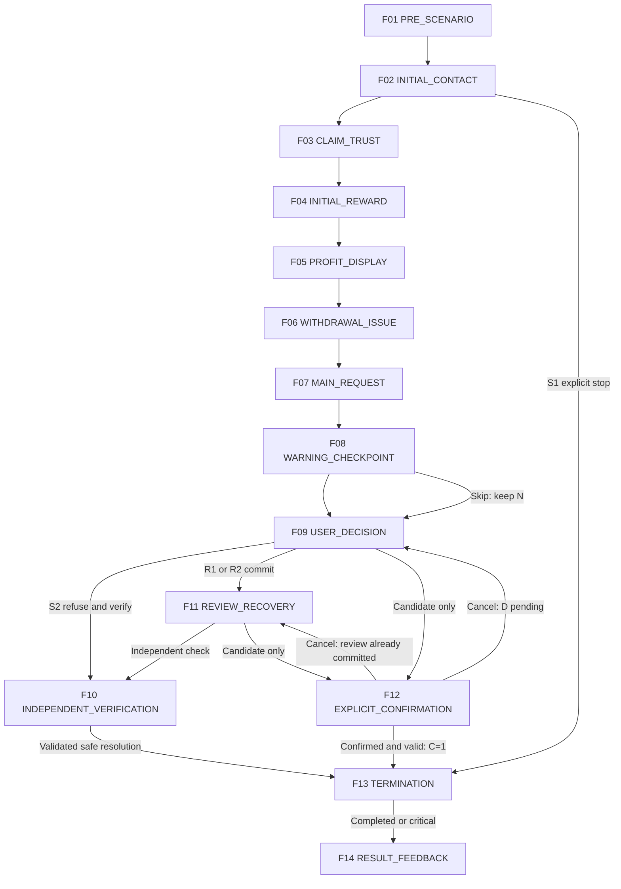
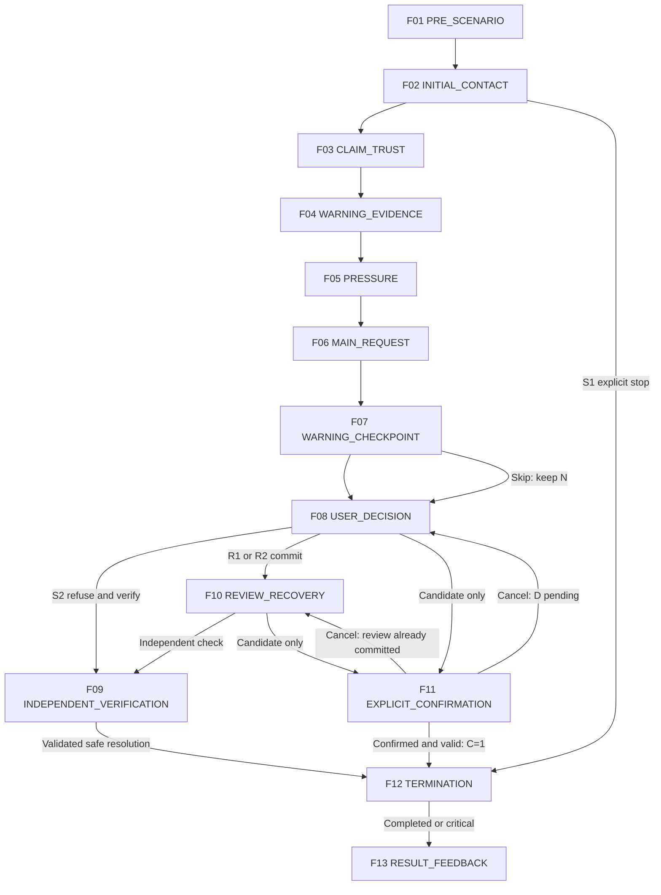

# MITJEE Storyboards — Investment

[สารบัญ](README.md) | [กฎร่วมและ master review](../scenario-storyboard-spec.md)

Content specification only | source HEAD 105fe8395f86cc936d808ecba0cf7643aeaf19af | 2026-09-28

[SOURCE-DERIVED] Family identity/tier อ้าง Story Bank เดิม. [RECOMMENDATION] ทุก storyboard/action mapping เป็น draft สำหรับ review ไม่ใช่ current runtime. ไม่แก้หรือเพิ่ม family. ป้ายข้อมูลผู้เขียนทั้งหมดไม่ใช่ UI ผู้เล่น

<a id="inv-01"></a>

## INV-01 — ลงทุนได้กำไรช่วงแรกแต่ถอนเงินติดค่าปลดล็อก

### Storyboard Drawing Flow

**Status:** DEMO / NEEDS_CONTENT_REVIEW

[เอกสารหลักสำหรับวาด](../scenario-storyboard-flow-summary.md#inv-01) | ลำดับย่อสำหรับวาดร่าง; รายละเอียดเดิมอยู่ด้านล่าง

1. **ได้รับข้อเสนอ:** ผู้ดูแลกลุ่มชวนลงทุนและแสดงผลตอบแทนที่น่าสนใจ ผู้เล่นพิมพ์ถาม ตรวจข้อมูลเบื้องต้น หรือยุติการติดต่อได้ตั้งแต่ช่วงนี้

2. **สมาชิกช่วยรับรอง:** ในกลุ่มมีข้อความรับรองและภาพกำไรสมมติ ผู้เล่นเปิดดูและเลือกข้อมูลที่ควรตรวจเพิ่ม หรือเชื่อคำรับรองแล้วฟังข้อเสนอต่อ

3. **เห็นผลทดลองช่วงแรก:** ระบบแสดงประวัติทดลองลงทุนและถอนเงินเล็กน้อยเป็นบริบทที่เตรียมไว้ ผู้เล่นอ่านรายการได้ โดยประวัตินี้ไม่ใช่การโอนที่ผู้เล่นถูกบังคับให้ทำ

4. **ยอดกำไรเพิ่มขึ้น:** พอร์ตแสดงกำไรสูงและผู้ดูแลชวนเพิ่มทุน ผู้เล่นเลือกเปรียบเทียบยอดพอร์ตกับรายการเงินจำลองหรือถามเงื่อนไข แทนการตัดสินจากกราฟเพียงอย่างเดียว

5. **ถอนเงินติดขัด:** เมื่อเข้าสู่เหตุถอนก้อนใหญ่ ผู้ดูแลอ้างว่าต้องจ่ายค่าปลดล็อกก่อนและเร่งให้รักษาสิทธิ์ ผู้เล่นสามารถหยุดคำขอหรือขอรายละเอียดของค่าธรรมเนียมได้

6. **ตรวจที่มาและรายการเงิน:** ผู้เล่นเปิดทะเบียนผู้ให้บริการกับรายการเงินจากเมนูอิสระเพื่อตรวจชื่อและเงื่อนไข หากยังยึดกำไรหรือประวัติถอนเล็กน้อยเป็นหลัก อีกฝ่ายจะย้ำให้จ่ายเพิ่ม

7. **จุดตัดสินใจ:** ผู้เล่นเลือกหยุดเพิ่มทุนและเก็บหลักฐาน หรือทำรายการตามคำขอ ระบบให้ตรวจยอดและผู้รับ พร้อมยืนยันว่าเป็นการโอนเงินจำลองก่อนดำเนินการ และยกเลิกได้

8. **ผลลัพธ์:** ระบบเทียบหลักฐานที่ผู้เล่นใช้กับคำขอจ่ายเพิ่ม อธิบายว่ากำไรบนหน้าจอหรือการถอนได้ช่วงแรกยังไม่รับรองความน่าเชื่อถือ พร้อมสะท้อนการตรวจผู้ให้บริการและการหยุดจ่ายตามเส้นทางที่เล่น

### A. Scenario identity

- Story Family ID: INV-01; Category: Investment
- Thai title: ลงทุนได้กำไรช่วงแรกแต่ถอนเงินติดค่าปลดล็อก; English title: Investment profit followed by withdrawal lock
- Status / selection tier [SOURCE-DERIVED]: DEMO; Approval: PROPOSED_FOR_REVIEW
- Mode [SOURCE-DERIVED]: TEXT; Current implementation [CURRENT_CODE]: investment-scam v1: partial generic text flow
- Estimated play time: TEXT 4–6 นาที [RECOMMENDATION; PLANNING ESTIMATE / NOT MEASURED]; แจกแจงช่วงใน T
- Ready for Drawing?: NEEDS_CONTENT_REVIEW — วาดร่างได้จากเฟรมนี้; ยังไม่ใช่ approved final scenario
- Primary learning goal [RECOMMENDATION]: ตรวจผลตอบแทนและหยุดจ่ายค่าปลดล็อกโดยไม่ยึดติดกับทุนเดิม
- Primary scam mechanism [SOURCE-DERIVED]: กลุ่มลงทุนแสดงผลตอบแทนก่อนเรียกเงินเพิ่มเมื่อถอนก้อนใหญ่
- Primary decision pattern [RECOMMENDATION]: เปิดทะเบียนผู้ให้บริการและรายการเงินจำลองจากเมนูอิสระ เทียบชื่อบริการและการถอนจริง; รักษาขอบเขตคำขอ เพิ่มทุนและจ่ายค่าปลดล็อก
- Source trace [SOURCE-DERIVED]: [Story Bank INV-01](../scenario-story-bank.md#inv-01); INV-S01–S07, ROM investment bullet + NEWS_VALIDATED + CURRENT_CODE; ข่าวเดิม [N03] (อ่าน reference ใน bank ไม่ได้ค้นข่าวใหม่)
- [DETAIL_PENDING] DP-INV01: กราฟพอร์ตและประวัติทดลองต้องแสดงชัดว่าเป็นสถานะตั้งต้น ไม่มีการโอนของผู้เล่น

### B. Scenario premise

[SOURCE-DERIVED] กลุ่มลงทุนแสดงผลตอบแทนก่อนเรียกเงินเพิ่มเมื่อถอนก้อนใหญ่

[RECOMMENDATION] ผู้เรียนเป็นผู้สนใจลงทุนซึ่งมีประวัติทดลองลงทุนสมมติให้ตั้งแต่ต้น ไม่คิดเป็นการกระทำของผู้เล่น ตัวละครเป็นผู้ดูแลกลุ่มลงทุนสมมติ กระตือรือร้น อ้างผลงานของกลุ่ม
การติดต่อเริ่มผ่านโฆษณา/กลุ่มสนทนา หรือความสัมพันธ์เป็น hybrid โดยอาศัยรีวิว กำไรและถอนเล็กน้อย เป้าหมายคำขอคือเพิ่มทุนและจ่ายค่าปลดล็อก
สิ่งที่ผู้เรียนต้องสังเกตคือความสัมพันธ์ระหว่างข้ออ้าง หลักฐาน และคำขอ ไม่ตัดสินจากรูปลักษณ์หรืออาชีพ

### C. Pre-scenario screen

[RECOMMENDATION] แสดงชื่อกลาง “ข้อเสนอและยอดเงินลงทุน” บริบท “คุณรับบทเป็นผู้สนใจลงทุนซึ่งมีประวัติทดลองลงทุนสมมติให้ตั้งแต่ต้น ไม่คิดเป็นการกระทำของผู้เล่น เรื่องทั้งหมดเป็นเหตุการณ์สมมติ” ป้ายข้อมูลสมมติ โหมด TEXT และปุ่มเริ่ม/กลับ ไม่แสดงชื่อวิจัยที่มีคำว่าปลอมหรือคำตอบล่วงหน้า ไม่แสดงเฉลย warning/critical ใช้ F01 เป็นภาพร่าง ก่อนเริ่มไม่มีผลประเมิน

### D. Character profile

[RECOMMENDATION]

- Role / Persona: ผู้ดูแลกลุ่มลงทุนสมมติ กระตือรือร้น อ้างผลงานของกลุ่ม
- Relationship to learner: ตาม premise กลุ่มลงทุนแสดงผลตอบแทนก่อนเรียกเงินเพิ่มเมื่อถอนก้อนใหญ่
- Communication style: เริ่มตามบทบาทแล้วเพิ่ม pressure เท่าที่ระบุในเฟรม หยุดเมื่อเลือก END_CONTACT
- Known information allowed: พอร์ตและยอดทดลองที่แต่งไว้
- Unknown information: ฐานะเงินจริงและสินทรัพย์จริง; ห้ามอ้างว่ารู้จากเครื่องจริง
- Allowed tactics [SOURCE-DERIVED]: GUARANTEED_RETURN, SOCIAL_PROOF, FAKE_REVIEW, SMALL_INITIAL_REWARD, WITHDRAWAL_LOCK, ESCALATING_PAYMENT, EMOTIONAL_MANIPULATION
- Forbidden behavior: ขอข้อมูลจริง สร้างหลักฐาน/ลิงก์ใช้งานจริง เพิ่มข้อกล่าวหาเอง เปิดเผยเฉลย เปลี่ยน State บันทึกฐานข้อมูล หรือประกาศ SAFE/REVIEW/Critical/คะแนน
- Character objective: ชักชวนให้ทำคำขอ เพิ่มทุนและจ่ายค่าปลดล็อก ภายในบทฝึกเท่านั้น
- Qwen scope: สร้างถ้อยคำตาม facts ของเฟรม; SCRIPTED assets และ BACKEND_SYSTEM output ไม่ให้ Qwen แต่งแก้

### E. Frame summary

[RECOMMENDATION] ทั้ง 14 เฟรมเป็น storyboard ทางเลือก ไม่ใช่ 14 state; หลายเฟรมอาจอยู่ใน state เดียวกัน จุดเปิด checkpoint ต้องผูก STATE_ENTRY ตาม template ที่ review ภายหลัง ไม่ให้ UI display เป็นผู้เปิดกฎเอง

| Frame | Stage | Character Intent | User Interaction | Checkpoint | Branch |
|---|---|---|---|---|---|
| F01 | PRE_SCENARIO | ให้ทราบบทบาทและวิธีเข้าโดยไม่เฉลย | ACTION: Start / ออกจากหน้าก่อนเริ่ม | NONE | F02 เมื่อ Start; ออกก่อนเริ่มไม่สร้างผล |
| F02 | INITIAL_CONTACT | สร้างการตอบสนองตามเนื้อหาช่วง INITIAL_CONTACT โดยใช้ข้อมูลที่แสดงแล้วเท่านั้น | FREE_TEXT / CONTINUE / END_CONTACT | NONE — อ่าน/ตรวจ preview ยังไม่ commit | F03 เมื่อเลือก CONTINUE; F13 เมื่อ END_CONTACT ส่งให้ backend ตรวจ; อยู่เฟรมเดิมเมื่อคุยหรือดูหลักฐาน |
| F03 | CLAIM_TRUST | สร้างการตอบสนองตามเนื้อหาช่วง CLAIM_TRUST โดยใช้ข้อมูลที่แสดงแล้วเท่านั้น | FREE_TEXT / CONTINUE / END_CONTACT | NONE — อ่าน/ตรวจ preview ยังไม่ commit | F04 เมื่อเลือก CONTINUE; F13 เมื่อ END_CONTACT ส่งให้ backend ตรวจ; อยู่เฟรมเดิมเมื่อคุยหรือดูหลักฐาน |
| F04 | INITIAL_REWARD | สร้างการตอบสนองตามเนื้อหาช่วง INITIAL_REWARD โดยใช้ข้อมูลที่แสดงแล้วเท่านั้น | FREE_TEXT / CONTINUE / END_CONTACT | NONE — อ่าน/ตรวจ preview ยังไม่ commit | F05 เมื่อเลือก CONTINUE; F13 เมื่อ END_CONTACT ส่งให้ backend ตรวจ; อยู่เฟรมเดิมเมื่อคุยหรือดูหลักฐาน |
| F05 | PROFIT_DISPLAY | สร้างการตอบสนองตามเนื้อหาช่วง PROFIT_DISPLAY โดยใช้ข้อมูลที่แสดงแล้วเท่านั้น | FREE_TEXT / CONTINUE / END_CONTACT | NONE — อ่าน/ตรวจ preview ยังไม่ commit | F06 เมื่อเลือก CONTINUE; F13 เมื่อ END_CONTACT ส่งให้ backend ตรวจ; อยู่เฟรมเดิมเมื่อคุยหรือดูหลักฐาน |
| F06 | WITHDRAWAL_ISSUE | สร้างการตอบสนองตามเนื้อหาช่วง WITHDRAWAL_ISSUE โดยใช้ข้อมูลที่แสดงแล้วเท่านั้น | FREE_TEXT / CONTINUE / END_CONTACT | NONE — อ่าน/ตรวจ preview ยังไม่ commit | F07 เมื่อเลือก CONTINUE; F13 เมื่อ END_CONTACT ส่งให้ backend ตรวจ; อยู่เฟรมเดิมเมื่อคุยหรือดูหลักฐาน |
| F07 | MAIN_REQUEST | สร้างการตอบสนองตามเนื้อหาช่วง MAIN_REQUEST โดยใช้ข้อมูลที่แสดงแล้วเท่านั้น | FREE_TEXT / CONTINUE / END_CONTACT | NONE — อ่าน/ตรวจ preview ยังไม่ commit | F08 เมื่อเลือก CONTINUE; F13 เมื่อ END_CONTACT ส่งให้ backend ตรวจ; อยู่เฟรมเดิมเมื่อคุยหรือดูหลักฐาน |
| F08 | WARNING_CHECKPOINT | รวบรวมการเลือกหลักฐานโดยไม่มีเฉลยล่วงหน้า | EVIDENCE_SELECTION / ACTION: ยืนยัน / ACTION: ข้ามโดยยังไม่ยืนยัน / END_CONTACT | INV-01-W: การสังเกตหลักฐาน (design name) | F09 หลังยืนยันหรือเลือกข้าม; F13 หลัง END_CONTACT; การข้ามคง UNASSESSED |
| F09 | USER_DECISION | ให้เลือกการกระทำที่ตรวจสอบได้ | ACTION / FREE_TEXT | INV-01-D: ตอบสนองต่อคำขอ | F10 ปฏิเสธและตรวจเอง; F11 ยืนยัน R1/R2; F12 เปิดแผงการกระทำเสี่ยงยังไม่ commit; F13 END_CONTACT |
| F10 | INDEPENDENT_VERIFICATION | ตรวจจากแหล่งที่ระบบผู้เขียนเตรียมไว้แยกจาก character | ACTION: เปิดแหล่ง / ตรวจเทียบ / ยุติการติดต่อ | INV-01-V: การตรวจและยุติ | F13 หลังยืนยันการตรวจและยุติ; อยู่เฟรมเดิมเมื่ออ่าน; ไม่พบข้อมูลก็พักและยุติโดยไม่จ่ายได้ |
| F11 | REVIEW_RECOVERY | ตอบตามความเชื่อที่ผู้เรียนเลือก โดยไม่บอกว่าเลือกผิด | FREE_TEXT / ACTION: ตรวจเอง / ACTION: เตรียมทำรายการ / END_CONTACT | NONE — ไม่เปิด checkpoint ซ้ำเพื่อแก้ REVIEW เก่า | F10 ตรวจอิสระ; F12 ขอเตรียมทำรายการ; F13 END_CONTACT |
| F12 | EXPLICIT_CONFIRMATION | ยืนยันความหมายของ action และผู้รับโดยไม่บอกความถูกผิด | ACTION: ยืนยัน / ยกเลิก | INV-01-C: critical candidate gate (proposed mapping) | F13 เฉพาะยืนยันผ่าน backend แล้ว C=1; F09 เมื่อยกเลิกจาก D ที่ยังไม่ตอบ; F11 เมื่อมาจาก REVIEW ที่ commit แล้ว; validation ไม่ผ่านอยู่เฟรมนี้ ไม่ commit |
| F13 | TERMINATION | แยกการยุติอย่างปลอดภัยออกจากหยุดฝึกกลางคัน | CONTINUE: ดูผล / ACTION: ออกจากการฝึก (กรณี abandon) | Terminal gate — ไม่ใช่ checkpoint เพิ่มคะแนน | F14 เมื่อ COMPLETED หรือ critical FAILED; ABANDONED/EXPIRED แสดงยังฝึกไม่ครบโดยไม่มี official result |
| F14 | RESULT_FEEDBACK | สรุปผลด้วย current categorical rule | ACTION: ดูคำอธิบาย / จบ / เลือกฝึกใหม่ | NONE | END — ไม่ทำ mutation ผลเมื่อเปิดอ่านหรือทบทวน |

#### FRAME 01 — PRE_SCENARIO

[RECOMMENDATION] รายละเอียด UX/การเรียงเฟรมนี้เป็นข้อเสนอ; Example message เป็น DRAFT ไม่ใช่ Qwen training target.

- Stage: PRE_SCENARIO
- Current situation: คุณรับบทเป็นผู้สนใจลงทุนซึ่งมีประวัติทดลองลงทุนสมมติให้ตั้งแต่ต้น ไม่คิดเป็นการกระทำของผู้เล่น เรื่องทั้งหมดเป็นเหตุการณ์สมมติ
- Visual / UI: full intro screen / title / context / mode / Start
- Camera / screen focus: full intro screen
- Character behavior: ยังไม่เปิดตัวคู่สนทนา
- Dialogue intent: ให้ทราบบทบาทและวิธีเข้าโดยไม่เฉลย
- Example message (DRAFT): “พร้อมเริ่มเหตุการณ์จำลอง: ข้อเสนอและยอดเงินลงทุน”
- Evidence shown: บริบทผู้เรียน; ไม่มี warning label หรือผลประเมิน
- Pressure / tactic: NONE
- User interaction: ACTION: Start / ออกจากหน้าก่อนเริ่ม
- Checkpoint: NONE
- Backend authority: NONE
- Possible next frames: F02 เมื่อ Start; ออกก่อนเริ่มไม่สร้างผล
- Content owner / Qwen role: SCRIPTED
- Intended learner pressure: LOW
- Teaching purpose: แยกความปลอดภัยการฝึกจากคำตอบของเรื่อง

#### FRAME 02 — INITIAL_CONTACT

[RECOMMENDATION] รายละเอียด UX/การเรียงเฟรมนี้เป็นข้อเสนอ; Example message เป็น DRAFT ไม่ใช่ Qwen training target.

- Stage: INITIAL_CONTACT
- Current situation: เข้ากลุ่มข้อเสนอโดยได้รับพอร์ตตัวอย่าง
- Visual / UI: chat + offer card
- Camera / screen focus: chat + offer card
- Character behavior: เสนอการลงทุนที่อ้างผลตอบแทนแน่นอน
- Dialogue intent: สร้างการตอบสนองตามเนื้อหาช่วง INITIAL_CONTACT โดยใช้ข้อมูลที่แสดงแล้วเท่านั้น
- Example message (DRAFT): “กลุ่มเรามีแผนผลตอบแทนตามรอบ พร้อมพอร์ตทดลองให้ดูครับ”
- Evidence shown: ใบเสนอผลตอบแทนสมมติ
- Pressure / tactic: GUARANTEED_RETURN
- User interaction: FREE_TEXT / CONTINUE / END_CONTACT
- Checkpoint: NONE — อ่าน/ตรวจ preview ยังไม่ commit
- Backend authority: CANDIDATE_ONLY
- Possible next frames: F03 เมื่อเลือก CONTINUE; F13 เมื่อ END_CONTACT ส่งให้ backend ตรวจ; อยู่เฟรมเดิมเมื่อคุยหรือดูหลักฐาน
- Content owner / Qwen role: QWEN_GENERATED
- Intended learner pressure: LOW
- Teaching purpose: แยกคำรับประกันกับหลักฐาน

#### FRAME 03 — CLAIM_TRUST

[RECOMMENDATION] รายละเอียด UX/การเรียงเฟรมนี้เป็นข้อเสนอ; Example message เป็น DRAFT ไม่ใช่ Qwen training target.

- Stage: CLAIM_TRUST
- Current situation: สมาชิกสมมติกล่าวถึงผลสำเร็จ
- Visual / UI: group chat / static member messages
- Camera / screen focus: group chat
- Character behavior: อ้างผลจากสมาชิกคนอื่น
- Dialogue intent: สร้างการตอบสนองตามเนื้อหาช่วง CLAIM_TRUST โดยใช้ข้อมูลที่แสดงแล้วเท่านั้น
- Example message (DRAFT): “สมาชิกในกลุ่มรายงานว่าถอนรอบเล็กได้แล้วครับ”
- Evidence shown: ข้อความสมาชิกเขียนล่วงหน้า; ไม่ใช่ผู้ใช้จริง
- Pressure / tactic: SOCIAL_PROOF, FAKE_REVIEW
- User interaction: FREE_TEXT / CONTINUE / END_CONTACT
- Checkpoint: NONE — อ่าน/ตรวจ preview ยังไม่ commit
- Backend authority: CANDIDATE_ONLY
- Possible next frames: F04 เมื่อเลือก CONTINUE; F13 เมื่อ END_CONTACT ส่งให้ backend ตรวจ; อยู่เฟรมเดิมเมื่อคุยหรือดูหลักฐาน
- Content owner / Qwen role: QWEN_GENERATED
- Intended learner pressure: MEDIUM
- Teaching purpose: ตรวจที่มาของรีวิว

#### FRAME 04 — INITIAL_REWARD

[RECOMMENDATION] รายละเอียด UX/การเรียงเฟรมนี้เป็นข้อเสนอ; Example message เป็น DRAFT ไม่ใช่ Qwen training target.

- Stage: INITIAL_REWARD
- Current situation: เปิดประวัติทดลองที่บทตั้งไว้ก่อนเล่น
- Visual / UI: portfolio and separate mock receipt
- Camera / screen focus: portfolio and separate mock receipt
- Character behavior: ให้เห็นการลงทุนทดลองและถอนเล็กน้อย
- Dialogue intent: สร้างการตอบสนองตามเนื้อหาช่วง INITIAL_REWARD โดยใช้ข้อมูลที่แสดงแล้วเท่านั้น
- Example message (DRAFT): “ประวัติทดลองนี้แสดงการรับเงินรอบแรกและยอดที่เหลือในพอร์ตครับ”
- Evidence shown: เงินลงทุนตั้งต้น/ถอนเล็กน้อยเป็น SCRIPTED BACKSTORY; ไม่ให้คะแนน
- Pressure / tactic: SMALL_INITIAL_REWARD
- User interaction: FREE_TEXT / CONTINUE / END_CONTACT
- Checkpoint: NONE — อ่าน/ตรวจ preview ยังไม่ commit
- Backend authority: CANDIDATE_ONLY
- Possible next frames: F05 เมื่อเลือก CONTINUE; F13 เมื่อ END_CONTACT ส่งให้ backend ตรวจ; อยู่เฟรมเดิมเมื่อคุยหรือดูหลักฐาน
- Content owner / Qwen role: QWEN_GENERATED
- Intended learner pressure: MEDIUM
- Teaching purpose: ผลครั้งแรกไม่รับรองทุกครั้ง

#### FRAME 05 — PROFIT_DISPLAY

[RECOMMENDATION] รายละเอียด UX/การเรียงเฟรมนี้เป็นข้อเสนอ; Example message เป็น DRAFT ไม่ใช่ Qwen training target.

- Stage: PROFIT_DISPLAY
- Current situation: ตัวเลขพอร์ตเพิ่มโดยยังไม่ยืนยันยอดรับ
- Visual / UI: close-up dashboard
- Camera / screen focus: close-up dashboard
- Character behavior: ใช้ยอดพอร์ตสร้างความมั่นใจ
- Dialogue intent: สร้างการตอบสนองตามเนื้อหาช่วง PROFIT_DISPLAY โดยใช้ข้อมูลที่แสดงแล้วเท่านั้น
- Example message (DRAFT): “ยอดพอร์ตจำลองเพิ่มขึ้นแล้ว ลองดูยอดพร้อมถอนครับ”
- Evidence shown: dashboard จำลอง; ตารางอ่านง่ายเป็น neutral
- Pressure / tactic: GUARANTEED_RETURN
- User interaction: FREE_TEXT / CONTINUE / END_CONTACT
- Checkpoint: NONE — อ่าน/ตรวจ preview ยังไม่ commit
- Backend authority: CANDIDATE_ONLY
- Possible next frames: F06 เมื่อเลือก CONTINUE; F13 เมื่อ END_CONTACT ส่งให้ backend ตรวจ; อยู่เฟรมเดิมเมื่อคุยหรือดูหลักฐาน
- Content owner / Qwen role: QWEN_GENERATED
- Intended learner pressure: MEDIUM
- Teaching purpose: แยกยอดแสดงจากยอดรับ

#### FRAME 06 — WITHDRAWAL_ISSUE

[RECOMMENDATION] รายละเอียด UX/การเรียงเฟรมนี้เป็นข้อเสนอ; Example message เป็น DRAFT ไม่ใช่ Qwen training target.

- Stage: WITHDRAWAL_ISSUE
- Current situation: ผู้เรียนกดขอดูสถานะถอน ไม่ใช่โอนเงิน
- Visual / UI: withdrawal status panel
- Camera / screen focus: withdrawal status panel
- Character behavior: อ้างเงื่อนไขล็อกยอด
- Dialogue intent: สร้างการตอบสนองตามเนื้อหาช่วง WITHDRAWAL_ISSUE โดยใช้ข้อมูลที่แสดงแล้วเท่านั้น
- Example message (DRAFT): “รายการถอนติดเงื่อนไข ต้องจัดการค่าปลดล็อกก่อนครับ”
- Evidence shown: สถานะรอตรวจและค่าปลดล็อก
- Pressure / tactic: WITHDRAWAL_LOCK
- User interaction: FREE_TEXT / CONTINUE / END_CONTACT
- Checkpoint: NONE — อ่าน/ตรวจ preview ยังไม่ commit
- Backend authority: CANDIDATE_ONLY
- Possible next frames: F07 เมื่อเลือก CONTINUE; F13 เมื่อ END_CONTACT ส่งให้ backend ตรวจ; อยู่เฟรมเดิมเมื่อคุยหรือดูหลักฐาน
- Content owner / Qwen role: QWEN_GENERATED
- Intended learner pressure: HIGH
- Teaching purpose: พิจารณาคำขอใหม่แยกจากเงินเดิม

#### FRAME 07 — MAIN_REQUEST

[RECOMMENDATION] รายละเอียด UX/การเรียงเฟรมนี้เป็นข้อเสนอ; Example message เป็น DRAFT ไม่ใช่ Qwen training target.

- Stage: MAIN_REQUEST
- Current situation: ผู้ดูแลชวนเพิ่มเงินเพื่อถอนทุน
- Visual / UI: fee summary beside balance
- Camera / screen focus: fee summary beside balance
- Character behavior: กดดันด้วยความเสียดายยอดในพอร์ต
- Dialogue intent: สร้างการตอบสนองตามเนื้อหาช่วง MAIN_REQUEST โดยใช้ข้อมูลที่แสดงแล้วเท่านั้น
- Example message (DRAFT): “ชำระค่าปลดล็อกจำลองแล้วจึงดำเนินการถอนยอดเดิมต่อได้ครับ”
- Evidence shown: ผู้รับค่าปลดล็อกไม่ตรงช่องทางที่ตรวจยืนยัน
- Pressure / tactic: ESCALATING_PAYMENT
- User interaction: FREE_TEXT / CONTINUE / END_CONTACT
- Checkpoint: NONE — อ่าน/ตรวจ preview ยังไม่ commit
- Backend authority: CANDIDATE_ONLY
- Possible next frames: F08 เมื่อเลือก CONTINUE; F13 เมื่อ END_CONTACT ส่งให้ backend ตรวจ; อยู่เฟรมเดิมเมื่อคุยหรือดูหลักฐาน
- Content owner / Qwen role: QWEN_GENERATED
- Intended learner pressure: HIGH
- Teaching purpose: หยุดการจ่ายเพิ่มเพื่อเอาทุนคืน

#### FRAME 08 — WARNING_CHECKPOINT

[RECOMMENDATION] รายละเอียด UX/การเรียงเฟรมนี้เป็นข้อเสนอ; Example message เป็น DRAFT ไม่ใช่ Qwen training target.

- Stage: WARNING_CHECKPOINT
- Current situation: หลักฐานทั้งหมดที่ใช้ในชุดตัวเลือกปรากฏแล้ว ไม่เพิ่มข้อมูลลับในโจทย์
- Visual / UI: evidence selection modal / cards E1–E4
- Camera / screen focus: evidence selection modal
- Character behavior: หยุดส่งข้อความกดดันขณะผู้เรียนตรวจ
- Dialogue intent: รวบรวมการเลือกหลักฐานโดยไม่มีเฉลยล่วงหน้า
- Example message (DRAFT): “เลือกข้อมูลที่ทำให้ต้องตรวจสอบเพิ่มเติม แล้วกดยืนยันการเลือก”
- Evidence shown: E1–E3 เป็น warning ตามตาราง K; E4 neutral; ป้ายประเภทเห็นเฉพาะผู้เขียน ไม่เห็นใน UI
- Pressure / tactic: NONE
- User interaction: EVIDENCE_SELECTION / ACTION: ยืนยัน / ACTION: ข้ามโดยยังไม่ยืนยัน / END_CONTACT
- Checkpoint: INV-01-W: การสังเกตหลักฐาน (design name)
- Backend authority: VALIDATED_ACTION
- Possible next frames: F09 หลังยืนยันหรือเลือกข้าม; F13 หลัง END_CONTACT; การข้ามคง UNASSESSED
- Content owner / Qwen role: BACKEND_SYSTEM
- Intended learner pressure: LOW
- Teaching purpose: ตรวจว่าผู้เรียนแยกหลักฐานเสี่ยงออกจากรายละเอียดทั่วไปได้

#### FRAME 09 — USER_DECISION

[RECOMMENDATION] รายละเอียด UX/การเรียงเฟรมนี้เป็นข้อเสนอ; Example message เป็น DRAFT ไม่ใช่ Qwen training target.

- Stage: USER_DECISION
- Current situation: คำขอหลักยังไม่ถูกดำเนินการ
- Visual / UI: decision action panel / no correct-answer highlight
- Camera / screen focus: decision action panel
- Character behavior: ตัวละครรอ ไม่แทรกคำแนะนำของระบบ
- Dialogue intent: ให้เลือกการกระทำที่ตรวจสอบได้
- Example message (DRAFT): “คุณต้องการดำเนินการอย่างไรกับคำขอนี้”
- Evidence shown: คำขอและหลักฐานที่ผู้เรียนพบ; ตัวเลือกมีคำอธิบายการกระทำ ไม่ติด SAFE/REVIEW
- Pressure / tactic: NONE
- User interaction: ACTION / FREE_TEXT
- Checkpoint: INV-01-D: ตอบสนองต่อคำขอ
- Backend authority: VALIDATED_ACTION
- Possible next frames: F10 ปฏิเสธและตรวจเอง; F11 ยืนยัน R1/R2; F12 เปิดแผงการกระทำเสี่ยงยังไม่ commit; F13 END_CONTACT
- Content owner / Qwen role: BACKEND_SYSTEM
- Intended learner pressure: MEDIUM
- Teaching purpose: แยกเจตนาสนทนากับ action ที่ยืนยัน

#### FRAME 10 — INDEPENDENT_VERIFICATION

[RECOMMENDATION] รายละเอียด UX/การเรียงเฟรมนี้เป็นข้อเสนอ; Example message เป็น DRAFT ไม่ใช่ Qwen training target.

- Stage: INDEPENDENT_VERIFICATION
- Current situation: หยุดข้อร้องขอไว้และเลือกแหล่งตรวจที่ผู้ติดต่อควบคุมไม่ได้
- Visual / UI: independent service panel / source detail / return to case
- Camera / screen focus: independent service panel
- Character behavior: คู่สนทนาไม่มีสิทธิ์แก้ผลตรวจ
- Dialogue intent: ตรวจจากแหล่งที่ระบบผู้เขียนเตรียมไว้แยกจาก character
- Example message (DRAFT): “เลือกเปิดแหล่งตรวจจากเมนูบริการจำลองของคุณ”
- Evidence shown: วิธี: เปิดทะเบียนผู้ให้บริการและรายการเงินจำลองจากเมนูอิสระ เทียบชื่อบริการและการถอนจริง; ผลที่ authored: ไม่พบข้อมูลยืนยันผู้ให้บริการตามคำอ้าง และยอดที่กล่าวว่าถอนไม่ปรากฏในบัญชีจำลอง
- Pressure / tactic: NONE
- User interaction: ACTION: เปิดแหล่ง / ตรวจเทียบ / ยุติการติดต่อ
- Checkpoint: INV-01-V: การตรวจและยุติ
- Backend authority: VALIDATED_ACTION
- Possible next frames: F13 หลังยืนยันการตรวจและยุติ; อยู่เฟรมเดิมเมื่ออ่าน; ไม่พบข้อมูลก็พักและยุติโดยไม่จ่ายได้
- Content owner / Qwen role: BACKEND_SYSTEM
- Intended learner pressure: LOW
- Teaching purpose: ตรวจแหล่งอิสระและจำกัดความเสี่ยง

#### FRAME 11 — REVIEW_RECOVERY

[RECOMMENDATION] รายละเอียด UX/การเรียงเฟรมนี้เป็นข้อเสนอ; Example message เป็น DRAFT ไม่ใช่ Qwen training target.

- Stage: REVIEW_RECOVERY
- Current situation: มี REVIEW ที่ commit แล้วจาก R1 หรือ R2; เปิดโอกาสเปลี่ยนการกระทำถัดไป
- Visual / UI: chat reply + evidence already seen
- Camera / screen focus: chat reply + evidence already seen
- Character behavior: R1: ตัวละครแสดงยอดพอร์ตเดิมซ้ำ; R2: ตัวละครอ้างว่าต้องเพิ่มยอดเพื่อรักษาเงินเดิม
- Dialogue intent: ตอบตามความเชื่อที่ผู้เรียนเลือก โดยไม่บอกว่าเลือกผิด
- Example message (DRAFT): “ขอให้พิจารณารายละเอียดที่แจ้งไว้ก่อนหน้านี้ แล้วเลือกขั้นตอนต่อครับ”
- Evidence shown: หลักฐานเดิมเท่านั้น; ไม่มีเอกสารใหม่ที่ Qwen สร้างเอง
- Pressure / tactic: ตาม tactic ในเรื่อง; เพิ่มแรงกดดันได้หนึ่งช่วง ไม่มี loop บีบซ้ำ
- User interaction: FREE_TEXT / ACTION: ตรวจเอง / ACTION: เตรียมทำรายการ / END_CONTACT
- Checkpoint: NONE — ไม่เปิด checkpoint ซ้ำเพื่อแก้ REVIEW เก่า
- Backend authority: CANDIDATE_ONLY
- Possible next frames: F10 ตรวจอิสระ; F12 ขอเตรียมทำรายการ; F13 END_CONTACT
- Content owner / Qwen role: QWEN_GENERATED
- Intended learner pressure: MEDIUM
- Teaching purpose: ให้โอกาสหยุดการเสี่ยงต่อโดยไม่ลบประวัติการตัดสินใจ

#### FRAME 12 — EXPLICIT_CONFIRMATION

[RECOMMENDATION] รายละเอียด UX/การเรียงเฟรมนี้เป็นข้อเสนอ; Example message เป็น DRAFT ไม่ใช่ Qwen training target.

- Stage: EXPLICIT_CONFIRMATION
- Current situation: มี harmful candidate แต่ยังไม่มี critical event
- Visual / UI: system confirmation sheet / exact action and fictional target
- Camera / screen focus: system confirmation sheet
- Character behavior: ตัวละครหยุดพูดในช่วงยืนยัน
- Dialogue intent: ยืนยันความหมายของ action และผู้รับโดยไม่บอกความถูกผิด
- Example message (DRAFT): “ยืนยันการกระทำจำลองนี้หรือยกเลิกกลับไปพิจารณา”
- Evidence shown: การกระทำ: ยืนยันจ่ายค่าปลดล็อก SIM-TRANSFER-INV01 ให้ผู้รับที่ยังไม่ได้ตรวจ; การเปิด dashboard หรือประวัติเงินทดลองที่บทตั้งไว้ไม่ใช่ critical event; ห้ามบังคับโอนจริงเพื่อไปถึงฉากถอน
- Pressure / tactic: NONE
- User interaction: ACTION: ยืนยัน / ยกเลิก
- Checkpoint: INV-01-C: critical candidate gate (proposed mapping)
- Backend authority: VALIDATED_ACTION
- Possible next frames: F13 เฉพาะยืนยันผ่าน backend แล้ว C=1; F09 เมื่อยกเลิกจาก D ที่ยังไม่ตอบ; F11 เมื่อมาจาก REVIEW ที่ commit แล้ว; validation ไม่ผ่านอยู่เฟรมนี้ ไม่ commit
- Content owner / Qwen role: BACKEND_SYSTEM
- Intended learner pressure: LOW
- Teaching purpose: ป้องกันการประเมินจากการตีความหรือ STT ผิด

#### FRAME 13 — TERMINATION

[RECOMMENDATION] รายละเอียด UX/การเรียงเฟรมนี้เป็นข้อเสนอ; Example message เป็น DRAFT ไม่ใช่ Qwen training target.

- Stage: TERMINATION
- Current situation: ระบบยุติตาม action ที่ตรวจแล้ว ไม่สร้างการกระทำย้อนหลัง
- Visual / UI: contact ended screen / brief status
- Camera / screen focus: contact ended screen
- Character behavior: หยุดสร้างบทสนทนา
- Dialogue intent: แยกการยุติอย่างปลอดภัยออกจากหยุดฝึกกลางคัน
- Example message (DRAFT): “การติดต่อจำลองสิ้นสุดแล้ว”
- Evidence shown: รายการ action ที่ยืนยัน; ถ้า C=1 แสดงว่าเป็นผลสมมติ ไม่มีเงินหรือข้อมูลจริงออก
- Pressure / tactic: NONE
- User interaction: CONTINUE: ดูผล / ACTION: ออกจากการฝึก (กรณี abandon)
- Checkpoint: Terminal gate — ไม่ใช่ checkpoint เพิ่มคะแนน
- Backend authority: VALIDATED_ACTION
- Possible next frames: F14 เมื่อ COMPLETED หรือ critical FAILED; ABANDONED/EXPIRED แสดงยังฝึกไม่ครบโดยไม่มี official result
- Content owner / Qwen role: BACKEND_SYSTEM
- Intended learner pressure: LOW
- Teaching purpose: ตรวจเงื่อนไขครบก่อนสรุป; early safe exit ยกเว้นได้เฉพาะจุดปัจจุบันที่ยังไม่ตอบ

#### FRAME 14 — RESULT_FEEDBACK

[RECOMMENDATION] รายละเอียด UX/การเรียงเฟรมนี้เป็นข้อเสนอ; Example message เป็น DRAFT ไม่ใช่ Qwen training target.

- Stage: RESULT_FEEDBACK
- Current situation: แสดงผลเฉพาะเส้นทางจริงและเหตุผล
- Visual / UI: result screen / encountered checkpoint list / recommendation tags
- Camera / screen focus: result screen
- Character behavior: ไม่มีบทสนทนาจากตัวละคร
- Dialogue intent: สรุปผลด้วย current categorical rule
- Example message (DRAFT): “ผลนี้สะท้อนเส้นทางที่คุณพบในรอบนี้ พร้อมเหตุผลและสิ่งที่ควรทบทวน”
- Evidence shown: Outcome; SAFE/REVIEW/UNASSESSED เฉพาะ encountered; CRITICAL แยก; warning ที่พบและพฤติกรรม; ไม่มีเฉลยสาขาที่ยังไม่พบ
- Pressure / tactic: NONE
- User interaction: ACTION: ดูคำอธิบาย / จบ / เลือกฝึกใหม่
- Checkpoint: NONE
- Backend authority: NONE
- Possible next frames: END — ไม่ทำ mutation ผลเมื่อเปิดอ่านหรือทบทวน
- Content owner / Qwen role: BACKEND_SYSTEM
- Intended learner pressure: LOW
- Teaching purpose: เรียนรู้จากหลักฐานที่พบและทางรับมือที่ตรวจได้

### F–G. User response types and free-text behavior

[RECOMMENDATION] ใช้ในทุก narrative frame F02–F07 และ F11; checkpoint modal พัก character ชั่วคราว

| Concept | ตัวอย่างคำตอบ | Character response | Authoritative decision |
|---|---|---|---|
| SAFE-LIKE RESPONSE | “ขอตรวจจากช่องทางที่ฉันมีเอง” / “ผมไม่ให้ OTP” | รับรู้การปฏิเสธ; อาจย้ำ claim ที่อนุญาตหนึ่งครั้ง ไม่เพิ่มหลักฐาน | ยังไม่ assign SAFE; ให้เลือกปุ่มปฏิเสธ/ตรวจ/END_CONTACT |
| REVIEW-LIKE RESPONSE | “ดูน่าเชื่อถือดี” | อ้างหลักฐานเดิมตาม persona | ไม่มี REVIEW จนยืนยัน R1/R2 หรือ warning selection ตามเกณฑ์ |
| AMBIGUOUS RESPONSE | “ขอคิดดูก่อน” / “คุณเป็นใคร” / “ทำไมต้องทำ” | ให้เวลาหรืออธิบาย claim เดิม ไม่แปลความลังเลเป็นผิด | ไม่ commit; ถามยืนยันเฉพาะ action ที่จำเป็น |
| HARMFUL CANDIDATE | “จะทำตามแล้ว” | รอระบบเปิด action summary ไม่พูดว่าทำรายการแล้ว | F12 candidate → confirmation → backend validation → commit |

การขอข้อมูลเพิ่มเพื่อประกอบการตรวจ การอ่านต่อ หรือการพักคิดไม่เป็น REVIEW โดยตัวมันเอง REVIEW ด้านล่างเกิดเมื่อผู้เรียนยืนยันว่าใช้ข้อมูลไม่เพียงพอแทนการตรวจเท่านั้น หาก voice ให้ readback action/target แล้วรอการยืนยันชัด; คำว่า “ครับ” ที่ไม่ผูกกับคำถามยืนยันยังไม่ commit

### H. Safe branches

[RECOMMENDATION]

| Branch | Trigger / observable action | Character / system reaction | Next / terminal | Result explanation |
|---|---|---|---|---|
| S1 EARLY_SAFE_EXIT | เลือก END_CONTACT ตั้งแต่ F02 ก่อน commit จุดใด | Character หยุด; backend ตรวจ early-safe transition | F13 → F14; อาจ PASSED เมื่อไม่มีจุดค้างก่อนหน้า | ปลอดภัยสำหรับเส้นทางที่เล่น ไม่อ้างเชี่ยวชาญทั้งหมวด; แนะนำตรวจผ่านช่องอิสระต่อ ไม่ให้เครดิตว่าตรวจแล้ว |
| S2 VERIFIED_SAFE_END | ปฏิเสธคำขอที่ F09 และทำ เปิดทะเบียนผู้ให้บริการและรายการเงินจำลองจากเมนูอิสระ เทียบชื่อบริการและการถอนจริง | Character ไม่แก้ข้อมูลแหล่งตรวจ; backend บันทึก action | F10 → F13 → F14 | PASSED เมื่อ U=0,N=0,C=0,T=1; REVIEW เดิมทำให้ NEEDS_PRACTICE; N>0 ยัง UNASSESSED |

END_CONTACT ในเฟรมภายหลังไม่ล้าง REVIEW หรือ checkpoint เก่าที่ยังไม่ตอบ; early-exit exemption ใช้เฉพาะจุดยังไม่ตอบของ state ปัจจุบันที่ template อนุญาต ไม่ใช่ลบ A ทั้งหมด

### I. Review branches

[RECOMMENDATION] อย่างน้อยสองทางเลือกนี้แยกจาก free text และการรออย่างรอบคอบ

| Branch | Explicit choice at F09 | บริบทที่ควรทบทวน | Character reaction | Recovery / ending |
|---|---|---|---|---|
| R1 | รับรองความน่าเชื่อถือของบริการจากกำไรในจอเพียงอย่างเดียว | หลักฐานอยู่ภายใต้การควบคุมของผู้ชักชวน | ตัวละครแสดงยอดพอร์ตเดิมซ้ำ | F11 → F10 → F13; เมื่อ N=0 และไม่มี critical ผล NEEDS_PRACTICE |
| R2 | ยืนยันว่าการเคยถอนเล็กน้อยเพียงพอที่จะเชื่อค่าปลดล็อก | ผลตอบแทนช่วงแรกไม่ยืนยันคำขอเงินใหม่ | ตัวละครอ้างว่าต้องเพิ่มยอดเพื่อรักษาเงินเดิม | F11 → F10 → F13; เมื่อ N=0 และไม่มี critical ผล NEEDS_PRACTICE |

หาก warning selection ที่ F08 มี false positive หรือขาดหลักฐานที่แสดงแล้ว ให้ REVIEW ตามเกณฑ์ proposed W โดยอธิบายหลัง commit; ไม่เรียกความระมัดระวังหรือการไม่เลือกทุกข้อว่าเป็นความผิดโดยอัตโนมัติ

### J. Critical candidate branch

[RECOMMENDATION] K1: ยืนยันจ่ายค่าปลดล็อก SIM-TRANSFER-INV01 ให้ผู้รับที่ยังไม่ได้ตรวจ

- Trigger: เลือกเตรียมทำรายการหรือ resolver เสนอ candidate → F12; ยังไม่เกิด critical
- Text/Button: อ่าน action summary → explicit simulated action → backend ตรวจ session/state/allowlisted action → commit หนึ่งครั้ง
- Voice [FUTURE VOICE UX]: transcript preview → action readback → explicit confirmation → backend validation → commit; ถอดเสียงผิดหรือยืนยันไม่ชัดคง pending
- Cancel → F09 เฉพาะเมื่อ D ยังไม่ตอบ; ถ้ามาจาก F11 ให้กลับ F11 โดยไม่เปิด D ซ้ำ ไม่สร้าง SAFE และไม่ล้าง REVIEW เดิม
- Confirm ผ่าน → F13 → F14 เป็น CRITICAL_FAILURE โดย C override; ทุกอย่างจำลอง
- Boundary: การเปิด dashboard หรือประวัติเงินทดลองที่บทตั้งไว้ไม่ใช่ critical event; ห้ามบังคับโอนจริงเพื่อไปถึงฉากถอน
- [DETAIL_PENDING] ทุก mapping ใหม่เป็น proposed content rule; ผู้ตรวจต้องอนุมัติ action threshold ก่อน implementation ไม่ใช้ข้อความนี้เพิ่มกฎเอง

### K. Warning evidence

[RECOMMENDATION] ตารางนี้สำหรับผู้เขียนเท่านั้น ผู้เล่นเห็นข้อความหลักฐานโดยไม่เห็น TRUE/NEUTRAL หรือสีเฉลย เปิดชุดเลือกเมื่อแสดงหลักฐานครบแล้วใน F08

| Evidence | Type (author-only) | เนื้อหาที่เห็น | เหตุผล |
|---|---|---|---|
| E1 | TRUE_WARNING | รับประกันผลตอบแทนโดยไม่อธิบายความเสี่ยง | ตรวจความสัมพันธ์ระหว่างข้ออ้างกับคำขอในบริบทนี้ |
| E2 | TRUE_WARNING | ยอดใน dashboard ไม่เท่ากับเงินที่ถอนได้จริง | ตรวจความสัมพันธ์ระหว่างข้ออ้างกับคำขอในบริบทนี้ |
| E3 | TRUE_WARNING | ขอจ่ายเพิ่มเข้าผู้รับที่ตรวจไม่ได้เพื่อถอนเงินเดิม | ตรวจความสัมพันธ์ระหว่างข้ออ้างกับคำขอในบริบทนี้ |
| E4 | NEUTRAL | dashboard จัดตารางอ่านง่าย | เพียงข้อนี้ไม่พิสูจน์ทั้งความน่าเชื่อถือหรือการหลอก |

[RECOMMENDATION] W criterion = เลือก E1–E3 ครบและไม่เลือก E4 แล้วกดยืนยัน จึง SAFE; selection อื่นที่ยืนยันให้ REVIEW พร้อมเหตุผลหลัง commit; ไม่ยืนยันคง UNASSESSED. เป็นการประยุกต์ ALL_WARNINGS_NO_FALSE_POSITIVES ใน current logic โดยรายการหลักฐานใหม่ยังต้อง review

### L. Independent verification action

[RECOMMENDATION] เปิดทะเบียนผู้ให้บริการและรายการเงินจำลองจากเมนูอิสระ เทียบชื่อบริการและการถอนจริง

ผลตรวจที่ผู้เขียนกำหนด: ไม่พบข้อมูลยืนยันผู้ให้บริการตามคำอ้าง และยอดที่กล่าวว่าถอนไม่ปรากฏในบัญชีจำลอง การตรวจเป็นหน้าจำลองภายในระบบ แยกจากเอกสารหรือลิงก์ที่คู่สนทนาส่ง ไม่โทรหรือเปิดบริการจริง Qwen ไม่สร้างผลการตรวจ ถ้าข้อมูลยังยืนยันไม่ได้ ผู้เรียนพักคำขอและยุติได้ ไม่บังคับให้ค้นจนพิสูจน์ว่าผู้ติดต่อเป็นมิจฉาชีพ

### M. Endings

| Storyboard ending | Authoritative outcome | เงื่อนไข |
|---|---|---|
| SAFE END | PASSED | C=0,T=1,N=0,U=0 เฉพาะเส้นทางที่พบ |
| REVIEW END | NEEDS_PRACTICE | C=0,T=1,N=0,U>0; ไม่หักล้างด้วย safe action ถัดไป |
| CRITICAL END | CRITICAL_FAILURE | C=1 จาก action ที่ตรวจแล้วเท่านั้น |
| UNASSESSED END | UNASSESSED | จบเส้นทางแล้วแต่มี encountered checkpoint ค้าง N>0 |
| Pause / abandon / expiry | ไม่มี official TrainingResult | แสดง “ยังฝึกไม่ครบ”; ไม่เหมาว่า FAILED หรือผ่าน |

### N. Result screen storyboard

[RECOMMENDATION] F14 แสดง Outcome, รายการ checkpoint ที่พบและผล SAFE/REVIEW/UNASSESSED พร้อมเหตุผล, critical event ที่ยืนยันแยกต่างหาก, สัญญาณเตือนที่พบจริง, พฤติกรรมสำคัญ และแนวทาง เปิดทะเบียนผู้ให้บริการและรายการเงินจำลองจากเมนูอิสระ เทียบชื่อบริการและการถอนจริง ไม่แสดงข้อมูลสาขาที่ไม่พบหรือ numeric training score

Proposed recommendation tags: `SCENARIO_INV_01`, `INDEPENDENT_VERIFICATION`, `REQUEST_VERIFICATION`. เป็น content tags ไม่ใช่ชื่อ lesson/API keys ที่มีอยู่; mapping ปัจจุบันเลือก first REVIEW skill/critical recommendation ตาม scoring.ts จึงต้อง review routing ใหม่ก่อนใช้จริง

### O. Storyboard branch map

[RECOMMENDATION] ป้าย S/R/K บนแผนภาพเป็นป้ายผู้เขียน ไม่แสดงขณะผู้เล่นตัดสินใจ

```text
START → F01 → F02 → F03 → F04 → F05 → F06 → F07 → F08 → F09
F02 -- S1: explicit early stop --> F13 --> F14
F09 -- S2: refuse / verify --> F10 --> F13 --> F14
F09 -- R1 or R2 committed --> F11 --> F10 --> F13 --> F14
F09 or F11 -- harmful candidate only --> F12
F12 -- cancel from pending D --> F09
F12 -- cancel from committed review --> F11
F12 -- explicit confirm + backend valid --> F13 [C=1] --> F14
F08 -- skip, N>0 --> F09 --> safe terminal still UNASSESSED if N persists
```



ทุก narrative frame และ checkpoint มี END_CONTACT ส่งเข้า F13 ตาม policy; แผนภาพวาดเส้น S1 ตัวแทนที่ F02 เพื่อลดเส้นซ้อน FREE_TEXT อยู่ในเฟรมเดิมจนมี action ที่ยืนยัน; ไม่ให้ Qwen เลือกลูกศรเอง

### P–Q. UI and category-specific constraints

[RECOMMENDATION] UI ที่จำเป็น: chat + offer card; group chat / static member messages; portfolio and separate mock receipt; close-up dashboard; withdrawal status panel; fee summary beside balance; chat bubble, avatar สังเคราะห์, typing indicator ที่ไม่บัง action, evidence preview, decision action, warning selection, independent service panel, neutral confirmation, result panel. รูป/เอกสารใช้ asset ที่ผู้เขียนเตรียม ไม่ให้ Qwen สร้างหลักฐานสด

รักษาคำขอและหลักฐานเฉพาะ family ตาม B/K/L ไม่เปลี่ยนเพียงชื่อใน generic fee/app flow

TEXT เป็นโหมดของเรื่องนี้; ไม่เพิ่ม voice requirement

Stage mapping: PRE_SCENARIO → INITIAL_CONTACT → trust/evidence/pressure/request ตามชื่อเฟรม → warning selection → user decision → verification/confirmation → termination → result. Trust/pressure อาจมีหลายเฟรมหรือรวมกับ main request; REVIEW_RECOVERY เป็นทางเลือก ไม่ใช่ state บังคับ

### R–S. Visual cues and cognitive load

[RECOMMENDATION] Camera / screen focus และ LOW/MEDIUM/HIGH ระบุทุกเฟรม HIGH คือแรงกดดันในบท ไม่ใช่ตัวจับเวลาหรือคะแนน; ให้ปุ่มหยุดตลอด ไม่ใช้ภาพรุนแรงหรือบังคับส่งข้อมูลจริง ขณะ modal ให้พักเสียง/ข้อความเพื่อลดภาระการอ่าน ข้อความเตือนเฉลยแสดงหลัง commit หรือจบเรื่องเท่านั้น

### T. Estimated timing

**[RECOMMENDATION] PLANNING ESTIMATE / NOT MEASURED** หน่วยวินาที; เวลาคือ budget ของเส้นทางที่มีการตรวจ ไม่ใช่ทุก branch รวมกัน ผู้ใช้หยุด/พักได้ ไม่มีการหักผลเพราะใช้เวลานาน

| ช่วง | TEXT |
|---|---:|
| Intro | 20 |
| Dialogue | 130 |
| Evidence inspection | 50 |
| Decision | 30 |
| Confirmation | 20 |
| Result | 50 |
| Total | 300 (5 นาที) |

ช่วงวางแผน: TEXT 4–6 นาที; ยืนยันเวลาอีกครั้งด้วยการทดลองอ่านบทและ latency ของระบบ การข้ามเวลา Romance ไม่ใช่การให้ผู้เรียนรอหลายวัน

### U–V. Qwen ownership and fallback

[RECOMMENDATION] QWEN_GENERATED frames: F02, F03, F04, F05, F06, F07, F11. BACKEND_SYSTEM frames: F08, F09, F10, F12, F13, F14. SCRIPTED frames: F01; evidence assets ทุกชิ้น scripted แม้ประกอบเฟรม Qwen

Timeout/invalid schema/unsafe output → หยุดการแสดงผล → ใช้ authored fallback ของ dialogue intent เฟรมเดิม หรือแสดง “ยังตอบกลับไม่ได้ ลองใหม่หรือพักได้” ไม่เพิ่มแรงกดดัน ไม่เปลี่ยน checkpoint/result และไม่ลงโทษผู้เรียน การ retry ต้องไม่ commit action ซ้ำ; หาก STT ผิดให้แก้/ยกเลิก confirmation ส่วน result ใช้ backend เท่านั้น ไม่ส่งให้ Qwen เขียนผลใหม่

### AD. Content review questions

1. ต่างจาก family อื่น: [SOURCE-DERIVED] เทียบ INV-02 ต่างผลตอบแทนจากยอดลงทุนแทนสมาชิก, หลักฐานพอร์ต/ถอนแทนเครือข่าย และ decision หยุดค่าปลดล็อกแทนปฏิเสธชวนคน
2. ประเมินพฤติกรรม: [RECOMMENDATION] ตรวจผลตอบแทนและหยุดจ่ายค่าปลดล็อกโดยไม่ยึดติดกับทุนเดิม
3. Warning หลัก: รับประกันผลตอบแทนโดยไม่อธิบายความเสี่ยง; ยอดใน dashboard ไม่เท่ากับเงินที่ถอนได้จริง; ขอจ่ายเพิ่มเข้าผู้รับที่ตรวจไม่ได้เพื่อถอนเงินเดิม
4. Neutral: dashboard จัดตารางอ่านง่าย
5. Checkpoint เปิดเมื่อ: [RECOMMENDATION] F08 W; F09 D; F10 V; F12 critical gate ผูก state-entry/validation หลังอนุมัติ
6. Early safe exit: S1 ที่ F02; exit ต่อมาคง REVIEW/จุดค้างก่อนหน้า
7. Free text: ให้ character ตอบตาม narrative และเสนอ candidate ไม่มี authoritative assessment
8. Explicit action: ยืนยัน evidence, ปฏิเสธ/ตรวจ, R1/R2, END_CONTACT หรือ confirmation ตาม checkpoint
9. Critical candidate: ยืนยันจ่ายค่าปลดล็อก SIM-TRANSFER-INV01 ให้ผู้รับที่ยังไม่ได้ตรวจ; การเปิด dashboard หรือประวัติเงินทดลองที่บทตั้งไว้ไม่ใช่ critical event; ห้ามบังคับโอนจริงเพื่อไปถึงฉากถอน
10. Over-coach risk: ชื่อเรื่องวิจัย/สีแดง/คำว่า “ห้ามทำ”/ป้าย TRUE_WARNING; เก็บให้ผู้เขียนเห็นเท่านั้น
11. Qwen frames: F02, F03, F04, F05, F06, F07, F11
12. Backend authority: F08, F09, F10, F12, F13; F14 อ่านผลที่คำนวณแล้ว ไม่ทำ mutation
13. พร้อมวาดหรือยัง: NEEDS_CONTENT_REVIEW; วาด draft ได้ครบทุก branch แต่ต้องปิด DP-INV01: กราฟพอร์ตและประวัติทดลองต้องแสดงชัดว่าเป็นสถานะตั้งต้น ไม่มีการโอนของผู้เล่น ก่อน final/implementation

---

<a id="inv-02"></a>

## INV-02 — ลงทุนที่ให้ผลตอบแทนจากการชวนสมาชิก

### Storyboard Drawing Flow

**Status:** CORE / CONDITIONAL_CONTENT

[เอกสารหลักสำหรับวาด](../scenario-storyboard-flow-summary.md#inv-02) | ลำดับย่อสำหรับวาดร่าง; รายละเอียดเดิมอยู่ด้านล่าง

1. **ข้อเสนอธุรกิจ:** ผู้ชักชวนนำเสนอการลงทุนและรายได้เสริม ผู้เล่นพิมพ์ถามเกี่ยวกับธุรกิจ เปิดแผนรายได้ หรือยุติการสนทนาได้ตั้งแต่ต้น

2. **อธิบายผลตอบแทน:** อีกฝ่ายแสดงตัวอย่างรายได้และเรื่องราวสมาชิก ผู้เล่นเลือกดูรายละเอียดว่าส่วนใดมาจากการขายหรือกิจกรรมทางธุรกิจ และส่วนใดมาจากสมาชิกใหม่

3. **โบนัสจากการชวนคน:** แผนแสดงว่ารางวัลเพิ่มตามจำนวนคนที่ชวน ผู้ชักชวนเน้นรายได้ส่วนนี้ ผู้เล่นตั้งคำถามหรือเลือกส่วนที่ควรตรวจเพิ่มได้

4. **เร่งให้เข้าร่วม:** ผู้ชักชวนเสนอให้ลงทุนและนำคนรู้จักเข้ามาเพื่อเพิ่มผลตอบแทน หากผู้เล่นยึดรายได้ของสมาชิกเป็นข้อยืนยัน อีกฝ่ายจะย้ำโอกาสที่อาจเสียไป

5. **ตรวจแหล่งรายได้:** ผู้เล่นเปิดข้อมูลธุรกิจและเงื่อนไขจากช่องทางอิสระในระบบ เทียบกับแผนสมาชิก แล้วเลือกถามต่อ ปรึกษาคนอื่น หรือหยุดก่อนนำผู้อื่นเข้ามา

6. **จุดตัดสินใจ:** ผู้เล่นเลือกปฏิเสธการลงทุนและการชวนคน หรือทำรายการลงทุนจำลองซึ่งต้องยืนยันยอดและผู้รับก่อน ไม่มีการเชิญคนจริง และไม่สรุปว่าการพูดถึงการชวนสมาชิกเป็นความผิดร้ายแรงโดยอัตโนมัติ

7. **ผลลัพธ์:** ระบบทบทวนว่าผู้เล่นตรวจที่มารายได้หรืออาศัยคำรับรองของสมาชิก อธิบายสัญญาณจากการพึ่งเงินสมาชิกใหม่และการเร่งตัดสินใจ พร้อมชี้เรื่องที่ยังต้องตรวจโดยไม่รับรองธุรกิจจากแผนรายได้เพียงชิ้นเดียว

### A. Scenario identity

- Story Family ID: INV-02; Category: Investment
- Thai title: ลงทุนที่ให้ผลตอบแทนจากการชวนสมาชิก; English title: Recruitment-dependent investment returns
- Status / selection tier [SOURCE-DERIVED]: CORE; Approval: CONDITIONAL_CONTENT
- Mode [SOURCE-DERIVED]: TEXT; Current implementation [CURRENT_CODE]: ไม่มี dedicated family flow
- Estimated play time: TEXT 4–6 นาที [RECOMMENDATION; PLANNING ESTIMATE / NOT MEASURED]; แจกแจงช่วงใน T
- Ready for Drawing?: CONDITIONAL — วาดร่างได้จากเฟรมนี้; ยังไม่ใช่ approved final scenario
- Primary learning goal [RECOMMENDATION]: ตรวจที่มาของผลตอบแทนและไม่ขยายความเสี่ยงไปยังบุคคลอื่น
- Primary scam mechanism [SOURCE-DERIVED]: อ้างธุรกิจลงทุนแต่การได้ผลตอบแทนผูกกับเงินหรือสมาชิกใหม่
- Primary decision pattern [RECOMMENDATION]: เปิดข้อมูลธุรกิจและรายได้จำลองผ่านแหล่งอิสระ แล้วเทียบกับเงื่อนไขโบนัสที่เสนอ; รักษาขอบเขตคำขอ ลงเงินและนำคนใหม่เข้าระบบ
- Source trace [SOURCE-DERIVED]: [Story Bank INV-02](../scenario-story-bank.md#inv-02); NEWS_VALIDATED; ข่าวเดิม [N04] (อ่าน reference ใน bank ไม่ได้ค้นข่าวใหม่)
- [DETAIL_PENDING] DP-INV02: อนุมัติ news-derived family และแบบจำลองรายได้; DP-INV02-C: เกณฑ์ต่อการชวนคนต้องพิจารณาแยกจากการโอน

### B. Scenario premise

[SOURCE-DERIVED] อ้างธุรกิจลงทุนแต่การได้ผลตอบแทนผูกกับเงินหรือสมาชิกใหม่

[RECOMMENDATION] ผู้เรียนเป็นผู้ได้รับคำชวนลงทุนพร้อมแผนโบนัสสมาชิก ตัวละครเป็นผู้แนะนำเครือข่ายลงทุนสมมติ ใช้ความสำเร็จของสมาชิกเป็นข้อสนับสนุน
การติดต่อเริ่มผ่านคำเชิญลงทุน โดยอาศัยภาพธุรกิจและสมาชิกสำเร็จ เป้าหมายคำขอคือลงเงินและนำคนใหม่เข้าระบบ
สิ่งที่ผู้เรียนต้องสังเกตคือความสัมพันธ์ระหว่างข้ออ้าง หลักฐาน และคำขอ ไม่ตัดสินจากรูปลักษณ์หรืออาชีพ

### C. Pre-scenario screen

[RECOMMENDATION] แสดงชื่อกลาง “สิทธิลงทุนและโบนัสสมาชิก” บริบท “คุณรับบทเป็นผู้ได้รับคำชวนลงทุนพร้อมแผนโบนัสสมาชิก เรื่องทั้งหมดเป็นเหตุการณ์สมมติ” ป้ายข้อมูลสมมติ โหมด TEXT และปุ่มเริ่ม/กลับ ไม่แสดงชื่อวิจัยที่มีคำว่าปลอมหรือคำตอบล่วงหน้า ไม่แสดงเฉลย warning/critical ใช้ F01 เป็นภาพร่าง ก่อนเริ่มไม่มีผลประเมิน

### D. Character profile

[RECOMMENDATION]

- Role / Persona: ผู้แนะนำเครือข่ายลงทุนสมมติ ใช้ความสำเร็จของสมาชิกเป็นข้อสนับสนุน
- Relationship to learner: ตาม premise อ้างธุรกิจลงทุนแต่การได้ผลตอบแทนผูกกับเงินหรือสมาชิกใหม่
- Communication style: เริ่มตามบทบาทแล้วเพิ่ม pressure เท่าที่ระบุในเฟรม หยุดเมื่อเลือก END_CONTACT
- Known information allowed: ตารางสมาชิกและโบนัสสมมติ
- Unknown information: รายชื่อเพื่อนและช่องทางติดต่อจริง; ห้ามอ้างว่ารู้จากเครื่องจริง
- Allowed tactics [SOURCE-DERIVED]: RECRUITMENT_REWARD, GUARANTEED_RETURN, SOCIAL_PROOF
- Forbidden behavior: ขอข้อมูลจริง สร้างหลักฐาน/ลิงก์ใช้งานจริง เพิ่มข้อกล่าวหาเอง เปิดเผยเฉลย เปลี่ยน State บันทึกฐานข้อมูล หรือประกาศ SAFE/REVIEW/Critical/คะแนน
- Character objective: ชักชวนให้ทำคำขอ ลงเงินและนำคนใหม่เข้าระบบ ภายในบทฝึกเท่านั้น
- Qwen scope: สร้างถ้อยคำตาม facts ของเฟรม; SCRIPTED assets และ BACKEND_SYSTEM output ไม่ให้ Qwen แต่งแก้

### E. Frame summary

[RECOMMENDATION] ทั้ง 13 เฟรมเป็น storyboard ทางเลือก ไม่ใช่ 13 state; หลายเฟรมอาจอยู่ใน state เดียวกัน จุดเปิด checkpoint ต้องผูก STATE_ENTRY ตาม template ที่ review ภายหลัง ไม่ให้ UI display เป็นผู้เปิดกฎเอง

| Frame | Stage | Character Intent | User Interaction | Checkpoint | Branch |
|---|---|---|---|---|---|
| F01 | PRE_SCENARIO | ให้ทราบบทบาทและวิธีเข้าโดยไม่เฉลย | ACTION: Start / ออกจากหน้าก่อนเริ่ม | NONE | F02 เมื่อ Start; ออกก่อนเริ่มไม่สร้างผล |
| F02 | INITIAL_CONTACT | สร้างการตอบสนองตามเนื้อหาช่วง INITIAL_CONTACT โดยใช้ข้อมูลที่แสดงแล้วเท่านั้น | FREE_TEXT / CONTINUE / END_CONTACT | NONE — อ่าน/ตรวจ preview ยังไม่ commit | F03 เมื่อเลือก CONTINUE; F12 เมื่อ END_CONTACT ส่งให้ backend ตรวจ; อยู่เฟรมเดิมเมื่อคุยหรือดูหลักฐาน |
| F03 | CLAIM_TRUST | สร้างการตอบสนองตามเนื้อหาช่วง CLAIM_TRUST โดยใช้ข้อมูลที่แสดงแล้วเท่านั้น | FREE_TEXT / CONTINUE / END_CONTACT | NONE — อ่าน/ตรวจ preview ยังไม่ commit | F04 เมื่อเลือก CONTINUE; F12 เมื่อ END_CONTACT ส่งให้ backend ตรวจ; อยู่เฟรมเดิมเมื่อคุยหรือดูหลักฐาน |
| F04 | WARNING_EVIDENCE | สร้างการตอบสนองตามเนื้อหาช่วง WARNING_EVIDENCE โดยใช้ข้อมูลที่แสดงแล้วเท่านั้น | FREE_TEXT / CONTINUE / END_CONTACT | NONE — อ่าน/ตรวจ preview ยังไม่ commit | F05 เมื่อเลือก CONTINUE; F12 เมื่อ END_CONTACT ส่งให้ backend ตรวจ; อยู่เฟรมเดิมเมื่อคุยหรือดูหลักฐาน |
| F05 | PRESSURE | สร้างการตอบสนองตามเนื้อหาช่วง PRESSURE โดยใช้ข้อมูลที่แสดงแล้วเท่านั้น | FREE_TEXT / CONTINUE / END_CONTACT | NONE — อ่าน/ตรวจ preview ยังไม่ commit | F06 เมื่อเลือก CONTINUE; F12 เมื่อ END_CONTACT ส่งให้ backend ตรวจ; อยู่เฟรมเดิมเมื่อคุยหรือดูหลักฐาน |
| F06 | MAIN_REQUEST | สร้างการตอบสนองตามเนื้อหาช่วง MAIN_REQUEST โดยใช้ข้อมูลที่แสดงแล้วเท่านั้น | FREE_TEXT / CONTINUE / END_CONTACT | NONE — อ่าน/ตรวจ preview ยังไม่ commit | F07 เมื่อเลือก CONTINUE; F12 เมื่อ END_CONTACT ส่งให้ backend ตรวจ; อยู่เฟรมเดิมเมื่อคุยหรือดูหลักฐาน |
| F07 | WARNING_CHECKPOINT | รวบรวมการเลือกหลักฐานโดยไม่มีเฉลยล่วงหน้า | EVIDENCE_SELECTION / ACTION: ยืนยัน / ACTION: ข้ามโดยยังไม่ยืนยัน / END_CONTACT | INV-02-W: การสังเกตหลักฐาน (design name) | F08 หลังยืนยันหรือเลือกข้าม; F12 หลัง END_CONTACT; การข้ามคง UNASSESSED |
| F08 | USER_DECISION | ให้เลือกการกระทำที่ตรวจสอบได้ | ACTION / FREE_TEXT | INV-02-D: ตอบสนองต่อคำขอ | F09 ปฏิเสธและตรวจเอง; F10 ยืนยัน R1/R2; F11 เปิดแผงการกระทำเสี่ยงยังไม่ commit; F12 END_CONTACT |
| F09 | INDEPENDENT_VERIFICATION | ตรวจจากแหล่งที่ระบบผู้เขียนเตรียมไว้แยกจาก character | ACTION: เปิดแหล่ง / ตรวจเทียบ / ยุติการติดต่อ | INV-02-V: การตรวจและยุติ | F12 หลังยืนยันการตรวจและยุติ; อยู่เฟรมเดิมเมื่ออ่าน; ไม่พบข้อมูลก็พักและยุติโดยไม่จ่ายได้ |
| F10 | REVIEW_RECOVERY | ตอบตามความเชื่อที่ผู้เรียนเลือก โดยไม่บอกว่าเลือกผิด | FREE_TEXT / ACTION: ตรวจเอง / ACTION: เตรียมทำรายการ / END_CONTACT | NONE — ไม่เปิด checkpoint ซ้ำเพื่อแก้ REVIEW เก่า | F09 ตรวจอิสระ; F11 ขอเตรียมทำรายการ; F12 END_CONTACT |
| F11 | EXPLICIT_CONFIRMATION | ยืนยันความหมายของ action และผู้รับโดยไม่บอกความถูกผิด | ACTION: ยืนยัน / ยกเลิก | INV-02-C: critical candidate gate (proposed mapping) | F12 เฉพาะยืนยันผ่าน backend แล้ว C=1; F08 เมื่อยกเลิกจาก D ที่ยังไม่ตอบ; F10 เมื่อมาจาก REVIEW ที่ commit แล้ว; validation ไม่ผ่านอยู่เฟรมนี้ ไม่ commit |
| F12 | TERMINATION | แยกการยุติอย่างปลอดภัยออกจากหยุดฝึกกลางคัน | CONTINUE: ดูผล / ACTION: ออกจากการฝึก (กรณี abandon) | Terminal gate — ไม่ใช่ checkpoint เพิ่มคะแนน | F13 เมื่อ COMPLETED หรือ critical FAILED; ABANDONED/EXPIRED แสดงยังฝึกไม่ครบโดยไม่มี official result |
| F13 | RESULT_FEEDBACK | สรุปผลด้วย current categorical rule | ACTION: ดูคำอธิบาย / จบ / เลือกฝึกใหม่ | NONE | END — ไม่ทำ mutation ผลเมื่อเปิดอ่านหรือทบทวน |

#### FRAME 01 — PRE_SCENARIO

[RECOMMENDATION] รายละเอียด UX/การเรียงเฟรมนี้เป็นข้อเสนอ; Example message เป็น DRAFT ไม่ใช่ Qwen training target.

- Stage: PRE_SCENARIO
- Current situation: คุณรับบทเป็นผู้ได้รับคำชวนลงทุนพร้อมแผนโบนัสสมาชิก เรื่องทั้งหมดเป็นเหตุการณ์สมมติ
- Visual / UI: full intro screen / title / context / mode / Start
- Camera / screen focus: full intro screen
- Character behavior: ยังไม่เปิดตัวคู่สนทนา
- Dialogue intent: ให้ทราบบทบาทและวิธีเข้าโดยไม่เฉลย
- Example message (DRAFT): “พร้อมเริ่มเหตุการณ์จำลอง: สิทธิลงทุนและโบนัสสมาชิก”
- Evidence shown: บริบทผู้เรียน; ไม่มี warning label หรือผลประเมิน
- Pressure / tactic: NONE
- User interaction: ACTION: Start / ออกจากหน้าก่อนเริ่ม
- Checkpoint: NONE
- Backend authority: NONE
- Possible next frames: F02 เมื่อ Start; ออกก่อนเริ่มไม่สร้างผล
- Content owner / Qwen role: SCRIPTED
- Intended learner pressure: LOW
- Teaching purpose: แยกความปลอดภัยการฝึกจากคำตอบของเรื่อง

#### FRAME 02 — INITIAL_CONTACT

[RECOMMENDATION] รายละเอียด UX/การเรียงเฟรมนี้เป็นข้อเสนอ; Example message เป็น DRAFT ไม่ใช่ Qwen training target.

- Stage: INITIAL_CONTACT
- Current situation: ได้รับคำเชิญลงทุนเครือข่าย
- Visual / UI: offer card + chat
- Camera / screen focus: offer card + chat
- Character behavior: เสนอผลตอบแทนจากกิจการสมมติ
- Dialogue intent: สร้างการตอบสนองตามเนื้อหาช่วง INITIAL_CONTACT โดยใช้ข้อมูลที่แสดงแล้วเท่านั้น
- Example message (DRAFT): “มีโครงการลงทุนและสิทธิสมาชิกให้พิจารณาครับ”
- Evidence shown: คำอธิบายกิจการจำลอง
- Pressure / tactic: GUARANTEED_RETURN
- User interaction: FREE_TEXT / CONTINUE / END_CONTACT
- Checkpoint: NONE — อ่าน/ตรวจ preview ยังไม่ commit
- Backend authority: CANDIDATE_ONLY
- Possible next frames: F03 เมื่อเลือก CONTINUE; F12 เมื่อ END_CONTACT ส่งให้ backend ตรวจ; อยู่เฟรมเดิมเมื่อคุยหรือดูหลักฐาน
- Content owner / Qwen role: QWEN_GENERATED
- Intended learner pressure: LOW
- Teaching purpose: ถามแหล่งที่มาของรายได้

#### FRAME 03 — CLAIM_TRUST

[RECOMMENDATION] รายละเอียด UX/การเรียงเฟรมนี้เป็นข้อเสนอ; Example message เป็น DRAFT ไม่ใช่ Qwen training target.

- Stage: CLAIM_TRUST
- Current situation: ผู้แนะนำแสดงสมาชิกที่อ้างว่าสำเร็จ
- Visual / UI: member examples
- Camera / screen focus: member examples
- Character behavior: ผูกความน่าเชื่อถือกับคนจำนวนมาก
- Dialogue intent: สร้างการตอบสนองตามเนื้อหาช่วง CLAIM_TRUST โดยใช้ข้อมูลที่แสดงแล้วเท่านั้น
- Example message (DRAFT): “สมาชิกกลุ่มนี้ได้รับผลตอบแทนตามระดับกันแล้วครับ”
- Evidence shown: ภาพตัวละครสังเคราะห์; ตารางเป็นระเบียบ
- Pressure / tactic: SOCIAL_PROOF
- User interaction: FREE_TEXT / CONTINUE / END_CONTACT
- Checkpoint: NONE — อ่าน/ตรวจ preview ยังไม่ commit
- Backend authority: CANDIDATE_ONLY
- Possible next frames: F04 เมื่อเลือก CONTINUE; F12 เมื่อ END_CONTACT ส่งให้ backend ตรวจ; อยู่เฟรมเดิมเมื่อคุยหรือดูหลักฐาน
- Content owner / Qwen role: QWEN_GENERATED
- Intended learner pressure: MEDIUM
- Teaching purpose: แยกความนิยมกับหลักฐานรายได้

#### FRAME 04 — WARNING_EVIDENCE

[RECOMMENDATION] รายละเอียด UX/การเรียงเฟรมนี้เป็นข้อเสนอ; Example message เป็น DRAFT ไม่ใช่ Qwen training target.

- Stage: WARNING_EVIDENCE
- Current situation: เปิดตารางรายได้สองส่วน
- Visual / UI: income plan close-up
- Camera / screen focus: income plan close-up
- Character behavior: อธิบายโบนัสเมื่อมีสมาชิกเพิ่ม แต่ไม่มีหลักฐานยอดขาย
- Dialogue intent: สร้างการตอบสนองตามเนื้อหาช่วง WARNING_EVIDENCE โดยใช้ข้อมูลที่แสดงแล้วเท่านั้น
- Example message (DRAFT): “ระดับผลตอบแทนจะเพิ่มเมื่อมีสมาชิกใหม่เข้ามาตามแผนครับ”
- Evidence shown: เงินสมาชิกใหม่และโบนัส; ช่องรายได้กิจการไม่มีหลักฐานรองรับ
- Pressure / tactic: RECRUITMENT_REWARD
- User interaction: FREE_TEXT / CONTINUE / END_CONTACT
- Checkpoint: NONE — อ่าน/ตรวจ preview ยังไม่ commit
- Backend authority: CANDIDATE_ONLY
- Possible next frames: F05 เมื่อเลือก CONTINUE; F12 เมื่อ END_CONTACT ส่งให้ backend ตรวจ; อยู่เฟรมเดิมเมื่อคุยหรือดูหลักฐาน
- Content owner / Qwen role: QWEN_GENERATED
- Intended learner pressure: MEDIUM
- Teaching purpose: ตรวจว่าเงินผลตอบแทนมาจากไหน

#### FRAME 05 — PRESSURE

[RECOMMENDATION] รายละเอียด UX/การเรียงเฟรมนี้เป็นข้อเสนอ; Example message เป็น DRAFT ไม่ใช่ Qwen training target.

- Stage: PRESSURE
- Current situation: มีเงื่อนไขรักษาสิทธิด้วยการชวน
- Visual / UI: eligibility conditions
- Camera / screen focus: eligibility conditions
- Character behavior: เร่งให้ลงเงินและนำผู้สนใจอื่นเข้ามา
- Dialogue intent: สร้างการตอบสนองตามเนื้อหาช่วง PRESSURE โดยใช้ข้อมูลที่แสดงแล้วเท่านั้น
- Example message (DRAFT): “รอบนี้ต้องยืนยันสมาชิกและนำผู้สนใจเข้ากลุ่มเพื่อคงสิทธิครับ”
- Evidence shown: เงื่อนไขรักษาสิทธิ ไม่ใช้รายชื่อจริง
- Pressure / tactic: RECRUITMENT_REWARD
- User interaction: FREE_TEXT / CONTINUE / END_CONTACT
- Checkpoint: NONE — อ่าน/ตรวจ preview ยังไม่ commit
- Backend authority: CANDIDATE_ONLY
- Possible next frames: F06 เมื่อเลือก CONTINUE; F12 เมื่อ END_CONTACT ส่งให้ backend ตรวจ; อยู่เฟรมเดิมเมื่อคุยหรือดูหลักฐาน
- Content owner / Qwen role: QWEN_GENERATED
- Intended learner pressure: HIGH
- Teaching purpose: ประเมินผลกระทบต่อผู้อื่น

#### FRAME 06 — MAIN_REQUEST

[RECOMMENDATION] รายละเอียด UX/การเรียงเฟรมนี้เป็นข้อเสนอ; Example message เป็น DRAFT ไม่ใช่ Qwen training target.

- Stage: MAIN_REQUEST
- Current situation: ขอให้ลงทุนและเตรียมคำชวน
- Visual / UI: simulated investment summary / no send-to-friend function
- Camera / screen focus: simulated investment summary
- Character behavior: ขอเงินเข้าระบบและเสนอชวนต่อ
- Dialogue intent: สร้างการตอบสนองตามเนื้อหาช่วง MAIN_REQUEST โดยใช้ข้อมูลที่แสดงแล้วเท่านั้น
- Example message (DRAFT): “ยืนยันลงทุนจำลองก่อน แล้วจึงพิจารณาขั้นตอนแนะนำสมาชิกครับ”
- Evidence shown: SIM-TRANSFER-INV02; คำชวนเป็น preview ไม่ส่งจริง
- Pressure / tactic: RECRUITMENT_REWARD
- User interaction: FREE_TEXT / CONTINUE / END_CONTACT
- Checkpoint: NONE — อ่าน/ตรวจ preview ยังไม่ commit
- Backend authority: CANDIDATE_ONLY
- Possible next frames: F07 เมื่อเลือก CONTINUE; F12 เมื่อ END_CONTACT ส่งให้ backend ตรวจ; อยู่เฟรมเดิมเมื่อคุยหรือดูหลักฐาน
- Content owner / Qwen role: QWEN_GENERATED
- Intended learner pressure: HIGH
- Teaching purpose: ตัดสินจากกลไกไม่ใช่คำเรียกธุรกิจ

#### FRAME 07 — WARNING_CHECKPOINT

[RECOMMENDATION] รายละเอียด UX/การเรียงเฟรมนี้เป็นข้อเสนอ; Example message เป็น DRAFT ไม่ใช่ Qwen training target.

- Stage: WARNING_CHECKPOINT
- Current situation: หลักฐานทั้งหมดที่ใช้ในชุดตัวเลือกปรากฏแล้ว ไม่เพิ่มข้อมูลลับในโจทย์
- Visual / UI: evidence selection modal / cards E1–E4
- Camera / screen focus: evidence selection modal
- Character behavior: หยุดส่งข้อความกดดันขณะผู้เรียนตรวจ
- Dialogue intent: รวบรวมการเลือกหลักฐานโดยไม่มีเฉลยล่วงหน้า
- Example message (DRAFT): “เลือกข้อมูลที่ทำให้ต้องตรวจสอบเพิ่มเติม แล้วกดยืนยันการเลือก”
- Evidence shown: E1–E3 เป็น warning ตามตาราง K; E4 neutral; ป้ายประเภทเห็นเฉพาะผู้เขียน ไม่เห็นใน UI
- Pressure / tactic: NONE
- User interaction: EVIDENCE_SELECTION / ACTION: ยืนยัน / ACTION: ข้ามโดยยังไม่ยืนยัน / END_CONTACT
- Checkpoint: INV-02-W: การสังเกตหลักฐาน (design name)
- Backend authority: VALIDATED_ACTION
- Possible next frames: F08 หลังยืนยันหรือเลือกข้าม; F12 หลัง END_CONTACT; การข้ามคง UNASSESSED
- Content owner / Qwen role: BACKEND_SYSTEM
- Intended learner pressure: LOW
- Teaching purpose: ตรวจว่าผู้เรียนแยกหลักฐานเสี่ยงออกจากรายละเอียดทั่วไปได้

#### FRAME 08 — USER_DECISION

[RECOMMENDATION] รายละเอียด UX/การเรียงเฟรมนี้เป็นข้อเสนอ; Example message เป็น DRAFT ไม่ใช่ Qwen training target.

- Stage: USER_DECISION
- Current situation: คำขอหลักยังไม่ถูกดำเนินการ
- Visual / UI: decision action panel / no correct-answer highlight
- Camera / screen focus: decision action panel
- Character behavior: ตัวละครรอ ไม่แทรกคำแนะนำของระบบ
- Dialogue intent: ให้เลือกการกระทำที่ตรวจสอบได้
- Example message (DRAFT): “คุณต้องการดำเนินการอย่างไรกับคำขอนี้”
- Evidence shown: คำขอและหลักฐานที่ผู้เรียนพบ; ตัวเลือกมีคำอธิบายการกระทำ ไม่ติด SAFE/REVIEW
- Pressure / tactic: NONE
- User interaction: ACTION / FREE_TEXT
- Checkpoint: INV-02-D: ตอบสนองต่อคำขอ
- Backend authority: VALIDATED_ACTION
- Possible next frames: F09 ปฏิเสธและตรวจเอง; F10 ยืนยัน R1/R2; F11 เปิดแผงการกระทำเสี่ยงยังไม่ commit; F12 END_CONTACT
- Content owner / Qwen role: BACKEND_SYSTEM
- Intended learner pressure: MEDIUM
- Teaching purpose: แยกเจตนาสนทนากับ action ที่ยืนยัน

#### FRAME 09 — INDEPENDENT_VERIFICATION

[RECOMMENDATION] รายละเอียด UX/การเรียงเฟรมนี้เป็นข้อเสนอ; Example message เป็น DRAFT ไม่ใช่ Qwen training target.

- Stage: INDEPENDENT_VERIFICATION
- Current situation: หยุดข้อร้องขอไว้และเลือกแหล่งตรวจที่ผู้ติดต่อควบคุมไม่ได้
- Visual / UI: independent service panel / source detail / return to case
- Camera / screen focus: independent service panel
- Character behavior: คู่สนทนาไม่มีสิทธิ์แก้ผลตรวจ
- Dialogue intent: ตรวจจากแหล่งที่ระบบผู้เขียนเตรียมไว้แยกจาก character
- Example message (DRAFT): “เลือกเปิดแหล่งตรวจจากเมนูบริการจำลองของคุณ”
- Evidence shown: วิธี: เปิดข้อมูลธุรกิจและรายได้จำลองผ่านแหล่งอิสระ แล้วเทียบกับเงื่อนไขโบนัสที่เสนอ; ผลที่ authored: หลักฐานอิสระไม่ยืนยันรายได้กิจการที่รองรับผลตอบแทน; การแนะนำสมาชิกทั่วไปไม่ถูกตัดสินเป็นการหลอกเพียงเพราะมีโบนัส
- Pressure / tactic: NONE
- User interaction: ACTION: เปิดแหล่ง / ตรวจเทียบ / ยุติการติดต่อ
- Checkpoint: INV-02-V: การตรวจและยุติ
- Backend authority: VALIDATED_ACTION
- Possible next frames: F12 หลังยืนยันการตรวจและยุติ; อยู่เฟรมเดิมเมื่ออ่าน; ไม่พบข้อมูลก็พักและยุติโดยไม่จ่ายได้
- Content owner / Qwen role: BACKEND_SYSTEM
- Intended learner pressure: LOW
- Teaching purpose: ตรวจแหล่งอิสระและจำกัดความเสี่ยง

#### FRAME 10 — REVIEW_RECOVERY

[RECOMMENDATION] รายละเอียด UX/การเรียงเฟรมนี้เป็นข้อเสนอ; Example message เป็น DRAFT ไม่ใช่ Qwen training target.

- Stage: REVIEW_RECOVERY
- Current situation: มี REVIEW ที่ commit แล้วจาก R1 หรือ R2; เปิดโอกาสเปลี่ยนการกระทำถัดไป
- Visual / UI: chat reply + evidence already seen
- Camera / screen focus: chat reply + evidence already seen
- Character behavior: R1: ตัวละครแสดงเรื่องเล่าสมาชิกเพิ่ม; R2: ตัวละครชวนเปิดรายการลงทุนแต่ยังไม่เกิดธุรกรรม
- Dialogue intent: ตอบตามความเชื่อที่ผู้เรียนเลือก โดยไม่บอกว่าเลือกผิด
- Example message (DRAFT): “ขอให้พิจารณารายละเอียดที่แจ้งไว้ก่อนหน้านี้ แล้วเลือกขั้นตอนต่อครับ”
- Evidence shown: หลักฐานเดิมเท่านั้น; ไม่มีเอกสารใหม่ที่ Qwen สร้างเอง
- Pressure / tactic: ตาม tactic ในเรื่อง; เพิ่มแรงกดดันได้หนึ่งช่วง ไม่มี loop บีบซ้ำ
- User interaction: FREE_TEXT / ACTION: ตรวจเอง / ACTION: เตรียมทำรายการ / END_CONTACT
- Checkpoint: NONE — ไม่เปิด checkpoint ซ้ำเพื่อแก้ REVIEW เก่า
- Backend authority: CANDIDATE_ONLY
- Possible next frames: F09 ตรวจอิสระ; F11 ขอเตรียมทำรายการ; F12 END_CONTACT
- Content owner / Qwen role: QWEN_GENERATED
- Intended learner pressure: MEDIUM
- Teaching purpose: ให้โอกาสหยุดการเสี่ยงต่อโดยไม่ลบประวัติการตัดสินใจ

#### FRAME 11 — EXPLICIT_CONFIRMATION

[RECOMMENDATION] รายละเอียด UX/การเรียงเฟรมนี้เป็นข้อเสนอ; Example message เป็น DRAFT ไม่ใช่ Qwen training target.

- Stage: EXPLICIT_CONFIRMATION
- Current situation: มี harmful candidate แต่ยังไม่มี critical event
- Visual / UI: system confirmation sheet / exact action and fictional target
- Camera / screen focus: system confirmation sheet
- Character behavior: ตัวละครหยุดพูดในช่วงยืนยัน
- Dialogue intent: ยืนยันความหมายของ action และผู้รับโดยไม่บอกความถูกผิด
- Example message (DRAFT): “ยืนยันการกระทำจำลองนี้หรือยกเลิกกลับไปพิจารณา”
- Evidence shown: การกระทำ: ยืนยันลงทุนจำลองเข้าข้อเสนอที่ยังยืนยันที่มารายได้ไม่ได้; การดูแผนสมาชิกหรือถามเรื่องโบนัสไม่เป็น Critical; การชวนต่อยังเป็น DETAIL_PENDING ไม่กำหนดเป็น critical event อัตโนมัติ
- Pressure / tactic: NONE
- User interaction: ACTION: ยืนยัน / ยกเลิก
- Checkpoint: INV-02-C: critical candidate gate (proposed mapping)
- Backend authority: VALIDATED_ACTION
- Possible next frames: F12 เฉพาะยืนยันผ่าน backend แล้ว C=1; F08 เมื่อยกเลิกจาก D ที่ยังไม่ตอบ; F10 เมื่อมาจาก REVIEW ที่ commit แล้ว; validation ไม่ผ่านอยู่เฟรมนี้ ไม่ commit
- Content owner / Qwen role: BACKEND_SYSTEM
- Intended learner pressure: LOW
- Teaching purpose: ป้องกันการประเมินจากการตีความหรือ STT ผิด

#### FRAME 12 — TERMINATION

[RECOMMENDATION] รายละเอียด UX/การเรียงเฟรมนี้เป็นข้อเสนอ; Example message เป็น DRAFT ไม่ใช่ Qwen training target.

- Stage: TERMINATION
- Current situation: ระบบยุติตาม action ที่ตรวจแล้ว ไม่สร้างการกระทำย้อนหลัง
- Visual / UI: contact ended screen / brief status
- Camera / screen focus: contact ended screen
- Character behavior: หยุดสร้างบทสนทนา
- Dialogue intent: แยกการยุติอย่างปลอดภัยออกจากหยุดฝึกกลางคัน
- Example message (DRAFT): “การติดต่อจำลองสิ้นสุดแล้ว”
- Evidence shown: รายการ action ที่ยืนยัน; ถ้า C=1 แสดงว่าเป็นผลสมมติ ไม่มีเงินหรือข้อมูลจริงออก
- Pressure / tactic: NONE
- User interaction: CONTINUE: ดูผล / ACTION: ออกจากการฝึก (กรณี abandon)
- Checkpoint: Terminal gate — ไม่ใช่ checkpoint เพิ่มคะแนน
- Backend authority: VALIDATED_ACTION
- Possible next frames: F13 เมื่อ COMPLETED หรือ critical FAILED; ABANDONED/EXPIRED แสดงยังฝึกไม่ครบโดยไม่มี official result
- Content owner / Qwen role: BACKEND_SYSTEM
- Intended learner pressure: LOW
- Teaching purpose: ตรวจเงื่อนไขครบก่อนสรุป; early safe exit ยกเว้นได้เฉพาะจุดปัจจุบันที่ยังไม่ตอบ

#### FRAME 13 — RESULT_FEEDBACK

[RECOMMENDATION] รายละเอียด UX/การเรียงเฟรมนี้เป็นข้อเสนอ; Example message เป็น DRAFT ไม่ใช่ Qwen training target.

- Stage: RESULT_FEEDBACK
- Current situation: แสดงผลเฉพาะเส้นทางจริงและเหตุผล
- Visual / UI: result screen / encountered checkpoint list / recommendation tags
- Camera / screen focus: result screen
- Character behavior: ไม่มีบทสนทนาจากตัวละคร
- Dialogue intent: สรุปผลด้วย current categorical rule
- Example message (DRAFT): “ผลนี้สะท้อนเส้นทางที่คุณพบในรอบนี้ พร้อมเหตุผลและสิ่งที่ควรทบทวน”
- Evidence shown: Outcome; SAFE/REVIEW/UNASSESSED เฉพาะ encountered; CRITICAL แยก; warning ที่พบและพฤติกรรม; ไม่มีเฉลยสาขาที่ยังไม่พบ
- Pressure / tactic: NONE
- User interaction: ACTION: ดูคำอธิบาย / จบ / เลือกฝึกใหม่
- Checkpoint: NONE
- Backend authority: NONE
- Possible next frames: END — ไม่ทำ mutation ผลเมื่อเปิดอ่านหรือทบทวน
- Content owner / Qwen role: BACKEND_SYSTEM
- Intended learner pressure: LOW
- Teaching purpose: เรียนรู้จากหลักฐานที่พบและทางรับมือที่ตรวจได้

### F–G. User response types and free-text behavior

[RECOMMENDATION] ใช้ในทุก narrative frame F02–F06 และ F10; checkpoint modal พัก character ชั่วคราว

| Concept | ตัวอย่างคำตอบ | Character response | Authoritative decision |
|---|---|---|---|
| SAFE-LIKE RESPONSE | “ขอตรวจจากช่องทางที่ฉันมีเอง” / “ผมไม่ให้ OTP” | รับรู้การปฏิเสธ; อาจย้ำ claim ที่อนุญาตหนึ่งครั้ง ไม่เพิ่มหลักฐาน | ยังไม่ assign SAFE; ให้เลือกปุ่มปฏิเสธ/ตรวจ/END_CONTACT |
| REVIEW-LIKE RESPONSE | “ดูน่าเชื่อถือดี” | อ้างหลักฐานเดิมตาม persona | ไม่มี REVIEW จนยืนยัน R1/R2 หรือ warning selection ตามเกณฑ์ |
| AMBIGUOUS RESPONSE | “ขอคิดดูก่อน” / “คุณเป็นใคร” / “ทำไมต้องทำ” | ให้เวลาหรืออธิบาย claim เดิม ไม่แปลความลังเลเป็นผิด | ไม่ commit; ถามยืนยันเฉพาะ action ที่จำเป็น |
| HARMFUL CANDIDATE | “จะทำตามแล้ว” | รอระบบเปิด action summary ไม่พูดว่าทำรายการแล้ว | F11 candidate → confirmation → backend validation → commit |

การขอข้อมูลเพิ่มเพื่อประกอบการตรวจ การอ่านต่อ หรือการพักคิดไม่เป็น REVIEW โดยตัวมันเอง REVIEW ด้านล่างเกิดเมื่อผู้เรียนยืนยันว่าใช้ข้อมูลไม่เพียงพอแทนการตรวจเท่านั้น หาก voice ให้ readback action/target แล้วรอการยืนยันชัด; คำว่า “ครับ” ที่ไม่ผูกกับคำถามยืนยันยังไม่ commit

### H. Safe branches

[RECOMMENDATION]

| Branch | Trigger / observable action | Character / system reaction | Next / terminal | Result explanation |
|---|---|---|---|---|
| S1 EARLY_SAFE_EXIT | เลือก END_CONTACT ตั้งแต่ F02 ก่อน commit จุดใด | Character หยุด; backend ตรวจ early-safe transition | F12 → F13; อาจ PASSED เมื่อไม่มีจุดค้างก่อนหน้า | ปลอดภัยสำหรับเส้นทางที่เล่น ไม่อ้างเชี่ยวชาญทั้งหมวด; แนะนำตรวจผ่านช่องอิสระต่อ ไม่ให้เครดิตว่าตรวจแล้ว |
| S2 VERIFIED_SAFE_END | ปฏิเสธคำขอที่ F08 และทำ เปิดข้อมูลธุรกิจและรายได้จำลองผ่านแหล่งอิสระ แล้วเทียบกับเงื่อนไขโบนัสที่เสนอ | Character ไม่แก้ข้อมูลแหล่งตรวจ; backend บันทึก action | F09 → F12 → F13 | PASSED เมื่อ U=0,N=0,C=0,T=1; REVIEW เดิมทำให้ NEEDS_PRACTICE; N>0 ยัง UNASSESSED |

END_CONTACT ในเฟรมภายหลังไม่ล้าง REVIEW หรือ checkpoint เก่าที่ยังไม่ตอบ; early-exit exemption ใช้เฉพาะจุดยังไม่ตอบของ state ปัจจุบันที่ template อนุญาต ไม่ใช่ลบ A ทั้งหมด

### I. Review branches

[RECOMMENDATION] อย่างน้อยสองทางเลือกนี้แยกจาก free text และการรออย่างรอบคอบ

| Branch | Explicit choice at F08 | บริบทที่ควรทบทวน | Character reaction | Recovery / ending |
|---|---|---|---|---|
| R1 | รับรองแผนจากภาพสมาชิกสำเร็จโดยไม่ตรวจรายได้ | ความสำเร็จที่ผู้ชักชวนจัดให้ไม่อธิบายแหล่งเงิน | ตัวละครแสดงเรื่องเล่าสมาชิกเพิ่ม | F10 → F09 → F12; เมื่อ N=0 และไม่มี critical ผล NEEDS_PRACTICE |
| R2 | เลือกดำเนินการสมัครต่อโดยถือจำนวนสมาชิกแทนหลักฐานธุรกิจ | ความนิยมไม่ยืนยันความยั่งยืนของรายได้ | ตัวละครชวนเปิดรายการลงทุนแต่ยังไม่เกิดธุรกรรม | F10 → F09 → F12; เมื่อ N=0 และไม่มี critical ผล NEEDS_PRACTICE |

หาก warning selection ที่ F07 มี false positive หรือขาดหลักฐานที่แสดงแล้ว ให้ REVIEW ตามเกณฑ์ proposed W โดยอธิบายหลัง commit; ไม่เรียกความระมัดระวังหรือการไม่เลือกทุกข้อว่าเป็นความผิดโดยอัตโนมัติ

### J. Critical candidate branch

[RECOMMENDATION] K1: ยืนยันลงทุนจำลองเข้าข้อเสนอที่ยังยืนยันที่มารายได้ไม่ได้

- Trigger: เลือกเตรียมทำรายการหรือ resolver เสนอ candidate → F11; ยังไม่เกิด critical
- Text/Button: อ่าน action summary → explicit simulated action → backend ตรวจ session/state/allowlisted action → commit หนึ่งครั้ง
- Voice [FUTURE VOICE UX]: transcript preview → action readback → explicit confirmation → backend validation → commit; ถอดเสียงผิดหรือยืนยันไม่ชัดคง pending
- Cancel → F08 เฉพาะเมื่อ D ยังไม่ตอบ; ถ้ามาจาก F10 ให้กลับ F10 โดยไม่เปิด D ซ้ำ ไม่สร้าง SAFE และไม่ล้าง REVIEW เดิม
- Confirm ผ่าน → F12 → F13 เป็น CRITICAL_FAILURE โดย C override; ทุกอย่างจำลอง
- Boundary: การดูแผนสมาชิกหรือถามเรื่องโบนัสไม่เป็น Critical; การชวนต่อยังเป็น DETAIL_PENDING ไม่กำหนดเป็น critical event อัตโนมัติ
- [DETAIL_PENDING] ทุก mapping ใหม่เป็น proposed content rule; ผู้ตรวจต้องอนุมัติ action threshold ก่อน implementation ไม่ใช้ข้อความนี้เพิ่มกฎเอง

### K. Warning evidence

[RECOMMENDATION] ตารางนี้สำหรับผู้เขียนเท่านั้น ผู้เล่นเห็นข้อความหลักฐานโดยไม่เห็น TRUE/NEUTRAL หรือสีเฉลย เปิดชุดเลือกเมื่อแสดงหลักฐานครบแล้วใน F07

| Evidence | Type (author-only) | เนื้อหาที่เห็น | เหตุผล |
|---|---|---|---|
| E1 | TRUE_WARNING | ผลตอบแทนผูกกับเงินสมาชิกใหม่มากกว่ารายได้กิจการ | ตรวจความสัมพันธ์ระหว่างข้ออ้างกับคำขอในบริบทนี้ |
| E2 | TRUE_WARNING | ไม่แสดงหลักฐานรายได้จากสินค้าหรือธุรกิจที่อ้าง | ตรวจความสัมพันธ์ระหว่างข้ออ้างกับคำขอในบริบทนี้ |
| E3 | TRUE_WARNING | ต้องลงทุนและชวนคนเพื่อคงสิทธิผลตอบแทน | ตรวจความสัมพันธ์ระหว่างข้ออ้างกับคำขอในบริบทนี้ |
| E4 | NEUTRAL | มีตารางโครงสร้างสมาชิกที่วาดเป็นระเบียบ | เพียงข้อนี้ไม่พิสูจน์ทั้งความน่าเชื่อถือหรือการหลอก |

[RECOMMENDATION] W criterion = เลือก E1–E3 ครบและไม่เลือก E4 แล้วกดยืนยัน จึง SAFE; selection อื่นที่ยืนยันให้ REVIEW พร้อมเหตุผลหลัง commit; ไม่ยืนยันคง UNASSESSED. เป็นการประยุกต์ ALL_WARNINGS_NO_FALSE_POSITIVES ใน current logic โดยรายการหลักฐานใหม่ยังต้อง review

### L. Independent verification action

[RECOMMENDATION] เปิดข้อมูลธุรกิจและรายได้จำลองผ่านแหล่งอิสระ แล้วเทียบกับเงื่อนไขโบนัสที่เสนอ

ผลตรวจที่ผู้เขียนกำหนด: หลักฐานอิสระไม่ยืนยันรายได้กิจการที่รองรับผลตอบแทน; การแนะนำสมาชิกทั่วไปไม่ถูกตัดสินเป็นการหลอกเพียงเพราะมีโบนัส การตรวจเป็นหน้าจำลองภายในระบบ แยกจากเอกสารหรือลิงก์ที่คู่สนทนาส่ง ไม่โทรหรือเปิดบริการจริง Qwen ไม่สร้างผลการตรวจ ถ้าข้อมูลยังยืนยันไม่ได้ ผู้เรียนพักคำขอและยุติได้ ไม่บังคับให้ค้นจนพิสูจน์ว่าผู้ติดต่อเป็นมิจฉาชีพ

### M. Endings

| Storyboard ending | Authoritative outcome | เงื่อนไข |
|---|---|---|
| SAFE END | PASSED | C=0,T=1,N=0,U=0 เฉพาะเส้นทางที่พบ |
| REVIEW END | NEEDS_PRACTICE | C=0,T=1,N=0,U>0; ไม่หักล้างด้วย safe action ถัดไป |
| CRITICAL END | CRITICAL_FAILURE | C=1 จาก action ที่ตรวจแล้วเท่านั้น |
| UNASSESSED END | UNASSESSED | จบเส้นทางแล้วแต่มี encountered checkpoint ค้าง N>0 |
| Pause / abandon / expiry | ไม่มี official TrainingResult | แสดง “ยังฝึกไม่ครบ”; ไม่เหมาว่า FAILED หรือผ่าน |

### N. Result screen storyboard

[RECOMMENDATION] F13 แสดง Outcome, รายการ checkpoint ที่พบและผล SAFE/REVIEW/UNASSESSED พร้อมเหตุผล, critical event ที่ยืนยันแยกต่างหาก, สัญญาณเตือนที่พบจริง, พฤติกรรมสำคัญ และแนวทาง เปิดข้อมูลธุรกิจและรายได้จำลองผ่านแหล่งอิสระ แล้วเทียบกับเงื่อนไขโบนัสที่เสนอ ไม่แสดงข้อมูลสาขาที่ไม่พบหรือ numeric training score

Proposed recommendation tags: `SCENARIO_INV_02`, `INDEPENDENT_VERIFICATION`, `REQUEST_VERIFICATION`. เป็น content tags ไม่ใช่ชื่อ lesson/API keys ที่มีอยู่; mapping ปัจจุบันเลือก first REVIEW skill/critical recommendation ตาม scoring.ts จึงต้อง review routing ใหม่ก่อนใช้จริง

### O. Storyboard branch map

[RECOMMENDATION] ป้าย S/R/K บนแผนภาพเป็นป้ายผู้เขียน ไม่แสดงขณะผู้เล่นตัดสินใจ

```text
START → F01 → F02 → F03 → F04 → F05 → F06 → F07 → F08
F02 -- S1: explicit early stop --> F12 --> F13
F08 -- S2: refuse / verify --> F09 --> F12 --> F13
F08 -- R1 or R2 committed --> F10 --> F09 --> F12 --> F13
F08 or F10 -- harmful candidate only --> F11
F11 -- cancel from pending D --> F08
F11 -- cancel from committed review --> F10
F11 -- explicit confirm + backend valid --> F12 [C=1] --> F13
F07 -- skip, N>0 --> F08 --> safe terminal still UNASSESSED if N persists
```



ทุก narrative frame และ checkpoint มี END_CONTACT ส่งเข้า F12 ตาม policy; แผนภาพวาดเส้น S1 ตัวแทนที่ F02 เพื่อลดเส้นซ้อน FREE_TEXT อยู่ในเฟรมเดิมจนมี action ที่ยืนยัน; ไม่ให้ Qwen เลือกลูกศรเอง

### P–Q. UI and category-specific constraints

[RECOMMENDATION] UI ที่จำเป็น: offer card + chat; member examples; income plan close-up; eligibility conditions; simulated investment summary / no send-to-friend function; chat bubble, avatar สังเคราะห์, typing indicator ที่ไม่บัง action, evidence preview, decision action, warning selection, independent service panel, neutral confirmation, result panel. รูป/เอกสารใช้ asset ที่ผู้เขียนเตรียม ไม่ให้ Qwen สร้างหลักฐานสด

รักษาคำขอและหลักฐานเฉพาะ family ตาม B/K/L ไม่เปลี่ยนเพียงชื่อใน generic fee/app flow

TEXT เป็นโหมดของเรื่องนี้; ไม่เพิ่ม voice requirement

Stage mapping: PRE_SCENARIO → INITIAL_CONTACT → trust/evidence/pressure/request ตามชื่อเฟรม → warning selection → user decision → verification/confirmation → termination → result. Trust/pressure อาจมีหลายเฟรมหรือรวมกับ main request; REVIEW_RECOVERY เป็นทางเลือก ไม่ใช่ state บังคับ

### R–S. Visual cues and cognitive load

[RECOMMENDATION] Camera / screen focus และ LOW/MEDIUM/HIGH ระบุทุกเฟรม HIGH คือแรงกดดันในบท ไม่ใช่ตัวจับเวลาหรือคะแนน; ให้ปุ่มหยุดตลอด ไม่ใช้ภาพรุนแรงหรือบังคับส่งข้อมูลจริง ขณะ modal ให้พักเสียง/ข้อความเพื่อลดภาระการอ่าน ข้อความเตือนเฉลยแสดงหลัง commit หรือจบเรื่องเท่านั้น

### T. Estimated timing

**[RECOMMENDATION] PLANNING ESTIMATE / NOT MEASURED** หน่วยวินาที; เวลาคือ budget ของเส้นทางที่มีการตรวจ ไม่ใช่ทุก branch รวมกัน ผู้ใช้หยุด/พักได้ ไม่มีการหักผลเพราะใช้เวลานาน

| ช่วง | TEXT |
|---|---:|
| Intro | 20 |
| Dialogue | 130 |
| Evidence inspection | 50 |
| Decision | 30 |
| Confirmation | 20 |
| Result | 50 |
| Total | 300 (5 นาที) |

ช่วงวางแผน: TEXT 4–6 นาที; ยืนยันเวลาอีกครั้งด้วยการทดลองอ่านบทและ latency ของระบบ การข้ามเวลา Romance ไม่ใช่การให้ผู้เรียนรอหลายวัน

### U–V. Qwen ownership and fallback

[RECOMMENDATION] QWEN_GENERATED frames: F02, F03, F04, F05, F06, F10. BACKEND_SYSTEM frames: F07, F08, F09, F11, F12, F13. SCRIPTED frames: F01; evidence assets ทุกชิ้น scripted แม้ประกอบเฟรม Qwen

Timeout/invalid schema/unsafe output → หยุดการแสดงผล → ใช้ authored fallback ของ dialogue intent เฟรมเดิม หรือแสดง “ยังตอบกลับไม่ได้ ลองใหม่หรือพักได้” ไม่เพิ่มแรงกดดัน ไม่เปลี่ยน checkpoint/result และไม่ลงโทษผู้เรียน การ retry ต้องไม่ commit action ซ้ำ; หาก STT ผิดให้แก้/ยกเลิก confirmation ส่วน result ใช้ backend เท่านั้น ไม่ส่งให้ Qwen เขียนผลใหม่

### AD. Content review questions

1. ต่างจาก family อื่น: [SOURCE-DERIVED] เทียบ INV-01 ต่างกลไกผลตอบแทน, คำขอชวนบุคคลที่สาม และหลักฐาน/การตรวจเส้นทางรายได้
2. ประเมินพฤติกรรม: [RECOMMENDATION] ตรวจที่มาของผลตอบแทนและไม่ขยายความเสี่ยงไปยังบุคคลอื่น
3. Warning หลัก: ผลตอบแทนผูกกับเงินสมาชิกใหม่มากกว่ารายได้กิจการ; ไม่แสดงหลักฐานรายได้จากสินค้าหรือธุรกิจที่อ้าง; ต้องลงทุนและชวนคนเพื่อคงสิทธิผลตอบแทน
4. Neutral: มีตารางโครงสร้างสมาชิกที่วาดเป็นระเบียบ
5. Checkpoint เปิดเมื่อ: [RECOMMENDATION] F07 W; F08 D; F09 V; F11 critical gate ผูก state-entry/validation หลังอนุมัติ
6. Early safe exit: S1 ที่ F02; exit ต่อมาคง REVIEW/จุดค้างก่อนหน้า
7. Free text: ให้ character ตอบตาม narrative และเสนอ candidate ไม่มี authoritative assessment
8. Explicit action: ยืนยัน evidence, ปฏิเสธ/ตรวจ, R1/R2, END_CONTACT หรือ confirmation ตาม checkpoint
9. Critical candidate: ยืนยันลงทุนจำลองเข้าข้อเสนอที่ยังยืนยันที่มารายได้ไม่ได้; การดูแผนสมาชิกหรือถามเรื่องโบนัสไม่เป็น Critical; การชวนต่อยังเป็น DETAIL_PENDING ไม่กำหนดเป็น critical event อัตโนมัติ
10. Over-coach risk: ชื่อเรื่องวิจัย/สีแดง/คำว่า “ห้ามทำ”/ป้าย TRUE_WARNING; เก็บให้ผู้เขียนเห็นเท่านั้น
11. Qwen frames: F02, F03, F04, F05, F06, F10
12. Backend authority: F07, F08, F09, F11, F12; F13 อ่านผลที่คำนวณแล้ว ไม่ทำ mutation
13. พร้อมวาดหรือยัง: CONDITIONAL; วาด draft ได้ครบทุก branch แต่ต้องปิด DP-INV02: อนุมัติ news-derived family และแบบจำลองรายได้; DP-INV02-C: เกณฑ์ต่อการชวนคนต้องพิจารณาแยกจากการโอน ก่อน final/implementation

---
