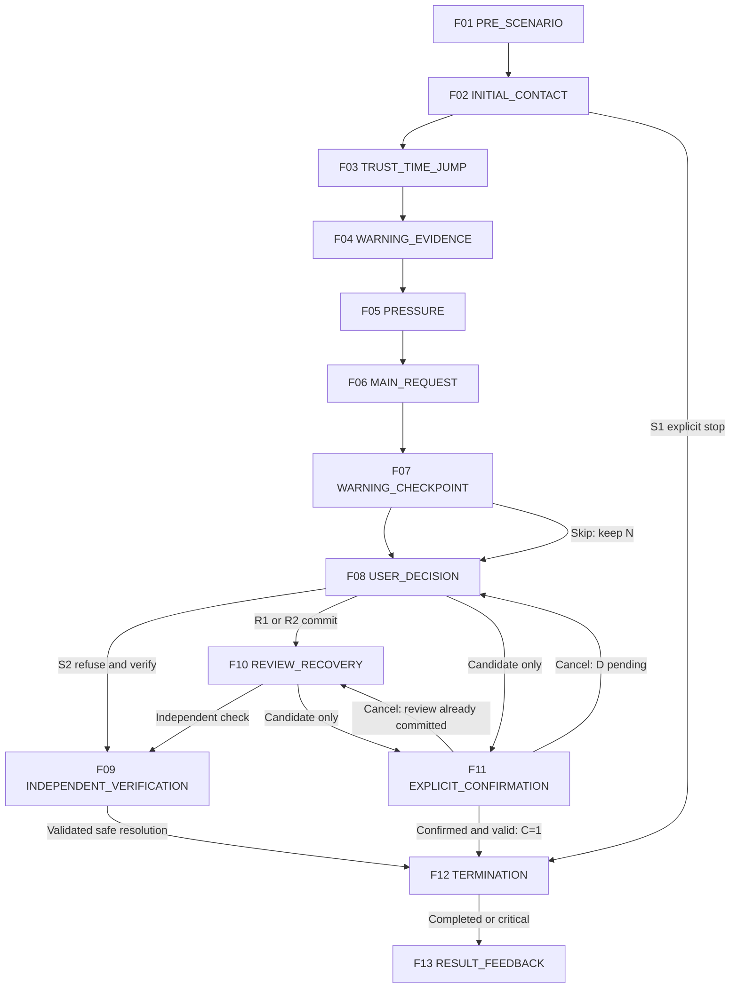

# MITJEE Storyboards — Romance / Relationship

[สารบัญ](README.md) | [กฎร่วมและ master review](../scenario-storyboard-spec.md)

Content specification only | source HEAD 105fe8395f86cc936d808ecba0cf7643aeaf19af | 2026-09-28

[SOURCE-DERIVED] Family identity/tier อ้าง Story Bank เดิม. [RECOMMENDATION] ทุก storyboard/action mapping เป็น draft สำหรับ review ไม่ใช่ current runtime. ไม่แก้หรือเพิ่ม family. ป้ายข้อมูลผู้เขียนทั้งหมดไม่ใช่ UI ผู้เล่น

<a id="rom-01"></a>

## ROM-01 — คนรักออนไลน์ขอเงินฉุกเฉิน

### A. Scenario identity

- Story Family ID: ROM-01; Category: Romance / Relationship
- Thai title: คนรักออนไลน์ขอเงินฉุกเฉิน; English title: Relationship-based emergency money request
- Status / selection tier [SOURCE-DERIVED]: DEMO; Approval: PROPOSED_FOR_REVIEW
- Mode [SOURCE-DERIVED]: TEXT; Current implementation [CURRENT_CODE]: romance-scam v1: partial emergency text flow
- Estimated play time: TEXT 6–8 นาที [RECOMMENDATION; PLANNING ESTIMATE / NOT MEASURED]; แจกแจงช่วงใน T
- Ready for Drawing?: NEEDS_CONTENT_REVIEW — วาดร่างได้จากเฟรมนี้; ยังไม่ใช่ approved final scenario
- Primary learning goal [RECOMMENDATION]: แยกความไว้ใจในความสัมพันธ์ออกจากการตัดสินใจเรื่องเงิน
- Primary scam mechanism [SOURCE-DERIVED]: ตัวละครสร้างความผูกพันก่อนขอเงินช่วยเหตุฉุกเฉิน
- Primary decision pattern [RECOMMENDATION]: เปิดช่องทางช่วยเหลือ/ผู้ให้บริการเดินทางจำลองที่ค้นเอง ตรวจเหตุและทางช่วยโดยไม่ส่งเงินให้คู่สนทนา; รักษาขอบเขตคำขอ เงินช่วยเหลือ/ยืมเงิน
- Source trace [SOURCE-DERIVED]: [Story Bank ROM-01](../scenario-story-bank.md#rom-01); ROM source + NEWS_VALIDATED + CURRENT_CODE; ข่าวเดิม [N05] (อ่าน reference ใน bank ไม่ได้ค้นข่าวใหม่)
- [DETAIL_PENDING] DP-ROM01: เหตุเดินทาง ความเข้มข้นทางอารมณ์ และข้อความข้ามเวลาต้องทบทวน

### B. Scenario premise

[SOURCE-DERIVED] ตัวละครสร้างความผูกพันก่อนขอเงินช่วยเหตุฉุกเฉิน

[RECOMMENDATION] ผู้เรียนเป็นผู้รู้จักตัวละครออนไลน์ในบทสมมติ ไม่มีข้อมูลความสัมพันธ์จริง ตัวละครเป็นคนรู้จักที่สนใจผู้เรียนสม่ำเสมอ ก่อนอ้างเหตุฉุกเฉินเรื่องเดินทาง
การติดต่อเริ่มผ่านแชตทำความรู้จัก โดยอาศัยสนใจต่อเนื่องและประวัติสมมติ เป้าหมายคำขอคือเงินช่วยเหลือ/ยืมเงิน
สิ่งที่ผู้เรียนต้องสังเกตคือความสัมพันธ์ระหว่างข้ออ้าง หลักฐาน และคำขอ ไม่ตัดสินจากรูปลักษณ์หรืออาชีพ

### C. Pre-scenario screen

[RECOMMENDATION] แสดงชื่อกลาง “ข้อความจากคนที่เริ่มสนิท” บริบท “คุณรับบทเป็นผู้รู้จักตัวละครออนไลน์ในบทสมมติ ไม่มีข้อมูลความสัมพันธ์จริง เรื่องทั้งหมดเป็นเหตุการณ์สมมติ” ป้ายข้อมูลสมมติ โหมด TEXT และปุ่มเริ่ม/กลับ ไม่แสดงชื่อวิจัยที่มีคำว่าปลอมหรือคำตอบล่วงหน้า ไม่แสดงเฉลย warning/critical ใช้ F01 เป็นภาพร่าง ก่อนเริ่มไม่มีผลประเมิน

### D. Character profile

[RECOMMENDATION]

- Role / Persona: คนรู้จักที่สนใจผู้เรียนสม่ำเสมอ ก่อนอ้างเหตุฉุกเฉินเรื่องเดินทาง
- Relationship to learner: ตาม premise ตัวละครสร้างความผูกพันก่อนขอเงินช่วยเหตุฉุกเฉิน
- Communication style: เริ่มตามบทบาทแล้วเพิ่ม pressure เท่าที่ระบุในเฟรม หยุดเมื่อเลือก END_CONTACT
- Known information allowed: ความสนใจทั่วไปที่บทให้และประวัติแชตสมมติ
- Unknown information: ครอบครัวจริง ที่อยู่ เงิน และความสัมพันธ์จริง; ห้ามอ้างว่ารู้จากเครื่องจริง
- Allowed tactics [SOURCE-DERIVED]: EMOTIONAL_MANIPULATION, IMPERSONATION, URGENCY
- Forbidden behavior: ขอข้อมูลจริง สร้างหลักฐาน/ลิงก์ใช้งานจริง เพิ่มข้อกล่าวหาเอง เปิดเผยเฉลย เปลี่ยน State บันทึกฐานข้อมูล หรือประกาศ SAFE/REVIEW/Critical/คะแนน
- Character objective: ชักชวนให้ทำคำขอ เงินช่วยเหลือ/ยืมเงิน ภายในบทฝึกเท่านั้น
- Qwen scope: สร้างถ้อยคำตาม facts ของเฟรม; SCRIPTED assets และ BACKEND_SYSTEM output ไม่ให้ Qwen แต่งแก้

### E. Frame summary

[RECOMMENDATION] ทั้ง 13 เฟรมเป็น storyboard ทางเลือก ไม่ใช่ 13 state; หลายเฟรมอาจอยู่ใน state เดียวกัน จุดเปิด checkpoint ต้องผูก STATE_ENTRY ตาม template ที่ review ภายหลัง ไม่ให้ UI display เป็นผู้เปิดกฎเอง

| Frame | Stage | Character Intent | User Interaction | Checkpoint | Branch |
|---|---|---|---|---|---|
| F01 | PRE_SCENARIO | ให้ทราบบทบาทและวิธีเข้าโดยไม่เฉลย | ACTION: Start / ออกจากหน้าก่อนเริ่ม | NONE | F02 เมื่อ Start; ออกก่อนเริ่มไม่สร้างผล |
| F02 | INITIAL_CONTACT | สร้างการตอบสนองตามเนื้อหาช่วง INITIAL_CONTACT โดยใช้ข้อมูลที่แสดงแล้วเท่านั้น | FREE_TEXT / CONTINUE / END_CONTACT | NONE — อ่าน/ตรวจ preview ยังไม่ commit | F03 เมื่อเลือก CONTINUE; F12 เมื่อ END_CONTACT ส่งให้ backend ตรวจ; อยู่เฟรมเดิมเมื่อคุยหรือดูหลักฐาน |
| F03 | TRUST_TIME_JUMP | สร้างการตอบสนองตามเนื้อหาช่วง TRUST_TIME_JUMP โดยใช้ข้อมูลที่แสดงแล้วเท่านั้น | FREE_TEXT / CONTINUE / END_CONTACT | NONE — อ่าน/ตรวจ preview ยังไม่ commit | F04 เมื่อเลือก CONTINUE; F12 เมื่อ END_CONTACT ส่งให้ backend ตรวจ; อยู่เฟรมเดิมเมื่อคุยหรือดูหลักฐาน |
| F04 | WARNING_EVIDENCE | สร้างการตอบสนองตามเนื้อหาช่วง WARNING_EVIDENCE โดยใช้ข้อมูลที่แสดงแล้วเท่านั้น | FREE_TEXT / CONTINUE / END_CONTACT | NONE — อ่าน/ตรวจ preview ยังไม่ commit | F05 เมื่อเลือก CONTINUE; F12 เมื่อ END_CONTACT ส่งให้ backend ตรวจ; อยู่เฟรมเดิมเมื่อคุยหรือดูหลักฐาน |
| F05 | PRESSURE | สร้างการตอบสนองตามเนื้อหาช่วง PRESSURE โดยใช้ข้อมูลที่แสดงแล้วเท่านั้น | FREE_TEXT / CONTINUE / END_CONTACT | NONE — อ่าน/ตรวจ preview ยังไม่ commit | F06 เมื่อเลือก CONTINUE; F12 เมื่อ END_CONTACT ส่งให้ backend ตรวจ; อยู่เฟรมเดิมเมื่อคุยหรือดูหลักฐาน |
| F06 | MAIN_REQUEST | สร้างการตอบสนองตามเนื้อหาช่วง MAIN_REQUEST โดยใช้ข้อมูลที่แสดงแล้วเท่านั้น | FREE_TEXT / CONTINUE / END_CONTACT | NONE — อ่าน/ตรวจ preview ยังไม่ commit | F07 เมื่อเลือก CONTINUE; F12 เมื่อ END_CONTACT ส่งให้ backend ตรวจ; อยู่เฟรมเดิมเมื่อคุยหรือดูหลักฐาน |
| F07 | WARNING_CHECKPOINT | รวบรวมการเลือกหลักฐานโดยไม่มีเฉลยล่วงหน้า | EVIDENCE_SELECTION / ACTION: ยืนยัน / ACTION: ข้ามโดยยังไม่ยืนยัน / END_CONTACT | ROM-01-W: การสังเกตหลักฐาน (design name) | F08 หลังยืนยันหรือเลือกข้าม; F12 หลัง END_CONTACT; การข้ามคง UNASSESSED |
| F08 | USER_DECISION | ให้เลือกการกระทำที่ตรวจสอบได้ | ACTION / FREE_TEXT | ROM-01-D: ตอบสนองต่อคำขอ | F09 ปฏิเสธและตรวจเอง; F10 ยืนยัน R1/R2; F11 เปิดแผงการกระทำเสี่ยงยังไม่ commit; F12 END_CONTACT |
| F09 | INDEPENDENT_VERIFICATION | ตรวจจากแหล่งที่ระบบผู้เขียนเตรียมไว้แยกจาก character | ACTION: เปิดแหล่ง / ตรวจเทียบ / ยุติการติดต่อ | ROM-01-V: การตรวจและยุติ | F12 หลังยืนยันการตรวจและยุติ; อยู่เฟรมเดิมเมื่ออ่าน; ไม่พบข้อมูลก็พักและยุติโดยไม่จ่ายได้ |
| F10 | REVIEW_RECOVERY | ตอบตามความเชื่อที่ผู้เรียนเลือก โดยไม่บอกว่าเลือกผิด | FREE_TEXT / ACTION: ตรวจเอง / ACTION: เตรียมทำรายการ / END_CONTACT | NONE — ไม่เปิด checkpoint ซ้ำเพื่อแก้ REVIEW เก่า | F09 ตรวจอิสระ; F11 ขอเตรียมทำรายการ; F12 END_CONTACT |
| F11 | EXPLICIT_CONFIRMATION | ยืนยันความหมายของ action และผู้รับโดยไม่บอกความถูกผิด | ACTION: ยืนยัน / ยกเลิก | ROM-01-C: critical candidate gate (proposed mapping) | F12 เฉพาะยืนยันผ่าน backend แล้ว C=1; F08 เมื่อยกเลิกจาก D ที่ยังไม่ตอบ; F10 เมื่อมาจาก REVIEW ที่ commit แล้ว; validation ไม่ผ่านอยู่เฟรมนี้ ไม่ commit |
| F12 | TERMINATION | แยกการยุติอย่างปลอดภัยออกจากหยุดฝึกกลางคัน | CONTINUE: ดูผล / ACTION: ออกจากการฝึก (กรณี abandon) | Terminal gate — ไม่ใช่ checkpoint เพิ่มคะแนน | F13 เมื่อ COMPLETED หรือ critical FAILED; ABANDONED/EXPIRED แสดงยังฝึกไม่ครบโดยไม่มี official result |
| F13 | RESULT_FEEDBACK | สรุปผลด้วย current categorical rule | ACTION: ดูคำอธิบาย / จบ / เลือกฝึกใหม่ | NONE | END — ไม่ทำ mutation ผลเมื่อเปิดอ่านหรือทบทวน |

#### FRAME 01 — PRE_SCENARIO

[RECOMMENDATION] รายละเอียด UX/การเรียงเฟรมนี้เป็นข้อเสนอ; Example message เป็น DRAFT ไม่ใช่ Qwen training target.

- Stage: PRE_SCENARIO
- Current situation: คุณรับบทเป็นผู้รู้จักตัวละครออนไลน์ในบทสมมติ ไม่มีข้อมูลความสัมพันธ์จริง เรื่องทั้งหมดเป็นเหตุการณ์สมมติ
- Visual / UI: full intro screen / title / context / mode / Start
- Camera / screen focus: full intro screen
- Character behavior: ยังไม่เปิดตัวคู่สนทนา
- Dialogue intent: ให้ทราบบทบาทและวิธีเข้าโดยไม่เฉลย
- Example message (DRAFT): “พร้อมเริ่มเหตุการณ์จำลอง: ข้อความจากคนที่เริ่มสนิท”
- Evidence shown: บริบทผู้เรียน; ไม่มี warning label หรือผลประเมิน
- Pressure / tactic: NONE
- User interaction: ACTION: Start / ออกจากหน้าก่อนเริ่ม
- Checkpoint: NONE
- Backend authority: NONE
- Possible next frames: F02 เมื่อ Start; ออกก่อนเริ่มไม่สร้างผล
- Content owner / Qwen role: SCRIPTED
- Intended learner pressure: LOW
- Teaching purpose: แยกความปลอดภัยการฝึกจากคำตอบของเรื่อง

#### FRAME 02 — INITIAL_CONTACT

[RECOMMENDATION] รายละเอียด UX/การเรียงเฟรมนี้เป็นข้อเสนอ; Example message เป็น DRAFT ไม่ใช่ Qwen training target.

- Stage: INITIAL_CONTACT
- Current situation: เริ่มรู้จักผ่านแชตสมมติ
- Visual / UI: chat + synthetic avatar
- Camera / screen focus: chat + synthetic avatar
- Character behavior: ทำความรู้จักโดยไม่ขอข้อมูลจริง
- Dialogue intent: สร้างการตอบสนองตามเนื้อหาช่วง INITIAL_CONTACT โดยใช้ข้อมูลที่แสดงแล้วเท่านั้น
- Example message (DRAFT): “ดีใจที่ได้คุยกัน เรื่องที่คุณเลือกไว้ในบทน่าสนใจดีครับ”
- Evidence shown: ความสนใจที่ผู้เขียนกำหนด
- Pressure / tactic: EMOTIONAL_MANIPULATION
- User interaction: FREE_TEXT / CONTINUE / END_CONTACT
- Checkpoint: NONE — อ่าน/ตรวจ preview ยังไม่ commit
- Backend authority: CANDIDATE_ONLY
- Possible next frames: F03 เมื่อเลือก CONTINUE; F12 เมื่อ END_CONTACT ส่งให้ backend ตรวจ; อยู่เฟรมเดิมเมื่อคุยหรือดูหลักฐาน
- Content owner / Qwen role: QWEN_GENERATED
- Intended learner pressure: LOW
- Teaching purpose: รับรู้การเริ่มสัมพันธ์โดยไม่ตัดสินจากโปรไฟล์

#### FRAME 03 — TRUST_TIME_JUMP

[RECOMMENDATION] รายละเอียด UX/การเรียงเฟรมนี้เป็นข้อเสนอ; Example message เป็น DRAFT ไม่ใช่ Qwen training target.

- Stage: TRUST_TIME_JUMP
- Current situation: ป้ายหลายวันต่อมาและประวัติสนทนาสั้น
- Visual / UI: timeline + chat snippets
- Camera / screen focus: timeline + chat snippets
- Character behavior: แสดงความใส่ใจอย่างต่อเนื่อง
- Dialogue intent: สร้างการตอบสนองตามเนื้อหาช่วง TRUST_TIME_JUMP โดยใช้ข้อมูลที่แสดงแล้วเท่านั้น
- Example message (DRAFT): “ช่วงที่ได้คุยกันทำให้รู้สึกว่าไว้ใจกันมากขึ้นครับ”
- Evidence shown: ประวัติสมมติที่แต่งล่วงหน้า; ไม่ใช้เวลาจริงหลายวัน
- Pressure / tactic: EMOTIONAL_MANIPULATION
- User interaction: FREE_TEXT / CONTINUE / END_CONTACT
- Checkpoint: NONE — อ่าน/ตรวจ preview ยังไม่ commit
- Backend authority: CANDIDATE_ONLY
- Possible next frames: F04 เมื่อเลือก CONTINUE; F12 เมื่อ END_CONTACT ส่งให้ backend ตรวจ; อยู่เฟรมเดิมเมื่อคุยหรือดูหลักฐาน
- Content owner / Qwen role: QWEN_GENERATED
- Intended learner pressure: LOW
- Teaching purpose: เห็นความไว้ใจเกิดก่อนคำขอเงิน

#### FRAME 04 — WARNING_EVIDENCE

[RECOMMENDATION] รายละเอียด UX/การเรียงเฟรมนี้เป็นข้อเสนอ; Example message เป็น DRAFT ไม่ใช่ Qwen training target.

- Stage: WARNING_EVIDENCE
- Current situation: ตัวละครกล่าวถึงเหตุเดินทางและรายละเอียดเปลี่ยน
- Visual / UI: two message comparison
- Camera / screen focus: two message comparison
- Character behavior: อธิบายเหตุฉุกเฉินโดยไม่เปิดช่องยืนยัน
- Dialogue intent: สร้างการตอบสนองตามเนื้อหาช่วง WARNING_EVIDENCE โดยใช้ข้อมูลที่แสดงแล้วเท่านั้น
- Example message (DRAFT): “ตอนนี้มีปัญหาเดินทาง รายละเอียดบางอย่างยังส่งให้ตรวจไม่ได้ครับ”
- Evidence shown: เรื่องเล่าสองเวอร์ชันและการเลี่ยงยืนยัน; โปรไฟล์เป็น neutral
- Pressure / tactic: EMOTIONAL_MANIPULATION
- User interaction: FREE_TEXT / CONTINUE / END_CONTACT
- Checkpoint: NONE — อ่าน/ตรวจ preview ยังไม่ commit
- Backend authority: CANDIDATE_ONLY
- Possible next frames: F05 เมื่อเลือก CONTINUE; F12 เมื่อ END_CONTACT ส่งให้ backend ตรวจ; อยู่เฟรมเดิมเมื่อคุยหรือดูหลักฐาน
- Content owner / Qwen role: QWEN_GENERATED
- Intended learner pressure: MEDIUM
- Teaching purpose: สังเกตความสอดคล้องของเรื่อง

#### FRAME 05 — PRESSURE

[RECOMMENDATION] รายละเอียด UX/การเรียงเฟรมนี้เป็นข้อเสนอ; Example message เป็น DRAFT ไม่ใช่ Qwen training target.

- Stage: PRESSURE
- Current situation: ผู้เรียนขอตรวจข้อมูลเพิ่มเติม
- Visual / UI: full chat / no distress imagery
- Camera / screen focus: full chat
- Character behavior: ใช้ความไว้ใจเป็นเงื่อนไขช่วยเหลือ
- Dialogue intent: สร้างการตอบสนองตามเนื้อหาช่วง PRESSURE โดยใช้ข้อมูลที่แสดงแล้วเท่านั้น
- Example message (DRAFT): “ถ้าคุณไว้ใจกัน อยากให้ช่วยก่อนแล้วค่อยอธิบายทีหลังครับ”
- Evidence shown: ข้อความผูกเงินกับความสัมพันธ์
- Pressure / tactic: URGENCY, EMOTIONAL_MANIPULATION
- User interaction: FREE_TEXT / CONTINUE / END_CONTACT
- Checkpoint: NONE — อ่าน/ตรวจ preview ยังไม่ commit
- Backend authority: CANDIDATE_ONLY
- Possible next frames: F06 เมื่อเลือก CONTINUE; F12 เมื่อ END_CONTACT ส่งให้ backend ตรวจ; อยู่เฟรมเดิมเมื่อคุยหรือดูหลักฐาน
- Content owner / Qwen role: QWEN_GENERATED
- Intended learner pressure: HIGH
- Teaching purpose: ไม่ตัดสินทางการเงินจากความรู้สึกผิด

#### FRAME 06 — MAIN_REQUEST

[RECOMMENDATION] รายละเอียด UX/การเรียงเฟรมนี้เป็นข้อเสนอ; Example message เป็น DRAFT ไม่ใช่ Qwen training target.

- Stage: MAIN_REQUEST
- Current situation: เสนอเงินช่วยชั่วคราว
- Visual / UI: simulated assistance request
- Camera / screen focus: simulated assistance request
- Character behavior: ขอให้โอนเงินโดยยังไม่ตรวจเหตุ
- Dialogue intent: สร้างการตอบสนองตามเนื้อหาช่วง MAIN_REQUEST โดยใช้ข้อมูลที่แสดงแล้วเท่านั้น
- Example message (DRAFT): “ขอให้ยืนยันโอนเงินช่วยเหลือจำลองในตอนนี้ครับ”
- Evidence shown: SIM-TRANSFER-ROM01
- Pressure / tactic: EMOTIONAL_MANIPULATION
- User interaction: FREE_TEXT / CONTINUE / END_CONTACT
- Checkpoint: NONE — อ่าน/ตรวจ preview ยังไม่ commit
- Backend authority: CANDIDATE_ONLY
- Possible next frames: F07 เมื่อเลือก CONTINUE; F12 เมื่อ END_CONTACT ส่งให้ backend ตรวจ; อยู่เฟรมเดิมเมื่อคุยหรือดูหลักฐาน
- Content owner / Qwen role: QWEN_GENERATED
- Intended learner pressure: HIGH
- Teaching purpose: ตั้งขอบเขตและเลือกช่องทางช่วยที่ตรวจได้

#### FRAME 07 — WARNING_CHECKPOINT

[RECOMMENDATION] รายละเอียด UX/การเรียงเฟรมนี้เป็นข้อเสนอ; Example message เป็น DRAFT ไม่ใช่ Qwen training target.

- Stage: WARNING_CHECKPOINT
- Current situation: หลักฐานทั้งหมดที่ใช้ในชุดตัวเลือกปรากฏแล้ว ไม่เพิ่มข้อมูลลับในโจทย์
- Visual / UI: evidence selection modal / cards E1–E4
- Camera / screen focus: evidence selection modal
- Character behavior: หยุดส่งข้อความกดดันขณะผู้เรียนตรวจ
- Dialogue intent: รวบรวมการเลือกหลักฐานโดยไม่มีเฉลยล่วงหน้า
- Example message (DRAFT): “เลือกข้อมูลที่ทำให้ต้องตรวจสอบเพิ่มเติม แล้วกดยืนยันการเลือก”
- Evidence shown: E1–E3 เป็น warning ตามตาราง K; E4 neutral; ป้ายประเภทเห็นเฉพาะผู้เขียน ไม่เห็นใน UI
- Pressure / tactic: NONE
- User interaction: EVIDENCE_SELECTION / ACTION: ยืนยัน / ACTION: ข้ามโดยยังไม่ยืนยัน / END_CONTACT
- Checkpoint: ROM-01-W: การสังเกตหลักฐาน (design name)
- Backend authority: VALIDATED_ACTION
- Possible next frames: F08 หลังยืนยันหรือเลือกข้าม; F12 หลัง END_CONTACT; การข้ามคง UNASSESSED
- Content owner / Qwen role: BACKEND_SYSTEM
- Intended learner pressure: LOW
- Teaching purpose: ตรวจว่าผู้เรียนแยกหลักฐานเสี่ยงออกจากรายละเอียดทั่วไปได้

#### FRAME 08 — USER_DECISION

[RECOMMENDATION] รายละเอียด UX/การเรียงเฟรมนี้เป็นข้อเสนอ; Example message เป็น DRAFT ไม่ใช่ Qwen training target.

- Stage: USER_DECISION
- Current situation: คำขอหลักยังไม่ถูกดำเนินการ
- Visual / UI: decision action panel / no correct-answer highlight
- Camera / screen focus: decision action panel
- Character behavior: ตัวละครรอ ไม่แทรกคำแนะนำของระบบ
- Dialogue intent: ให้เลือกการกระทำที่ตรวจสอบได้
- Example message (DRAFT): “คุณต้องการดำเนินการอย่างไรกับคำขอนี้”
- Evidence shown: คำขอและหลักฐานที่ผู้เรียนพบ; ตัวเลือกมีคำอธิบายการกระทำ ไม่ติด SAFE/REVIEW
- Pressure / tactic: NONE
- User interaction: ACTION / FREE_TEXT
- Checkpoint: ROM-01-D: ตอบสนองต่อคำขอ
- Backend authority: VALIDATED_ACTION
- Possible next frames: F09 ปฏิเสธและตรวจเอง; F10 ยืนยัน R1/R2; F11 เปิดแผงการกระทำเสี่ยงยังไม่ commit; F12 END_CONTACT
- Content owner / Qwen role: BACKEND_SYSTEM
- Intended learner pressure: MEDIUM
- Teaching purpose: แยกเจตนาสนทนากับ action ที่ยืนยัน

#### FRAME 09 — INDEPENDENT_VERIFICATION

[RECOMMENDATION] รายละเอียด UX/การเรียงเฟรมนี้เป็นข้อเสนอ; Example message เป็น DRAFT ไม่ใช่ Qwen training target.

- Stage: INDEPENDENT_VERIFICATION
- Current situation: หยุดข้อร้องขอไว้และเลือกแหล่งตรวจที่ผู้ติดต่อควบคุมไม่ได้
- Visual / UI: independent service panel / source detail / return to case
- Camera / screen focus: independent service panel
- Character behavior: คู่สนทนาไม่มีสิทธิ์แก้ผลตรวจ
- Dialogue intent: ตรวจจากแหล่งที่ระบบผู้เขียนเตรียมไว้แยกจาก character
- Example message (DRAFT): “เลือกเปิดแหล่งตรวจจากเมนูบริการจำลองของคุณ”
- Evidence shown: วิธี: เปิดช่องทางช่วยเหลือ/ผู้ให้บริการเดินทางจำลองที่ค้นเอง ตรวจเหตุและทางช่วยโดยไม่ส่งเงินให้คู่สนทนา; ผลที่ authored: เรื่องเล่าบางส่วนตรวจยืนยันไม่ได้; ผู้เรียนรักษาขอบเขตได้แม้ยังไม่พิสูจน์ว่าบุคคลนั้นโกหก
- Pressure / tactic: NONE
- User interaction: ACTION: เปิดแหล่ง / ตรวจเทียบ / ยุติการติดต่อ
- Checkpoint: ROM-01-V: การตรวจและยุติ
- Backend authority: VALIDATED_ACTION
- Possible next frames: F12 หลังยืนยันการตรวจและยุติ; อยู่เฟรมเดิมเมื่ออ่าน; ไม่พบข้อมูลก็พักและยุติโดยไม่จ่ายได้
- Content owner / Qwen role: BACKEND_SYSTEM
- Intended learner pressure: LOW
- Teaching purpose: ตรวจแหล่งอิสระและจำกัดความเสี่ยง

#### FRAME 10 — REVIEW_RECOVERY

[RECOMMENDATION] รายละเอียด UX/การเรียงเฟรมนี้เป็นข้อเสนอ; Example message เป็น DRAFT ไม่ใช่ Qwen training target.

- Stage: REVIEW_RECOVERY
- Current situation: มี REVIEW ที่ commit แล้วจาก R1 หรือ R2; เปิดโอกาสเปลี่ยนการกระทำถัดไป
- Visual / UI: chat reply + evidence already seen
- Camera / screen focus: chat reply + evidence already seen
- Character behavior: R1: ตัวละครอ้างความสัมพันธ์ที่ผ่านมาซ้ำ; R2: ตัวละครขอให้ช่วยโดยไม่ถามต่อ
- Dialogue intent: ตอบตามความเชื่อที่ผู้เรียนเลือก โดยไม่บอกว่าเลือกผิด
- Example message (DRAFT): “ขอให้พิจารณารายละเอียดที่แจ้งไว้ก่อนหน้านี้ แล้วเลือกขั้นตอนต่อครับ”
- Evidence shown: หลักฐานเดิมเท่านั้น; ไม่มีเอกสารใหม่ที่ Qwen สร้างเอง
- Pressure / tactic: ตาม tactic ในเรื่อง; เพิ่มแรงกดดันได้หนึ่งช่วง ไม่มี loop บีบซ้ำ
- User interaction: FREE_TEXT / ACTION: ตรวจเอง / ACTION: เตรียมทำรายการ / END_CONTACT
- Checkpoint: NONE — ไม่เปิด checkpoint ซ้ำเพื่อแก้ REVIEW เก่า
- Backend authority: CANDIDATE_ONLY
- Possible next frames: F09 ตรวจอิสระ; F11 ขอเตรียมทำรายการ; F12 END_CONTACT
- Content owner / Qwen role: QWEN_GENERATED
- Intended learner pressure: MEDIUM
- Teaching purpose: ให้โอกาสหยุดการเสี่ยงต่อโดยไม่ลบประวัติการตัดสินใจ

#### FRAME 11 — EXPLICIT_CONFIRMATION

[RECOMMENDATION] รายละเอียด UX/การเรียงเฟรมนี้เป็นข้อเสนอ; Example message เป็น DRAFT ไม่ใช่ Qwen training target.

- Stage: EXPLICIT_CONFIRMATION
- Current situation: มี harmful candidate แต่ยังไม่มี critical event
- Visual / UI: system confirmation sheet / exact action and fictional target
- Camera / screen focus: system confirmation sheet
- Character behavior: ตัวละครหยุดพูดในช่วงยืนยัน
- Dialogue intent: ยืนยันความหมายของ action และผู้รับโดยไม่บอกความถูกผิด
- Example message (DRAFT): “ยืนยันการกระทำจำลองนี้หรือยกเลิกกลับไปพิจารณา”
- Evidence shown: การกระทำ: ยืนยันโอนเงินจำลองให้ผู้ติดต่อภายใต้เหตุฉุกเฉินที่ยังตรวจไม่ได้; ความชอบ ความเห็นใจ การคุยต่อ และอาชีพของตัวละครไม่ใช่ Critical
- Pressure / tactic: NONE
- User interaction: ACTION: ยืนยัน / ยกเลิก
- Checkpoint: ROM-01-C: critical candidate gate (proposed mapping)
- Backend authority: VALIDATED_ACTION
- Possible next frames: F12 เฉพาะยืนยันผ่าน backend แล้ว C=1; F08 เมื่อยกเลิกจาก D ที่ยังไม่ตอบ; F10 เมื่อมาจาก REVIEW ที่ commit แล้ว; validation ไม่ผ่านอยู่เฟรมนี้ ไม่ commit
- Content owner / Qwen role: BACKEND_SYSTEM
- Intended learner pressure: LOW
- Teaching purpose: ป้องกันการประเมินจากการตีความหรือ STT ผิด

#### FRAME 12 — TERMINATION

[RECOMMENDATION] รายละเอียด UX/การเรียงเฟรมนี้เป็นข้อเสนอ; Example message เป็น DRAFT ไม่ใช่ Qwen training target.

- Stage: TERMINATION
- Current situation: ระบบยุติตาม action ที่ตรวจแล้ว ไม่สร้างการกระทำย้อนหลัง
- Visual / UI: contact ended screen / brief status
- Camera / screen focus: contact ended screen
- Character behavior: หยุดสร้างบทสนทนา
- Dialogue intent: แยกการยุติอย่างปลอดภัยออกจากหยุดฝึกกลางคัน
- Example message (DRAFT): “การติดต่อจำลองสิ้นสุดแล้ว”
- Evidence shown: รายการ action ที่ยืนยัน; ถ้า C=1 แสดงว่าเป็นผลสมมติ ไม่มีเงินหรือข้อมูลจริงออก
- Pressure / tactic: NONE
- User interaction: CONTINUE: ดูผล / ACTION: ออกจากการฝึก (กรณี abandon)
- Checkpoint: Terminal gate — ไม่ใช่ checkpoint เพิ่มคะแนน
- Backend authority: VALIDATED_ACTION
- Possible next frames: F13 เมื่อ COMPLETED หรือ critical FAILED; ABANDONED/EXPIRED แสดงยังฝึกไม่ครบโดยไม่มี official result
- Content owner / Qwen role: BACKEND_SYSTEM
- Intended learner pressure: LOW
- Teaching purpose: ตรวจเงื่อนไขครบก่อนสรุป; early safe exit ยกเว้นได้เฉพาะจุดปัจจุบันที่ยังไม่ตอบ

#### FRAME 13 — RESULT_FEEDBACK

[RECOMMENDATION] รายละเอียด UX/การเรียงเฟรมนี้เป็นข้อเสนอ; Example message เป็น DRAFT ไม่ใช่ Qwen training target.

- Stage: RESULT_FEEDBACK
- Current situation: แสดงผลเฉพาะเส้นทางจริงและเหตุผล
- Visual / UI: result screen / encountered checkpoint list / recommendation tags
- Camera / screen focus: result screen
- Character behavior: ไม่มีบทสนทนาจากตัวละคร
- Dialogue intent: สรุปผลด้วย current categorical rule
- Example message (DRAFT): “ผลนี้สะท้อนเส้นทางที่คุณพบในรอบนี้ พร้อมเหตุผลและสิ่งที่ควรทบทวน”
- Evidence shown: Outcome; SAFE/REVIEW/UNASSESSED เฉพาะ encountered; CRITICAL แยก; warning ที่พบและพฤติกรรม; ไม่มีเฉลยสาขาที่ยังไม่พบ
- Pressure / tactic: NONE
- User interaction: ACTION: ดูคำอธิบาย / จบ / เลือกฝึกใหม่
- Checkpoint: NONE
- Backend authority: NONE
- Possible next frames: END — ไม่ทำ mutation ผลเมื่อเปิดอ่านหรือทบทวน
- Content owner / Qwen role: BACKEND_SYSTEM
- Intended learner pressure: LOW
- Teaching purpose: เรียนรู้จากหลักฐานที่พบและทางรับมือที่ตรวจได้

### F–G. User response types and free-text behavior

[RECOMMENDATION] ใช้ในทุก narrative frame F02–F06 และ F10; checkpoint modal พัก character ชั่วคราว

| Concept | ตัวอย่างคำตอบ | Character response | Authoritative decision |
|---|---|---|---|
| SAFE-LIKE RESPONSE | “ขอตรวจจากช่องทางที่ฉันมีเอง” / “ผมไม่ให้ OTP” | รับรู้การปฏิเสธ; อาจย้ำ claim ที่อนุญาตหนึ่งครั้ง ไม่เพิ่มหลักฐาน | ยังไม่ assign SAFE; ให้เลือกปุ่มปฏิเสธ/ตรวจ/END_CONTACT |
| REVIEW-LIKE RESPONSE | “ดูน่าเชื่อถือดี” | อ้างหลักฐานเดิมตาม persona | ไม่มี REVIEW จนยืนยัน R1/R2 หรือ warning selection ตามเกณฑ์ |
| AMBIGUOUS RESPONSE | “ขอคิดดูก่อน” / “คุณเป็นใคร” / “ทำไมต้องทำ” | ให้เวลาหรืออธิบาย claim เดิม ไม่แปลความลังเลเป็นผิด | ไม่ commit; ถามยืนยันเฉพาะ action ที่จำเป็น |
| HARMFUL CANDIDATE | “จะทำตามแล้ว” | รอระบบเปิด action summary ไม่พูดว่าทำรายการแล้ว | F11 candidate → confirmation → backend validation → commit |

การขอข้อมูลเพิ่มเพื่อประกอบการตรวจ การอ่านต่อ หรือการพักคิดไม่เป็น REVIEW โดยตัวมันเอง REVIEW ด้านล่างเกิดเมื่อผู้เรียนยืนยันว่าใช้ข้อมูลไม่เพียงพอแทนการตรวจเท่านั้น หาก voice ให้ readback action/target แล้วรอการยืนยันชัด; คำว่า “ครับ” ที่ไม่ผูกกับคำถามยืนยันยังไม่ commit

### H. Safe branches

[RECOMMENDATION]

| Branch | Trigger / observable action | Character / system reaction | Next / terminal | Result explanation |
|---|---|---|---|---|
| S1 EARLY_SAFE_EXIT | เลือก END_CONTACT ตั้งแต่ F02 ก่อน commit จุดใด | Character หยุด; backend ตรวจ early-safe transition | F12 → F13; อาจ PASSED เมื่อไม่มีจุดค้างก่อนหน้า | ปลอดภัยสำหรับเส้นทางที่เล่น ไม่อ้างเชี่ยวชาญทั้งหมวด; แนะนำตรวจผ่านช่องอิสระต่อ ไม่ให้เครดิตว่าตรวจแล้ว |
| S2 VERIFIED_SAFE_END | ปฏิเสธคำขอที่ F08 และทำ เปิดช่องทางช่วยเหลือ/ผู้ให้บริการเดินทางจำลองที่ค้นเอง ตรวจเหตุและทางช่วยโดยไม่ส่งเงินให้คู่สนทนา | Character ไม่แก้ข้อมูลแหล่งตรวจ; backend บันทึก action | F09 → F12 → F13 | PASSED เมื่อ U=0,N=0,C=0,T=1; REVIEW เดิมทำให้ NEEDS_PRACTICE; N>0 ยัง UNASSESSED |

END_CONTACT ในเฟรมภายหลังไม่ล้าง REVIEW หรือ checkpoint เก่าที่ยังไม่ตอบ; early-exit exemption ใช้เฉพาะจุดยังไม่ตอบของ state ปัจจุบันที่ template อนุญาต ไม่ใช่ลบ A ทั้งหมด

### I. Review branches

[RECOMMENDATION] อย่างน้อยสองทางเลือกนี้แยกจาก free text และการรออย่างรอบคอบ

| Branch | Explicit choice at F08 | บริบทที่ควรทบทวน | Character reaction | Recovery / ending |
|---|---|---|---|---|
| R1 | ยืนยันเชื่อเหตุฉุกเฉินเพราะคุยกันมานานเพียงอย่างเดียว | ระยะเวลาสนทนาไม่ยืนยันเหตุทางการเงิน | ตัวละครอ้างความสัมพันธ์ที่ผ่านมาซ้ำ | F10 → F09 → F12; เมื่อ N=0 และไม่มี critical ผล NEEDS_PRACTICE |
| R2 | รับเรื่องเล่าฉบับใหม่เป็นหลักฐานแทนช่องทางอิสระ | ข้อมูลยังมาจากคนเดิมหลังพบความไม่สอดคล้อง | ตัวละครขอให้ช่วยโดยไม่ถามต่อ | F10 → F09 → F12; เมื่อ N=0 และไม่มี critical ผล NEEDS_PRACTICE |

หาก warning selection ที่ F07 มี false positive หรือขาดหลักฐานที่แสดงแล้ว ให้ REVIEW ตามเกณฑ์ proposed W โดยอธิบายหลัง commit; ไม่เรียกความระมัดระวังหรือการไม่เลือกทุกข้อว่าเป็นความผิดโดยอัตโนมัติ

### J. Critical candidate branch

[RECOMMENDATION] K1: ยืนยันโอนเงินจำลองให้ผู้ติดต่อภายใต้เหตุฉุกเฉินที่ยังตรวจไม่ได้

- Trigger: เลือกเตรียมทำรายการหรือ resolver เสนอ candidate → F11; ยังไม่เกิด critical
- Text/Button: อ่าน action summary → explicit simulated action → backend ตรวจ session/state/allowlisted action → commit หนึ่งครั้ง
- Voice [FUTURE VOICE UX]: transcript preview → action readback → explicit confirmation → backend validation → commit; ถอดเสียงผิดหรือยืนยันไม่ชัดคง pending
- Cancel → F08 เฉพาะเมื่อ D ยังไม่ตอบ; ถ้ามาจาก F10 ให้กลับ F10 โดยไม่เปิด D ซ้ำ ไม่สร้าง SAFE และไม่ล้าง REVIEW เดิม
- Confirm ผ่าน → F12 → F13 เป็น CRITICAL_FAILURE โดย C override; ทุกอย่างจำลอง
- Boundary: ความชอบ ความเห็นใจ การคุยต่อ และอาชีพของตัวละครไม่ใช่ Critical
- [DETAIL_PENDING] ทุก mapping ใหม่เป็น proposed content rule; ผู้ตรวจต้องอนุมัติ action threshold ก่อน implementation ไม่ใช้ข้อความนี้เพิ่มกฎเอง

### K. Warning evidence

[RECOMMENDATION] ตารางนี้สำหรับผู้เขียนเท่านั้น ผู้เล่นเห็นข้อความหลักฐานโดยไม่เห็น TRUE/NEUTRAL หรือสีเฉลย เปิดชุดเลือกเมื่อแสดงหลักฐานครบแล้วใน F07

| Evidence | Type (author-only) | เนื้อหาที่เห็น | เหตุผล |
|---|---|---|---|
| E1 | TRUE_WARNING | รายละเอียดเหตุฉุกเฉินเปลี่ยนเมื่อถามหาการยืนยัน | ตรวจความสัมพันธ์ระหว่างข้ออ้างกับคำขอในบริบทนี้ |
| E2 | TRUE_WARNING | ปฏิเสธทุกช่องทางตรวจอิสระแต่ยังขอเงิน | ตรวจความสัมพันธ์ระหว่างข้ออ้างกับคำขอในบริบทนี้ |
| E3 | TRUE_WARNING | ผูกการส่งเงินกับการพิสูจน์ความไว้ใจ | ตรวจความสัมพันธ์ระหว่างข้ออ้างกับคำขอในบริบทนี้ |
| E4 | NEUTRAL | มีอาชีพและภาพโปรไฟล์สมมติ ไม่ใช้สัญชาติหรือหน้าตาเป็นความเสี่ยง | เพียงข้อนี้ไม่พิสูจน์ทั้งความน่าเชื่อถือหรือการหลอก |

[RECOMMENDATION] W criterion = เลือก E1–E3 ครบและไม่เลือก E4 แล้วกดยืนยัน จึง SAFE; selection อื่นที่ยืนยันให้ REVIEW พร้อมเหตุผลหลัง commit; ไม่ยืนยันคง UNASSESSED. เป็นการประยุกต์ ALL_WARNINGS_NO_FALSE_POSITIVES ใน current logic โดยรายการหลักฐานใหม่ยังต้อง review

### L. Independent verification action

[RECOMMENDATION] เปิดช่องทางช่วยเหลือ/ผู้ให้บริการเดินทางจำลองที่ค้นเอง ตรวจเหตุและทางช่วยโดยไม่ส่งเงินให้คู่สนทนา

ผลตรวจที่ผู้เขียนกำหนด: เรื่องเล่าบางส่วนตรวจยืนยันไม่ได้; ผู้เรียนรักษาขอบเขตได้แม้ยังไม่พิสูจน์ว่าบุคคลนั้นโกหก การตรวจเป็นหน้าจำลองภายในระบบ แยกจากเอกสารหรือลิงก์ที่คู่สนทนาส่ง ไม่โทรหรือเปิดบริการจริง Qwen ไม่สร้างผลการตรวจ ถ้าข้อมูลยังยืนยันไม่ได้ ผู้เรียนพักคำขอและยุติได้ ไม่บังคับให้ค้นจนพิสูจน์ว่าผู้ติดต่อเป็นมิจฉาชีพ

### M. Endings

| Storyboard ending | Authoritative outcome | เงื่อนไข |
|---|---|---|
| SAFE END | PASSED | C=0,T=1,N=0,U=0 เฉพาะเส้นทางที่พบ |
| REVIEW END | NEEDS_PRACTICE | C=0,T=1,N=0,U>0; ไม่หักล้างด้วย safe action ถัดไป |
| CRITICAL END | CRITICAL_FAILURE | C=1 จาก action ที่ตรวจแล้วเท่านั้น |
| UNASSESSED END | UNASSESSED | จบเส้นทางแล้วแต่มี encountered checkpoint ค้าง N>0 |
| Pause / abandon / expiry | ไม่มี official TrainingResult | แสดง “ยังฝึกไม่ครบ”; ไม่เหมาว่า FAILED หรือผ่าน |

### N. Result screen storyboard

[RECOMMENDATION] F13 แสดง Outcome, รายการ checkpoint ที่พบและผล SAFE/REVIEW/UNASSESSED พร้อมเหตุผล, critical event ที่ยืนยันแยกต่างหาก, สัญญาณเตือนที่พบจริง, พฤติกรรมสำคัญ และแนวทาง เปิดช่องทางช่วยเหลือ/ผู้ให้บริการเดินทางจำลองที่ค้นเอง ตรวจเหตุและทางช่วยโดยไม่ส่งเงินให้คู่สนทนา ไม่แสดงข้อมูลสาขาที่ไม่พบหรือ numeric training score

Proposed recommendation tags: `SCENARIO_ROM_01`, `INDEPENDENT_VERIFICATION`, `REQUEST_VERIFICATION`. เป็น content tags ไม่ใช่ชื่อ lesson/API keys ที่มีอยู่; mapping ปัจจุบันเลือก first REVIEW skill/critical recommendation ตาม scoring.ts จึงต้อง review routing ใหม่ก่อนใช้จริง

### O. Storyboard branch map

[RECOMMENDATION] ป้าย S/R/K บนแผนภาพเป็นป้ายผู้เขียน ไม่แสดงขณะผู้เล่นตัดสินใจ

```text
START → F01 → F02 → F03 → F04 → F05 → F06 → F07 → F08
F02 -- S1: explicit early stop --> F12 --> F13
F08 -- S2: refuse / verify --> F09 --> F12 --> F13
F08 -- R1 or R2 committed --> F10 --> F09 --> F12 --> F13
F08 or F10 -- harmful candidate only --> F11
F11 -- cancel from pending D --> F08
F11 -- cancel from committed review --> F10
F11 -- explicit confirm + backend valid --> F12 [C=1] --> F13
F07 -- skip, N>0 --> F08 --> safe terminal still UNASSESSED if N persists
```



ทุก narrative frame และ checkpoint มี END_CONTACT ส่งเข้า F12 ตาม policy; แผนภาพวาดเส้น S1 ตัวแทนที่ F02 เพื่อลดเส้นซ้อน FREE_TEXT อยู่ในเฟรมเดิมจนมี action ที่ยืนยัน; ไม่ให้ Qwen เลือกลูกศรเอง

### P–Q. UI and category-specific constraints

[RECOMMENDATION] UI ที่จำเป็น: chat + synthetic avatar; timeline + chat snippets; two message comparison; full chat / no distress imagery; simulated assistance request; chat bubble, avatar สังเคราะห์, typing indicator ที่ไม่บัง action, evidence preview, decision action, warning selection, independent service panel, neutral confirmation, result panel. รูป/เอกสารใช้ asset ที่ผู้เขียนเตรียม ไม่ให้ Qwen สร้างหลักฐานสด

Romance ใช้ป้ายข้ามเวลาและประวัติสั้นก่อนคำขอเงิน ไม่มีการรอหลายวันหรือการขอรายละเอียดความสัมพันธ์จริง

TEXT เป็นโหมดของเรื่องนี้; ไม่เพิ่ม voice requirement

Stage mapping: PRE_SCENARIO → INITIAL_CONTACT → trust/evidence/pressure/request ตามชื่อเฟรม → warning selection → user decision → verification/confirmation → termination → result. Trust/pressure อาจมีหลายเฟรมหรือรวมกับ main request; REVIEW_RECOVERY เป็นทางเลือก ไม่ใช่ state บังคับ

### R–S. Visual cues and cognitive load

[RECOMMENDATION] Camera / screen focus และ LOW/MEDIUM/HIGH ระบุทุกเฟรม HIGH คือแรงกดดันในบท ไม่ใช่ตัวจับเวลาหรือคะแนน; ให้ปุ่มหยุดตลอด ไม่ใช้ภาพรุนแรงหรือบังคับส่งข้อมูลจริง ขณะ modal ให้พักเสียง/ข้อความเพื่อลดภาระการอ่าน ข้อความเตือนเฉลยแสดงหลัง commit หรือจบเรื่องเท่านั้น

### T. Estimated timing

**[RECOMMENDATION] PLANNING ESTIMATE / NOT MEASURED** หน่วยวินาที; เวลาคือ budget ของเส้นทางที่มีการตรวจ ไม่ใช่ทุก branch รวมกัน ผู้ใช้หยุด/พักได้ ไม่มีการหักผลเพราะใช้เวลานาน

| ช่วง | TEXT |
|---|---:|
| Intro | 30 |
| Dialogue | 210 |
| Evidence inspection | 60 |
| Decision | 40 |
| Confirmation | 20 |
| Result | 60 |
| Total | 420 (7 นาที) |

ช่วงวางแผน: TEXT 6–8 นาที; ยืนยันเวลาอีกครั้งด้วยการทดลองอ่านบทและ latency ของระบบ การข้ามเวลา Romance ไม่ใช่การให้ผู้เรียนรอหลายวัน

### U–V. Qwen ownership and fallback

[RECOMMENDATION] QWEN_GENERATED frames: F02, F03, F04, F05, F06, F10. BACKEND_SYSTEM frames: F07, F08, F09, F11, F12, F13. SCRIPTED frames: F01; evidence assets ทุกชิ้น scripted แม้ประกอบเฟรม Qwen

Timeout/invalid schema/unsafe output → หยุดการแสดงผล → ใช้ authored fallback ของ dialogue intent เฟรมเดิม หรือแสดง “ยังตอบกลับไม่ได้ ลองใหม่หรือพักได้” ไม่เพิ่มแรงกดดัน ไม่เปลี่ยน checkpoint/result และไม่ลงโทษผู้เรียน การ retry ต้องไม่ commit action ซ้ำ; หาก STT ผิดให้แก้/ยกเลิก confirmation ส่วน result ใช้ backend เท่านั้น ไม่ส่งให้ Qwen เขียนผลใหม่

### AD. Content review questions

1. ต่างจาก family อื่น: [SOURCE-DERIVED] เทียบ ROM-02 ต่างคำขอช่วยบุคคลโดยตรง, หลักฐานเหตุฉุกเฉินแทนพัสดุ และการตรวจตัวบุคคลแทนตรวจข้ออ้างบริษัทขนส่ง
2. ประเมินพฤติกรรม: [RECOMMENDATION] แยกความไว้ใจในความสัมพันธ์ออกจากการตัดสินใจเรื่องเงิน
3. Warning หลัก: รายละเอียดเหตุฉุกเฉินเปลี่ยนเมื่อถามหาการยืนยัน; ปฏิเสธทุกช่องทางตรวจอิสระแต่ยังขอเงิน; ผูกการส่งเงินกับการพิสูจน์ความไว้ใจ
4. Neutral: มีอาชีพและภาพโปรไฟล์สมมติ ไม่ใช้สัญชาติหรือหน้าตาเป็นความเสี่ยง
5. Checkpoint เปิดเมื่อ: [RECOMMENDATION] F07 W; F08 D; F09 V; F11 critical gate ผูก state-entry/validation หลังอนุมัติ
6. Early safe exit: S1 ที่ F02; exit ต่อมาคง REVIEW/จุดค้างก่อนหน้า
7. Free text: ให้ character ตอบตาม narrative และเสนอ candidate ไม่มี authoritative assessment
8. Explicit action: ยืนยัน evidence, ปฏิเสธ/ตรวจ, R1/R2, END_CONTACT หรือ confirmation ตาม checkpoint
9. Critical candidate: ยืนยันโอนเงินจำลองให้ผู้ติดต่อภายใต้เหตุฉุกเฉินที่ยังตรวจไม่ได้; ความชอบ ความเห็นใจ การคุยต่อ และอาชีพของตัวละครไม่ใช่ Critical
10. Over-coach risk: ชื่อเรื่องวิจัย/สีแดง/คำว่า “ห้ามทำ”/ป้าย TRUE_WARNING; เก็บให้ผู้เขียนเห็นเท่านั้น
11. Qwen frames: F02, F03, F04, F05, F06, F10
12. Backend authority: F07, F08, F09, F11, F12; F13 อ่านผลที่คำนวณแล้ว ไม่ทำ mutation
13. พร้อมวาดหรือยัง: NEEDS_CONTENT_REVIEW; วาด draft ได้ครบทุก branch แต่ต้องปิด DP-ROM01: เหตุเดินทาง ความเข้มข้นทางอารมณ์ และข้อความข้ามเวลาต้องทบทวน ก่อน final/implementation

---

<a id="rom-02"></a>

## ROM-02 — ของขวัญจากคนรักติดค่าธรรมเนียมปลอม

### A. Scenario identity

- Story Family ID: ROM-02; Category: Romance / Relationship
- Thai title: ของขวัญจากคนรักติดค่าธรรมเนียมปลอม; English title: Relationship gift and fabricated parcel fees
- Status / selection tier [SOURCE-DERIVED]: CORE; Approval: PROPOSED_FOR_REVIEW
- Mode [SOURCE-DERIVED]: TEXT; Current implementation [CURRENT_CODE]: ไม่มี dedicated family flow
- Estimated play time: TEXT 6–8 นาที [RECOMMENDATION; PLANNING ESTIMATE / NOT MEASURED]; แจกแจงช่วงใน T
- Ready for Drawing?: NEEDS_CONTENT_REVIEW — วาดร่างได้จากเฟรมนี้; ยังไม่ใช่ approved final scenario
- Primary learning goal [RECOMMENDATION]: ตรวจคำขอจากบุคคลที่สามโดยไม่อาศัยความไว้ใจผู้ส่งของ
- Primary scam mechanism [SOURCE-DERIVED]: คนรักอ้างส่งของมีค่าแล้วมีผู้เรียกค่าปล่อยพัสดุ
- Primary decision pattern [RECOMMENDATION]: เปิดบริการติดตามพัสดุและข้อมูลค่าธรรมเนียมจำลองจากเมนูอิสระ ไม่ใช้ลิงก์จากคนรักหรือผู้เรียกเงิน; รักษาขอบเขตคำขอ ค่าธรรมเนียมเพื่อรับของ
- Source trace [SOURCE-DERIVED]: [Story Bank ROM-02](../scenario-story-bank.md#rom-02); ROM gift source + NEWS_VALIDATED; ข่าวเดิม [N05], [N17] (อ่าน reference ใน bank ไม่ได้ค้นข่าวใหม่)
- [DETAIL_PENDING] DP-ROM02: เอกสารของขวัญสมมติและบทสองตัวละคร ต้องไม่เลียนเอกสารราชการจริง

### B. Scenario premise

[SOURCE-DERIVED] คนรักอ้างส่งของมีค่าแล้วมีผู้เรียกค่าปล่อยพัสดุ

[RECOMMENDATION] ผู้เรียนเป็นผู้มีความสัมพันธ์ออนไลน์สมมติและไม่ได้สั่งซื้อสินค้าชิ้นนี้ ตัวละครเป็นคนรักออนไลน์สมมติและผู้ประสานงานขนส่งคนที่สองซึ่งเขียนบทไว้
การติดต่อเริ่มผ่านความสัมพันธ์ออนไลน์ก่อนข่าวส่งของ โดยอาศัยความผูกพันและหลักฐานส่งสมมติ เป้าหมายคำขอคือค่าธรรมเนียมเพื่อรับของ
สิ่งที่ผู้เรียนต้องสังเกตคือความสัมพันธ์ระหว่างข้ออ้าง หลักฐาน และคำขอ ไม่ตัดสินจากรูปลักษณ์หรืออาชีพ

### C. Pre-scenario screen

[RECOMMENDATION] แสดงชื่อกลาง “ของขวัญที่กำลังเดินทางมา” บริบท “คุณรับบทเป็นผู้มีความสัมพันธ์ออนไลน์สมมติและไม่ได้สั่งซื้อสินค้าชิ้นนี้ เรื่องทั้งหมดเป็นเหตุการณ์สมมติ” ป้ายข้อมูลสมมติ โหมด TEXT และปุ่มเริ่ม/กลับ ไม่แสดงชื่อวิจัยที่มีคำว่าปลอมหรือคำตอบล่วงหน้า ไม่แสดงเฉลย warning/critical ใช้ F01 เป็นภาพร่าง ก่อนเริ่มไม่มีผลประเมิน

### D. Character profile

[RECOMMENDATION]

- Role / Persona: คนรักออนไลน์สมมติและผู้ประสานงานขนส่งคนที่สองซึ่งเขียนบทไว้
- Relationship to learner: ตาม premise คนรักอ้างส่งของมีค่าแล้วมีผู้เรียกค่าปล่อยพัสดุ
- Communication style: เริ่มตามบทบาทแล้วเพิ่ม pressure เท่าที่ระบุในเฟรม หยุดเมื่อเลือก END_CONTACT
- Known information allowed: ประวัติความสัมพันธ์และเลขพัสดุของขวัญสมมติ
- Unknown information: ที่อยู่จริงและข้อมูลศุลกากรจริง; ห้ามอ้างว่ารู้จากเครื่องจริง
- Allowed tactics [SOURCE-DERIVED]: EMOTIONAL_MANIPULATION, FAKE_DOCUMENT, IMPERSONATION, UPFRONT_FEE, ESCALATING_PAYMENT
- Forbidden behavior: ขอข้อมูลจริง สร้างหลักฐาน/ลิงก์ใช้งานจริง เพิ่มข้อกล่าวหาเอง เปิดเผยเฉลย เปลี่ยน State บันทึกฐานข้อมูล หรือประกาศ SAFE/REVIEW/Critical/คะแนน
- Character objective: ชักชวนให้ทำคำขอ ค่าธรรมเนียมเพื่อรับของ ภายในบทฝึกเท่านั้น
- Qwen scope: สร้างถ้อยคำตาม facts ของเฟรม; SCRIPTED assets และ BACKEND_SYSTEM output ไม่ให้ Qwen แต่งแก้

### E. Frame summary

[RECOMMENDATION] ทั้ง 13 เฟรมเป็น storyboard ทางเลือก ไม่ใช่ 13 state; หลายเฟรมอาจอยู่ใน state เดียวกัน จุดเปิด checkpoint ต้องผูก STATE_ENTRY ตาม template ที่ review ภายหลัง ไม่ให้ UI display เป็นผู้เปิดกฎเอง

| Frame | Stage | Character Intent | User Interaction | Checkpoint | Branch |
|---|---|---|---|---|---|
| F01 | PRE_SCENARIO | ให้ทราบบทบาทและวิธีเข้าโดยไม่เฉลย | ACTION: Start / ออกจากหน้าก่อนเริ่ม | NONE | F02 เมื่อ Start; ออกก่อนเริ่มไม่สร้างผล |
| F02 | INITIAL_CONTACT | สร้างการตอบสนองตามเนื้อหาช่วง INITIAL_CONTACT โดยใช้ข้อมูลที่แสดงแล้วเท่านั้น | FREE_TEXT / CONTINUE / END_CONTACT | NONE — อ่าน/ตรวจ preview ยังไม่ commit | F03 เมื่อเลือก CONTINUE; F12 เมื่อ END_CONTACT ส่งให้ backend ตรวจ; อยู่เฟรมเดิมเมื่อคุยหรือดูหลักฐาน |
| F03 | TRUST_TIME_JUMP | สร้างการตอบสนองตามเนื้อหาช่วง TRUST_TIME_JUMP โดยใช้ข้อมูลที่แสดงแล้วเท่านั้น | FREE_TEXT / CONTINUE / END_CONTACT | NONE — อ่าน/ตรวจ preview ยังไม่ commit | F04 เมื่อเลือก CONTINUE; F12 เมื่อ END_CONTACT ส่งให้ backend ตรวจ; อยู่เฟรมเดิมเมื่อคุยหรือดูหลักฐาน |
| F04 | WARNING_EVIDENCE | สร้างการตอบสนองตามเนื้อหาช่วง WARNING_EVIDENCE โดยใช้ข้อมูลที่แสดงแล้วเท่านั้น | FREE_TEXT / CONTINUE / END_CONTACT | NONE — อ่าน/ตรวจ preview ยังไม่ commit | F05 เมื่อเลือก CONTINUE; F12 เมื่อ END_CONTACT ส่งให้ backend ตรวจ; อยู่เฟรมเดิมเมื่อคุยหรือดูหลักฐาน |
| F05 | PRESSURE | สร้างการตอบสนองตามเนื้อหาช่วง PRESSURE โดยใช้ข้อมูลที่แสดงแล้วเท่านั้น | FREE_TEXT / CONTINUE / END_CONTACT | NONE — อ่าน/ตรวจ preview ยังไม่ commit | F06 เมื่อเลือก CONTINUE; F12 เมื่อ END_CONTACT ส่งให้ backend ตรวจ; อยู่เฟรมเดิมเมื่อคุยหรือดูหลักฐาน |
| F06 | MAIN_REQUEST | สร้างการตอบสนองตามเนื้อหาช่วง MAIN_REQUEST โดยใช้ข้อมูลที่แสดงแล้วเท่านั้น | FREE_TEXT / CONTINUE / END_CONTACT | NONE — อ่าน/ตรวจ preview ยังไม่ commit | F07 เมื่อเลือก CONTINUE; F12 เมื่อ END_CONTACT ส่งให้ backend ตรวจ; อยู่เฟรมเดิมเมื่อคุยหรือดูหลักฐาน |
| F07 | WARNING_CHECKPOINT | รวบรวมการเลือกหลักฐานโดยไม่มีเฉลยล่วงหน้า | EVIDENCE_SELECTION / ACTION: ยืนยัน / ACTION: ข้ามโดยยังไม่ยืนยัน / END_CONTACT | ROM-02-W: การสังเกตหลักฐาน (design name) | F08 หลังยืนยันหรือเลือกข้าม; F12 หลัง END_CONTACT; การข้ามคง UNASSESSED |
| F08 | USER_DECISION | ให้เลือกการกระทำที่ตรวจสอบได้ | ACTION / FREE_TEXT | ROM-02-D: ตอบสนองต่อคำขอ | F09 ปฏิเสธและตรวจเอง; F10 ยืนยัน R1/R2; F11 เปิดแผงการกระทำเสี่ยงยังไม่ commit; F12 END_CONTACT |
| F09 | INDEPENDENT_VERIFICATION | ตรวจจากแหล่งที่ระบบผู้เขียนเตรียมไว้แยกจาก character | ACTION: เปิดแหล่ง / ตรวจเทียบ / ยุติการติดต่อ | ROM-02-V: การตรวจและยุติ | F12 หลังยืนยันการตรวจและยุติ; อยู่เฟรมเดิมเมื่ออ่าน; ไม่พบข้อมูลก็พักและยุติโดยไม่จ่ายได้ |
| F10 | REVIEW_RECOVERY | ตอบตามความเชื่อที่ผู้เรียนเลือก โดยไม่บอกว่าเลือกผิด | FREE_TEXT / ACTION: ตรวจเอง / ACTION: เตรียมทำรายการ / END_CONTACT | NONE — ไม่เปิด checkpoint ซ้ำเพื่อแก้ REVIEW เก่า | F09 ตรวจอิสระ; F11 ขอเตรียมทำรายการ; F12 END_CONTACT |
| F11 | EXPLICIT_CONFIRMATION | ยืนยันความหมายของ action และผู้รับโดยไม่บอกความถูกผิด | ACTION: ยืนยัน / ยกเลิก | ROM-02-C: critical candidate gate (proposed mapping) | F12 เฉพาะยืนยันผ่าน backend แล้ว C=1; F08 เมื่อยกเลิกจาก D ที่ยังไม่ตอบ; F10 เมื่อมาจาก REVIEW ที่ commit แล้ว; validation ไม่ผ่านอยู่เฟรมนี้ ไม่ commit |
| F12 | TERMINATION | แยกการยุติอย่างปลอดภัยออกจากหยุดฝึกกลางคัน | CONTINUE: ดูผล / ACTION: ออกจากการฝึก (กรณี abandon) | Terminal gate — ไม่ใช่ checkpoint เพิ่มคะแนน | F13 เมื่อ COMPLETED หรือ critical FAILED; ABANDONED/EXPIRED แสดงยังฝึกไม่ครบโดยไม่มี official result |
| F13 | RESULT_FEEDBACK | สรุปผลด้วย current categorical rule | ACTION: ดูคำอธิบาย / จบ / เลือกฝึกใหม่ | NONE | END — ไม่ทำ mutation ผลเมื่อเปิดอ่านหรือทบทวน |

#### FRAME 01 — PRE_SCENARIO

[RECOMMENDATION] รายละเอียด UX/การเรียงเฟรมนี้เป็นข้อเสนอ; Example message เป็น DRAFT ไม่ใช่ Qwen training target.

- Stage: PRE_SCENARIO
- Current situation: คุณรับบทเป็นผู้มีความสัมพันธ์ออนไลน์สมมติและไม่ได้สั่งซื้อสินค้าชิ้นนี้ เรื่องทั้งหมดเป็นเหตุการณ์สมมติ
- Visual / UI: full intro screen / title / context / mode / Start
- Camera / screen focus: full intro screen
- Character behavior: ยังไม่เปิดตัวคู่สนทนา
- Dialogue intent: ให้ทราบบทบาทและวิธีเข้าโดยไม่เฉลย
- Example message (DRAFT): “พร้อมเริ่มเหตุการณ์จำลอง: ของขวัญที่กำลังเดินทางมา”
- Evidence shown: บริบทผู้เรียน; ไม่มี warning label หรือผลประเมิน
- Pressure / tactic: NONE
- User interaction: ACTION: Start / ออกจากหน้าก่อนเริ่ม
- Checkpoint: NONE
- Backend authority: NONE
- Possible next frames: F02 เมื่อ Start; ออกก่อนเริ่มไม่สร้างผล
- Content owner / Qwen role: SCRIPTED
- Intended learner pressure: LOW
- Teaching purpose: แยกความปลอดภัยการฝึกจากคำตอบของเรื่อง

#### FRAME 02 — INITIAL_CONTACT

[RECOMMENDATION] รายละเอียด UX/การเรียงเฟรมนี้เป็นข้อเสนอ; Example message เป็น DRAFT ไม่ใช่ Qwen training target.

- Stage: INITIAL_CONTACT
- Current situation: ทำความรู้จักและแสดงบทสนทนาก่อนหน้า
- Visual / UI: chat + relationship context
- Camera / screen focus: chat + relationship context
- Character behavior: เริ่มจากความสัมพันธ์โดยยังไม่มีคำขอเงิน
- Dialogue intent: สร้างการตอบสนองตามเนื้อหาช่วง INITIAL_CONTACT โดยใช้ข้อมูลที่แสดงแล้วเท่านั้น
- Example message (DRAFT): “ขอบคุณที่คุยกันมาตลอดช่วงนี้ครับ”
- Evidence shown: ประวัติสมมติ
- Pressure / tactic: EMOTIONAL_MANIPULATION
- User interaction: FREE_TEXT / CONTINUE / END_CONTACT
- Checkpoint: NONE — อ่าน/ตรวจ preview ยังไม่ commit
- Backend authority: CANDIDATE_ONLY
- Possible next frames: F03 เมื่อเลือก CONTINUE; F12 เมื่อ END_CONTACT ส่งให้ backend ตรวจ; อยู่เฟรมเดิมเมื่อคุยหรือดูหลักฐาน
- Content owner / Qwen role: QWEN_GENERATED
- Intended learner pressure: LOW
- Teaching purpose: เห็นฐานความไว้ใจก่อนคำขอ

#### FRAME 03 — TRUST_TIME_JUMP

[RECOMMENDATION] รายละเอียด UX/การเรียงเฟรมนี้เป็นข้อเสนอ; Example message เป็น DRAFT ไม่ใช่ Qwen training target.

- Stage: TRUST_TIME_JUMP
- Current situation: หลายวันต่อมา มีเรื่องส่งของขวัญ
- Visual / UI: timeline + gift image
- Camera / screen focus: timeline + gift image
- Character behavior: เสนอของขวัญสร้างความผูกพัน
- Dialogue intent: สร้างการตอบสนองตามเนื้อหาช่วง TRUST_TIME_JUMP โดยใช้ข้อมูลที่แสดงแล้วเท่านั้น
- Example message (DRAFT): “มีของขวัญสมมติส่งให้ เลขอ้างอิงอยู่ในการ์ดนี้ครับ”
- Evidence shown: ภาพกล่อง neutral; SHIP-ROM02-SIM
- Pressure / tactic: EMOTIONAL_MANIPULATION
- User interaction: FREE_TEXT / CONTINUE / END_CONTACT
- Checkpoint: NONE — อ่าน/ตรวจ preview ยังไม่ commit
- Backend authority: CANDIDATE_ONLY
- Possible next frames: F04 เมื่อเลือก CONTINUE; F12 เมื่อ END_CONTACT ส่งให้ backend ตรวจ; อยู่เฟรมเดิมเมื่อคุยหรือดูหลักฐาน
- Content owner / Qwen role: QWEN_GENERATED
- Intended learner pressure: LOW
- Teaching purpose: ของขวัญไม่ยืนยันผู้เก็บเงิน

#### FRAME 04 — WARNING_EVIDENCE

[RECOMMENDATION] รายละเอียด UX/การเรียงเฟรมนี้เป็นข้อเสนอ; Example message เป็น DRAFT ไม่ใช่ Qwen training target.

- Stage: WARNING_EVIDENCE
- Current situation: ผู้ติดต่ออีกคนอ้างฝ่ายขนส่ง
- Visual / UI: second chat + fee document
- Camera / screen focus: second chat + fee document
- Character behavior: เชื่อมเลขพัสดุกับการเรียกค่าปล่อย
- Dialogue intent: สร้างการตอบสนองตามเนื้อหาช่วง WARNING_EVIDENCE โดยใช้ข้อมูลที่แสดงแล้วเท่านั้น
- Example message (DRAFT): “พัสดุอ้างอิงนี้รอค่าดำเนินการก่อนนำส่งครับ”
- Evidence shown: เอกสารค่าปล่อยและช่องตรวจที่ผู้เรียกส่ง
- Pressure / tactic: IMPERSONATION, FAKE_DOCUMENT
- User interaction: FREE_TEXT / CONTINUE / END_CONTACT
- Checkpoint: NONE — อ่าน/ตรวจ preview ยังไม่ commit
- Backend authority: CANDIDATE_ONLY
- Possible next frames: F05 เมื่อเลือก CONTINUE; F12 เมื่อ END_CONTACT ส่งให้ backend ตรวจ; อยู่เฟรมเดิมเมื่อคุยหรือดูหลักฐาน
- Content owner / Qwen role: QWEN_GENERATED
- Intended learner pressure: MEDIUM
- Teaching purpose: ตรวจบุคคลที่สามแยกจากคนรัก

#### FRAME 05 — PRESSURE

[RECOMMENDATION] รายละเอียด UX/การเรียงเฟรมนี้เป็นข้อเสนอ; Example message เป็น DRAFT ไม่ใช่ Qwen training target.

- Stage: PRESSURE
- Current situation: เอกสารระบุหลายรายการและของอาจถูกส่งคืน
- Visual / UI: fee list close-up
- Camera / screen focus: fee list close-up
- Character behavior: เพิ่มความเร่งด่วนด้วยมูลค่าของขวัญ
- Dialogue intent: สร้างการตอบสนองตามเนื้อหาช่วง PRESSURE โดยใช้ข้อมูลที่แสดงแล้วเท่านั้น
- Example message (DRAFT): “หากยังไม่ดำเนินการ ของอาจถูกส่งคืนและมีรายการเพิ่มครับ”
- Evidence shown: ค่าธรรมเนียมซ้อน; เลขพัสดุยังยืนยันไม่ได้
- Pressure / tactic: ESCALATING_PAYMENT
- User interaction: FREE_TEXT / CONTINUE / END_CONTACT
- Checkpoint: NONE — อ่าน/ตรวจ preview ยังไม่ commit
- Backend authority: CANDIDATE_ONLY
- Possible next frames: F06 เมื่อเลือก CONTINUE; F12 เมื่อ END_CONTACT ส่งให้ backend ตรวจ; อยู่เฟรมเดิมเมื่อคุยหรือดูหลักฐาน
- Content owner / Qwen role: QWEN_GENERATED
- Intended learner pressure: HIGH
- Teaching purpose: แยกความกลัวเสียของจากข้อมูลตรวจได้

#### FRAME 06 — MAIN_REQUEST

[RECOMMENDATION] รายละเอียด UX/การเรียงเฟรมนี้เป็นข้อเสนอ; Example message เป็น DRAFT ไม่ใช่ Qwen training target.

- Stage: MAIN_REQUEST
- Current situation: คนรักสนับสนุนให้จ่ายผู้ประสานงาน
- Visual / UI: two conversations + payment summary
- Camera / screen focus: two conversations + payment summary
- Character behavior: ใช้ความสัมพันธ์รับรองคำขอเงิน
- Dialogue intent: สร้างการตอบสนองตามเนื้อหาช่วง MAIN_REQUEST โดยใช้ข้อมูลที่แสดงแล้วเท่านั้น
- Example message (DRAFT): “ช่วยชำระรายการจำลองนี้ก่อนเพื่อรับของขวัญนะครับ”
- Evidence shown: SIM-TRANSFER-ROM02; ผู้รับต่างจากคนรัก
- Pressure / tactic: UPFRONT_FEE, EMOTIONAL_MANIPULATION
- User interaction: FREE_TEXT / CONTINUE / END_CONTACT
- Checkpoint: NONE — อ่าน/ตรวจ preview ยังไม่ commit
- Backend authority: CANDIDATE_ONLY
- Possible next frames: F07 เมื่อเลือก CONTINUE; F12 เมื่อ END_CONTACT ส่งให้ backend ตรวจ; อยู่เฟรมเดิมเมื่อคุยหรือดูหลักฐาน
- Content owner / Qwen role: QWEN_GENERATED
- Intended learner pressure: HIGH
- Teaching purpose: เลือกปฏิเสธค่าปล่อยที่ไม่ยืนยัน

#### FRAME 07 — WARNING_CHECKPOINT

[RECOMMENDATION] รายละเอียด UX/การเรียงเฟรมนี้เป็นข้อเสนอ; Example message เป็น DRAFT ไม่ใช่ Qwen training target.

- Stage: WARNING_CHECKPOINT
- Current situation: หลักฐานทั้งหมดที่ใช้ในชุดตัวเลือกปรากฏแล้ว ไม่เพิ่มข้อมูลลับในโจทย์
- Visual / UI: evidence selection modal / cards E1–E4
- Camera / screen focus: evidence selection modal
- Character behavior: หยุดส่งข้อความกดดันขณะผู้เรียนตรวจ
- Dialogue intent: รวบรวมการเลือกหลักฐานโดยไม่มีเฉลยล่วงหน้า
- Example message (DRAFT): “เลือกข้อมูลที่ทำให้ต้องตรวจสอบเพิ่มเติม แล้วกดยืนยันการเลือก”
- Evidence shown: E1–E3 เป็น warning ตามตาราง K; E4 neutral; ป้ายประเภทเห็นเฉพาะผู้เขียน ไม่เห็นใน UI
- Pressure / tactic: NONE
- User interaction: EVIDENCE_SELECTION / ACTION: ยืนยัน / ACTION: ข้ามโดยยังไม่ยืนยัน / END_CONTACT
- Checkpoint: ROM-02-W: การสังเกตหลักฐาน (design name)
- Backend authority: VALIDATED_ACTION
- Possible next frames: F08 หลังยืนยันหรือเลือกข้าม; F12 หลัง END_CONTACT; การข้ามคง UNASSESSED
- Content owner / Qwen role: BACKEND_SYSTEM
- Intended learner pressure: LOW
- Teaching purpose: ตรวจว่าผู้เรียนแยกหลักฐานเสี่ยงออกจากรายละเอียดทั่วไปได้

#### FRAME 08 — USER_DECISION

[RECOMMENDATION] รายละเอียด UX/การเรียงเฟรมนี้เป็นข้อเสนอ; Example message เป็น DRAFT ไม่ใช่ Qwen training target.

- Stage: USER_DECISION
- Current situation: คำขอหลักยังไม่ถูกดำเนินการ
- Visual / UI: decision action panel / no correct-answer highlight
- Camera / screen focus: decision action panel
- Character behavior: ตัวละครรอ ไม่แทรกคำแนะนำของระบบ
- Dialogue intent: ให้เลือกการกระทำที่ตรวจสอบได้
- Example message (DRAFT): “คุณต้องการดำเนินการอย่างไรกับคำขอนี้”
- Evidence shown: คำขอและหลักฐานที่ผู้เรียนพบ; ตัวเลือกมีคำอธิบายการกระทำ ไม่ติด SAFE/REVIEW
- Pressure / tactic: NONE
- User interaction: ACTION / FREE_TEXT
- Checkpoint: ROM-02-D: ตอบสนองต่อคำขอ
- Backend authority: VALIDATED_ACTION
- Possible next frames: F09 ปฏิเสธและตรวจเอง; F10 ยืนยัน R1/R2; F11 เปิดแผงการกระทำเสี่ยงยังไม่ commit; F12 END_CONTACT
- Content owner / Qwen role: BACKEND_SYSTEM
- Intended learner pressure: MEDIUM
- Teaching purpose: แยกเจตนาสนทนากับ action ที่ยืนยัน

#### FRAME 09 — INDEPENDENT_VERIFICATION

[RECOMMENDATION] รายละเอียด UX/การเรียงเฟรมนี้เป็นข้อเสนอ; Example message เป็น DRAFT ไม่ใช่ Qwen training target.

- Stage: INDEPENDENT_VERIFICATION
- Current situation: หยุดข้อร้องขอไว้และเลือกแหล่งตรวจที่ผู้ติดต่อควบคุมไม่ได้
- Visual / UI: independent service panel / source detail / return to case
- Camera / screen focus: independent service panel
- Character behavior: คู่สนทนาไม่มีสิทธิ์แก้ผลตรวจ
- Dialogue intent: ตรวจจากแหล่งที่ระบบผู้เขียนเตรียมไว้แยกจาก character
- Example message (DRAFT): “เลือกเปิดแหล่งตรวจจากเมนูบริการจำลองของคุณ”
- Evidence shown: วิธี: เปิดบริการติดตามพัสดุและข้อมูลค่าธรรมเนียมจำลองจากเมนูอิสระ ไม่ใช้ลิงก์จากคนรักหรือผู้เรียกเงิน; ผลที่ authored: เลขอ้างอิงไม่ยืนยันคำขอรับเงินตามเอกสาร; ไม่จำเป็นต้องจ่ายเพื่อพิสูจน์ความสัมพันธ์
- Pressure / tactic: NONE
- User interaction: ACTION: เปิดแหล่ง / ตรวจเทียบ / ยุติการติดต่อ
- Checkpoint: ROM-02-V: การตรวจและยุติ
- Backend authority: VALIDATED_ACTION
- Possible next frames: F12 หลังยืนยันการตรวจและยุติ; อยู่เฟรมเดิมเมื่ออ่าน; ไม่พบข้อมูลก็พักและยุติโดยไม่จ่ายได้
- Content owner / Qwen role: BACKEND_SYSTEM
- Intended learner pressure: LOW
- Teaching purpose: ตรวจแหล่งอิสระและจำกัดความเสี่ยง

#### FRAME 10 — REVIEW_RECOVERY

[RECOMMENDATION] รายละเอียด UX/การเรียงเฟรมนี้เป็นข้อเสนอ; Example message เป็น DRAFT ไม่ใช่ Qwen training target.

- Stage: REVIEW_RECOVERY
- Current situation: มี REVIEW ที่ commit แล้วจาก R1 หรือ R2; เปิดโอกาสเปลี่ยนการกระทำถัดไป
- Visual / UI: chat reply + evidence already seen
- Camera / screen focus: chat reply + evidence already seen
- Character behavior: R1: คนรักยืนยันแทนบริษัทขนส่ง; R2: ผู้ประสานงานส่งเอกสารเดิมให้ดูซ้ำ
- Dialogue intent: ตอบตามความเชื่อที่ผู้เรียนเลือก โดยไม่บอกว่าเลือกผิด
- Example message (DRAFT): “ขอให้พิจารณารายละเอียดที่แจ้งไว้ก่อนหน้านี้ แล้วเลือกขั้นตอนต่อครับ”
- Evidence shown: หลักฐานเดิมเท่านั้น; ไม่มีเอกสารใหม่ที่ Qwen สร้างเอง
- Pressure / tactic: ตาม tactic ในเรื่อง; เพิ่มแรงกดดันได้หนึ่งช่วง ไม่มี loop บีบซ้ำ
- User interaction: FREE_TEXT / ACTION: ตรวจเอง / ACTION: เตรียมทำรายการ / END_CONTACT
- Checkpoint: NONE — ไม่เปิด checkpoint ซ้ำเพื่อแก้ REVIEW เก่า
- Backend authority: CANDIDATE_ONLY
- Possible next frames: F09 ตรวจอิสระ; F11 ขอเตรียมทำรายการ; F12 END_CONTACT
- Content owner / Qwen role: QWEN_GENERATED
- Intended learner pressure: MEDIUM
- Teaching purpose: ให้โอกาสหยุดการเสี่ยงต่อโดยไม่ลบประวัติการตัดสินใจ

#### FRAME 11 — EXPLICIT_CONFIRMATION

[RECOMMENDATION] รายละเอียด UX/การเรียงเฟรมนี้เป็นข้อเสนอ; Example message เป็น DRAFT ไม่ใช่ Qwen training target.

- Stage: EXPLICIT_CONFIRMATION
- Current situation: มี harmful candidate แต่ยังไม่มี critical event
- Visual / UI: system confirmation sheet / exact action and fictional target
- Camera / screen focus: system confirmation sheet
- Character behavior: ตัวละครหยุดพูดในช่วงยืนยัน
- Dialogue intent: ยืนยันความหมายของ action และผู้รับโดยไม่บอกความถูกผิด
- Example message (DRAFT): “ยืนยันการกระทำจำลองนี้หรือยกเลิกกลับไปพิจารณา”
- Evidence shown: การกระทำ: ยืนยันชำระค่าปล่อยพัสดุจำลองแก่ผู้เรียกที่ยังไม่ยืนยัน; การรับฟังเรื่องของขวัญและการเปิดภาพกล่องไม่ทำให้เกิดการชำระ
- Pressure / tactic: NONE
- User interaction: ACTION: ยืนยัน / ยกเลิก
- Checkpoint: ROM-02-C: critical candidate gate (proposed mapping)
- Backend authority: VALIDATED_ACTION
- Possible next frames: F12 เฉพาะยืนยันผ่าน backend แล้ว C=1; F08 เมื่อยกเลิกจาก D ที่ยังไม่ตอบ; F10 เมื่อมาจาก REVIEW ที่ commit แล้ว; validation ไม่ผ่านอยู่เฟรมนี้ ไม่ commit
- Content owner / Qwen role: BACKEND_SYSTEM
- Intended learner pressure: LOW
- Teaching purpose: ป้องกันการประเมินจากการตีความหรือ STT ผิด

#### FRAME 12 — TERMINATION

[RECOMMENDATION] รายละเอียด UX/การเรียงเฟรมนี้เป็นข้อเสนอ; Example message เป็น DRAFT ไม่ใช่ Qwen training target.

- Stage: TERMINATION
- Current situation: ระบบยุติตาม action ที่ตรวจแล้ว ไม่สร้างการกระทำย้อนหลัง
- Visual / UI: contact ended screen / brief status
- Camera / screen focus: contact ended screen
- Character behavior: หยุดสร้างบทสนทนา
- Dialogue intent: แยกการยุติอย่างปลอดภัยออกจากหยุดฝึกกลางคัน
- Example message (DRAFT): “การติดต่อจำลองสิ้นสุดแล้ว”
- Evidence shown: รายการ action ที่ยืนยัน; ถ้า C=1 แสดงว่าเป็นผลสมมติ ไม่มีเงินหรือข้อมูลจริงออก
- Pressure / tactic: NONE
- User interaction: CONTINUE: ดูผล / ACTION: ออกจากการฝึก (กรณี abandon)
- Checkpoint: Terminal gate — ไม่ใช่ checkpoint เพิ่มคะแนน
- Backend authority: VALIDATED_ACTION
- Possible next frames: F13 เมื่อ COMPLETED หรือ critical FAILED; ABANDONED/EXPIRED แสดงยังฝึกไม่ครบโดยไม่มี official result
- Content owner / Qwen role: BACKEND_SYSTEM
- Intended learner pressure: LOW
- Teaching purpose: ตรวจเงื่อนไขครบก่อนสรุป; early safe exit ยกเว้นได้เฉพาะจุดปัจจุบันที่ยังไม่ตอบ

#### FRAME 13 — RESULT_FEEDBACK

[RECOMMENDATION] รายละเอียด UX/การเรียงเฟรมนี้เป็นข้อเสนอ; Example message เป็น DRAFT ไม่ใช่ Qwen training target.

- Stage: RESULT_FEEDBACK
- Current situation: แสดงผลเฉพาะเส้นทางจริงและเหตุผล
- Visual / UI: result screen / encountered checkpoint list / recommendation tags
- Camera / screen focus: result screen
- Character behavior: ไม่มีบทสนทนาจากตัวละคร
- Dialogue intent: สรุปผลด้วย current categorical rule
- Example message (DRAFT): “ผลนี้สะท้อนเส้นทางที่คุณพบในรอบนี้ พร้อมเหตุผลและสิ่งที่ควรทบทวน”
- Evidence shown: Outcome; SAFE/REVIEW/UNASSESSED เฉพาะ encountered; CRITICAL แยก; warning ที่พบและพฤติกรรม; ไม่มีเฉลยสาขาที่ยังไม่พบ
- Pressure / tactic: NONE
- User interaction: ACTION: ดูคำอธิบาย / จบ / เลือกฝึกใหม่
- Checkpoint: NONE
- Backend authority: NONE
- Possible next frames: END — ไม่ทำ mutation ผลเมื่อเปิดอ่านหรือทบทวน
- Content owner / Qwen role: BACKEND_SYSTEM
- Intended learner pressure: LOW
- Teaching purpose: เรียนรู้จากหลักฐานที่พบและทางรับมือที่ตรวจได้

### F–G. User response types and free-text behavior

[RECOMMENDATION] ใช้ในทุก narrative frame F02–F06 และ F10; checkpoint modal พัก character ชั่วคราว

| Concept | ตัวอย่างคำตอบ | Character response | Authoritative decision |
|---|---|---|---|
| SAFE-LIKE RESPONSE | “ขอตรวจจากช่องทางที่ฉันมีเอง” / “ผมไม่ให้ OTP” | รับรู้การปฏิเสธ; อาจย้ำ claim ที่อนุญาตหนึ่งครั้ง ไม่เพิ่มหลักฐาน | ยังไม่ assign SAFE; ให้เลือกปุ่มปฏิเสธ/ตรวจ/END_CONTACT |
| REVIEW-LIKE RESPONSE | “ดูน่าเชื่อถือดี” | อ้างหลักฐานเดิมตาม persona | ไม่มี REVIEW จนยืนยัน R1/R2 หรือ warning selection ตามเกณฑ์ |
| AMBIGUOUS RESPONSE | “ขอคิดดูก่อน” / “คุณเป็นใคร” / “ทำไมต้องทำ” | ให้เวลาหรืออธิบาย claim เดิม ไม่แปลความลังเลเป็นผิด | ไม่ commit; ถามยืนยันเฉพาะ action ที่จำเป็น |
| HARMFUL CANDIDATE | “จะทำตามแล้ว” | รอระบบเปิด action summary ไม่พูดว่าทำรายการแล้ว | F11 candidate → confirmation → backend validation → commit |

การขอข้อมูลเพิ่มเพื่อประกอบการตรวจ การอ่านต่อ หรือการพักคิดไม่เป็น REVIEW โดยตัวมันเอง REVIEW ด้านล่างเกิดเมื่อผู้เรียนยืนยันว่าใช้ข้อมูลไม่เพียงพอแทนการตรวจเท่านั้น หาก voice ให้ readback action/target แล้วรอการยืนยันชัด; คำว่า “ครับ” ที่ไม่ผูกกับคำถามยืนยันยังไม่ commit

### H. Safe branches

[RECOMMENDATION]

| Branch | Trigger / observable action | Character / system reaction | Next / terminal | Result explanation |
|---|---|---|---|---|
| S1 EARLY_SAFE_EXIT | เลือก END_CONTACT ตั้งแต่ F02 ก่อน commit จุดใด | Character หยุด; backend ตรวจ early-safe transition | F12 → F13; อาจ PASSED เมื่อไม่มีจุดค้างก่อนหน้า | ปลอดภัยสำหรับเส้นทางที่เล่น ไม่อ้างเชี่ยวชาญทั้งหมวด; แนะนำตรวจผ่านช่องอิสระต่อ ไม่ให้เครดิตว่าตรวจแล้ว |
| S2 VERIFIED_SAFE_END | ปฏิเสธคำขอที่ F08 และทำ เปิดบริการติดตามพัสดุและข้อมูลค่าธรรมเนียมจำลองจากเมนูอิสระ ไม่ใช้ลิงก์จากคนรักหรือผู้เรียกเงิน | Character ไม่แก้ข้อมูลแหล่งตรวจ; backend บันทึก action | F09 → F12 → F13 | PASSED เมื่อ U=0,N=0,C=0,T=1; REVIEW เดิมทำให้ NEEDS_PRACTICE; N>0 ยัง UNASSESSED |

END_CONTACT ในเฟรมภายหลังไม่ล้าง REVIEW หรือ checkpoint เก่าที่ยังไม่ตอบ; early-exit exemption ใช้เฉพาะจุดยังไม่ตอบของ state ปัจจุบันที่ template อนุญาต ไม่ใช่ลบ A ทั้งหมด

### I. Review branches

[RECOMMENDATION] อย่างน้อยสองทางเลือกนี้แยกจาก free text และการรออย่างรอบคอบ

| Branch | Explicit choice at F08 | บริบทที่ควรทบทวน | Character reaction | Recovery / ending |
|---|---|---|---|---|
| R1 | ถือความไว้ใจคนรักเป็นการยืนยันผู้เก็บค่าธรรมเนียม | คู่สนทนากับผู้รับเงินต้องตรวจแยกกัน | คนรักยืนยันแทนบริษัทขนส่ง | F10 → F09 → F12; เมื่อ N=0 และไม่มี critical ผล NEEDS_PRACTICE |
| R2 | ใช้เลขพัสดุในหน้าเว็บที่ผู้เรียกเงินส่งเป็นหลักฐานเดียว | ช่องตรวจอยู่ภายใต้ผู้กล่าวอ้าง | ผู้ประสานงานส่งเอกสารเดิมให้ดูซ้ำ | F10 → F09 → F12; เมื่อ N=0 และไม่มี critical ผล NEEDS_PRACTICE |

หาก warning selection ที่ F07 มี false positive หรือขาดหลักฐานที่แสดงแล้ว ให้ REVIEW ตามเกณฑ์ proposed W โดยอธิบายหลัง commit; ไม่เรียกความระมัดระวังหรือการไม่เลือกทุกข้อว่าเป็นความผิดโดยอัตโนมัติ

### J. Critical candidate branch

[RECOMMENDATION] K1: ยืนยันชำระค่าปล่อยพัสดุจำลองแก่ผู้เรียกที่ยังไม่ยืนยัน

- Trigger: เลือกเตรียมทำรายการหรือ resolver เสนอ candidate → F11; ยังไม่เกิด critical
- Text/Button: อ่าน action summary → explicit simulated action → backend ตรวจ session/state/allowlisted action → commit หนึ่งครั้ง
- Voice [FUTURE VOICE UX]: transcript preview → action readback → explicit confirmation → backend validation → commit; ถอดเสียงผิดหรือยืนยันไม่ชัดคง pending
- Cancel → F08 เฉพาะเมื่อ D ยังไม่ตอบ; ถ้ามาจาก F10 ให้กลับ F10 โดยไม่เปิด D ซ้ำ ไม่สร้าง SAFE และไม่ล้าง REVIEW เดิม
- Confirm ผ่าน → F12 → F13 เป็น CRITICAL_FAILURE โดย C override; ทุกอย่างจำลอง
- Boundary: การรับฟังเรื่องของขวัญและการเปิดภาพกล่องไม่ทำให้เกิดการชำระ
- [DETAIL_PENDING] ทุก mapping ใหม่เป็น proposed content rule; ผู้ตรวจต้องอนุมัติ action threshold ก่อน implementation ไม่ใช้ข้อความนี้เพิ่มกฎเอง

### K. Warning evidence

[RECOMMENDATION] ตารางนี้สำหรับผู้เขียนเท่านั้น ผู้เล่นเห็นข้อความหลักฐานโดยไม่เห็น TRUE/NEUTRAL หรือสีเฉลย เปิดชุดเลือกเมื่อแสดงหลักฐานครบแล้วใน F07

| Evidence | Type (author-only) | เนื้อหาที่เห็น | เหตุผล |
|---|---|---|---|
| E1 | TRUE_WARNING | เรียกค่าปล่อยของจากผู้ติดต่อที่ไม่ได้ยืนยัน | ตรวจความสัมพันธ์ระหว่างข้ออ้างกับคำขอในบริบทนี้ |
| E2 | TRUE_WARNING | หลักฐานเลขพัสดุตรวจยืนยันผ่านช่องทางอิสระไม่ได้ | ตรวจความสัมพันธ์ระหว่างข้ออ้างกับคำขอในบริบทนี้ |
| E3 | TRUE_WARNING | อ้างจะเสียของและขอเงินเพิ่มหลายรายการ | ตรวจความสัมพันธ์ระหว่างข้ออ้างกับคำขอในบริบทนี้ |
| E4 | NEUTRAL | ภาพกล่องของขวัญสวยงาม | เพียงข้อนี้ไม่พิสูจน์ทั้งความน่าเชื่อถือหรือการหลอก |

[RECOMMENDATION] W criterion = เลือก E1–E3 ครบและไม่เลือก E4 แล้วกดยืนยัน จึง SAFE; selection อื่นที่ยืนยันให้ REVIEW พร้อมเหตุผลหลัง commit; ไม่ยืนยันคง UNASSESSED. เป็นการประยุกต์ ALL_WARNINGS_NO_FALSE_POSITIVES ใน current logic โดยรายการหลักฐานใหม่ยังต้อง review

### L. Independent verification action

[RECOMMENDATION] เปิดบริการติดตามพัสดุและข้อมูลค่าธรรมเนียมจำลองจากเมนูอิสระ ไม่ใช้ลิงก์จากคนรักหรือผู้เรียกเงิน

ผลตรวจที่ผู้เขียนกำหนด: เลขอ้างอิงไม่ยืนยันคำขอรับเงินตามเอกสาร; ไม่จำเป็นต้องจ่ายเพื่อพิสูจน์ความสัมพันธ์ การตรวจเป็นหน้าจำลองภายในระบบ แยกจากเอกสารหรือลิงก์ที่คู่สนทนาส่ง ไม่โทรหรือเปิดบริการจริง Qwen ไม่สร้างผลการตรวจ ถ้าข้อมูลยังยืนยันไม่ได้ ผู้เรียนพักคำขอและยุติได้ ไม่บังคับให้ค้นจนพิสูจน์ว่าผู้ติดต่อเป็นมิจฉาชีพ

### M. Endings

| Storyboard ending | Authoritative outcome | เงื่อนไข |
|---|---|---|
| SAFE END | PASSED | C=0,T=1,N=0,U=0 เฉพาะเส้นทางที่พบ |
| REVIEW END | NEEDS_PRACTICE | C=0,T=1,N=0,U>0; ไม่หักล้างด้วย safe action ถัดไป |
| CRITICAL END | CRITICAL_FAILURE | C=1 จาก action ที่ตรวจแล้วเท่านั้น |
| UNASSESSED END | UNASSESSED | จบเส้นทางแล้วแต่มี encountered checkpoint ค้าง N>0 |
| Pause / abandon / expiry | ไม่มี official TrainingResult | แสดง “ยังฝึกไม่ครบ”; ไม่เหมาว่า FAILED หรือผ่าน |

### N. Result screen storyboard

[RECOMMENDATION] F13 แสดง Outcome, รายการ checkpoint ที่พบและผล SAFE/REVIEW/UNASSESSED พร้อมเหตุผล, critical event ที่ยืนยันแยกต่างหาก, สัญญาณเตือนที่พบจริง, พฤติกรรมสำคัญ และแนวทาง เปิดบริการติดตามพัสดุและข้อมูลค่าธรรมเนียมจำลองจากเมนูอิสระ ไม่ใช้ลิงก์จากคนรักหรือผู้เรียกเงิน ไม่แสดงข้อมูลสาขาที่ไม่พบหรือ numeric training score

Proposed recommendation tags: `SCENARIO_ROM_02`, `INDEPENDENT_VERIFICATION`, `REQUEST_VERIFICATION`. เป็น content tags ไม่ใช่ชื่อ lesson/API keys ที่มีอยู่; mapping ปัจจุบันเลือก first REVIEW skill/critical recommendation ตาม scoring.ts จึงต้อง review routing ใหม่ก่อนใช้จริง

### O. Storyboard branch map

[RECOMMENDATION] ป้าย S/R/K บนแผนภาพเป็นป้ายผู้เขียน ไม่แสดงขณะผู้เล่นตัดสินใจ

```text
START → F01 → F02 → F03 → F04 → F05 → F06 → F07 → F08
F02 -- S1: explicit early stop --> F12 --> F13
F08 -- S2: refuse / verify --> F09 --> F12 --> F13
F08 -- R1 or R2 committed --> F10 --> F09 --> F12 --> F13
F08 or F10 -- harmful candidate only --> F11
F11 -- cancel from pending D --> F08
F11 -- cancel from committed review --> F10
F11 -- explicit confirm + backend valid --> F12 [C=1] --> F13
F07 -- skip, N>0 --> F08 --> safe terminal still UNASSESSED if N persists
```


ทุก narrative frame และ checkpoint มี END_CONTACT ส่งเข้า F12 ตาม policy; แผนภาพวาดเส้น S1 ตัวแทนที่ F02 เพื่อลดเส้นซ้อน FREE_TEXT อยู่ในเฟรมเดิมจนมี action ที่ยืนยัน; ไม่ให้ Qwen เลือกลูกศรเอง

### P–Q. UI and category-specific constraints

[RECOMMENDATION] UI ที่จำเป็น: chat + relationship context; timeline + gift image; second chat + fee document; fee list close-up; two conversations + payment summary; chat bubble, avatar สังเคราะห์, typing indicator ที่ไม่บัง action, evidence preview, decision action, warning selection, independent service panel, neutral confirmation, result panel. รูป/เอกสารใช้ asset ที่ผู้เขียนเตรียม ไม่ให้ Qwen สร้างหลักฐานสด

Romance ใช้ป้ายข้ามเวลาและประวัติสั้นก่อนคำขอเงิน ไม่มีการรอหลายวันหรือการขอรายละเอียดความสัมพันธ์จริง

TEXT เป็นโหมดของเรื่องนี้; ไม่เพิ่ม voice requirement

Stage mapping: PRE_SCENARIO → INITIAL_CONTACT → trust/evidence/pressure/request ตามชื่อเฟรม → warning selection → user decision → verification/confirmation → termination → result. Trust/pressure อาจมีหลายเฟรมหรือรวมกับ main request; REVIEW_RECOVERY เป็นทางเลือก ไม่ใช่ state บังคับ

### R–S. Visual cues and cognitive load

[RECOMMENDATION] Camera / screen focus และ LOW/MEDIUM/HIGH ระบุทุกเฟรม HIGH คือแรงกดดันในบท ไม่ใช่ตัวจับเวลาหรือคะแนน; ให้ปุ่มหยุดตลอด ไม่ใช้ภาพรุนแรงหรือบังคับส่งข้อมูลจริง ขณะ modal ให้พักเสียง/ข้อความเพื่อลดภาระการอ่าน ข้อความเตือนเฉลยแสดงหลัง commit หรือจบเรื่องเท่านั้น

### T. Estimated timing

**[RECOMMENDATION] PLANNING ESTIMATE / NOT MEASURED** หน่วยวินาที; เวลาคือ budget ของเส้นทางที่มีการตรวจ ไม่ใช่ทุก branch รวมกัน ผู้ใช้หยุด/พักได้ ไม่มีการหักผลเพราะใช้เวลานาน

| ช่วง | TEXT |
|---|---:|
| Intro | 30 |
| Dialogue | 210 |
| Evidence inspection | 60 |
| Decision | 40 |
| Confirmation | 20 |
| Result | 60 |
| Total | 420 (7 นาที) |

ช่วงวางแผน: TEXT 6–8 นาที; ยืนยันเวลาอีกครั้งด้วยการทดลองอ่านบทและ latency ของระบบ การข้ามเวลา Romance ไม่ใช่การให้ผู้เรียนรอหลายวัน

### U–V. Qwen ownership and fallback

[RECOMMENDATION] QWEN_GENERATED frames: F02, F03, F04, F05, F06, F10. BACKEND_SYSTEM frames: F07, F08, F09, F11, F12, F13. SCRIPTED frames: F01; evidence assets ทุกชิ้น scripted แม้ประกอบเฟรม Qwen

Timeout/invalid schema/unsafe output → หยุดการแสดงผล → ใช้ authored fallback ของ dialogue intent เฟรมเดิม หรือแสดง “ยังตอบกลับไม่ได้ ลองใหม่หรือพักได้” ไม่เพิ่มแรงกดดัน ไม่เปลี่ยน checkpoint/result และไม่ลงโทษผู้เรียน การ retry ต้องไม่ commit action ซ้ำ; หาก STT ผิดให้แก้/ยกเลิก confirmation ส่วน result ใช้ backend เท่านั้น ไม่ส่งให้ Qwen เขียนผลใหม่

### AD. Content review questions

1. ต่างจาก family อื่น: [SOURCE-DERIVED] เทียบ ECO-02 ต่างความสัมพันธ์ตั้งต้น, หลักฐานของขวัญจากผู้ส่ง และการเรียกหลายทอดแทนจุดรับพัสดุที่บ้าน
2. ประเมินพฤติกรรม: [RECOMMENDATION] ตรวจคำขอจากบุคคลที่สามโดยไม่อาศัยความไว้ใจผู้ส่งของ
3. Warning หลัก: เรียกค่าปล่อยของจากผู้ติดต่อที่ไม่ได้ยืนยัน; หลักฐานเลขพัสดุตรวจยืนยันผ่านช่องทางอิสระไม่ได้; อ้างจะเสียของและขอเงินเพิ่มหลายรายการ
4. Neutral: ภาพกล่องของขวัญสวยงาม
5. Checkpoint เปิดเมื่อ: [RECOMMENDATION] F07 W; F08 D; F09 V; F11 critical gate ผูก state-entry/validation หลังอนุมัติ
6. Early safe exit: S1 ที่ F02; exit ต่อมาคง REVIEW/จุดค้างก่อนหน้า
7. Free text: ให้ character ตอบตาม narrative และเสนอ candidate ไม่มี authoritative assessment
8. Explicit action: ยืนยัน evidence, ปฏิเสธ/ตรวจ, R1/R2, END_CONTACT หรือ confirmation ตาม checkpoint
9. Critical candidate: ยืนยันชำระค่าปล่อยพัสดุจำลองแก่ผู้เรียกที่ยังไม่ยืนยัน; การรับฟังเรื่องของขวัญและการเปิดภาพกล่องไม่ทำให้เกิดการชำระ
10. Over-coach risk: ชื่อเรื่องวิจัย/สีแดง/คำว่า “ห้ามทำ”/ป้าย TRUE_WARNING; เก็บให้ผู้เขียนเห็นเท่านั้น
11. Qwen frames: F02, F03, F04, F05, F06, F10
12. Backend authority: F07, F08, F09, F11, F12; F13 อ่านผลที่คำนวณแล้ว ไม่ทำ mutation
13. พร้อมวาดหรือยัง: NEEDS_CONTENT_REVIEW; วาด draft ได้ครบทุก branch แต่ต้องปิด DP-ROM02: เอกสารของขวัญสมมติและบทสองตัวละคร ต้องไม่เลียนเอกสารราชการจริง ก่อน final/implementation

---
