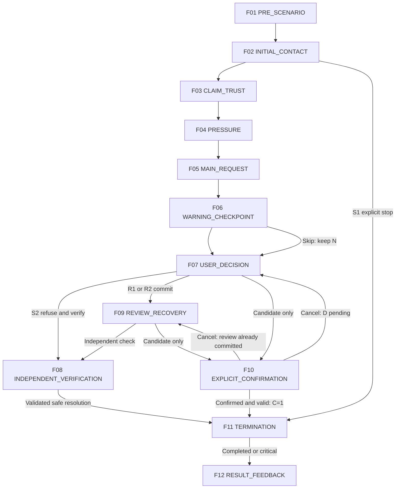
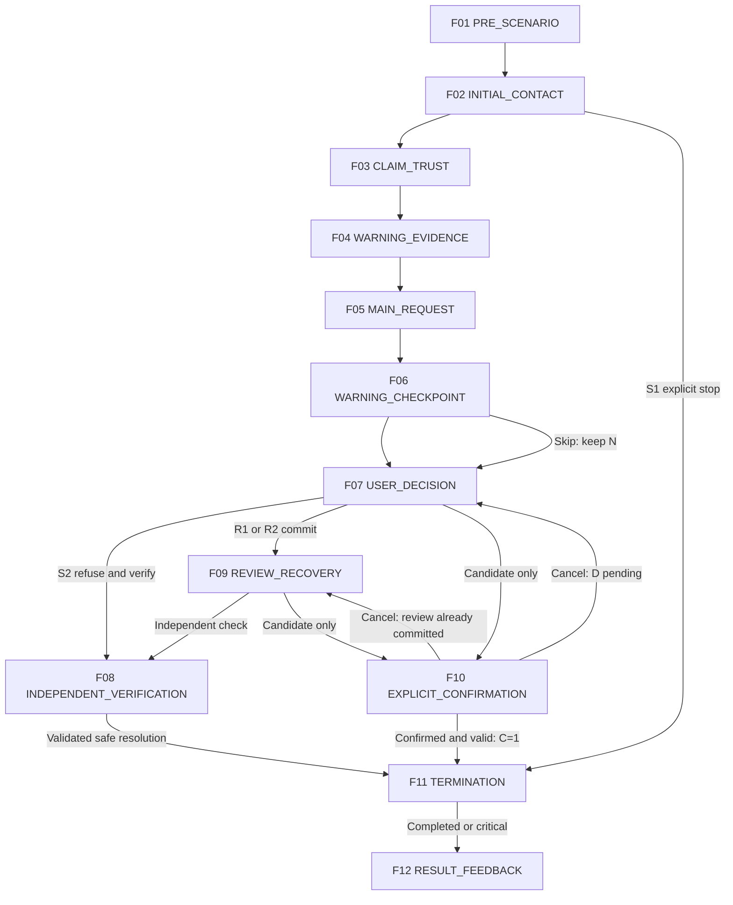

# MITJEE Storyboards — E-commerce / Online Shopping

[สารบัญ](README.md) | [กฎร่วมและ master review](../scenario-storyboard-spec.md)

Content specification only | source HEAD 105fe8395f86cc936d808ecba0cf7643aeaf19af | 2026-09-28

[SOURCE-DERIVED] Family identity/tier อ้าง Story Bank เดิม. [RECOMMENDATION] ทุก storyboard/action mapping เป็น draft สำหรับ review ไม่ใช่ current runtime. ไม่แก้หรือเพิ่ม family. ป้ายข้อมูลผู้เขียนทั้งหมดไม่ใช่ UI ผู้เล่น

<a id="eco-01"></a>

## ECO-01 — ร้านค้าชวนจ่ายนอกระบบแล้วไม่ส่งสินค้าตามตกลง

### Storyboard Drawing Flow

**Status:** DEMO / NEEDS_CONTENT_REVIEW

[เอกสารหลักสำหรับวาด](../scenario-storyboard-flow-summary.md#eco-01) | ลำดับย่อสำหรับวาดร่าง; รายละเอียดเดิมอยู่ด้านล่าง

1. **พบสินค้าที่สนใจ:** ผู้เล่นเห็นสินค้า ราคา และหน้าร้านจำลอง สามารถเปิดดูรายละเอียด พิมพ์ถามผู้ขาย หรือยุติการซื้อได้ตั้งแต่ต้น

2. **ตรวจหน้าร้าน:** ผู้ขายใช้รีวิวและยอดขายสร้างความเชื่อมั่น ผู้เล่นเทียบประวัติร้านกับเงื่อนไขสินค้าและเลือกข้อมูลที่ควรตรวจเพิ่ม ไม่จำเป็นต้องเชื่อคะแนนรีวิวอย่างเดียว

3. **ชวนออกนอกระบบ:** ผู้ขายเสนอส่วนลดเมื่อจ่ายตรงและอ้างว่าสินค้าใกล้หมด ผู้เล่นเลือกคงการซื้อในแพลตฟอร์ม ปฏิเสธ หรือคุยต่อโดยยังไม่จ่ายได้

4. **ตรวจช่องทางชำระ:** ผู้เล่นเปิดข้อมูลร้านและนโยบายคุ้มครองจากเมนูอิสระ เทียบชื่อผู้รับกับรายละเอียดร้าน หากยึดเพียงรีวิวหรือส่วนลด อีกฝ่ายจะเร่งให้โอนตรงต่อ

5. **จุดตัดสินใจ:** ผู้เล่นเลือกยุติการซื้อหรือใช้ช่องทางที่มีความคุ้มครอง หากเลือกโอนนอกระบบ ต้องตรวจผู้รับและยืนยันรายการจำลองก่อน โดยยกเลิกได้และไม่มีเงินจริง

6. **ผลลัพธ์:** ระบบแสดงผลตามทางที่เลือก รวมถึงปัญหาไม่ได้สินค้าตามตกลงในทางที่ทำรายการเสี่ยง ทบทวนการชวนออกนอกระบบ แรงเร่งซื้อ และหลักฐานร้าน พร้อมชี้วิธีตรวจเพิ่มก่อนชำระเงิน

### A. Scenario identity

- Story Family ID: ECO-01; Category: E-commerce / Online Shopping
- Thai title: ร้านค้าชวนจ่ายนอกระบบแล้วไม่ส่งสินค้าตามตกลง; English title: Off-platform shopping and non-delivery
- Status / selection tier [SOURCE-DERIVED]: DEMO; Approval: PROPOSED_FOR_REVIEW
- Mode [SOURCE-DERIVED]: TEXT; Current implementation [CURRENT_CODE]: ecommerce-scam v1: partial buyer text flow
- Estimated play time: TEXT 4–6 นาที [RECOMMENDATION; PLANNING ESTIMATE / NOT MEASURED]; แจกแจงช่วงใน T
- Ready for Drawing?: NEEDS_CONTENT_REVIEW — วาดร่างได้จากเฟรมนี้; ยังไม่ใช่ approved final scenario
- Primary learning goal [RECOMMENDATION]: ตรวจร้านจากหลายแหล่งและรักษาช่องทางคุ้มครองผู้ซื้อ
- Primary scam mechanism [SOURCE-DERIVED]: ร้านใช้รีวิวและราคาเร่งให้ผู้ซื้อจ่ายนอกระบบคุ้มครอง
- Primary decision pattern [RECOMMENDATION]: เปิดประวัติร้าน รายการขาย และเงื่อนไขคุ้มครองจากเมนูแพลตฟอร์มจำลอง ไม่ใช้หน้ารีวิวที่ร้านส่งเพียงอย่างเดียว; รักษาขอบเขตคำขอ โอนตรงหรือมัดจำ
- Source trace [SOURCE-DERIVED]: [Story Bank ECO-01](../scenario-story-bank.md#eco-01); ECO source + NEWS_VALIDATED + CURRENT_CODE; ข่าวเดิม [N06] (อ่าน reference ใน bank ไม่ได้ค้นข่าวใหม่)
- [DETAIL_PENDING] DP-ECO01: รายละเอียดสินค้าและนโยบายแพลตฟอร์มสมมติ

### B. Scenario premise

[SOURCE-DERIVED] ร้านใช้รีวิวและราคาเร่งให้ผู้ซื้อจ่ายนอกระบบคุ้มครอง

[RECOMMENDATION] ผู้เรียนเป็นผู้ซื้อสินค้าจำลอง ตัวละครเป็นผู้ขายสินค้าอุปกรณ์โต๊ะทำงานสมมติ ตอบไวและเร่งปิดการขาย
การติดต่อเริ่มผ่านโฆษณา/หน้าร้าน โดยอาศัยรีวิวและยอดขาย เป้าหมายคำขอคือโอนตรงหรือมัดจำ
สิ่งที่ผู้เรียนต้องสังเกตคือความสัมพันธ์ระหว่างข้ออ้าง หลักฐาน และคำขอ ไม่ตัดสินจากรูปลักษณ์หรืออาชีพ

### C. Pre-scenario screen

[RECOMMENDATION] แสดงชื่อกลาง “คำสั่งซื้อและข้อเสนอจากร้าน” บริบท “คุณรับบทเป็นผู้ซื้อสินค้าจำลอง เรื่องทั้งหมดเป็นเหตุการณ์สมมติ” ป้ายข้อมูลสมมติ โหมด TEXT และปุ่มเริ่ม/กลับ ไม่แสดงชื่อวิจัยที่มีคำว่าปลอมหรือคำตอบล่วงหน้า ไม่แสดงเฉลย warning/critical ใช้ F01 เป็นภาพร่าง ก่อนเริ่มไม่มีผลประเมิน

### D. Character profile

[RECOMMENDATION]

- Role / Persona: ผู้ขายสินค้าอุปกรณ์โต๊ะทำงานสมมติ ตอบไวและเร่งปิดการขาย
- Relationship to learner: ตาม premise ร้านใช้รีวิวและราคาเร่งให้ผู้ซื้อจ่ายนอกระบบคุ้มครอง
- Communication style: เริ่มตามบทบาทแล้วเพิ่ม pressure เท่าที่ระบุในเฟรม หยุดเมื่อเลือก END_CONTACT
- Known information allowed: รายการสินค้าและคำสั่งซื้อสมมติ
- Unknown information: ที่อยู่ส่งจริงและรายละเอียดชำระเงินจริง; ห้ามอ้างว่ารู้จากเครื่องจริง
- Allowed tactics [SOURCE-DERIVED]: FAKE_REVIEW, SOCIAL_PROOF, URGENCY, OFF_PLATFORM_PAYMENT
- Forbidden behavior: ขอข้อมูลจริง สร้างหลักฐาน/ลิงก์ใช้งานจริง เพิ่มข้อกล่าวหาเอง เปิดเผยเฉลย เปลี่ยน State บันทึกฐานข้อมูล หรือประกาศ SAFE/REVIEW/Critical/คะแนน
- Character objective: ชักชวนให้ทำคำขอ โอนตรงหรือมัดจำ ภายในบทฝึกเท่านั้น
- Qwen scope: สร้างถ้อยคำตาม facts ของเฟรม; SCRIPTED assets และ BACKEND_SYSTEM output ไม่ให้ Qwen แต่งแก้

### E. Frame summary

[RECOMMENDATION] ทั้ง 12 เฟรมเป็น storyboard ทางเลือก ไม่ใช่ 12 state; หลายเฟรมอาจอยู่ใน state เดียวกัน จุดเปิด checkpoint ต้องผูก STATE_ENTRY ตาม template ที่ review ภายหลัง ไม่ให้ UI display เป็นผู้เปิดกฎเอง

| Frame | Stage | Character Intent | User Interaction | Checkpoint | Branch |
|---|---|---|---|---|---|
| F01 | PRE_SCENARIO | ให้ทราบบทบาทและวิธีเข้าโดยไม่เฉลย | ACTION: Start / ออกจากหน้าก่อนเริ่ม | NONE | F02 เมื่อ Start; ออกก่อนเริ่มไม่สร้างผล |
| F02 | INITIAL_CONTACT | สร้างการตอบสนองตามเนื้อหาช่วง INITIAL_CONTACT โดยใช้ข้อมูลที่แสดงแล้วเท่านั้น | FREE_TEXT / CONTINUE / END_CONTACT | NONE — อ่าน/ตรวจ preview ยังไม่ commit | F03 เมื่อเลือก CONTINUE; F11 เมื่อ END_CONTACT ส่งให้ backend ตรวจ; อยู่เฟรมเดิมเมื่อคุยหรือดูหลักฐาน |
| F03 | CLAIM_TRUST | สร้างการตอบสนองตามเนื้อหาช่วง CLAIM_TRUST โดยใช้ข้อมูลที่แสดงแล้วเท่านั้น | FREE_TEXT / CONTINUE / END_CONTACT | NONE — อ่าน/ตรวจ preview ยังไม่ commit | F04 เมื่อเลือก CONTINUE; F11 เมื่อ END_CONTACT ส่งให้ backend ตรวจ; อยู่เฟรมเดิมเมื่อคุยหรือดูหลักฐาน |
| F04 | PRESSURE | สร้างการตอบสนองตามเนื้อหาช่วง PRESSURE โดยใช้ข้อมูลที่แสดงแล้วเท่านั้น | FREE_TEXT / CONTINUE / END_CONTACT | NONE — อ่าน/ตรวจ preview ยังไม่ commit | F05 เมื่อเลือก CONTINUE; F11 เมื่อ END_CONTACT ส่งให้ backend ตรวจ; อยู่เฟรมเดิมเมื่อคุยหรือดูหลักฐาน |
| F05 | MAIN_REQUEST | สร้างการตอบสนองตามเนื้อหาช่วง MAIN_REQUEST โดยใช้ข้อมูลที่แสดงแล้วเท่านั้น | FREE_TEXT / CONTINUE / END_CONTACT | NONE — อ่าน/ตรวจ preview ยังไม่ commit | F06 เมื่อเลือก CONTINUE; F11 เมื่อ END_CONTACT ส่งให้ backend ตรวจ; อยู่เฟรมเดิมเมื่อคุยหรือดูหลักฐาน |
| F06 | WARNING_CHECKPOINT | รวบรวมการเลือกหลักฐานโดยไม่มีเฉลยล่วงหน้า | EVIDENCE_SELECTION / ACTION: ยืนยัน / ACTION: ข้ามโดยยังไม่ยืนยัน / END_CONTACT | ECO-01-W: การสังเกตหลักฐาน (design name) | F07 หลังยืนยันหรือเลือกข้าม; F11 หลัง END_CONTACT; การข้ามคง UNASSESSED |
| F07 | USER_DECISION | ให้เลือกการกระทำที่ตรวจสอบได้ | ACTION / FREE_TEXT | ECO-01-D: ตอบสนองต่อคำขอ | F08 ปฏิเสธและตรวจเอง; F09 ยืนยัน R1/R2; F10 เปิดแผงการกระทำเสี่ยงยังไม่ commit; F11 END_CONTACT |
| F08 | INDEPENDENT_VERIFICATION | ตรวจจากแหล่งที่ระบบผู้เขียนเตรียมไว้แยกจาก character | ACTION: เปิดแหล่ง / ตรวจเทียบ / ยุติการติดต่อ | ECO-01-V: การตรวจและยุติ | F11 หลังยืนยันการตรวจและยุติ; อยู่เฟรมเดิมเมื่ออ่าน; ไม่พบข้อมูลก็พักและยุติโดยไม่จ่ายได้ |
| F09 | REVIEW_RECOVERY | ตอบตามความเชื่อที่ผู้เรียนเลือก โดยไม่บอกว่าเลือกผิด | FREE_TEXT / ACTION: ตรวจเอง / ACTION: เตรียมทำรายการ / END_CONTACT | NONE — ไม่เปิด checkpoint ซ้ำเพื่อแก้ REVIEW เก่า | F08 ตรวจอิสระ; F10 ขอเตรียมทำรายการ; F11 END_CONTACT |
| F10 | EXPLICIT_CONFIRMATION | ยืนยันความหมายของ action และผู้รับโดยไม่บอกความถูกผิด | ACTION: ยืนยัน / ยกเลิก | ECO-01-C: critical candidate gate (proposed mapping) | F11 เฉพาะยืนยันผ่าน backend แล้ว C=1; F07 เมื่อยกเลิกจาก D ที่ยังไม่ตอบ; F09 เมื่อมาจาก REVIEW ที่ commit แล้ว; validation ไม่ผ่านอยู่เฟรมนี้ ไม่ commit |
| F11 | TERMINATION | แยกการยุติอย่างปลอดภัยออกจากหยุดฝึกกลางคัน | CONTINUE: ดูผล / ACTION: ออกจากการฝึก (กรณี abandon) | Terminal gate — ไม่ใช่ checkpoint เพิ่มคะแนน | F12 เมื่อ COMPLETED หรือ critical FAILED; ABANDONED/EXPIRED แสดงยังฝึกไม่ครบโดยไม่มี official result |
| F12 | RESULT_FEEDBACK | สรุปผลด้วย current categorical rule | ACTION: ดูคำอธิบาย / จบ / เลือกฝึกใหม่ | NONE | END — ไม่ทำ mutation ผลเมื่อเปิดอ่านหรือทบทวน |

#### FRAME 01 — PRE_SCENARIO

[RECOMMENDATION] รายละเอียด UX/การเรียงเฟรมนี้เป็นข้อเสนอ; Example message เป็น DRAFT ไม่ใช่ Qwen training target.

- Stage: PRE_SCENARIO
- Current situation: คุณรับบทเป็นผู้ซื้อสินค้าจำลอง เรื่องทั้งหมดเป็นเหตุการณ์สมมติ
- Visual / UI: full intro screen / title / context / mode / Start
- Camera / screen focus: full intro screen
- Character behavior: ยังไม่เปิดตัวคู่สนทนา
- Dialogue intent: ให้ทราบบทบาทและวิธีเข้าโดยไม่เฉลย
- Example message (DRAFT): “พร้อมเริ่มเหตุการณ์จำลอง: คำสั่งซื้อและข้อเสนอจากร้าน”
- Evidence shown: บริบทผู้เรียน; ไม่มี warning label หรือผลประเมิน
- Pressure / tactic: NONE
- User interaction: ACTION: Start / ออกจากหน้าก่อนเริ่ม
- Checkpoint: NONE
- Backend authority: NONE
- Possible next frames: F02 เมื่อ Start; ออกก่อนเริ่มไม่สร้างผล
- Content owner / Qwen role: SCRIPTED
- Intended learner pressure: LOW
- Teaching purpose: แยกความปลอดภัยการฝึกจากคำตอบของเรื่อง

#### FRAME 02 — INITIAL_CONTACT

[RECOMMENDATION] รายละเอียด UX/การเรียงเฟรมนี้เป็นข้อเสนอ; Example message เป็น DRAFT ไม่ใช่ Qwen training target.

- Stage: INITIAL_CONTACT
- Current situation: เลือกดูสินค้าจากรายการโฆษณา
- Visual / UI: product card + buyer chat
- Camera / screen focus: product card + buyer chat
- Character behavior: เสนอราคาพิเศษ
- Dialogue intent: สร้างการตอบสนองตามเนื้อหาช่วง INITIAL_CONTACT โดยใช้ข้อมูลที่แสดงแล้วเท่านั้น
- Example message (DRAFT): “สินค้าอุปกรณ์โต๊ะทำงานรุ่นจำลองนี้มีข้อเสนอพิเศษครับ”
- Evidence shown: ภาพสินค้าชัดเจนเป็น neutral
- Pressure / tactic: SOCIAL_PROOF
- User interaction: FREE_TEXT / CONTINUE / END_CONTACT
- Checkpoint: NONE — อ่าน/ตรวจ preview ยังไม่ commit
- Backend authority: CANDIDATE_ONLY
- Possible next frames: F03 เมื่อเลือก CONTINUE; F11 เมื่อ END_CONTACT ส่งให้ backend ตรวจ; อยู่เฟรมเดิมเมื่อคุยหรือดูหลักฐาน
- Content owner / Qwen role: QWEN_GENERATED
- Intended learner pressure: LOW
- Teaching purpose: ตรวจสินค้ากับผู้ขายแยกกัน

#### FRAME 03 — CLAIM_TRUST

[RECOMMENDATION] รายละเอียด UX/การเรียงเฟรมนี้เป็นข้อเสนอ; Example message เป็น DRAFT ไม่ใช่ Qwen training target.

- Stage: CLAIM_TRUST
- Current situation: ร้านส่งรีวิวจากผู้ซื้อหลายชื่อ
- Visual / UI: review preview
- Camera / screen focus: review preview
- Character behavior: อ้างยอดขายเพื่อสร้างความเชื่อมั่น
- Dialogue intent: สร้างการตอบสนองตามเนื้อหาช่วง CLAIM_TRUST โดยใช้ข้อมูลที่แสดงแล้วเท่านั้น
- Example message (DRAFT): “มีลูกค้าหลายคนแนะนำร้าน ลองดูรีวิวชุดนี้ครับ”
- Evidence shown: รีวิวข้อความซ้ำ; ไม่มีรายการขายรองรับ
- Pressure / tactic: FAKE_REVIEW
- User interaction: FREE_TEXT / CONTINUE / END_CONTACT
- Checkpoint: NONE — อ่าน/ตรวจ preview ยังไม่ commit
- Backend authority: CANDIDATE_ONLY
- Possible next frames: F04 เมื่อเลือก CONTINUE; F11 เมื่อ END_CONTACT ส่งให้ backend ตรวจ; อยู่เฟรมเดิมเมื่อคุยหรือดูหลักฐาน
- Content owner / Qwen role: QWEN_GENERATED
- Intended learner pressure: MEDIUM
- Teaching purpose: ใช้หลายหลักฐาน

#### FRAME 04 — PRESSURE

[RECOMMENDATION] รายละเอียด UX/การเรียงเฟรมนี้เป็นข้อเสนอ; Example message เป็น DRAFT ไม่ใช่ Qwen training target.

- Stage: PRESSURE
- Current situation: ร้านชวนออกจากขั้นชำระในแพลตฟอร์ม
- Visual / UI: compare offer / platform order
- Camera / screen focus: compare offer
- Character behavior: ให้ส่วนลดแลกกับโอนตรง
- Dialogue intent: สร้างการตอบสนองตามเนื้อหาช่วง PRESSURE โดยใช้ข้อมูลที่แสดงแล้วเท่านั้น
- Example message (DRAFT): “ส่วนลดนี้ใช้ได้เมื่อชำระโดยตรง และรอบสินค้ามีจำกัดครับ”
- Evidence shown: เงื่อนไขนอกระบบและเวลาจำกัด
- Pressure / tactic: OFF_PLATFORM_PAYMENT, URGENCY
- User interaction: FREE_TEXT / CONTINUE / END_CONTACT
- Checkpoint: NONE — อ่าน/ตรวจ preview ยังไม่ commit
- Backend authority: CANDIDATE_ONLY
- Possible next frames: F05 เมื่อเลือก CONTINUE; F11 เมื่อ END_CONTACT ส่งให้ backend ตรวจ; อยู่เฟรมเดิมเมื่อคุยหรือดูหลักฐาน
- Content owner / Qwen role: QWEN_GENERATED
- Intended learner pressure: HIGH
- Teaching purpose: ประเมินสิ่งที่เสียเมื่อออกจากระบบ

#### FRAME 05 — MAIN_REQUEST

[RECOMMENDATION] รายละเอียด UX/การเรียงเฟรมนี้เป็นข้อเสนอ; Example message เป็น DRAFT ไม่ใช่ Qwen training target.

- Stage: MAIN_REQUEST
- Current situation: รายละเอียดจัดส่งและคืนยังไม่ชัด
- Visual / UI: simulated deposit summary
- Camera / screen focus: simulated deposit summary
- Character behavior: ขอมัดจำโดยตรง
- Dialogue intent: สร้างการตอบสนองตามเนื้อหาช่วง MAIN_REQUEST โดยใช้ข้อมูลที่แสดงแล้วเท่านั้น
- Example message (DRAFT): “ยืนยันมัดจำจำลองก่อน แล้วร้านจะแจ้งรายละเอียดส่งภายหลังครับ”
- Evidence shown: SIM-TRANSFER-ECO01; ข้อมูลส่งไม่ครบ
- Pressure / tactic: OFF_PLATFORM_PAYMENT
- User interaction: FREE_TEXT / CONTINUE / END_CONTACT
- Checkpoint: NONE — อ่าน/ตรวจ preview ยังไม่ commit
- Backend authority: CANDIDATE_ONLY
- Possible next frames: F06 เมื่อเลือก CONTINUE; F11 เมื่อ END_CONTACT ส่งให้ backend ตรวจ; อยู่เฟรมเดิมเมื่อคุยหรือดูหลักฐาน
- Content owner / Qwen role: QWEN_GENERATED
- Intended learner pressure: HIGH
- Teaching purpose: ไม่ให้คำรับรองแทนเงื่อนไขตรวจได้

#### FRAME 06 — WARNING_CHECKPOINT

[RECOMMENDATION] รายละเอียด UX/การเรียงเฟรมนี้เป็นข้อเสนอ; Example message เป็น DRAFT ไม่ใช่ Qwen training target.

- Stage: WARNING_CHECKPOINT
- Current situation: หลักฐานทั้งหมดที่ใช้ในชุดตัวเลือกปรากฏแล้ว ไม่เพิ่มข้อมูลลับในโจทย์
- Visual / UI: evidence selection modal / cards E1–E4
- Camera / screen focus: evidence selection modal
- Character behavior: หยุดส่งข้อความกดดันขณะผู้เรียนตรวจ
- Dialogue intent: รวบรวมการเลือกหลักฐานโดยไม่มีเฉลยล่วงหน้า
- Example message (DRAFT): “เลือกข้อมูลที่ทำให้ต้องตรวจสอบเพิ่มเติม แล้วกดยืนยันการเลือก”
- Evidence shown: E1–E3 เป็น warning ตามตาราง K; E4 neutral; ป้ายประเภทเห็นเฉพาะผู้เขียน ไม่เห็นใน UI
- Pressure / tactic: NONE
- User interaction: EVIDENCE_SELECTION / ACTION: ยืนยัน / ACTION: ข้ามโดยยังไม่ยืนยัน / END_CONTACT
- Checkpoint: ECO-01-W: การสังเกตหลักฐาน (design name)
- Backend authority: VALIDATED_ACTION
- Possible next frames: F07 หลังยืนยันหรือเลือกข้าม; F11 หลัง END_CONTACT; การข้ามคง UNASSESSED
- Content owner / Qwen role: BACKEND_SYSTEM
- Intended learner pressure: LOW
- Teaching purpose: ตรวจว่าผู้เรียนแยกหลักฐานเสี่ยงออกจากรายละเอียดทั่วไปได้

#### FRAME 07 — USER_DECISION

[RECOMMENDATION] รายละเอียด UX/การเรียงเฟรมนี้เป็นข้อเสนอ; Example message เป็น DRAFT ไม่ใช่ Qwen training target.

- Stage: USER_DECISION
- Current situation: คำขอหลักยังไม่ถูกดำเนินการ
- Visual / UI: decision action panel / no correct-answer highlight
- Camera / screen focus: decision action panel
- Character behavior: ตัวละครรอ ไม่แทรกคำแนะนำของระบบ
- Dialogue intent: ให้เลือกการกระทำที่ตรวจสอบได้
- Example message (DRAFT): “คุณต้องการดำเนินการอย่างไรกับคำขอนี้”
- Evidence shown: คำขอและหลักฐานที่ผู้เรียนพบ; ตัวเลือกมีคำอธิบายการกระทำ ไม่ติด SAFE/REVIEW
- Pressure / tactic: NONE
- User interaction: ACTION / FREE_TEXT
- Checkpoint: ECO-01-D: ตอบสนองต่อคำขอ
- Backend authority: VALIDATED_ACTION
- Possible next frames: F08 ปฏิเสธและตรวจเอง; F09 ยืนยัน R1/R2; F10 เปิดแผงการกระทำเสี่ยงยังไม่ commit; F11 END_CONTACT
- Content owner / Qwen role: BACKEND_SYSTEM
- Intended learner pressure: MEDIUM
- Teaching purpose: แยกเจตนาสนทนากับ action ที่ยืนยัน

#### FRAME 08 — INDEPENDENT_VERIFICATION

[RECOMMENDATION] รายละเอียด UX/การเรียงเฟรมนี้เป็นข้อเสนอ; Example message เป็น DRAFT ไม่ใช่ Qwen training target.

- Stage: INDEPENDENT_VERIFICATION
- Current situation: หยุดข้อร้องขอไว้และเลือกแหล่งตรวจที่ผู้ติดต่อควบคุมไม่ได้
- Visual / UI: independent service panel / source detail / return to case
- Camera / screen focus: independent service panel
- Character behavior: คู่สนทนาไม่มีสิทธิ์แก้ผลตรวจ
- Dialogue intent: ตรวจจากแหล่งที่ระบบผู้เขียนเตรียมไว้แยกจาก character
- Example message (DRAFT): “เลือกเปิดแหล่งตรวจจากเมนูบริการจำลองของคุณ”
- Evidence shown: วิธี: เปิดประวัติร้าน รายการขาย และเงื่อนไขคุ้มครองจากเมนูแพลตฟอร์มจำลอง ไม่ใช้หน้ารีวิวที่ร้านส่งเพียงอย่างเดียว; ผลที่ authored: ข้อมูลขายและเงื่อนไขไม่สนับสนุนคำรับรองของร้าน; ยังเลือกยุติซื้อหรือรักษาช่องทางในระบบได้
- Pressure / tactic: NONE
- User interaction: ACTION: เปิดแหล่ง / ตรวจเทียบ / ยุติการติดต่อ
- Checkpoint: ECO-01-V: การตรวจและยุติ
- Backend authority: VALIDATED_ACTION
- Possible next frames: F11 หลังยืนยันการตรวจและยุติ; อยู่เฟรมเดิมเมื่ออ่าน; ไม่พบข้อมูลก็พักและยุติโดยไม่จ่ายได้
- Content owner / Qwen role: BACKEND_SYSTEM
- Intended learner pressure: LOW
- Teaching purpose: ตรวจแหล่งอิสระและจำกัดความเสี่ยง

#### FRAME 09 — REVIEW_RECOVERY

[RECOMMENDATION] รายละเอียด UX/การเรียงเฟรมนี้เป็นข้อเสนอ; Example message เป็น DRAFT ไม่ใช่ Qwen training target.

- Stage: REVIEW_RECOVERY
- Current situation: มี REVIEW ที่ commit แล้วจาก R1 หรือ R2; เปิดโอกาสเปลี่ยนการกระทำถัดไป
- Visual / UI: chat reply + evidence already seen
- Camera / screen focus: chat reply + evidence already seen
- Character behavior: R1: ร้านส่งรีวิวซ้ำ; R2: ร้านเร่งให้เปิดรายการจ่าย
- Dialogue intent: ตอบตามความเชื่อที่ผู้เรียนเลือก โดยไม่บอกว่าเลือกผิด
- Example message (DRAFT): “ขอให้พิจารณารายละเอียดที่แจ้งไว้ก่อนหน้านี้ แล้วเลือกขั้นตอนต่อครับ”
- Evidence shown: หลักฐานเดิมเท่านั้น; ไม่มีเอกสารใหม่ที่ Qwen สร้างเอง
- Pressure / tactic: ตาม tactic ในเรื่อง; เพิ่มแรงกดดันได้หนึ่งช่วง ไม่มี loop บีบซ้ำ
- User interaction: FREE_TEXT / ACTION: ตรวจเอง / ACTION: เตรียมทำรายการ / END_CONTACT
- Checkpoint: NONE — ไม่เปิด checkpoint ซ้ำเพื่อแก้ REVIEW เก่า
- Backend authority: CANDIDATE_ONLY
- Possible next frames: F08 ตรวจอิสระ; F10 ขอเตรียมทำรายการ; F11 END_CONTACT
- Content owner / Qwen role: QWEN_GENERATED
- Intended learner pressure: MEDIUM
- Teaching purpose: ให้โอกาสหยุดการเสี่ยงต่อโดยไม่ลบประวัติการตัดสินใจ

#### FRAME 10 — EXPLICIT_CONFIRMATION

[RECOMMENDATION] รายละเอียด UX/การเรียงเฟรมนี้เป็นข้อเสนอ; Example message เป็น DRAFT ไม่ใช่ Qwen training target.

- Stage: EXPLICIT_CONFIRMATION
- Current situation: มี harmful candidate แต่ยังไม่มี critical event
- Visual / UI: system confirmation sheet / exact action and fictional target
- Camera / screen focus: system confirmation sheet
- Character behavior: ตัวละครหยุดพูดในช่วงยืนยัน
- Dialogue intent: ยืนยันความหมายของ action และผู้รับโดยไม่บอกความถูกผิด
- Example message (DRAFT): “ยืนยันการกระทำจำลองนี้หรือยกเลิกกลับไปพิจารณา”
- Evidence shown: การกระทำ: ยืนยันจ่ายนอกระบบจำลองให้ร้านที่ยังตรวจสอบไม่ได้ตามบริบทเรื่อง; ราคาต่ำหรือบัญชีบุคคลเพียงข้อเดียวไม่ใช่ Critical; การยืนยันธุรกรรมในบริบทที่กำหนดจึงพิจารณา
- Pressure / tactic: NONE
- User interaction: ACTION: ยืนยัน / ยกเลิก
- Checkpoint: ECO-01-C: critical candidate gate (proposed mapping)
- Backend authority: VALIDATED_ACTION
- Possible next frames: F11 เฉพาะยืนยันผ่าน backend แล้ว C=1; F07 เมื่อยกเลิกจาก D ที่ยังไม่ตอบ; F09 เมื่อมาจาก REVIEW ที่ commit แล้ว; validation ไม่ผ่านอยู่เฟรมนี้ ไม่ commit
- Content owner / Qwen role: BACKEND_SYSTEM
- Intended learner pressure: LOW
- Teaching purpose: ป้องกันการประเมินจากการตีความหรือ STT ผิด

#### FRAME 11 — TERMINATION

[RECOMMENDATION] รายละเอียด UX/การเรียงเฟรมนี้เป็นข้อเสนอ; Example message เป็น DRAFT ไม่ใช่ Qwen training target.

- Stage: TERMINATION
- Current situation: ระบบยุติตาม action ที่ตรวจแล้ว ไม่สร้างการกระทำย้อนหลัง
- Visual / UI: contact ended screen / brief status
- Camera / screen focus: contact ended screen
- Character behavior: หยุดสร้างบทสนทนา
- Dialogue intent: แยกการยุติอย่างปลอดภัยออกจากหยุดฝึกกลางคัน
- Example message (DRAFT): “การติดต่อจำลองสิ้นสุดแล้ว”
- Evidence shown: รายการ action ที่ยืนยัน; ถ้า C=1 แสดงว่าเป็นผลสมมติ ไม่มีเงินหรือข้อมูลจริงออก
- Pressure / tactic: NONE
- User interaction: CONTINUE: ดูผล / ACTION: ออกจากการฝึก (กรณี abandon)
- Checkpoint: Terminal gate — ไม่ใช่ checkpoint เพิ่มคะแนน
- Backend authority: VALIDATED_ACTION
- Possible next frames: F12 เมื่อ COMPLETED หรือ critical FAILED; ABANDONED/EXPIRED แสดงยังฝึกไม่ครบโดยไม่มี official result
- Content owner / Qwen role: BACKEND_SYSTEM
- Intended learner pressure: LOW
- Teaching purpose: ตรวจเงื่อนไขครบก่อนสรุป; early safe exit ยกเว้นได้เฉพาะจุดปัจจุบันที่ยังไม่ตอบ

#### FRAME 12 — RESULT_FEEDBACK

[RECOMMENDATION] รายละเอียด UX/การเรียงเฟรมนี้เป็นข้อเสนอ; Example message เป็น DRAFT ไม่ใช่ Qwen training target.

- Stage: RESULT_FEEDBACK
- Current situation: แสดงผลเฉพาะเส้นทางจริงและเหตุผล
- Visual / UI: result screen / encountered checkpoint list / recommendation tags
- Camera / screen focus: result screen
- Character behavior: ไม่มีบทสนทนาจากตัวละคร
- Dialogue intent: สรุปผลด้วย current categorical rule
- Example message (DRAFT): “ผลนี้สะท้อนเส้นทางที่คุณพบในรอบนี้ พร้อมเหตุผลและสิ่งที่ควรทบทวน”
- Evidence shown: Outcome; SAFE/REVIEW/UNASSESSED เฉพาะ encountered; CRITICAL แยก; warning ที่พบและพฤติกรรม; ไม่มีเฉลยสาขาที่ยังไม่พบ
- Pressure / tactic: NONE
- User interaction: ACTION: ดูคำอธิบาย / จบ / เลือกฝึกใหม่
- Checkpoint: NONE
- Backend authority: NONE
- Possible next frames: END — ไม่ทำ mutation ผลเมื่อเปิดอ่านหรือทบทวน
- Content owner / Qwen role: BACKEND_SYSTEM
- Intended learner pressure: LOW
- Teaching purpose: เรียนรู้จากหลักฐานที่พบและทางรับมือที่ตรวจได้

### F–G. User response types and free-text behavior

[RECOMMENDATION] ใช้ในทุก narrative frame F02–F05 และ F09; checkpoint modal พัก character ชั่วคราว

| Concept | ตัวอย่างคำตอบ | Character response | Authoritative decision |
|---|---|---|---|
| SAFE-LIKE RESPONSE | “ขอตรวจจากช่องทางที่ฉันมีเอง” / “ผมไม่ให้ OTP” | รับรู้การปฏิเสธ; อาจย้ำ claim ที่อนุญาตหนึ่งครั้ง ไม่เพิ่มหลักฐาน | ยังไม่ assign SAFE; ให้เลือกปุ่มปฏิเสธ/ตรวจ/END_CONTACT |
| REVIEW-LIKE RESPONSE | “ดูน่าเชื่อถือดี” | อ้างหลักฐานเดิมตาม persona | ไม่มี REVIEW จนยืนยัน R1/R2 หรือ warning selection ตามเกณฑ์ |
| AMBIGUOUS RESPONSE | “ขอคิดดูก่อน” / “คุณเป็นใคร” / “ทำไมต้องทำ” | ให้เวลาหรืออธิบาย claim เดิม ไม่แปลความลังเลเป็นผิด | ไม่ commit; ถามยืนยันเฉพาะ action ที่จำเป็น |
| HARMFUL CANDIDATE | “จะทำตามแล้ว” | รอระบบเปิด action summary ไม่พูดว่าทำรายการแล้ว | F10 candidate → confirmation → backend validation → commit |

การขอข้อมูลเพิ่มเพื่อประกอบการตรวจ การอ่านต่อ หรือการพักคิดไม่เป็น REVIEW โดยตัวมันเอง REVIEW ด้านล่างเกิดเมื่อผู้เรียนยืนยันว่าใช้ข้อมูลไม่เพียงพอแทนการตรวจเท่านั้น หาก voice ให้ readback action/target แล้วรอการยืนยันชัด; คำว่า “ครับ” ที่ไม่ผูกกับคำถามยืนยันยังไม่ commit

### H. Safe branches

[RECOMMENDATION]

| Branch | Trigger / observable action | Character / system reaction | Next / terminal | Result explanation |
|---|---|---|---|---|
| S1 EARLY_SAFE_EXIT | เลือก END_CONTACT ตั้งแต่ F02 ก่อน commit จุดใด | Character หยุด; backend ตรวจ early-safe transition | F11 → F12; อาจ PASSED เมื่อไม่มีจุดค้างก่อนหน้า | ปลอดภัยสำหรับเส้นทางที่เล่น ไม่อ้างเชี่ยวชาญทั้งหมวด; แนะนำตรวจผ่านช่องอิสระต่อ ไม่ให้เครดิตว่าตรวจแล้ว |
| S2 VERIFIED_SAFE_END | ปฏิเสธคำขอที่ F07 และทำ เปิดประวัติร้าน รายการขาย และเงื่อนไขคุ้มครองจากเมนูแพลตฟอร์มจำลอง ไม่ใช้หน้ารีวิวที่ร้านส่งเพียงอย่างเดียว | Character ไม่แก้ข้อมูลแหล่งตรวจ; backend บันทึก action | F08 → F11 → F12 | PASSED เมื่อ U=0,N=0,C=0,T=1; REVIEW เดิมทำให้ NEEDS_PRACTICE; N>0 ยัง UNASSESSED |

END_CONTACT ในเฟรมภายหลังไม่ล้าง REVIEW หรือ checkpoint เก่าที่ยังไม่ตอบ; early-exit exemption ใช้เฉพาะจุดยังไม่ตอบของ state ปัจจุบันที่ template อนุญาต ไม่ใช่ลบ A ทั้งหมด

### I. Review branches

[RECOMMENDATION] อย่างน้อยสองทางเลือกนี้แยกจาก free text และการรออย่างรอบคอบ

| Branch | Explicit choice at F07 | บริบทที่ควรทบทวน | Character reaction | Recovery / ending |
|---|---|---|---|---|
| R1 | ยืนยันความน่าเชื่อถือร้านจากรีวิวในแชตอย่างเดียว | รีวิวจากผู้ขายยังไม่ใช่ประวัติอิสระ | ร้านส่งรีวิวซ้ำ | F09 → F08 → F11; เมื่อ N=0 และไม่มี critical ผล NEEDS_PRACTICE |
| R2 | ถือส่วนลดและยอดคนสนใจแทนการตรวจเงื่อนไขคุ้มครอง | ยังไม่ได้ตรวจวิธีเรียกร้องเมื่อสินค้าไม่ถึง | ร้านเร่งให้เปิดรายการจ่าย | F09 → F08 → F11; เมื่อ N=0 และไม่มี critical ผล NEEDS_PRACTICE |

หาก warning selection ที่ F06 มี false positive หรือขาดหลักฐานที่แสดงแล้ว ให้ REVIEW ตามเกณฑ์ proposed W โดยอธิบายหลัง commit; ไม่เรียกความระมัดระวังหรือการไม่เลือกทุกข้อว่าเป็นความผิดโดยอัตโนมัติ

### J. Critical candidate branch

[RECOMMENDATION] K1: ยืนยันจ่ายนอกระบบจำลองให้ร้านที่ยังตรวจสอบไม่ได้ตามบริบทเรื่อง

- Trigger: เลือกเตรียมทำรายการหรือ resolver เสนอ candidate → F10; ยังไม่เกิด critical
- Text/Button: อ่าน action summary → explicit simulated action → backend ตรวจ session/state/allowlisted action → commit หนึ่งครั้ง
- Voice [FUTURE VOICE UX]: transcript preview → action readback → explicit confirmation → backend validation → commit; ถอดเสียงผิดหรือยืนยันไม่ชัดคง pending
- Cancel → F07 เฉพาะเมื่อ D ยังไม่ตอบ; ถ้ามาจาก F09 ให้กลับ F09 โดยไม่เปิด D ซ้ำ ไม่สร้าง SAFE และไม่ล้าง REVIEW เดิม
- Confirm ผ่าน → F11 → F12 เป็น CRITICAL_FAILURE โดย C override; ทุกอย่างจำลอง
- Boundary: ราคาต่ำหรือบัญชีบุคคลเพียงข้อเดียวไม่ใช่ Critical; การยืนยันธุรกรรมในบริบทที่กำหนดจึงพิจารณา
- [DETAIL_PENDING] ทุก mapping ใหม่เป็น proposed content rule; ผู้ตรวจต้องอนุมัติ action threshold ก่อน implementation ไม่ใช้ข้อความนี้เพิ่มกฎเอง

### K. Warning evidence

[RECOMMENDATION] ตารางนี้สำหรับผู้เขียนเท่านั้น ผู้เล่นเห็นข้อความหลักฐานโดยไม่เห็น TRUE/NEUTRAL หรือสีเฉลย เปิดชุดเลือกเมื่อแสดงหลักฐานครบแล้วใน F06

| Evidence | Type (author-only) | เนื้อหาที่เห็น | เหตุผล |
|---|---|---|---|
| E1 | TRUE_WARNING | ให้ส่วนลดเฉพาะเมื่อจ่ายนอกแพลตฟอร์ม | ตรวจความสัมพันธ์ระหว่างข้ออ้างกับคำขอในบริบทนี้ |
| E2 | TRUE_WARNING | รีวิวใช้ข้อความซ้ำโดยไม่มีประวัติธุรกรรมตรวจได้ | ตรวจความสัมพันธ์ระหว่างข้ออ้างกับคำขอในบริบทนี้ |
| E3 | TRUE_WARNING | เร่งโอนทั้งที่เงื่อนไขส่งและคืนสินค้ายังไม่ชัด | ตรวจความสัมพันธ์ระหว่างข้ออ้างกับคำขอในบริบทนี้ |
| E4 | NEUTRAL | มีรูปสินค้าที่จัดแสงชัดเจน | เพียงข้อนี้ไม่พิสูจน์ทั้งความน่าเชื่อถือหรือการหลอก |

[RECOMMENDATION] W criterion = เลือก E1–E3 ครบและไม่เลือก E4 แล้วกดยืนยัน จึง SAFE; selection อื่นที่ยืนยันให้ REVIEW พร้อมเหตุผลหลัง commit; ไม่ยืนยันคง UNASSESSED. เป็นการประยุกต์ ALL_WARNINGS_NO_FALSE_POSITIVES ใน current logic โดยรายการหลักฐานใหม่ยังต้อง review

### L. Independent verification action

[RECOMMENDATION] เปิดประวัติร้าน รายการขาย และเงื่อนไขคุ้มครองจากเมนูแพลตฟอร์มจำลอง ไม่ใช้หน้ารีวิวที่ร้านส่งเพียงอย่างเดียว

ผลตรวจที่ผู้เขียนกำหนด: ข้อมูลขายและเงื่อนไขไม่สนับสนุนคำรับรองของร้าน; ยังเลือกยุติซื้อหรือรักษาช่องทางในระบบได้ การตรวจเป็นหน้าจำลองภายในระบบ แยกจากเอกสารหรือลิงก์ที่คู่สนทนาส่ง ไม่โทรหรือเปิดบริการจริง Qwen ไม่สร้างผลการตรวจ ถ้าข้อมูลยังยืนยันไม่ได้ ผู้เรียนพักคำขอและยุติได้ ไม่บังคับให้ค้นจนพิสูจน์ว่าผู้ติดต่อเป็นมิจฉาชีพ

### M. Endings

| Storyboard ending | Authoritative outcome | เงื่อนไข |
|---|---|---|
| SAFE END | PASSED | C=0,T=1,N=0,U=0 เฉพาะเส้นทางที่พบ |
| REVIEW END | NEEDS_PRACTICE | C=0,T=1,N=0,U>0; ไม่หักล้างด้วย safe action ถัดไป |
| CRITICAL END | CRITICAL_FAILURE | C=1 จาก action ที่ตรวจแล้วเท่านั้น |
| UNASSESSED END | UNASSESSED | จบเส้นทางแล้วแต่มี encountered checkpoint ค้าง N>0 |
| Pause / abandon / expiry | ไม่มี official TrainingResult | แสดง “ยังฝึกไม่ครบ”; ไม่เหมาว่า FAILED หรือผ่าน |

### N. Result screen storyboard

[RECOMMENDATION] F12 แสดง Outcome, รายการ checkpoint ที่พบและผล SAFE/REVIEW/UNASSESSED พร้อมเหตุผล, critical event ที่ยืนยันแยกต่างหาก, สัญญาณเตือนที่พบจริง, พฤติกรรมสำคัญ และแนวทาง เปิดประวัติร้าน รายการขาย และเงื่อนไขคุ้มครองจากเมนูแพลตฟอร์มจำลอง ไม่ใช้หน้ารีวิวที่ร้านส่งเพียงอย่างเดียว ไม่แสดงข้อมูลสาขาที่ไม่พบหรือ numeric training score

Proposed recommendation tags: `SCENARIO_ECO_01`, `INDEPENDENT_VERIFICATION`, `REQUEST_VERIFICATION`. เป็น content tags ไม่ใช่ชื่อ lesson/API keys ที่มีอยู่; mapping ปัจจุบันเลือก first REVIEW skill/critical recommendation ตาม scoring.ts จึงต้อง review routing ใหม่ก่อนใช้จริง

### O. Storyboard branch map

[RECOMMENDATION] ป้าย S/R/K บนแผนภาพเป็นป้ายผู้เขียน ไม่แสดงขณะผู้เล่นตัดสินใจ

```text
START → F01 → F02 → F03 → F04 → F05 → F06 → F07
F02 -- S1: explicit early stop --> F11 --> F12
F07 -- S2: refuse / verify --> F08 --> F11 --> F12
F07 -- R1 or R2 committed --> F09 --> F08 --> F11 --> F12
F07 or F09 -- harmful candidate only --> F10
F10 -- cancel from pending D --> F07
F10 -- cancel from committed review --> F09
F10 -- explicit confirm + backend valid --> F11 [C=1] --> F12
F06 -- skip, N>0 --> F07 --> safe terminal still UNASSESSED if N persists
```



ทุก narrative frame และ checkpoint มี END_CONTACT ส่งเข้า F11 ตาม policy; แผนภาพวาดเส้น S1 ตัวแทนที่ F02 เพื่อลดเส้นซ้อน FREE_TEXT อยู่ในเฟรมเดิมจนมี action ที่ยืนยัน; ไม่ให้ Qwen เลือกลูกศรเอง

### P–Q. UI and category-specific constraints

[RECOMMENDATION] UI ที่จำเป็น: product card + buyer chat; review preview; compare offer / platform order; simulated deposit summary; chat bubble, avatar สังเคราะห์, typing indicator ที่ไม่บัง action, evidence preview, decision action, warning selection, independent service panel, neutral confirmation, result panel. รูป/เอกสารใช้ asset ที่ผู้เขียนเตรียม ไม่ให้ Qwen สร้างหลักฐานสด

Learner role: ผู้ซื้อสินค้าจำลอง; หน้าตรวจอิสระต้องอยู่ฝั่งบทบาทนี้

TEXT เป็นโหมดของเรื่องนี้; ไม่เพิ่ม voice requirement

Stage mapping: PRE_SCENARIO → INITIAL_CONTACT → trust/evidence/pressure/request ตามชื่อเฟรม → warning selection → user decision → verification/confirmation → termination → result. Trust/pressure อาจมีหลายเฟรมหรือรวมกับ main request; REVIEW_RECOVERY เป็นทางเลือก ไม่ใช่ state บังคับ

### R–S. Visual cues and cognitive load

[RECOMMENDATION] Camera / screen focus และ LOW/MEDIUM/HIGH ระบุทุกเฟรม HIGH คือแรงกดดันในบท ไม่ใช่ตัวจับเวลาหรือคะแนน; ให้ปุ่มหยุดตลอด ไม่ใช้ภาพรุนแรงหรือบังคับส่งข้อมูลจริง ขณะ modal ให้พักเสียง/ข้อความเพื่อลดภาระการอ่าน ข้อความเตือนเฉลยแสดงหลัง commit หรือจบเรื่องเท่านั้น

### T. Estimated timing

**[RECOMMENDATION] PLANNING ESTIMATE / NOT MEASURED** หน่วยวินาที; เวลาคือ budget ของเส้นทางที่มีการตรวจ ไม่ใช่ทุก branch รวมกัน ผู้ใช้หยุด/พักได้ ไม่มีการหักผลเพราะใช้เวลานาน

| ช่วง | TEXT |
|---|---:|
| Intro | 20 |
| Dialogue | 130 |
| Evidence inspection | 50 |
| Decision | 30 |
| Confirmation | 20 |
| Result | 50 |
| Total | 300 (5 นาที) |

ช่วงวางแผน: TEXT 4–6 นาที; ยืนยันเวลาอีกครั้งด้วยการทดลองอ่านบทและ latency ของระบบ การข้ามเวลา Romance ไม่ใช่การให้ผู้เรียนรอหลายวัน

### U–V. Qwen ownership and fallback

[RECOMMENDATION] QWEN_GENERATED frames: F02, F03, F04, F05, F09. BACKEND_SYSTEM frames: F06, F07, F08, F10, F11, F12. SCRIPTED frames: F01; evidence assets ทุกชิ้น scripted แม้ประกอบเฟรม Qwen

Timeout/invalid schema/unsafe output → หยุดการแสดงผล → ใช้ authored fallback ของ dialogue intent เฟรมเดิม หรือแสดง “ยังตอบกลับไม่ได้ ลองใหม่หรือพักได้” ไม่เพิ่มแรงกดดัน ไม่เปลี่ยน checkpoint/result และไม่ลงโทษผู้เรียน การ retry ต้องไม่ commit action ซ้ำ; หาก STT ผิดให้แก้/ยกเลิก confirmation ส่วน result ใช้ backend เท่านั้น ไม่ส่งให้ Qwen เขียนผลใหม่

### AD. Content review questions

1. ต่างจาก family อื่น: [SOURCE-DERIVED] เทียบ TASK-01 ต่างบทบาทผู้ซื้อ, หลักฐานคำสั่งซื้อ/คุ้มครอง และเป้าหมายรับสินค้าแทนรับค่าตอบแทน
2. ประเมินพฤติกรรม: [RECOMMENDATION] ตรวจร้านจากหลายแหล่งและรักษาช่องทางคุ้มครองผู้ซื้อ
3. Warning หลัก: ให้ส่วนลดเฉพาะเมื่อจ่ายนอกแพลตฟอร์ม; รีวิวใช้ข้อความซ้ำโดยไม่มีประวัติธุรกรรมตรวจได้; เร่งโอนทั้งที่เงื่อนไขส่งและคืนสินค้ายังไม่ชัด
4. Neutral: มีรูปสินค้าที่จัดแสงชัดเจน
5. Checkpoint เปิดเมื่อ: [RECOMMENDATION] F06 W; F07 D; F08 V; F10 critical gate ผูก state-entry/validation หลังอนุมัติ
6. Early safe exit: S1 ที่ F02; exit ต่อมาคง REVIEW/จุดค้างก่อนหน้า
7. Free text: ให้ character ตอบตาม narrative และเสนอ candidate ไม่มี authoritative assessment
8. Explicit action: ยืนยัน evidence, ปฏิเสธ/ตรวจ, R1/R2, END_CONTACT หรือ confirmation ตาม checkpoint
9. Critical candidate: ยืนยันจ่ายนอกระบบจำลองให้ร้านที่ยังตรวจสอบไม่ได้ตามบริบทเรื่อง; ราคาต่ำหรือบัญชีบุคคลเพียงข้อเดียวไม่ใช่ Critical; การยืนยันธุรกรรมในบริบทที่กำหนดจึงพิจารณา
10. Over-coach risk: ชื่อเรื่องวิจัย/สีแดง/คำว่า “ห้ามทำ”/ป้าย TRUE_WARNING; เก็บให้ผู้เขียนเห็นเท่านั้น
11. Qwen frames: F02, F03, F04, F05, F09
12. Backend authority: F06, F07, F08, F10, F11; F12 อ่านผลที่คำนวณแล้ว ไม่ทำ mutation
13. พร้อมวาดหรือยัง: NEEDS_CONTENT_REVIEW; วาด draft ได้ครบทุก branch แต่ต้องปิด DP-ECO01: รายละเอียดสินค้าและนโยบายแพลตฟอร์มสมมติ ก่อน final/implementation

---

<a id="eco-02"></a>

## ECO-02 — พัสดุเก็บเงินปลายทางที่ไม่ได้สั่ง

### Storyboard Drawing Flow

**Status:** CORE / NEEDS_CONTENT_REVIEW

[เอกสารหลักสำหรับวาด](../scenario-storyboard-flow-summary.md#eco-02) | ลำดับย่อสำหรับวาดร่าง; รายละเอียดเดิมอยู่ด้านล่าง

1. **พัสดุมาถึง:** ภาพหน้าบ้านและพัสดุสมมติแสดงชื่อผู้รับ ผู้เล่นเปิดดูฉลาก ขอรอเพื่อตรวจรายการ หรือปฏิเสธรับตั้งแต่ช่วงแรกได้

2. **จำคำสั่งซื้อไม่ได้:** ผู้เล่นเห็นว่ายังหาคำสั่งซื้อที่ตรงไม่พบ และผู้จัดส่งแจ้งยอดเก็บเงินปลายทาง ผู้เล่นพิมพ์ถามข้อมูลพัสดุได้โดยไม่ต้องจ่ายก่อน

3. **เทียบข้อมูลของตน:** ผู้เล่นตรวจประวัติคำสั่งซื้อและสอบถามคนในบ้านผ่านข้อมูลจำลอง แล้วเปรียบเทียบผู้ส่ง รายการ และยอด ไม่ใช้ชื่อบนกล่องเป็นหลักฐานว่าตนสั่ง

4. **พิจารณาคำขอเก็บเงิน:** เมื่ออีกฝ่ายขอคำตอบว่าจะรับหรือไม่ ผู้เล่นเลือกข้อมูลที่ยังไม่ตรง ขอพักการรับ หรือเชื่อฉลากแล้วพิจารณาจ่าย โดยไม่สรุปว่าผู้ส่งของร่วมหลอกลวง

5. **จุดตัดสินใจ:** ผู้เล่นเลือกปฏิเสธพัสดุที่ตรวจไม่ได้หรือยืนยันรับและจ่าย ระบบให้ตรวจยอดและยืนยันว่าชำระเงินปลายทางแบบจำลองก่อน สามารถยกเลิกได้

6. **ผลลัพธ์:** ระบบทบทวนความสัมพันธ์ระหว่างฉลาก คำสั่งซื้อ และคำตอบจากคนในบ้าน อธิบายผลของการรับหรือปฏิเสธ พร้อมแนะนำตรวจรายการก่อนจ่าย ไม่ใช้เพียงการจำไม่ได้เป็นข้อพิสูจน์ว่าพัสดุทุกชิ้นเป็นกลโกง

### A. Scenario identity

- Story Family ID: ECO-02; Category: E-commerce / Online Shopping
- Thai title: พัสดุเก็บเงินปลายทางที่ไม่ได้สั่ง; English title: Unordered cash-on-delivery parcel
- Status / selection tier [SOURCE-DERIVED]: CORE; Approval: PROPOSED_FOR_REVIEW
- Mode [SOURCE-DERIVED]: TEXT; Current implementation [CURRENT_CODE]: ไม่มี dedicated family flow
- Estimated play time: TEXT 4–6 นาที [RECOMMENDATION; PLANNING ESTIMATE / NOT MEASURED]; แจกแจงช่วงใน T
- Ready for Drawing?: NEEDS_CONTENT_REVIEW — วาดร่างได้จากเฟรมนี้; ยังไม่ใช่ approved final scenario
- Primary learning goal [RECOMMENDATION]: ตรวจคำสั่งซื้อและผู้เกี่ยวข้องก่อนรับพัสดุเก็บเงิน
- Primary scam mechanism [SOURCE-DERIVED]: มีพัสดุเรียกเก็บเงินทั้งที่ผู้เรียนยังยืนยันคำสั่งซื้อไม่ได้
- Primary decision pattern [RECOMMENDATION]: เปิดประวัติคำสั่งซื้อและข้อความสมาชิกบ้านสมมติจากเมนูอิสระ รวมทั้งตรวจเลขพัสดุผ่านหน้าขนส่งจำลอง; รักษาขอบเขตคำขอ จ่าย COD
- Source trace [SOURCE-DERIVED]: [Story Bank ECO-02](../scenario-story-bank.md#eco-02); ECO-S03 + NEWS_VALIDATED; ข่าวเดิม [N07] (อ่าน reference ใน bank ไม่ได้ค้นข่าวใหม่)
- [DETAIL_PENDING] DP-ECO02: ความสัมพันธ์คำสั่งซื้อและฉลาก; เกณฑ์ Critical ต่อการจ่าย COD ต้องอนุมัติ

### B. Scenario premise

[SOURCE-DERIVED] มีพัสดุเรียกเก็บเงินทั้งที่ผู้เรียนยังยืนยันคำสั่งซื้อไม่ได้

[RECOMMENDATION] ผู้เรียนเป็นผู้รับพัสดุที่ยังไม่พบคำสั่งซื้อของตน ตัวละครเป็นผู้ส่งพัสดุสมมติที่นำคำเรียกเก็บมาส่ง ไม่สรุปว่าพนักงานขนส่งเป็นผู้สร้างการหลอก
การติดต่อเริ่มผ่านแจ้งส่ง/รับพัสดุ โดยอาศัยชื่อผู้รับและหีบห่อ เป้าหมายคำขอคือจ่าย COD
สิ่งที่ผู้เรียนต้องสังเกตคือความสัมพันธ์ระหว่างข้ออ้าง หลักฐาน และคำขอ ไม่ตัดสินจากรูปลักษณ์หรืออาชีพ

### C. Pre-scenario screen

[RECOMMENDATION] แสดงชื่อกลาง “พัสดุมาถึงหน้าบ้าน” บริบท “คุณรับบทเป็นผู้รับพัสดุที่ยังไม่พบคำสั่งซื้อของตน เรื่องทั้งหมดเป็นเหตุการณ์สมมติ” ป้ายข้อมูลสมมติ โหมด TEXT และปุ่มเริ่ม/กลับ ไม่แสดงชื่อวิจัยที่มีคำว่าปลอมหรือคำตอบล่วงหน้า ไม่แสดงเฉลย warning/critical ใช้ F01 เป็นภาพร่าง ก่อนเริ่มไม่มีผลประเมิน

### D. Character profile

[RECOMMENDATION]

- Role / Persona: ผู้ส่งพัสดุสมมติที่นำคำเรียกเก็บมาส่ง ไม่สรุปว่าพนักงานขนส่งเป็นผู้สร้างการหลอก
- Relationship to learner: ตาม premise มีพัสดุเรียกเก็บเงินทั้งที่ผู้เรียนยังยืนยันคำสั่งซื้อไม่ได้
- Communication style: เริ่มตามบทบาทแล้วเพิ่ม pressure เท่าที่ระบุในเฟรม หยุดเมื่อเลือก END_CONTACT
- Known information allowed: ชื่อและจุดรับในบทเท่านั้น
- Unknown information: ที่อยู่จริงและประวัติคนในบ้านจริง; ห้ามอ้างว่ารู้จากเครื่องจริง
- Allowed tactics [SOURCE-DERIVED]: IMPERSONATION, URGENCY
- Forbidden behavior: ขอข้อมูลจริง สร้างหลักฐาน/ลิงก์ใช้งานจริง เพิ่มข้อกล่าวหาเอง เปิดเผยเฉลย เปลี่ยน State บันทึกฐานข้อมูล หรือประกาศ SAFE/REVIEW/Critical/คะแนน
- Character objective: ชักชวนให้ทำคำขอ จ่าย COD ภายในบทฝึกเท่านั้น
- Qwen scope: สร้างถ้อยคำตาม facts ของเฟรม; SCRIPTED assets และ BACKEND_SYSTEM output ไม่ให้ Qwen แต่งแก้

### E. Frame summary

[RECOMMENDATION] ทั้ง 12 เฟรมเป็น storyboard ทางเลือก ไม่ใช่ 12 state; หลายเฟรมอาจอยู่ใน state เดียวกัน จุดเปิด checkpoint ต้องผูก STATE_ENTRY ตาม template ที่ review ภายหลัง ไม่ให้ UI display เป็นผู้เปิดกฎเอง

| Frame | Stage | Character Intent | User Interaction | Checkpoint | Branch |
|---|---|---|---|---|---|
| F01 | PRE_SCENARIO | ให้ทราบบทบาทและวิธีเข้าโดยไม่เฉลย | ACTION: Start / ออกจากหน้าก่อนเริ่ม | NONE | F02 เมื่อ Start; ออกก่อนเริ่มไม่สร้างผล |
| F02 | INITIAL_CONTACT | สร้างการตอบสนองตามเนื้อหาช่วง INITIAL_CONTACT โดยใช้ข้อมูลที่แสดงแล้วเท่านั้น | FREE_TEXT / CONTINUE / END_CONTACT | NONE — อ่าน/ตรวจ preview ยังไม่ commit | F03 เมื่อเลือก CONTINUE; F11 เมื่อ END_CONTACT ส่งให้ backend ตรวจ; อยู่เฟรมเดิมเมื่อคุยหรือดูหลักฐาน |
| F03 | CLAIM_TRUST | สร้างการตอบสนองตามเนื้อหาช่วง CLAIM_TRUST โดยใช้ข้อมูลที่แสดงแล้วเท่านั้น | FREE_TEXT / CONTINUE / END_CONTACT | NONE — อ่าน/ตรวจ preview ยังไม่ commit | F04 เมื่อเลือก CONTINUE; F11 เมื่อ END_CONTACT ส่งให้ backend ตรวจ; อยู่เฟรมเดิมเมื่อคุยหรือดูหลักฐาน |
| F04 | WARNING_EVIDENCE | สร้างการตอบสนองตามเนื้อหาช่วง WARNING_EVIDENCE โดยใช้ข้อมูลที่แสดงแล้วเท่านั้น | FREE_TEXT / CONTINUE / END_CONTACT | NONE — อ่าน/ตรวจ preview ยังไม่ commit | F05 เมื่อเลือก CONTINUE; F11 เมื่อ END_CONTACT ส่งให้ backend ตรวจ; อยู่เฟรมเดิมเมื่อคุยหรือดูหลักฐาน |
| F05 | MAIN_REQUEST | สร้างการตอบสนองตามเนื้อหาช่วง MAIN_REQUEST โดยใช้ข้อมูลที่แสดงแล้วเท่านั้น | FREE_TEXT / CONTINUE / END_CONTACT | NONE — อ่าน/ตรวจ preview ยังไม่ commit | F06 เมื่อเลือก CONTINUE; F11 เมื่อ END_CONTACT ส่งให้ backend ตรวจ; อยู่เฟรมเดิมเมื่อคุยหรือดูหลักฐาน |
| F06 | WARNING_CHECKPOINT | รวบรวมการเลือกหลักฐานโดยไม่มีเฉลยล่วงหน้า | EVIDENCE_SELECTION / ACTION: ยืนยัน / ACTION: ข้ามโดยยังไม่ยืนยัน / END_CONTACT | ECO-02-W: การสังเกตหลักฐาน (design name) | F07 หลังยืนยันหรือเลือกข้าม; F11 หลัง END_CONTACT; การข้ามคง UNASSESSED |
| F07 | USER_DECISION | ให้เลือกการกระทำที่ตรวจสอบได้ | ACTION / FREE_TEXT | ECO-02-D: ตอบสนองต่อคำขอ | F08 ปฏิเสธและตรวจเอง; F09 ยืนยัน R1/R2; F10 เปิดแผงการกระทำเสี่ยงยังไม่ commit; F11 END_CONTACT |
| F08 | INDEPENDENT_VERIFICATION | ตรวจจากแหล่งที่ระบบผู้เขียนเตรียมไว้แยกจาก character | ACTION: เปิดแหล่ง / ตรวจเทียบ / ยุติการติดต่อ | ECO-02-V: การตรวจและยุติ | F11 หลังยืนยันการตรวจและยุติ; อยู่เฟรมเดิมเมื่ออ่าน; ไม่พบข้อมูลก็พักและยุติโดยไม่จ่ายได้ |
| F09 | REVIEW_RECOVERY | ตอบตามความเชื่อที่ผู้เรียนเลือก โดยไม่บอกว่าเลือกผิด | FREE_TEXT / ACTION: ตรวจเอง / ACTION: เตรียมทำรายการ / END_CONTACT | NONE — ไม่เปิด checkpoint ซ้ำเพื่อแก้ REVIEW เก่า | F08 ตรวจอิสระ; F10 ขอเตรียมทำรายการ; F11 END_CONTACT |
| F10 | EXPLICIT_CONFIRMATION | ยืนยันความหมายของ action และผู้รับโดยไม่บอกความถูกผิด | ACTION: ยืนยัน / ยกเลิก | ECO-02-C: critical candidate gate (proposed mapping) | F11 เฉพาะยืนยันผ่าน backend แล้ว C=1; F07 เมื่อยกเลิกจาก D ที่ยังไม่ตอบ; F09 เมื่อมาจาก REVIEW ที่ commit แล้ว; validation ไม่ผ่านอยู่เฟรมนี้ ไม่ commit |
| F11 | TERMINATION | แยกการยุติอย่างปลอดภัยออกจากหยุดฝึกกลางคัน | CONTINUE: ดูผล / ACTION: ออกจากการฝึก (กรณี abandon) | Terminal gate — ไม่ใช่ checkpoint เพิ่มคะแนน | F12 เมื่อ COMPLETED หรือ critical FAILED; ABANDONED/EXPIRED แสดงยังฝึกไม่ครบโดยไม่มี official result |
| F12 | RESULT_FEEDBACK | สรุปผลด้วย current categorical rule | ACTION: ดูคำอธิบาย / จบ / เลือกฝึกใหม่ | NONE | END — ไม่ทำ mutation ผลเมื่อเปิดอ่านหรือทบทวน |

#### FRAME 01 — PRE_SCENARIO

[RECOMMENDATION] รายละเอียด UX/การเรียงเฟรมนี้เป็นข้อเสนอ; Example message เป็น DRAFT ไม่ใช่ Qwen training target.

- Stage: PRE_SCENARIO
- Current situation: คุณรับบทเป็นผู้รับพัสดุที่ยังไม่พบคำสั่งซื้อของตน เรื่องทั้งหมดเป็นเหตุการณ์สมมติ
- Visual / UI: full intro screen / title / context / mode / Start
- Camera / screen focus: full intro screen
- Character behavior: ยังไม่เปิดตัวคู่สนทนา
- Dialogue intent: ให้ทราบบทบาทและวิธีเข้าโดยไม่เฉลย
- Example message (DRAFT): “พร้อมเริ่มเหตุการณ์จำลอง: พัสดุมาถึงหน้าบ้าน”
- Evidence shown: บริบทผู้เรียน; ไม่มี warning label หรือผลประเมิน
- Pressure / tactic: NONE
- User interaction: ACTION: Start / ออกจากหน้าก่อนเริ่ม
- Checkpoint: NONE
- Backend authority: NONE
- Possible next frames: F02 เมื่อ Start; ออกก่อนเริ่มไม่สร้างผล
- Content owner / Qwen role: SCRIPTED
- Intended learner pressure: LOW
- Teaching purpose: แยกความปลอดภัยการฝึกจากคำตอบของเรื่อง

#### FRAME 02 — INITIAL_CONTACT

[RECOMMENDATION] รายละเอียด UX/การเรียงเฟรมนี้เป็นข้อเสนอ; Example message เป็น DRAFT ไม่ใช่ Qwen training target.

- Stage: INITIAL_CONTACT
- Current situation: ผู้ส่งแจ้งพัสดุถึงจุดรับ
- Visual / UI: delivery chat + parcel card
- Camera / screen focus: delivery chat + parcel card
- Character behavior: แจ้งยอด COD จำลอง
- Dialogue intent: สร้างการตอบสนองตามเนื้อหาช่วง INITIAL_CONTACT โดยใช้ข้อมูลที่แสดงแล้วเท่านั้น
- Example message (DRAFT): “มีพัสดุเก็บเงินปลายทางถึงจุดรับตามบทครับ”
- Evidence shown: SHIP-ECO02-SIM; ชื่อผู้รับตรง
- Pressure / tactic: NONE
- User interaction: FREE_TEXT / CONTINUE / END_CONTACT
- Checkpoint: NONE — อ่าน/ตรวจ preview ยังไม่ commit
- Backend authority: CANDIDATE_ONLY
- Possible next frames: F03 เมื่อเลือก CONTINUE; F11 เมื่อ END_CONTACT ส่งให้ backend ตรวจ; อยู่เฟรมเดิมเมื่อคุยหรือดูหลักฐาน
- Content owner / Qwen role: QWEN_GENERATED
- Intended learner pressure: LOW
- Teaching purpose: ไม่ถือการส่งถึงเป็นคำสั่งซื้อ

#### FRAME 03 — CLAIM_TRUST

[RECOMMENDATION] รายละเอียด UX/การเรียงเฟรมนี้เป็นข้อเสนอ; Example message เป็น DRAFT ไม่ใช่ Qwen training target.

- Stage: CLAIM_TRUST
- Current situation: ผู้เรียนยังจำรายการไม่ได้
- Visual / UI: label close-up
- Camera / screen focus: label close-up
- Character behavior: อ้างชื่อและข้อมูลหน้ากล่อง
- Dialogue intent: สร้างการตอบสนองตามเนื้อหาช่วง CLAIM_TRUST โดยใช้ข้อมูลที่แสดงแล้วเท่านั้น
- Example message (DRAFT): “ชื่อหน้ากล่องตรงกับคุณ อาจเป็นรายการของคนในบ้านครับ”
- Evidence shown: ฉลากและผู้ส่งต้นทาง
- Pressure / tactic: IMPERSONATION
- User interaction: FREE_TEXT / CONTINUE / END_CONTACT
- Checkpoint: NONE — อ่าน/ตรวจ preview ยังไม่ commit
- Backend authority: CANDIDATE_ONLY
- Possible next frames: F04 เมื่อเลือก CONTINUE; F11 เมื่อ END_CONTACT ส่งให้ backend ตรวจ; อยู่เฟรมเดิมเมื่อคุยหรือดูหลักฐาน
- Content owner / Qwen role: QWEN_GENERATED
- Intended learner pressure: MEDIUM
- Teaching purpose: แยกที่อยู่ตรงกับอำนาจสั่งซื้อ

#### FRAME 04 — WARNING_EVIDENCE

[RECOMMENDATION] รายละเอียด UX/การเรียงเฟรมนี้เป็นข้อเสนอ; Example message เป็น DRAFT ไม่ใช่ Qwen training target.

- Stage: WARNING_EVIDENCE
- Current situation: มีประวัติคำสั่งซื้อให้เปิดเทียบ
- Visual / UI: order history icon / package view
- Camera / screen focus: order history icon
- Character behavior: ยืนยันเพียงว่าต้องเก็บเงินตามฉลาก
- Dialogue intent: สร้างการตอบสนองตามเนื้อหาช่วง WARNING_EVIDENCE โดยใช้ข้อมูลที่แสดงแล้วเท่านั้น
- Example message (DRAFT): “ในระบบส่งของระบุให้เก็บยอดนี้ครับ”
- Evidence shown: คำสั่งซื้อไม่มีรายการตรง; ไม่มีคนยืนยัน
- Pressure / tactic: NONE
- User interaction: FREE_TEXT / CONTINUE / END_CONTACT
- Checkpoint: NONE — อ่าน/ตรวจ preview ยังไม่ commit
- Backend authority: CANDIDATE_ONLY
- Possible next frames: F05 เมื่อเลือก CONTINUE; F11 เมื่อ END_CONTACT ส่งให้ backend ตรวจ; อยู่เฟรมเดิมเมื่อคุยหรือดูหลักฐาน
- Content owner / Qwen role: QWEN_GENERATED
- Intended learner pressure: MEDIUM
- Teaching purpose: ตรวจข้อมูลต้นทางของตน

#### FRAME 05 — MAIN_REQUEST

[RECOMMENDATION] รายละเอียด UX/การเรียงเฟรมนี้เป็นข้อเสนอ; Example message เป็น DRAFT ไม่ใช่ Qwen training target.

- Stage: MAIN_REQUEST
- Current situation: ถูกเร่งให้รับก่อนคนในบ้านตอบ
- Visual / UI: delivery action panel
- Camera / screen focus: delivery action panel
- Character behavior: ขอให้ชำระก่อนตรวจครบ
- Dialogue intent: สร้างการตอบสนองตามเนื้อหาช่วง MAIN_REQUEST โดยใช้ข้อมูลที่แสดงแล้วเท่านั้น
- Example message (DRAFT): “ขอให้ยืนยันรับและจ่ายรายการจำลองนี้ก่อนครับ”
- Evidence shown: คำขอจ่ายทั้งที่การสั่งยังไม่ยืนยัน
- Pressure / tactic: URGENCY
- User interaction: FREE_TEXT / CONTINUE / END_CONTACT
- Checkpoint: NONE — อ่าน/ตรวจ preview ยังไม่ commit
- Backend authority: CANDIDATE_ONLY
- Possible next frames: F06 เมื่อเลือก CONTINUE; F11 เมื่อ END_CONTACT ส่งให้ backend ตรวจ; อยู่เฟรมเดิมเมื่อคุยหรือดูหลักฐาน
- Content owner / Qwen role: QWEN_GENERATED
- Intended learner pressure: HIGH
- Teaching purpose: เลือกพักหรือปฏิเสธรับโดยไม่กล่าวหา

#### FRAME 06 — WARNING_CHECKPOINT

[RECOMMENDATION] รายละเอียด UX/การเรียงเฟรมนี้เป็นข้อเสนอ; Example message เป็น DRAFT ไม่ใช่ Qwen training target.

- Stage: WARNING_CHECKPOINT
- Current situation: หลักฐานทั้งหมดที่ใช้ในชุดตัวเลือกปรากฏแล้ว ไม่เพิ่มข้อมูลลับในโจทย์
- Visual / UI: evidence selection modal / cards E1–E4
- Camera / screen focus: evidence selection modal
- Character behavior: หยุดส่งข้อความกดดันขณะผู้เรียนตรวจ
- Dialogue intent: รวบรวมการเลือกหลักฐานโดยไม่มีเฉลยล่วงหน้า
- Example message (DRAFT): “เลือกข้อมูลที่ทำให้ต้องตรวจสอบเพิ่มเติม แล้วกดยืนยันการเลือก”
- Evidence shown: E1–E3 เป็น warning ตามตาราง K; E4 neutral; ป้ายประเภทเห็นเฉพาะผู้เขียน ไม่เห็นใน UI
- Pressure / tactic: NONE
- User interaction: EVIDENCE_SELECTION / ACTION: ยืนยัน / ACTION: ข้ามโดยยังไม่ยืนยัน / END_CONTACT
- Checkpoint: ECO-02-W: การสังเกตหลักฐาน (design name)
- Backend authority: VALIDATED_ACTION
- Possible next frames: F07 หลังยืนยันหรือเลือกข้าม; F11 หลัง END_CONTACT; การข้ามคง UNASSESSED
- Content owner / Qwen role: BACKEND_SYSTEM
- Intended learner pressure: LOW
- Teaching purpose: ตรวจว่าผู้เรียนแยกหลักฐานเสี่ยงออกจากรายละเอียดทั่วไปได้

#### FRAME 07 — USER_DECISION

[RECOMMENDATION] รายละเอียด UX/การเรียงเฟรมนี้เป็นข้อเสนอ; Example message เป็น DRAFT ไม่ใช่ Qwen training target.

- Stage: USER_DECISION
- Current situation: คำขอหลักยังไม่ถูกดำเนินการ
- Visual / UI: decision action panel / no correct-answer highlight
- Camera / screen focus: decision action panel
- Character behavior: ตัวละครรอ ไม่แทรกคำแนะนำของระบบ
- Dialogue intent: ให้เลือกการกระทำที่ตรวจสอบได้
- Example message (DRAFT): “คุณต้องการดำเนินการอย่างไรกับคำขอนี้”
- Evidence shown: คำขอและหลักฐานที่ผู้เรียนพบ; ตัวเลือกมีคำอธิบายการกระทำ ไม่ติด SAFE/REVIEW
- Pressure / tactic: NONE
- User interaction: ACTION / FREE_TEXT
- Checkpoint: ECO-02-D: ตอบสนองต่อคำขอ
- Backend authority: VALIDATED_ACTION
- Possible next frames: F08 ปฏิเสธและตรวจเอง; F09 ยืนยัน R1/R2; F10 เปิดแผงการกระทำเสี่ยงยังไม่ commit; F11 END_CONTACT
- Content owner / Qwen role: BACKEND_SYSTEM
- Intended learner pressure: MEDIUM
- Teaching purpose: แยกเจตนาสนทนากับ action ที่ยืนยัน

#### FRAME 08 — INDEPENDENT_VERIFICATION

[RECOMMENDATION] รายละเอียด UX/การเรียงเฟรมนี้เป็นข้อเสนอ; Example message เป็น DRAFT ไม่ใช่ Qwen training target.

- Stage: INDEPENDENT_VERIFICATION
- Current situation: หยุดข้อร้องขอไว้และเลือกแหล่งตรวจที่ผู้ติดต่อควบคุมไม่ได้
- Visual / UI: independent service panel / source detail / return to case
- Camera / screen focus: independent service panel
- Character behavior: คู่สนทนาไม่มีสิทธิ์แก้ผลตรวจ
- Dialogue intent: ตรวจจากแหล่งที่ระบบผู้เขียนเตรียมไว้แยกจาก character
- Example message (DRAFT): “เลือกเปิดแหล่งตรวจจากเมนูบริการจำลองของคุณ”
- Evidence shown: วิธี: เปิดประวัติคำสั่งซื้อและข้อความสมาชิกบ้านสมมติจากเมนูอิสระ รวมทั้งตรวจเลขพัสดุผ่านหน้าขนส่งจำลอง; ผลที่ authored: ไม่พบใครยืนยันคำสั่งซื้อ; การไม่พบรายการอย่างเดียวให้พักรับและตรวจต่อ ไม่กล่าวหาผู้ส่งทันที
- Pressure / tactic: NONE
- User interaction: ACTION: เปิดแหล่ง / ตรวจเทียบ / ยุติการติดต่อ
- Checkpoint: ECO-02-V: การตรวจและยุติ
- Backend authority: VALIDATED_ACTION
- Possible next frames: F11 หลังยืนยันการตรวจและยุติ; อยู่เฟรมเดิมเมื่ออ่าน; ไม่พบข้อมูลก็พักและยุติโดยไม่จ่ายได้
- Content owner / Qwen role: BACKEND_SYSTEM
- Intended learner pressure: LOW
- Teaching purpose: ตรวจแหล่งอิสระและจำกัดความเสี่ยง

#### FRAME 09 — REVIEW_RECOVERY

[RECOMMENDATION] รายละเอียด UX/การเรียงเฟรมนี้เป็นข้อเสนอ; Example message เป็น DRAFT ไม่ใช่ Qwen training target.

- Stage: REVIEW_RECOVERY
- Current situation: มี REVIEW ที่ commit แล้วจาก R1 หรือ R2; เปิดโอกาสเปลี่ยนการกระทำถัดไป
- Visual / UI: chat reply + evidence already seen
- Camera / screen focus: chat reply + evidence already seen
- Character behavior: R1: ตัวละครชี้ฉลากเดิม; R2: ผู้ส่งขอให้จัดการชำระเพื่อส่งงานต่อ
- Dialogue intent: ตอบตามความเชื่อที่ผู้เรียนเลือก โดยไม่บอกว่าเลือกผิด
- Example message (DRAFT): “ขอให้พิจารณารายละเอียดที่แจ้งไว้ก่อนหน้านี้ แล้วเลือกขั้นตอนต่อครับ”
- Evidence shown: หลักฐานเดิมเท่านั้น; ไม่มีเอกสารใหม่ที่ Qwen สร้างเอง
- Pressure / tactic: ตาม tactic ในเรื่อง; เพิ่มแรงกดดันได้หนึ่งช่วง ไม่มี loop บีบซ้ำ
- User interaction: FREE_TEXT / ACTION: ตรวจเอง / ACTION: เตรียมทำรายการ / END_CONTACT
- Checkpoint: NONE — ไม่เปิด checkpoint ซ้ำเพื่อแก้ REVIEW เก่า
- Backend authority: CANDIDATE_ONLY
- Possible next frames: F08 ตรวจอิสระ; F10 ขอเตรียมทำรายการ; F11 END_CONTACT
- Content owner / Qwen role: QWEN_GENERATED
- Intended learner pressure: MEDIUM
- Teaching purpose: ให้โอกาสหยุดการเสี่ยงต่อโดยไม่ลบประวัติการตัดสินใจ

#### FRAME 10 — EXPLICIT_CONFIRMATION

[RECOMMENDATION] รายละเอียด UX/การเรียงเฟรมนี้เป็นข้อเสนอ; Example message เป็น DRAFT ไม่ใช่ Qwen training target.

- Stage: EXPLICIT_CONFIRMATION
- Current situation: มี harmful candidate แต่ยังไม่มี critical event
- Visual / UI: system confirmation sheet / exact action and fictional target
- Camera / screen focus: system confirmation sheet
- Character behavior: ตัวละครหยุดพูดในช่วงยืนยัน
- Dialogue intent: ยืนยันความหมายของ action และผู้รับโดยไม่บอกความถูกผิด
- Example message (DRAFT): “ยืนยันการกระทำจำลองนี้หรือยกเลิกกลับไปพิจารณา”
- Evidence shown: การกระทำ: ยืนยันจ่าย COD จำลองทั้งที่คำสั่งซื้อตามบทไม่เคยได้รับการยืนยัน; ขอเวลาถามคนในบ้านหรือพนักงานขนส่งไม่เป็น REVIEW; ควรทบทวนเมื่อถือคำกล่าวอ้างแทนการตรวจ
- Pressure / tactic: NONE
- User interaction: ACTION: ยืนยัน / ยกเลิก
- Checkpoint: ECO-02-C: critical candidate gate (proposed mapping)
- Backend authority: VALIDATED_ACTION
- Possible next frames: F11 เฉพาะยืนยันผ่าน backend แล้ว C=1; F07 เมื่อยกเลิกจาก D ที่ยังไม่ตอบ; F09 เมื่อมาจาก REVIEW ที่ commit แล้ว; validation ไม่ผ่านอยู่เฟรมนี้ ไม่ commit
- Content owner / Qwen role: BACKEND_SYSTEM
- Intended learner pressure: LOW
- Teaching purpose: ป้องกันการประเมินจากการตีความหรือ STT ผิด

#### FRAME 11 — TERMINATION

[RECOMMENDATION] รายละเอียด UX/การเรียงเฟรมนี้เป็นข้อเสนอ; Example message เป็น DRAFT ไม่ใช่ Qwen training target.

- Stage: TERMINATION
- Current situation: ระบบยุติตาม action ที่ตรวจแล้ว ไม่สร้างการกระทำย้อนหลัง
- Visual / UI: contact ended screen / brief status
- Camera / screen focus: contact ended screen
- Character behavior: หยุดสร้างบทสนทนา
- Dialogue intent: แยกการยุติอย่างปลอดภัยออกจากหยุดฝึกกลางคัน
- Example message (DRAFT): “การติดต่อจำลองสิ้นสุดแล้ว”
- Evidence shown: รายการ action ที่ยืนยัน; ถ้า C=1 แสดงว่าเป็นผลสมมติ ไม่มีเงินหรือข้อมูลจริงออก
- Pressure / tactic: NONE
- User interaction: CONTINUE: ดูผล / ACTION: ออกจากการฝึก (กรณี abandon)
- Checkpoint: Terminal gate — ไม่ใช่ checkpoint เพิ่มคะแนน
- Backend authority: VALIDATED_ACTION
- Possible next frames: F12 เมื่อ COMPLETED หรือ critical FAILED; ABANDONED/EXPIRED แสดงยังฝึกไม่ครบโดยไม่มี official result
- Content owner / Qwen role: BACKEND_SYSTEM
- Intended learner pressure: LOW
- Teaching purpose: ตรวจเงื่อนไขครบก่อนสรุป; early safe exit ยกเว้นได้เฉพาะจุดปัจจุบันที่ยังไม่ตอบ

#### FRAME 12 — RESULT_FEEDBACK

[RECOMMENDATION] รายละเอียด UX/การเรียงเฟรมนี้เป็นข้อเสนอ; Example message เป็น DRAFT ไม่ใช่ Qwen training target.

- Stage: RESULT_FEEDBACK
- Current situation: แสดงผลเฉพาะเส้นทางจริงและเหตุผล
- Visual / UI: result screen / encountered checkpoint list / recommendation tags
- Camera / screen focus: result screen
- Character behavior: ไม่มีบทสนทนาจากตัวละคร
- Dialogue intent: สรุปผลด้วย current categorical rule
- Example message (DRAFT): “ผลนี้สะท้อนเส้นทางที่คุณพบในรอบนี้ พร้อมเหตุผลและสิ่งที่ควรทบทวน”
- Evidence shown: Outcome; SAFE/REVIEW/UNASSESSED เฉพาะ encountered; CRITICAL แยก; warning ที่พบและพฤติกรรม; ไม่มีเฉลยสาขาที่ยังไม่พบ
- Pressure / tactic: NONE
- User interaction: ACTION: ดูคำอธิบาย / จบ / เลือกฝึกใหม่
- Checkpoint: NONE
- Backend authority: NONE
- Possible next frames: END — ไม่ทำ mutation ผลเมื่อเปิดอ่านหรือทบทวน
- Content owner / Qwen role: BACKEND_SYSTEM
- Intended learner pressure: LOW
- Teaching purpose: เรียนรู้จากหลักฐานที่พบและทางรับมือที่ตรวจได้

### F–G. User response types and free-text behavior

[RECOMMENDATION] ใช้ในทุก narrative frame F02–F05 และ F09; checkpoint modal พัก character ชั่วคราว

| Concept | ตัวอย่างคำตอบ | Character response | Authoritative decision |
|---|---|---|---|
| SAFE-LIKE RESPONSE | “ขอตรวจจากช่องทางที่ฉันมีเอง” / “ผมไม่ให้ OTP” | รับรู้การปฏิเสธ; อาจย้ำ claim ที่อนุญาตหนึ่งครั้ง ไม่เพิ่มหลักฐาน | ยังไม่ assign SAFE; ให้เลือกปุ่มปฏิเสธ/ตรวจ/END_CONTACT |
| REVIEW-LIKE RESPONSE | “ดูน่าเชื่อถือดี” | อ้างหลักฐานเดิมตาม persona | ไม่มี REVIEW จนยืนยัน R1/R2 หรือ warning selection ตามเกณฑ์ |
| AMBIGUOUS RESPONSE | “ขอคิดดูก่อน” / “คุณเป็นใคร” / “ทำไมต้องทำ” | ให้เวลาหรืออธิบาย claim เดิม ไม่แปลความลังเลเป็นผิด | ไม่ commit; ถามยืนยันเฉพาะ action ที่จำเป็น |
| HARMFUL CANDIDATE | “จะทำตามแล้ว” | รอระบบเปิด action summary ไม่พูดว่าทำรายการแล้ว | F10 candidate → confirmation → backend validation → commit |

การขอข้อมูลเพิ่มเพื่อประกอบการตรวจ การอ่านต่อ หรือการพักคิดไม่เป็น REVIEW โดยตัวมันเอง REVIEW ด้านล่างเกิดเมื่อผู้เรียนยืนยันว่าใช้ข้อมูลไม่เพียงพอแทนการตรวจเท่านั้น หาก voice ให้ readback action/target แล้วรอการยืนยันชัด; คำว่า “ครับ” ที่ไม่ผูกกับคำถามยืนยันยังไม่ commit

### H. Safe branches

[RECOMMENDATION]

| Branch | Trigger / observable action | Character / system reaction | Next / terminal | Result explanation |
|---|---|---|---|---|
| S1 EARLY_SAFE_EXIT | เลือก END_CONTACT ตั้งแต่ F02 ก่อน commit จุดใด | Character หยุด; backend ตรวจ early-safe transition | F11 → F12; อาจ PASSED เมื่อไม่มีจุดค้างก่อนหน้า | ปลอดภัยสำหรับเส้นทางที่เล่น ไม่อ้างเชี่ยวชาญทั้งหมวด; แนะนำตรวจผ่านช่องอิสระต่อ ไม่ให้เครดิตว่าตรวจแล้ว |
| S2 VERIFIED_SAFE_END | ปฏิเสธคำขอที่ F07 และทำ เปิดประวัติคำสั่งซื้อและข้อความสมาชิกบ้านสมมติจากเมนูอิสระ รวมทั้งตรวจเลขพัสดุผ่านหน้าขนส่งจำลอง | Character ไม่แก้ข้อมูลแหล่งตรวจ; backend บันทึก action | F08 → F11 → F12 | PASSED เมื่อ U=0,N=0,C=0,T=1; REVIEW เดิมทำให้ NEEDS_PRACTICE; N>0 ยัง UNASSESSED |

END_CONTACT ในเฟรมภายหลังไม่ล้าง REVIEW หรือ checkpoint เก่าที่ยังไม่ตอบ; early-exit exemption ใช้เฉพาะจุดยังไม่ตอบของ state ปัจจุบันที่ template อนุญาต ไม่ใช่ลบ A ทั้งหมด

### I. Review branches

[RECOMMENDATION] อย่างน้อยสองทางเลือกนี้แยกจาก free text และการรออย่างรอบคอบ

| Branch | Explicit choice at F07 | บริบทที่ควรทบทวน | Character reaction | Recovery / ending |
|---|---|---|---|---|
| R1 | ยืนยันว่าเป็นของตนเพราะชื่อหน้ากล่องตรง | ชื่อผู้รับไม่ใช่หลักฐานการสั่งซื้อ | ตัวละครชี้ฉลากเดิม | F09 → F08 → F11; เมื่อ N=0 และไม่มี critical ผล NEEDS_PRACTICE |
| R2 | เชื่อคำบอกว่าคนในบ้านสั่งโดยไม่ถามคนในบ้าน | ไม่ตรวจผู้มีคำสั่งซื้อที่อ้างถึง | ผู้ส่งขอให้จัดการชำระเพื่อส่งงานต่อ | F09 → F08 → F11; เมื่อ N=0 และไม่มี critical ผล NEEDS_PRACTICE |

หาก warning selection ที่ F06 มี false positive หรือขาดหลักฐานที่แสดงแล้ว ให้ REVIEW ตามเกณฑ์ proposed W โดยอธิบายหลัง commit; ไม่เรียกความระมัดระวังหรือการไม่เลือกทุกข้อว่าเป็นความผิดโดยอัตโนมัติ

### J. Critical candidate branch

[RECOMMENDATION] K1: ยืนยันจ่าย COD จำลองทั้งที่คำสั่งซื้อตามบทไม่เคยได้รับการยืนยัน

- Trigger: เลือกเตรียมทำรายการหรือ resolver เสนอ candidate → F10; ยังไม่เกิด critical
- Text/Button: อ่าน action summary → explicit simulated action → backend ตรวจ session/state/allowlisted action → commit หนึ่งครั้ง
- Voice [FUTURE VOICE UX]: transcript preview → action readback → explicit confirmation → backend validation → commit; ถอดเสียงผิดหรือยืนยันไม่ชัดคง pending
- Cancel → F07 เฉพาะเมื่อ D ยังไม่ตอบ; ถ้ามาจาก F09 ให้กลับ F09 โดยไม่เปิด D ซ้ำ ไม่สร้าง SAFE และไม่ล้าง REVIEW เดิม
- Confirm ผ่าน → F11 → F12 เป็น CRITICAL_FAILURE โดย C override; ทุกอย่างจำลอง
- Boundary: ขอเวลาถามคนในบ้านหรือพนักงานขนส่งไม่เป็น REVIEW; ควรทบทวนเมื่อถือคำกล่าวอ้างแทนการตรวจ
- [DETAIL_PENDING] ทุก mapping ใหม่เป็น proposed content rule; ผู้ตรวจต้องอนุมัติ action threshold ก่อน implementation ไม่ใช้ข้อความนี้เพิ่มกฎเอง

### K. Warning evidence

[RECOMMENDATION] ตารางนี้สำหรับผู้เขียนเท่านั้น ผู้เล่นเห็นข้อความหลักฐานโดยไม่เห็น TRUE/NEUTRAL หรือสีเฉลย เปิดชุดเลือกเมื่อแสดงหลักฐานครบแล้วใน F06

| Evidence | Type (author-only) | เนื้อหาที่เห็น | เหตุผล |
|---|---|---|---|
| E1 | TRUE_WARNING | ไม่มีคำสั่งซื้อที่ตรงในประวัติที่ตรวจได้ | ตรวจความสัมพันธ์ระหว่างข้ออ้างกับคำขอในบริบทนี้ |
| E2 | TRUE_WARNING | ผู้ส่งต้นทางในฉลากไม่สัมพันธ์กับรายการที่ยืนยัน | ตรวจความสัมพันธ์ระหว่างข้ออ้างกับคำขอในบริบทนี้ |
| E3 | TRUE_WARNING | คำกล่าวอ้างว่าคนในบ้านสั่งยังไม่มีผู้ยืนยันแต่ถูกเร่งให้จ่าย | ตรวจความสัมพันธ์ระหว่างข้ออ้างกับคำขอในบริบทนี้ |
| E4 | NEUTRAL | ชื่อผู้รับสมมติตรงกับบท | เพียงข้อนี้ไม่พิสูจน์ทั้งความน่าเชื่อถือหรือการหลอก |

[RECOMMENDATION] W criterion = เลือก E1–E3 ครบและไม่เลือก E4 แล้วกดยืนยัน จึง SAFE; selection อื่นที่ยืนยันให้ REVIEW พร้อมเหตุผลหลัง commit; ไม่ยืนยันคง UNASSESSED. เป็นการประยุกต์ ALL_WARNINGS_NO_FALSE_POSITIVES ใน current logic โดยรายการหลักฐานใหม่ยังต้อง review

### L. Independent verification action

[RECOMMENDATION] เปิดประวัติคำสั่งซื้อและข้อความสมาชิกบ้านสมมติจากเมนูอิสระ รวมทั้งตรวจเลขพัสดุผ่านหน้าขนส่งจำลอง

ผลตรวจที่ผู้เขียนกำหนด: ไม่พบใครยืนยันคำสั่งซื้อ; การไม่พบรายการอย่างเดียวให้พักรับและตรวจต่อ ไม่กล่าวหาผู้ส่งทันที การตรวจเป็นหน้าจำลองภายในระบบ แยกจากเอกสารหรือลิงก์ที่คู่สนทนาส่ง ไม่โทรหรือเปิดบริการจริง Qwen ไม่สร้างผลการตรวจ ถ้าข้อมูลยังยืนยันไม่ได้ ผู้เรียนพักคำขอและยุติได้ ไม่บังคับให้ค้นจนพิสูจน์ว่าผู้ติดต่อเป็นมิจฉาชีพ

### M. Endings

| Storyboard ending | Authoritative outcome | เงื่อนไข |
|---|---|---|
| SAFE END | PASSED | C=0,T=1,N=0,U=0 เฉพาะเส้นทางที่พบ |
| REVIEW END | NEEDS_PRACTICE | C=0,T=1,N=0,U>0; ไม่หักล้างด้วย safe action ถัดไป |
| CRITICAL END | CRITICAL_FAILURE | C=1 จาก action ที่ตรวจแล้วเท่านั้น |
| UNASSESSED END | UNASSESSED | จบเส้นทางแล้วแต่มี encountered checkpoint ค้าง N>0 |
| Pause / abandon / expiry | ไม่มี official TrainingResult | แสดง “ยังฝึกไม่ครบ”; ไม่เหมาว่า FAILED หรือผ่าน |

### N. Result screen storyboard

[RECOMMENDATION] F12 แสดง Outcome, รายการ checkpoint ที่พบและผล SAFE/REVIEW/UNASSESSED พร้อมเหตุผล, critical event ที่ยืนยันแยกต่างหาก, สัญญาณเตือนที่พบจริง, พฤติกรรมสำคัญ และแนวทาง เปิดประวัติคำสั่งซื้อและข้อความสมาชิกบ้านสมมติจากเมนูอิสระ รวมทั้งตรวจเลขพัสดุผ่านหน้าขนส่งจำลอง ไม่แสดงข้อมูลสาขาที่ไม่พบหรือ numeric training score

Proposed recommendation tags: `SCENARIO_ECO_02`, `INDEPENDENT_VERIFICATION`, `REQUEST_VERIFICATION`. เป็น content tags ไม่ใช่ชื่อ lesson/API keys ที่มีอยู่; mapping ปัจจุบันเลือก first REVIEW skill/critical recommendation ตาม scoring.ts จึงต้อง review routing ใหม่ก่อนใช้จริง

### O. Storyboard branch map

[RECOMMENDATION] ป้าย S/R/K บนแผนภาพเป็นป้ายผู้เขียน ไม่แสดงขณะผู้เล่นตัดสินใจ

```text
START → F01 → F02 → F03 → F04 → F05 → F06 → F07
F02 -- S1: explicit early stop --> F11 --> F12
F07 -- S2: refuse / verify --> F08 --> F11 --> F12
F07 -- R1 or R2 committed --> F09 --> F08 --> F11 --> F12
F07 or F09 -- harmful candidate only --> F10
F10 -- cancel from pending D --> F07
F10 -- cancel from committed review --> F09
F10 -- explicit confirm + backend valid --> F11 [C=1] --> F12
F06 -- skip, N>0 --> F07 --> safe terminal still UNASSESSED if N persists
```



ทุก narrative frame และ checkpoint มี END_CONTACT ส่งเข้า F11 ตาม policy; แผนภาพวาดเส้น S1 ตัวแทนที่ F02 เพื่อลดเส้นซ้อน FREE_TEXT อยู่ในเฟรมเดิมจนมี action ที่ยืนยัน; ไม่ให้ Qwen เลือกลูกศรเอง

### P–Q. UI and category-specific constraints

[RECOMMENDATION] UI ที่จำเป็น: delivery chat + parcel card; label close-up; order history icon / package view; delivery action panel; chat bubble, avatar สังเคราะห์, typing indicator ที่ไม่บัง action, evidence preview, decision action, warning selection, independent service panel, neutral confirmation, result panel. รูป/เอกสารใช้ asset ที่ผู้เขียนเตรียม ไม่ให้ Qwen สร้างหลักฐานสด

Learner role: ผู้รับพัสดุที่ยังไม่พบคำสั่งซื้อของตน; หน้าตรวจอิสระต้องอยู่ฝั่งบทบาทนี้

TEXT เป็นโหมดของเรื่องนี้; ไม่เพิ่ม voice requirement

Stage mapping: PRE_SCENARIO → INITIAL_CONTACT → trust/evidence/pressure/request ตามชื่อเฟรม → warning selection → user decision → verification/confirmation → termination → result. Trust/pressure อาจมีหลายเฟรมหรือรวมกับ main request; REVIEW_RECOVERY เป็นทางเลือก ไม่ใช่ state บังคับ

### R–S. Visual cues and cognitive load

[RECOMMENDATION] Camera / screen focus และ LOW/MEDIUM/HIGH ระบุทุกเฟรม HIGH คือแรงกดดันในบท ไม่ใช่ตัวจับเวลาหรือคะแนน; ให้ปุ่มหยุดตลอด ไม่ใช้ภาพรุนแรงหรือบังคับส่งข้อมูลจริง ขณะ modal ให้พักเสียง/ข้อความเพื่อลดภาระการอ่าน ข้อความเตือนเฉลยแสดงหลัง commit หรือจบเรื่องเท่านั้น

### T. Estimated timing

**[RECOMMENDATION] PLANNING ESTIMATE / NOT MEASURED** หน่วยวินาที; เวลาคือ budget ของเส้นทางที่มีการตรวจ ไม่ใช่ทุก branch รวมกัน ผู้ใช้หยุด/พักได้ ไม่มีการหักผลเพราะใช้เวลานาน

| ช่วง | TEXT |
|---|---:|
| Intro | 20 |
| Dialogue | 130 |
| Evidence inspection | 50 |
| Decision | 30 |
| Confirmation | 20 |
| Result | 50 |
| Total | 300 (5 นาที) |

ช่วงวางแผน: TEXT 4–6 นาที; ยืนยันเวลาอีกครั้งด้วยการทดลองอ่านบทและ latency ของระบบ การข้ามเวลา Romance ไม่ใช่การให้ผู้เรียนรอหลายวัน

### U–V. Qwen ownership and fallback

[RECOMMENDATION] QWEN_GENERATED frames: F02, F03, F04, F05, F09. BACKEND_SYSTEM frames: F06, F07, F08, F10, F11, F12. SCRIPTED frames: F01; evidence assets ทุกชิ้น scripted แม้ประกอบเฟรม Qwen

Timeout/invalid schema/unsafe output → หยุดการแสดงผล → ใช้ authored fallback ของ dialogue intent เฟรมเดิม หรือแสดง “ยังตอบกลับไม่ได้ ลองใหม่หรือพักได้” ไม่เพิ่มแรงกดดัน ไม่เปลี่ยน checkpoint/result และไม่ลงโทษผู้เรียน การ retry ต้องไม่ commit action ซ้ำ; หาก STT ผิดให้แก้/ยกเลิก confirmation ส่วน result ใช้ backend เท่านั้น ไม่ส่งให้ Qwen เขียนผลใหม่

### AD. Content review questions

1. ต่างจาก family อื่น: [SOURCE-DERIVED] เทียบ ECO-01 ต่างผู้เรียนไม่ได้เริ่มซื้อ, หลักฐานพัสดุ/ประวัติคำสั่งซื้อ และ decision รับ-ไม่รับแทนเลือกวิธีชำระร้าน
2. ประเมินพฤติกรรม: [RECOMMENDATION] ตรวจคำสั่งซื้อและผู้เกี่ยวข้องก่อนรับพัสดุเก็บเงิน
3. Warning หลัก: ไม่มีคำสั่งซื้อที่ตรงในประวัติที่ตรวจได้; ผู้ส่งต้นทางในฉลากไม่สัมพันธ์กับรายการที่ยืนยัน; คำกล่าวอ้างว่าคนในบ้านสั่งยังไม่มีผู้ยืนยันแต่ถูกเร่งให้จ่าย
4. Neutral: ชื่อผู้รับสมมติตรงกับบท
5. Checkpoint เปิดเมื่อ: [RECOMMENDATION] F06 W; F07 D; F08 V; F10 critical gate ผูก state-entry/validation หลังอนุมัติ
6. Early safe exit: S1 ที่ F02; exit ต่อมาคง REVIEW/จุดค้างก่อนหน้า
7. Free text: ให้ character ตอบตาม narrative และเสนอ candidate ไม่มี authoritative assessment
8. Explicit action: ยืนยัน evidence, ปฏิเสธ/ตรวจ, R1/R2, END_CONTACT หรือ confirmation ตาม checkpoint
9. Critical candidate: ยืนยันจ่าย COD จำลองทั้งที่คำสั่งซื้อตามบทไม่เคยได้รับการยืนยัน; ขอเวลาถามคนในบ้านหรือพนักงานขนส่งไม่เป็น REVIEW; ควรทบทวนเมื่อถือคำกล่าวอ้างแทนการตรวจ
10. Over-coach risk: ชื่อเรื่องวิจัย/สีแดง/คำว่า “ห้ามทำ”/ป้าย TRUE_WARNING; เก็บให้ผู้เขียนเห็นเท่านั้น
11. Qwen frames: F02, F03, F04, F05, F09
12. Backend authority: F06, F07, F08, F10, F11; F12 อ่านผลที่คำนวณแล้ว ไม่ทำ mutation
13. พร้อมวาดหรือยัง: NEEDS_CONTENT_REVIEW; วาด draft ได้ครบทุก branch แต่ต้องปิด DP-ECO02: ความสัมพันธ์คำสั่งซื้อและฉลาก; เกณฑ์ Critical ต่อการจ่าย COD ต้องอนุมัติ ก่อน final/implementation

---

<a id="eco-03"></a>

## ECO-03 — ผู้ขายถูกหลอกด้วยหลักฐานชำระเงินปลอม

### Storyboard Drawing Flow

**Status:** CORE / CONDITIONAL_CONTENT

[เอกสารหลักสำหรับวาด](../scenario-storyboard-flow-summary.md#eco-03) | ลำดับย่อสำหรับวาดร่าง; รายละเอียดเดิมอยู่ด้านล่าง

1. **ผู้ซื้อสั่งสินค้า:** หน้าร้านจำลองมีคำสั่งซื้อเข้ามา ผู้เล่นในบทผู้ขายพิมพ์คุย ตรวจรายละเอียดสินค้า หรือยุติการซื้อขายได้

2. **ส่งหลักฐานชำระเงิน:** ผู้ซื้อส่งภาพสลิปสมมติและอ้างว่าจ่ายแล้ว ผู้เล่นเปิดดูชื่อ ยอด และเวลา พร้อมเลือกส่วนที่ควรตรวจเพิ่มก่อนเตรียมส่ง

3. **เร่งให้ส่งของ:** ผู้ซื้อย้ำว่าต้องใช้สินค้าด่วนและให้ยึดสลิปเป็นหลัก ผู้เล่นเลือกชะลอการส่งหรือคุยต่อได้โดยยังไม่ส่งมอบสินค้า

4. **ตรวจเงินเข้าของร้าน:** ผู้เล่นเปิดรายการรับเงินจำลองของร้านเองและเทียบกับคำสั่งซื้อ หากยังไม่พบยอด ต้องตรวจสถานะต่อ ไม่สรุปจากความล่าช้าเพียงอย่างเดียวว่าสลิปปลอม

5. **จุดตัดสินใจ:** ผู้เล่นเลือกยังไม่ส่งจนยืนยันการรับเงินได้ หรือเลือกส่งสินค้าตามสลิป ระบบแสดงรายการสินค้าและหน้าต่างยืนยันการส่งมอบจำลองก่อนดำเนินเรื่อง ไม่มีการจัดส่งของจริง

6. **ผลลัพธ์:** ระบบเทียบสลิปกับรายการเงินที่ผู้เล่นตรวจ อธิบายผลของการส่งหรือชะลอสินค้าและการเร่งตัดสินใจ พร้อมแนะนำให้ยืนยันเงินเข้าจากช่องทางร้าน ไม่ใช้ภาพหลักฐานเพียงอย่างเดียว

### A. Scenario identity

- Story Family ID: ECO-03; Category: E-commerce / Online Shopping
- Thai title: ผู้ขายถูกหลอกด้วยหลักฐานชำระเงินปลอม; English title: Seller targeted with fabricated payment evidence
- Status / selection tier [SOURCE-DERIVED]: CORE; Approval: CONDITIONAL_CONTENT
- Mode [SOURCE-DERIVED]: TEXT; Current implementation [CURRENT_CODE]: ไม่มี dedicated family flow
- Estimated play time: TEXT 4–6 นาที [RECOMMENDATION; PLANNING ESTIMATE / NOT MEASURED]; แจกแจงช่วงใน T
- Ready for Drawing?: CONDITIONAL — วาดร่างได้จากเฟรมนี้; ยังไม่ใช่ approved final scenario
- Primary learning goal [RECOMMENDATION]: ตรวจรายการเงินเข้าที่แหล่งของตนก่อนปล่อยสินค้า
- Primary scam mechanism [SOURCE-DERIVED]: ผู้ซื้อแสดงสลิปเพื่อให้ผู้ขายส่งของทั้งที่เงินยังไม่เข้า
- Primary decision pattern [RECOMMENDATION]: เปิดรายการรับเงินและสถานะคำสั่งซื้อจากหลังร้านจำลองของผู้เรียนเอง เทียบยอด เวลา และเลขอ้างอิง; รักษาขอบเขตคำขอ ส่งของตามสลิป
- Source trace [SOURCE-DERIVED]: [Story Bank ECO-03](../scenario-story-bank.md#eco-03); ECO fake-slip seed + NEWS_VALIDATED; ข่าวเดิม [N02], [N08] (อ่าน reference ใน bank ไม่ได้ค้นข่าวใหม่)
- [DETAIL_PENDING] DP-ECO03: อนุมัติข่าว-derived family และ action ส่งมอบสินค้า; แยก delayed payment จาก fabricated receipt

### B. Scenario premise

[SOURCE-DERIVED] ผู้ซื้อแสดงสลิปเพื่อให้ผู้ขายส่งของทั้งที่เงินยังไม่เข้า

[RECOMMENDATION] ผู้เรียนเป็นผู้ขายสินค้า ไม่ใช่ผู้ซื้อ ตัวละครเป็นผู้ซื้อสมมติส่งภาพหลักฐานชำระและเร่งส่งของ
การติดต่อเริ่มผ่านคำสั่งซื้อ โดยอาศัยภาพหลักฐานชำระ เป้าหมายคำขอคือส่งของตามสลิป
สิ่งที่ผู้เรียนต้องสังเกตคือความสัมพันธ์ระหว่างข้ออ้าง หลักฐาน และคำขอ ไม่ตัดสินจากรูปลักษณ์หรืออาชีพ

### C. Pre-scenario screen

[RECOMMENDATION] แสดงชื่อกลาง “คำสั่งซื้อที่รอจัดส่ง” บริบท “คุณรับบทเป็นผู้ขายสินค้า ไม่ใช่ผู้ซื้อ เรื่องทั้งหมดเป็นเหตุการณ์สมมติ” ป้ายข้อมูลสมมติ โหมด TEXT และปุ่มเริ่ม/กลับ ไม่แสดงชื่อวิจัยที่มีคำว่าปลอมหรือคำตอบล่วงหน้า ไม่แสดงเฉลย warning/critical ใช้ F01 เป็นภาพร่าง ก่อนเริ่มไม่มีผลประเมิน

### D. Character profile

[RECOMMENDATION]

- Role / Persona: ผู้ซื้อสมมติส่งภาพหลักฐานชำระและเร่งส่งของ
- Relationship to learner: ตาม premise ผู้ซื้อแสดงสลิปเพื่อให้ผู้ขายส่งของทั้งที่เงินยังไม่เข้า
- Communication style: เริ่มตามบทบาทแล้วเพิ่ม pressure เท่าที่ระบุในเฟรม หยุดเมื่อเลือก END_CONTACT
- Known information allowed: ยอดและเลขคำสั่งซื้อสมมติ
- Unknown information: บัญชีร้านจริงและข้อมูลลูกค้าจริง; ห้ามอ้างว่ารู้จากเครื่องจริง
- Allowed tactics [SOURCE-DERIVED]: FAKE_RECEIPT, URGENCY
- Forbidden behavior: ขอข้อมูลจริง สร้างหลักฐาน/ลิงก์ใช้งานจริง เพิ่มข้อกล่าวหาเอง เปิดเผยเฉลย เปลี่ยน State บันทึกฐานข้อมูล หรือประกาศ SAFE/REVIEW/Critical/คะแนน
- Character objective: ชักชวนให้ทำคำขอ ส่งของตามสลิป ภายในบทฝึกเท่านั้น
- Qwen scope: สร้างถ้อยคำตาม facts ของเฟรม; SCRIPTED assets และ BACKEND_SYSTEM output ไม่ให้ Qwen แต่งแก้

### E. Frame summary

[RECOMMENDATION] ทั้ง 12 เฟรมเป็น storyboard ทางเลือก ไม่ใช่ 12 state; หลายเฟรมอาจอยู่ใน state เดียวกัน จุดเปิด checkpoint ต้องผูก STATE_ENTRY ตาม template ที่ review ภายหลัง ไม่ให้ UI display เป็นผู้เปิดกฎเอง

| Frame | Stage | Character Intent | User Interaction | Checkpoint | Branch |
|---|---|---|---|---|---|
| F01 | PRE_SCENARIO | ให้ทราบบทบาทและวิธีเข้าโดยไม่เฉลย | ACTION: Start / ออกจากหน้าก่อนเริ่ม | NONE | F02 เมื่อ Start; ออกก่อนเริ่มไม่สร้างผล |
| F02 | INITIAL_CONTACT | สร้างการตอบสนองตามเนื้อหาช่วง INITIAL_CONTACT โดยใช้ข้อมูลที่แสดงแล้วเท่านั้น | FREE_TEXT / CONTINUE / END_CONTACT | NONE — อ่าน/ตรวจ preview ยังไม่ commit | F03 เมื่อเลือก CONTINUE; F11 เมื่อ END_CONTACT ส่งให้ backend ตรวจ; อยู่เฟรมเดิมเมื่อคุยหรือดูหลักฐาน |
| F03 | CLAIM_TRUST | สร้างการตอบสนองตามเนื้อหาช่วง CLAIM_TRUST โดยใช้ข้อมูลที่แสดงแล้วเท่านั้น | FREE_TEXT / CONTINUE / END_CONTACT | NONE — อ่าน/ตรวจ preview ยังไม่ commit | F04 เมื่อเลือก CONTINUE; F11 เมื่อ END_CONTACT ส่งให้ backend ตรวจ; อยู่เฟรมเดิมเมื่อคุยหรือดูหลักฐาน |
| F04 | WARNING_EVIDENCE | สร้างการตอบสนองตามเนื้อหาช่วง WARNING_EVIDENCE โดยใช้ข้อมูลที่แสดงแล้วเท่านั้น | FREE_TEXT / CONTINUE / END_CONTACT | NONE — อ่าน/ตรวจ preview ยังไม่ commit | F05 เมื่อเลือก CONTINUE; F11 เมื่อ END_CONTACT ส่งให้ backend ตรวจ; อยู่เฟรมเดิมเมื่อคุยหรือดูหลักฐาน |
| F05 | MAIN_REQUEST | สร้างการตอบสนองตามเนื้อหาช่วง MAIN_REQUEST โดยใช้ข้อมูลที่แสดงแล้วเท่านั้น | FREE_TEXT / CONTINUE / END_CONTACT | NONE — อ่าน/ตรวจ preview ยังไม่ commit | F06 เมื่อเลือก CONTINUE; F11 เมื่อ END_CONTACT ส่งให้ backend ตรวจ; อยู่เฟรมเดิมเมื่อคุยหรือดูหลักฐาน |
| F06 | WARNING_CHECKPOINT | รวบรวมการเลือกหลักฐานโดยไม่มีเฉลยล่วงหน้า | EVIDENCE_SELECTION / ACTION: ยืนยัน / ACTION: ข้ามโดยยังไม่ยืนยัน / END_CONTACT | ECO-03-W: การสังเกตหลักฐาน (design name) | F07 หลังยืนยันหรือเลือกข้าม; F11 หลัง END_CONTACT; การข้ามคง UNASSESSED |
| F07 | USER_DECISION | ให้เลือกการกระทำที่ตรวจสอบได้ | ACTION / FREE_TEXT | ECO-03-D: ตอบสนองต่อคำขอ | F08 ปฏิเสธและตรวจเอง; F09 ยืนยัน R1/R2; F10 เปิดแผงการกระทำเสี่ยงยังไม่ commit; F11 END_CONTACT |
| F08 | INDEPENDENT_VERIFICATION | ตรวจจากแหล่งที่ระบบผู้เขียนเตรียมไว้แยกจาก character | ACTION: เปิดแหล่ง / ตรวจเทียบ / ยุติการติดต่อ | ECO-03-V: การตรวจและยุติ | F11 หลังยืนยันการตรวจและยุติ; อยู่เฟรมเดิมเมื่ออ่าน; ไม่พบข้อมูลก็พักและยุติโดยไม่จ่ายได้ |
| F09 | REVIEW_RECOVERY | ตอบตามความเชื่อที่ผู้เรียนเลือก โดยไม่บอกว่าเลือกผิด | FREE_TEXT / ACTION: ตรวจเอง / ACTION: เตรียมทำรายการ / END_CONTACT | NONE — ไม่เปิด checkpoint ซ้ำเพื่อแก้ REVIEW เก่า | F08 ตรวจอิสระ; F10 ขอเตรียมทำรายการ; F11 END_CONTACT |
| F10 | EXPLICIT_CONFIRMATION | ยืนยันความหมายของ action และผู้รับโดยไม่บอกความถูกผิด | ACTION: ยืนยัน / ยกเลิก | ECO-03-C: critical candidate gate (proposed mapping) | F11 เฉพาะยืนยันผ่าน backend แล้ว C=1; F07 เมื่อยกเลิกจาก D ที่ยังไม่ตอบ; F09 เมื่อมาจาก REVIEW ที่ commit แล้ว; validation ไม่ผ่านอยู่เฟรมนี้ ไม่ commit |
| F11 | TERMINATION | แยกการยุติอย่างปลอดภัยออกจากหยุดฝึกกลางคัน | CONTINUE: ดูผล / ACTION: ออกจากการฝึก (กรณี abandon) | Terminal gate — ไม่ใช่ checkpoint เพิ่มคะแนน | F12 เมื่อ COMPLETED หรือ critical FAILED; ABANDONED/EXPIRED แสดงยังฝึกไม่ครบโดยไม่มี official result |
| F12 | RESULT_FEEDBACK | สรุปผลด้วย current categorical rule | ACTION: ดูคำอธิบาย / จบ / เลือกฝึกใหม่ | NONE | END — ไม่ทำ mutation ผลเมื่อเปิดอ่านหรือทบทวน |

#### FRAME 01 — PRE_SCENARIO

[RECOMMENDATION] รายละเอียด UX/การเรียงเฟรมนี้เป็นข้อเสนอ; Example message เป็น DRAFT ไม่ใช่ Qwen training target.

- Stage: PRE_SCENARIO
- Current situation: คุณรับบทเป็นผู้ขายสินค้า ไม่ใช่ผู้ซื้อ เรื่องทั้งหมดเป็นเหตุการณ์สมมติ
- Visual / UI: full intro screen / title / context / mode / Start
- Camera / screen focus: full intro screen
- Character behavior: ยังไม่เปิดตัวคู่สนทนา
- Dialogue intent: ให้ทราบบทบาทและวิธีเข้าโดยไม่เฉลย
- Example message (DRAFT): “พร้อมเริ่มเหตุการณ์จำลอง: คำสั่งซื้อที่รอจัดส่ง”
- Evidence shown: บริบทผู้เรียน; ไม่มี warning label หรือผลประเมิน
- Pressure / tactic: NONE
- User interaction: ACTION: Start / ออกจากหน้าก่อนเริ่ม
- Checkpoint: NONE
- Backend authority: NONE
- Possible next frames: F02 เมื่อ Start; ออกก่อนเริ่มไม่สร้างผล
- Content owner / Qwen role: SCRIPTED
- Intended learner pressure: LOW
- Teaching purpose: แยกความปลอดภัยการฝึกจากคำตอบของเรื่อง

#### FRAME 02 — INITIAL_CONTACT

[RECOMMENDATION] รายละเอียด UX/การเรียงเฟรมนี้เป็นข้อเสนอ; Example message เป็น DRAFT ไม่ใช่ Qwen training target.

- Stage: INITIAL_CONTACT
- Current situation: ผู้เรียนเป็นร้านค้าที่ได้รับคำสั่งซื้อ
- Visual / UI: seller order panel + buyer chat
- Camera / screen focus: seller order panel + buyer chat
- Character behavior: ยืนยันว่าจะซื้อสินค้าที่ประกาศ
- Dialogue intent: สร้างการตอบสนองตามเนื้อหาช่วง INITIAL_CONTACT โดยใช้ข้อมูลที่แสดงแล้วเท่านั้น
- Example message (DRAFT): “ผมสั่งรายการ ORDER-ECO03-SIM ตามประกาศครับ”
- Evidence shown: เลขคำสั่งซื้อและคำสุภาพ
- Pressure / tactic: NONE
- User interaction: FREE_TEXT / CONTINUE / END_CONTACT
- Checkpoint: NONE — อ่าน/ตรวจ preview ยังไม่ commit
- Backend authority: CANDIDATE_ONLY
- Possible next frames: F03 เมื่อเลือก CONTINUE; F11 เมื่อ END_CONTACT ส่งให้ backend ตรวจ; อยู่เฟรมเดิมเมื่อคุยหรือดูหลักฐาน
- Content owner / Qwen role: QWEN_GENERATED
- Intended learner pressure: LOW
- Teaching purpose: รับรู้บทบาทผู้ขาย

#### FRAME 03 — CLAIM_TRUST

[RECOMMENDATION] รายละเอียด UX/การเรียงเฟรมนี้เป็นข้อเสนอ; Example message เป็น DRAFT ไม่ใช่ Qwen training target.

- Stage: CLAIM_TRUST
- Current situation: ผู้ซื้อส่งภาพว่าโอนแล้ว
- Visual / UI: receipt preview
- Camera / screen focus: receipt preview
- Character behavior: ใช้ภาพชำระแทนสถานะจากระบบร้าน
- Dialogue intent: สร้างการตอบสนองตามเนื้อหาช่วง CLAIM_TRUST โดยใช้ข้อมูลที่แสดงแล้วเท่านั้น
- Example message (DRAFT): “ส่งหลักฐานชำระจำลองให้แล้วครับ”
- Evidence shown: สลิปสมมติมีลายน้ำ
- Pressure / tactic: FAKE_RECEIPT
- User interaction: FREE_TEXT / CONTINUE / END_CONTACT
- Checkpoint: NONE — อ่าน/ตรวจ preview ยังไม่ commit
- Backend authority: CANDIDATE_ONLY
- Possible next frames: F04 เมื่อเลือก CONTINUE; F11 เมื่อ END_CONTACT ส่งให้ backend ตรวจ; อยู่เฟรมเดิมเมื่อคุยหรือดูหลักฐาน
- Content owner / Qwen role: QWEN_GENERATED
- Intended learner pressure: MEDIUM
- Teaching purpose: ตรวจยอดจากด้านผู้รับ

#### FRAME 04 — WARNING_EVIDENCE

[RECOMMENDATION] รายละเอียด UX/การเรียงเฟรมนี้เป็นข้อเสนอ; Example message เป็น DRAFT ไม่ใช่ Qwen training target.

- Stage: WARNING_EVIDENCE
- Current situation: หลังร้านยังแสดงยอดรอยืนยัน
- Visual / UI: receipt and store ledger
- Camera / screen focus: receipt and store ledger
- Character behavior: บอกว่าภาพเพียงพอและไม่ต้องรอ
- Dialogue intent: สร้างการตอบสนองตามเนื้อหาช่วง WARNING_EVIDENCE โดยใช้ข้อมูลที่แสดงแล้วเท่านั้น
- Example message (DRAFT): “ยอดในระบบอาจช้า แต่ภาพนี้ยืนยันแล้วครับ”
- Evidence shown: รายการเงินไม่มียอดสำเร็จ; ข้อมูลภาพไม่ตรงสถานะ
- Pressure / tactic: FAKE_RECEIPT
- User interaction: FREE_TEXT / CONTINUE / END_CONTACT
- Checkpoint: NONE — อ่าน/ตรวจ preview ยังไม่ commit
- Backend authority: CANDIDATE_ONLY
- Possible next frames: F05 เมื่อเลือก CONTINUE; F11 เมื่อ END_CONTACT ส่งให้ backend ตรวจ; อยู่เฟรมเดิมเมื่อคุยหรือดูหลักฐาน
- Content owner / Qwen role: QWEN_GENERATED
- Intended learner pressure: MEDIUM
- Teaching purpose: ไม่กล่าวหาแต่ยังไม่ปล่อยสินค้า

#### FRAME 05 — MAIN_REQUEST

[RECOMMENDATION] รายละเอียด UX/การเรียงเฟรมนี้เป็นข้อเสนอ; Example message เป็น DRAFT ไม่ใช่ Qwen training target.

- Stage: MAIN_REQUEST
- Current situation: ผู้ซื้อเร่งจัดส่งรอบปัจจุบัน
- Visual / UI: dispatch action panel
- Camera / screen focus: dispatch action panel
- Character behavior: ขอให้ส่งสินค้าก่อนตรวจเสร็จ
- Dialogue intent: สร้างการตอบสนองตามเนื้อหาช่วง MAIN_REQUEST โดยใช้ข้อมูลที่แสดงแล้วเท่านั้น
- Example message (DRAFT): “ยืนยันปล่อยสินค้าจำลองรอบนี้เลยได้ไหมครับ”
- Evidence shown: คำเร่งไม่รอตรวจ; DISPATCH-ECO03-SIM
- Pressure / tactic: URGENCY
- User interaction: FREE_TEXT / CONTINUE / END_CONTACT
- Checkpoint: NONE — อ่าน/ตรวจ preview ยังไม่ commit
- Backend authority: CANDIDATE_ONLY
- Possible next frames: F06 เมื่อเลือก CONTINUE; F11 เมื่อ END_CONTACT ส่งให้ backend ตรวจ; อยู่เฟรมเดิมเมื่อคุยหรือดูหลักฐาน
- Content owner / Qwen role: QWEN_GENERATED
- Intended learner pressure: HIGH
- Teaching purpose: ยืนยันเงินก่อนส่งมอบ

#### FRAME 06 — WARNING_CHECKPOINT

[RECOMMENDATION] รายละเอียด UX/การเรียงเฟรมนี้เป็นข้อเสนอ; Example message เป็น DRAFT ไม่ใช่ Qwen training target.

- Stage: WARNING_CHECKPOINT
- Current situation: หลักฐานทั้งหมดที่ใช้ในชุดตัวเลือกปรากฏแล้ว ไม่เพิ่มข้อมูลลับในโจทย์
- Visual / UI: evidence selection modal / cards E1–E4
- Camera / screen focus: evidence selection modal
- Character behavior: หยุดส่งข้อความกดดันขณะผู้เรียนตรวจ
- Dialogue intent: รวบรวมการเลือกหลักฐานโดยไม่มีเฉลยล่วงหน้า
- Example message (DRAFT): “เลือกข้อมูลที่ทำให้ต้องตรวจสอบเพิ่มเติม แล้วกดยืนยันการเลือก”
- Evidence shown: E1–E3 เป็น warning ตามตาราง K; E4 neutral; ป้ายประเภทเห็นเฉพาะผู้เขียน ไม่เห็นใน UI
- Pressure / tactic: NONE
- User interaction: EVIDENCE_SELECTION / ACTION: ยืนยัน / ACTION: ข้ามโดยยังไม่ยืนยัน / END_CONTACT
- Checkpoint: ECO-03-W: การสังเกตหลักฐาน (design name)
- Backend authority: VALIDATED_ACTION
- Possible next frames: F07 หลังยืนยันหรือเลือกข้าม; F11 หลัง END_CONTACT; การข้ามคง UNASSESSED
- Content owner / Qwen role: BACKEND_SYSTEM
- Intended learner pressure: LOW
- Teaching purpose: ตรวจว่าผู้เรียนแยกหลักฐานเสี่ยงออกจากรายละเอียดทั่วไปได้

#### FRAME 07 — USER_DECISION

[RECOMMENDATION] รายละเอียด UX/การเรียงเฟรมนี้เป็นข้อเสนอ; Example message เป็น DRAFT ไม่ใช่ Qwen training target.

- Stage: USER_DECISION
- Current situation: คำขอหลักยังไม่ถูกดำเนินการ
- Visual / UI: decision action panel / no correct-answer highlight
- Camera / screen focus: decision action panel
- Character behavior: ตัวละครรอ ไม่แทรกคำแนะนำของระบบ
- Dialogue intent: ให้เลือกการกระทำที่ตรวจสอบได้
- Example message (DRAFT): “คุณต้องการดำเนินการอย่างไรกับคำขอนี้”
- Evidence shown: คำขอและหลักฐานที่ผู้เรียนพบ; ตัวเลือกมีคำอธิบายการกระทำ ไม่ติด SAFE/REVIEW
- Pressure / tactic: NONE
- User interaction: ACTION / FREE_TEXT
- Checkpoint: ECO-03-D: ตอบสนองต่อคำขอ
- Backend authority: VALIDATED_ACTION
- Possible next frames: F08 ปฏิเสธและตรวจเอง; F09 ยืนยัน R1/R2; F10 เปิดแผงการกระทำเสี่ยงยังไม่ commit; F11 END_CONTACT
- Content owner / Qwen role: BACKEND_SYSTEM
- Intended learner pressure: MEDIUM
- Teaching purpose: แยกเจตนาสนทนากับ action ที่ยืนยัน

#### FRAME 08 — INDEPENDENT_VERIFICATION

[RECOMMENDATION] รายละเอียด UX/การเรียงเฟรมนี้เป็นข้อเสนอ; Example message เป็น DRAFT ไม่ใช่ Qwen training target.

- Stage: INDEPENDENT_VERIFICATION
- Current situation: หยุดข้อร้องขอไว้และเลือกแหล่งตรวจที่ผู้ติดต่อควบคุมไม่ได้
- Visual / UI: independent service panel / source detail / return to case
- Camera / screen focus: independent service panel
- Character behavior: คู่สนทนาไม่มีสิทธิ์แก้ผลตรวจ
- Dialogue intent: ตรวจจากแหล่งที่ระบบผู้เขียนเตรียมไว้แยกจาก character
- Example message (DRAFT): “เลือกเปิดแหล่งตรวจจากเมนูบริการจำลองของคุณ”
- Evidence shown: วิธี: เปิดรายการรับเงินและสถานะคำสั่งซื้อจากหลังร้านจำลองของผู้เรียนเอง เทียบยอด เวลา และเลขอ้างอิง; ผลที่ authored: ยังไม่มีรายการรับเงินสำเร็จ จึงพักการจัดส่งได้; ไม่สรุปว่าสลิปปลอมเพียงเพราะเงินล่าช้า
- Pressure / tactic: NONE
- User interaction: ACTION: เปิดแหล่ง / ตรวจเทียบ / ยุติการติดต่อ
- Checkpoint: ECO-03-V: การตรวจและยุติ
- Backend authority: VALIDATED_ACTION
- Possible next frames: F11 หลังยืนยันการตรวจและยุติ; อยู่เฟรมเดิมเมื่ออ่าน; ไม่พบข้อมูลก็พักและยุติโดยไม่จ่ายได้
- Content owner / Qwen role: BACKEND_SYSTEM
- Intended learner pressure: LOW
- Teaching purpose: ตรวจแหล่งอิสระและจำกัดความเสี่ยง

#### FRAME 09 — REVIEW_RECOVERY

[RECOMMENDATION] รายละเอียด UX/การเรียงเฟรมนี้เป็นข้อเสนอ; Example message เป็น DRAFT ไม่ใช่ Qwen training target.

- Stage: REVIEW_RECOVERY
- Current situation: มี REVIEW ที่ commit แล้วจาก R1 หรือ R2; เปิดโอกาสเปลี่ยนการกระทำถัดไป
- Visual / UI: chat reply + evidence already seen
- Camera / screen focus: chat reply + evidence already seen
- Character behavior: R1: ผู้ซื้อย้ำภาพเดิม; R2: ผู้ซื้อเร่งกำหนดส่ง
- Dialogue intent: ตอบตามความเชื่อที่ผู้เรียนเลือก โดยไม่บอกว่าเลือกผิด
- Example message (DRAFT): “ขอให้พิจารณารายละเอียดที่แจ้งไว้ก่อนหน้านี้ แล้วเลือกขั้นตอนต่อครับ”
- Evidence shown: หลักฐานเดิมเท่านั้น; ไม่มีเอกสารใหม่ที่ Qwen สร้างเอง
- Pressure / tactic: ตาม tactic ในเรื่อง; เพิ่มแรงกดดันได้หนึ่งช่วง ไม่มี loop บีบซ้ำ
- User interaction: FREE_TEXT / ACTION: ตรวจเอง / ACTION: เตรียมทำรายการ / END_CONTACT
- Checkpoint: NONE — ไม่เปิด checkpoint ซ้ำเพื่อแก้ REVIEW เก่า
- Backend authority: CANDIDATE_ONLY
- Possible next frames: F08 ตรวจอิสระ; F10 ขอเตรียมทำรายการ; F11 END_CONTACT
- Content owner / Qwen role: QWEN_GENERATED
- Intended learner pressure: MEDIUM
- Teaching purpose: ให้โอกาสหยุดการเสี่ยงต่อโดยไม่ลบประวัติการตัดสินใจ

#### FRAME 10 — EXPLICIT_CONFIRMATION

[RECOMMENDATION] รายละเอียด UX/การเรียงเฟรมนี้เป็นข้อเสนอ; Example message เป็น DRAFT ไม่ใช่ Qwen training target.

- Stage: EXPLICIT_CONFIRMATION
- Current situation: มี harmful candidate แต่ยังไม่มี critical event
- Visual / UI: system confirmation sheet / exact action and fictional target
- Camera / screen focus: system confirmation sheet
- Character behavior: ตัวละครหยุดพูดในช่วงยืนยัน
- Dialogue intent: ยืนยันความหมายของ action และผู้รับโดยไม่บอกความถูกผิด
- Example message (DRAFT): “ยืนยันการกระทำจำลองนี้หรือยกเลิกกลับไปพิจารณา”
- Evidence shown: การกระทำ: ยืนยันปล่อยสินค้าจำลองทั้งที่ยอดรับยังไม่ยืนยันและผู้ซื้อยืนกรานใช้ภาพแทน; เปิดหรือขยายสลิปไม่สร้าง Critical; เกณฑ์ส่งสินค้าเป็น candidate ที่ต้องอนุมัติ ไม่ใช่กฎโอนเงินที่มีอยู่
- Pressure / tactic: NONE
- User interaction: ACTION: ยืนยัน / ยกเลิก
- Checkpoint: ECO-03-C: critical candidate gate (proposed mapping)
- Backend authority: VALIDATED_ACTION
- Possible next frames: F11 เฉพาะยืนยันผ่าน backend แล้ว C=1; F07 เมื่อยกเลิกจาก D ที่ยังไม่ตอบ; F09 เมื่อมาจาก REVIEW ที่ commit แล้ว; validation ไม่ผ่านอยู่เฟรมนี้ ไม่ commit
- Content owner / Qwen role: BACKEND_SYSTEM
- Intended learner pressure: LOW
- Teaching purpose: ป้องกันการประเมินจากการตีความหรือ STT ผิด

#### FRAME 11 — TERMINATION

[RECOMMENDATION] รายละเอียด UX/การเรียงเฟรมนี้เป็นข้อเสนอ; Example message เป็น DRAFT ไม่ใช่ Qwen training target.

- Stage: TERMINATION
- Current situation: ระบบยุติตาม action ที่ตรวจแล้ว ไม่สร้างการกระทำย้อนหลัง
- Visual / UI: contact ended screen / brief status
- Camera / screen focus: contact ended screen
- Character behavior: หยุดสร้างบทสนทนา
- Dialogue intent: แยกการยุติอย่างปลอดภัยออกจากหยุดฝึกกลางคัน
- Example message (DRAFT): “การติดต่อจำลองสิ้นสุดแล้ว”
- Evidence shown: รายการ action ที่ยืนยัน; ถ้า C=1 แสดงว่าเป็นผลสมมติ ไม่มีเงินหรือข้อมูลจริงออก
- Pressure / tactic: NONE
- User interaction: CONTINUE: ดูผล / ACTION: ออกจากการฝึก (กรณี abandon)
- Checkpoint: Terminal gate — ไม่ใช่ checkpoint เพิ่มคะแนน
- Backend authority: VALIDATED_ACTION
- Possible next frames: F12 เมื่อ COMPLETED หรือ critical FAILED; ABANDONED/EXPIRED แสดงยังฝึกไม่ครบโดยไม่มี official result
- Content owner / Qwen role: BACKEND_SYSTEM
- Intended learner pressure: LOW
- Teaching purpose: ตรวจเงื่อนไขครบก่อนสรุป; early safe exit ยกเว้นได้เฉพาะจุดปัจจุบันที่ยังไม่ตอบ

#### FRAME 12 — RESULT_FEEDBACK

[RECOMMENDATION] รายละเอียด UX/การเรียงเฟรมนี้เป็นข้อเสนอ; Example message เป็น DRAFT ไม่ใช่ Qwen training target.

- Stage: RESULT_FEEDBACK
- Current situation: แสดงผลเฉพาะเส้นทางจริงและเหตุผล
- Visual / UI: result screen / encountered checkpoint list / recommendation tags
- Camera / screen focus: result screen
- Character behavior: ไม่มีบทสนทนาจากตัวละคร
- Dialogue intent: สรุปผลด้วย current categorical rule
- Example message (DRAFT): “ผลนี้สะท้อนเส้นทางที่คุณพบในรอบนี้ พร้อมเหตุผลและสิ่งที่ควรทบทวน”
- Evidence shown: Outcome; SAFE/REVIEW/UNASSESSED เฉพาะ encountered; CRITICAL แยก; warning ที่พบและพฤติกรรม; ไม่มีเฉลยสาขาที่ยังไม่พบ
- Pressure / tactic: NONE
- User interaction: ACTION: ดูคำอธิบาย / จบ / เลือกฝึกใหม่
- Checkpoint: NONE
- Backend authority: NONE
- Possible next frames: END — ไม่ทำ mutation ผลเมื่อเปิดอ่านหรือทบทวน
- Content owner / Qwen role: BACKEND_SYSTEM
- Intended learner pressure: LOW
- Teaching purpose: เรียนรู้จากหลักฐานที่พบและทางรับมือที่ตรวจได้

### F–G. User response types and free-text behavior

[RECOMMENDATION] ใช้ในทุก narrative frame F02–F05 และ F09; checkpoint modal พัก character ชั่วคราว

| Concept | ตัวอย่างคำตอบ | Character response | Authoritative decision |
|---|---|---|---|
| SAFE-LIKE RESPONSE | “ขอตรวจจากช่องทางที่ฉันมีเอง” / “ผมไม่ให้ OTP” | รับรู้การปฏิเสธ; อาจย้ำ claim ที่อนุญาตหนึ่งครั้ง ไม่เพิ่มหลักฐาน | ยังไม่ assign SAFE; ให้เลือกปุ่มปฏิเสธ/ตรวจ/END_CONTACT |
| REVIEW-LIKE RESPONSE | “ดูน่าเชื่อถือดี” | อ้างหลักฐานเดิมตาม persona | ไม่มี REVIEW จนยืนยัน R1/R2 หรือ warning selection ตามเกณฑ์ |
| AMBIGUOUS RESPONSE | “ขอคิดดูก่อน” / “คุณเป็นใคร” / “ทำไมต้องทำ” | ให้เวลาหรืออธิบาย claim เดิม ไม่แปลความลังเลเป็นผิด | ไม่ commit; ถามยืนยันเฉพาะ action ที่จำเป็น |
| HARMFUL CANDIDATE | “จะทำตามแล้ว” | รอระบบเปิด action summary ไม่พูดว่าทำรายการแล้ว | F10 candidate → confirmation → backend validation → commit |

การขอข้อมูลเพิ่มเพื่อประกอบการตรวจ การอ่านต่อ หรือการพักคิดไม่เป็น REVIEW โดยตัวมันเอง REVIEW ด้านล่างเกิดเมื่อผู้เรียนยืนยันว่าใช้ข้อมูลไม่เพียงพอแทนการตรวจเท่านั้น หาก voice ให้ readback action/target แล้วรอการยืนยันชัด; คำว่า “ครับ” ที่ไม่ผูกกับคำถามยืนยันยังไม่ commit

### H. Safe branches

[RECOMMENDATION]

| Branch | Trigger / observable action | Character / system reaction | Next / terminal | Result explanation |
|---|---|---|---|---|
| S1 EARLY_SAFE_EXIT | เลือก END_CONTACT ตั้งแต่ F02 ก่อน commit จุดใด | Character หยุด; backend ตรวจ early-safe transition | F11 → F12; อาจ PASSED เมื่อไม่มีจุดค้างก่อนหน้า | ปลอดภัยสำหรับเส้นทางที่เล่น ไม่อ้างเชี่ยวชาญทั้งหมวด; แนะนำตรวจผ่านช่องอิสระต่อ ไม่ให้เครดิตว่าตรวจแล้ว |
| S2 VERIFIED_SAFE_END | ปฏิเสธคำขอที่ F07 และทำ เปิดรายการรับเงินและสถานะคำสั่งซื้อจากหลังร้านจำลองของผู้เรียนเอง เทียบยอด เวลา และเลขอ้างอิง | Character ไม่แก้ข้อมูลแหล่งตรวจ; backend บันทึก action | F08 → F11 → F12 | PASSED เมื่อ U=0,N=0,C=0,T=1; REVIEW เดิมทำให้ NEEDS_PRACTICE; N>0 ยัง UNASSESSED |

END_CONTACT ในเฟรมภายหลังไม่ล้าง REVIEW หรือ checkpoint เก่าที่ยังไม่ตอบ; early-exit exemption ใช้เฉพาะจุดยังไม่ตอบของ state ปัจจุบันที่ template อนุญาต ไม่ใช่ลบ A ทั้งหมด

### I. Review branches

[RECOMMENDATION] อย่างน้อยสองทางเลือกนี้แยกจาก free text และการรออย่างรอบคอบ

| Branch | Explicit choice at F07 | บริบทที่ควรทบทวน | Character reaction | Recovery / ending |
|---|---|---|---|---|
| R1 | รับรองการชำระจากภาพสลิปโดยไม่เปิดรายการเงิน | ภาพอาจไม่สะท้อนยอดรับสำเร็จ | ผู้ซื้อย้ำภาพเดิม | F09 → F08 → F11; เมื่อ N=0 และไม่มี critical ผล NEEDS_PRACTICE |
| R2 | ยืนยันความพร้อมส่งเพราะเลขคำสั่งซื้อถูก แม้ยังไม่ตรวจยอดรับ | รายละเอียดคำสั่งซื้อไม่ยืนยันการชำระ | ผู้ซื้อเร่งกำหนดส่ง | F09 → F08 → F11; เมื่อ N=0 และไม่มี critical ผล NEEDS_PRACTICE |

หาก warning selection ที่ F06 มี false positive หรือขาดหลักฐานที่แสดงแล้ว ให้ REVIEW ตามเกณฑ์ proposed W โดยอธิบายหลัง commit; ไม่เรียกความระมัดระวังหรือการไม่เลือกทุกข้อว่าเป็นความผิดโดยอัตโนมัติ

### J. Critical candidate branch

[RECOMMENDATION] K1: ยืนยันปล่อยสินค้าจำลองทั้งที่ยอดรับยังไม่ยืนยันและผู้ซื้อยืนกรานใช้ภาพแทน

- Trigger: เลือกเตรียมทำรายการหรือ resolver เสนอ candidate → F10; ยังไม่เกิด critical
- Text/Button: อ่าน action summary → explicit simulated action → backend ตรวจ session/state/allowlisted action → commit หนึ่งครั้ง
- Voice [FUTURE VOICE UX]: transcript preview → action readback → explicit confirmation → backend validation → commit; ถอดเสียงผิดหรือยืนยันไม่ชัดคง pending
- Cancel → F07 เฉพาะเมื่อ D ยังไม่ตอบ; ถ้ามาจาก F09 ให้กลับ F09 โดยไม่เปิด D ซ้ำ ไม่สร้าง SAFE และไม่ล้าง REVIEW เดิม
- Confirm ผ่าน → F11 → F12 เป็น CRITICAL_FAILURE โดย C override; ทุกอย่างจำลอง
- Boundary: เปิดหรือขยายสลิปไม่สร้าง Critical; เกณฑ์ส่งสินค้าเป็น candidate ที่ต้องอนุมัติ ไม่ใช่กฎโอนเงินที่มีอยู่
- [DETAIL_PENDING] ทุก mapping ใหม่เป็น proposed content rule; ผู้ตรวจต้องอนุมัติ action threshold ก่อน implementation ไม่ใช้ข้อความนี้เพิ่มกฎเอง

### K. Warning evidence

[RECOMMENDATION] ตารางนี้สำหรับผู้เขียนเท่านั้น ผู้เล่นเห็นข้อความหลักฐานโดยไม่เห็น TRUE/NEUTRAL หรือสีเฉลย เปิดชุดเลือกเมื่อแสดงหลักฐานครบแล้วใน F06

| Evidence | Type (author-only) | เนื้อหาที่เห็น | เหตุผล |
|---|---|---|---|
| E1 | TRUE_WARNING | ภาพสลิปไม่ตรงกับรายการรับเงินของร้าน | ตรวจความสัมพันธ์ระหว่างข้ออ้างกับคำขอในบริบทนี้ |
| E2 | TRUE_WARNING | ผู้ซื้อไม่ยอมรอการยืนยันยอดเข้า | ตรวจความสัมพันธ์ระหว่างข้ออ้างกับคำขอในบริบทนี้ |
| E3 | TRUE_WARNING | เร่งส่งสินค้าโดยอ้างภาพแทนหลักฐานรายการสำเร็จ | ตรวจความสัมพันธ์ระหว่างข้ออ้างกับคำขอในบริบทนี้ |
| E4 | NEUTRAL | ผู้ซื้อสื่อสารสุภาพและระบุเลขคำสั่งซื้อถูก | เพียงข้อนี้ไม่พิสูจน์ทั้งความน่าเชื่อถือหรือการหลอก |

[RECOMMENDATION] W criterion = เลือก E1–E3 ครบและไม่เลือก E4 แล้วกดยืนยัน จึง SAFE; selection อื่นที่ยืนยันให้ REVIEW พร้อมเหตุผลหลัง commit; ไม่ยืนยันคง UNASSESSED. เป็นการประยุกต์ ALL_WARNINGS_NO_FALSE_POSITIVES ใน current logic โดยรายการหลักฐานใหม่ยังต้อง review

### L. Independent verification action

[RECOMMENDATION] เปิดรายการรับเงินและสถานะคำสั่งซื้อจากหลังร้านจำลองของผู้เรียนเอง เทียบยอด เวลา และเลขอ้างอิง

ผลตรวจที่ผู้เขียนกำหนด: ยังไม่มีรายการรับเงินสำเร็จ จึงพักการจัดส่งได้; ไม่สรุปว่าสลิปปลอมเพียงเพราะเงินล่าช้า การตรวจเป็นหน้าจำลองภายในระบบ แยกจากเอกสารหรือลิงก์ที่คู่สนทนาส่ง ไม่โทรหรือเปิดบริการจริง Qwen ไม่สร้างผลการตรวจ ถ้าข้อมูลยังยืนยันไม่ได้ ผู้เรียนพักคำขอและยุติได้ ไม่บังคับให้ค้นจนพิสูจน์ว่าผู้ติดต่อเป็นมิจฉาชีพ

### M. Endings

| Storyboard ending | Authoritative outcome | เงื่อนไข |
|---|---|---|
| SAFE END | PASSED | C=0,T=1,N=0,U=0 เฉพาะเส้นทางที่พบ |
| REVIEW END | NEEDS_PRACTICE | C=0,T=1,N=0,U>0; ไม่หักล้างด้วย safe action ถัดไป |
| CRITICAL END | CRITICAL_FAILURE | C=1 จาก action ที่ตรวจแล้วเท่านั้น |
| UNASSESSED END | UNASSESSED | จบเส้นทางแล้วแต่มี encountered checkpoint ค้าง N>0 |
| Pause / abandon / expiry | ไม่มี official TrainingResult | แสดง “ยังฝึกไม่ครบ”; ไม่เหมาว่า FAILED หรือผ่าน |

### N. Result screen storyboard

[RECOMMENDATION] F12 แสดง Outcome, รายการ checkpoint ที่พบและผล SAFE/REVIEW/UNASSESSED พร้อมเหตุผล, critical event ที่ยืนยันแยกต่างหาก, สัญญาณเตือนที่พบจริง, พฤติกรรมสำคัญ และแนวทาง เปิดรายการรับเงินและสถานะคำสั่งซื้อจากหลังร้านจำลองของผู้เรียนเอง เทียบยอด เวลา และเลขอ้างอิง ไม่แสดงข้อมูลสาขาที่ไม่พบหรือ numeric training score

Proposed recommendation tags: `SCENARIO_ECO_03`, `INDEPENDENT_VERIFICATION`, `REQUEST_VERIFICATION`. เป็น content tags ไม่ใช่ชื่อ lesson/API keys ที่มีอยู่; mapping ปัจจุบันเลือก first REVIEW skill/critical recommendation ตาม scoring.ts จึงต้อง review routing ใหม่ก่อนใช้จริง

### O. Storyboard branch map

[RECOMMENDATION] ป้าย S/R/K บนแผนภาพเป็นป้ายผู้เขียน ไม่แสดงขณะผู้เล่นตัดสินใจ

```text
START → F01 → F02 → F03 → F04 → F05 → F06 → F07
F02 -- S1: explicit early stop --> F11 --> F12
F07 -- S2: refuse / verify --> F08 --> F11 --> F12
F07 -- R1 or R2 committed --> F09 --> F08 --> F11 --> F12
F07 or F09 -- harmful candidate only --> F10
F10 -- cancel from pending D --> F07
F10 -- cancel from committed review --> F09
F10 -- explicit confirm + backend valid --> F11 [C=1] --> F12
F06 -- skip, N>0 --> F07 --> safe terminal still UNASSESSED if N persists
```


ทุก narrative frame และ checkpoint มี END_CONTACT ส่งเข้า F11 ตาม policy; แผนภาพวาดเส้น S1 ตัวแทนที่ F02 เพื่อลดเส้นซ้อน FREE_TEXT อยู่ในเฟรมเดิมจนมี action ที่ยืนยัน; ไม่ให้ Qwen เลือกลูกศรเอง

### P–Q. UI and category-specific constraints

[RECOMMENDATION] UI ที่จำเป็น: seller order panel + buyer chat; receipt preview; receipt and store ledger; dispatch action panel; chat bubble, avatar สังเคราะห์, typing indicator ที่ไม่บัง action, evidence preview, decision action, warning selection, independent service panel, neutral confirmation, result panel. รูป/เอกสารใช้ asset ที่ผู้เขียนเตรียม ไม่ให้ Qwen สร้างหลักฐานสด

Learner role: ผู้ขายสินค้า ไม่ใช่ผู้ซื้อ; หน้าตรวจอิสระต้องอยู่ฝั่งบทบาทนี้

TEXT เป็นโหมดของเรื่องนี้; ไม่เพิ่ม voice requirement

Stage mapping: PRE_SCENARIO → INITIAL_CONTACT → trust/evidence/pressure/request ตามชื่อเฟรม → warning selection → user decision → verification/confirmation → termination → result. Trust/pressure อาจมีหลายเฟรมหรือรวมกับ main request; REVIEW_RECOVERY เป็นทางเลือก ไม่ใช่ state บังคับ

### R–S. Visual cues and cognitive load

[RECOMMENDATION] Camera / screen focus และ LOW/MEDIUM/HIGH ระบุทุกเฟรม HIGH คือแรงกดดันในบท ไม่ใช่ตัวจับเวลาหรือคะแนน; ให้ปุ่มหยุดตลอด ไม่ใช้ภาพรุนแรงหรือบังคับส่งข้อมูลจริง ขณะ modal ให้พักเสียง/ข้อความเพื่อลดภาระการอ่าน ข้อความเตือนเฉลยแสดงหลัง commit หรือจบเรื่องเท่านั้น

### T. Estimated timing

**[RECOMMENDATION] PLANNING ESTIMATE / NOT MEASURED** หน่วยวินาที; เวลาคือ budget ของเส้นทางที่มีการตรวจ ไม่ใช่ทุก branch รวมกัน ผู้ใช้หยุด/พักได้ ไม่มีการหักผลเพราะใช้เวลานาน

| ช่วง | TEXT |
|---|---:|
| Intro | 20 |
| Dialogue | 130 |
| Evidence inspection | 50 |
| Decision | 30 |
| Confirmation | 20 |
| Result | 50 |
| Total | 300 (5 นาที) |

ช่วงวางแผน: TEXT 4–6 นาที; ยืนยันเวลาอีกครั้งด้วยการทดลองอ่านบทและ latency ของระบบ การข้ามเวลา Romance ไม่ใช่การให้ผู้เรียนรอหลายวัน

### U–V. Qwen ownership and fallback

[RECOMMENDATION] QWEN_GENERATED frames: F02, F03, F04, F05, F09. BACKEND_SYSTEM frames: F06, F07, F08, F10, F11, F12. SCRIPTED frames: F01; evidence assets ทุกชิ้น scripted แม้ประกอบเฟรม Qwen

Timeout/invalid schema/unsafe output → หยุดการแสดงผล → ใช้ authored fallback ของ dialogue intent เฟรมเดิม หรือแสดง “ยังตอบกลับไม่ได้ ลองใหม่หรือพักได้” ไม่เพิ่มแรงกดดัน ไม่เปลี่ยน checkpoint/result และไม่ลงโทษผู้เรียน การ retry ต้องไม่ commit action ซ้ำ; หาก STT ผิดให้แก้/ยกเลิก confirmation ส่วน result ใช้ backend เท่านั้น ไม่ส่งให้ Qwen เขียนผลใหม่

### AD. Content review questions

1. ต่างจาก family อื่น: [SOURCE-DERIVED] เทียบ ECO-01 ต่างบทบาทเป็นผู้ขาย, หลักฐานยอดรับแทนร้านค้า และความเสี่ยงส่งสินค้าก่อนเงินจริงแทนโอนซื้อ
2. ประเมินพฤติกรรม: [RECOMMENDATION] ตรวจรายการเงินเข้าที่แหล่งของตนก่อนปล่อยสินค้า
3. Warning หลัก: ภาพสลิปไม่ตรงกับรายการรับเงินของร้าน; ผู้ซื้อไม่ยอมรอการยืนยันยอดเข้า; เร่งส่งสินค้าโดยอ้างภาพแทนหลักฐานรายการสำเร็จ
4. Neutral: ผู้ซื้อสื่อสารสุภาพและระบุเลขคำสั่งซื้อถูก
5. Checkpoint เปิดเมื่อ: [RECOMMENDATION] F06 W; F07 D; F08 V; F10 critical gate ผูก state-entry/validation หลังอนุมัติ
6. Early safe exit: S1 ที่ F02; exit ต่อมาคง REVIEW/จุดค้างก่อนหน้า
7. Free text: ให้ character ตอบตาม narrative และเสนอ candidate ไม่มี authoritative assessment
8. Explicit action: ยืนยัน evidence, ปฏิเสธ/ตรวจ, R1/R2, END_CONTACT หรือ confirmation ตาม checkpoint
9. Critical candidate: ยืนยันปล่อยสินค้าจำลองทั้งที่ยอดรับยังไม่ยืนยันและผู้ซื้อยืนกรานใช้ภาพแทน; เปิดหรือขยายสลิปไม่สร้าง Critical; เกณฑ์ส่งสินค้าเป็น candidate ที่ต้องอนุมัติ ไม่ใช่กฎโอนเงินที่มีอยู่
10. Over-coach risk: ชื่อเรื่องวิจัย/สีแดง/คำว่า “ห้ามทำ”/ป้าย TRUE_WARNING; เก็บให้ผู้เขียนเห็นเท่านั้น
11. Qwen frames: F02, F03, F04, F05, F09
12. Backend authority: F06, F07, F08, F10, F11; F12 อ่านผลที่คำนวณแล้ว ไม่ทำ mutation
13. พร้อมวาดหรือยัง: CONDITIONAL; วาด draft ได้ครบทุก branch แต่ต้องปิด DP-ECO03: อนุมัติข่าว-derived family และ action ส่งมอบสินค้า; แยก delayed payment จาก fabricated receipt ก่อน final/implementation

---
