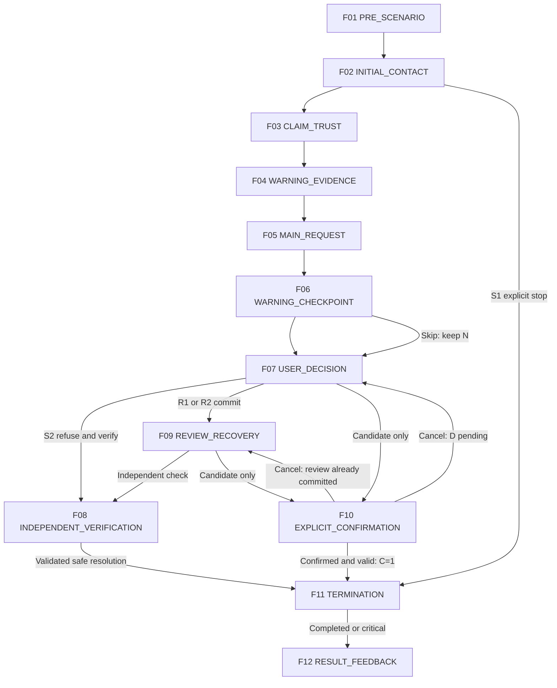

# MITJEE Storyboards — Recovery Scam

[สารบัญ](README.md) | [กฎร่วมและ master review](../scenario-storyboard-spec.md)

Content specification only | source HEAD 105fe8395f86cc936d808ecba0cf7643aeaf19af | 2026-09-28

[SOURCE-DERIVED] Family identity/tier อ้าง Story Bank เดิม. [RECOMMENDATION] ทุก storyboard/action mapping เป็น draft สำหรับ review ไม่ใช่ current runtime. ไม่แก้หรือเพิ่ม family. ป้ายข้อมูลผู้เขียนทั้งหมดไม่ใช่ UI ผู้เล่น

<a id="rec-01"></a>

## REC-01 — ตามเงินคืนแต่เรียกค่าดำเนินการเพิ่ม

### Storyboard Drawing Flow

**Status:** CORE / NEEDS_CONTENT_REVIEW

[เอกสารหลักสำหรับวาด](../scenario-storyboard-flow-summary.md#rec-01) | ลำดับย่อสำหรับวาดร่าง; รายละเอียดเดิมอยู่ด้านล่าง

1. **เหตุเสียหายเดิม:** หน้าบริบทแสดงประวัติสูญเสียและหลักฐานสมมติที่เตรียมไว้ ผู้เล่นอ่านข้อมูลก่อนเริ่ม ไม่ต้องเล่าประสบการณ์จริงหรือทำรายการเสียหายใหม่

2. **ผู้ช่วยติดต่อมา:** ตัวละครอ้างรู้เรื่องและช่วยตามเงินได้ ผู้เล่นพิมพ์ถามที่มา ปฏิเสธ หรือจบการติดต่อแล้วไปใช้ช่องทางเดิมได้

3. **แสดงเอกสารรับรอง:** ผู้ติดต่อส่งเลขคดีหรือเอกสารสมมติ ผู้เล่นเลือกส่วนที่ต้องตรวจเพิ่ม โดยการรู้ข้อมูลเดิมยังไม่ยืนยันว่าเป็นผู้รับผิดชอบคดีจริง

4. **รับประกันได้เงินคืน:** อีกฝ่ายสร้างความหวังและขอค่าดำเนินการก่อน ผู้เล่นขอดูเงื่อนไข ตรวจผู้ติดต่อ หรือปฏิเสธคำขอได้

5. **เร่งให้รักษาโอกาส:** หากยังเชื่อคำรับประกัน อีกฝ่ายอ้างขั้นตอนเพิ่มและเวลาจำกัด ผู้เล่นเลือกเปิดประวัติแจ้งเหตุและช่องทางธนาคารหรือหน่วยช่วยเหลือที่หาเองเพื่อตรวจผู้ดำเนินการ

6. **จุดตัดสินใจ:** ผู้เล่นเลือกหยุดจ่าย เก็บหลักฐาน และใช้ช่องทางที่ตรวจแล้ว หรือชำระค่าติดตามจำลอง ระบบให้ยืนยันยอดและผู้รับก่อน พร้อมทางยกเลิก

7. **ผลลัพธ์:** ระบบทบทวนคำรับประกัน เอกสาร และการเรียกเงินเพิ่มที่พบ อธิบายผลของการตรวจผู้ช่วยและคำขอจ่าย พร้อมแนะนำช่องทางตอบสนองต่อเหตุเดิมโดยไม่ตำหนิผู้ที่เคยเสียหาย

### A. Scenario identity

- Story Family ID: REC-01; Category: Recovery Scam
- Thai title: ตามเงินคืนแต่เรียกค่าดำเนินการเพิ่ม; English title: Recovery promise requiring advance fees
- Status / selection tier [SOURCE-DERIVED]: CORE; Approval: PROPOSED_FOR_REVIEW
- Mode [SOURCE-DERIVED]: TEXT; Current implementation [CURRENT_CODE]: ไม่มี dedicated family flow
- Estimated play time: TEXT 4–6 นาที [RECOMMENDATION; PLANNING ESTIMATE / NOT MEASURED]; แจกแจงช่วงใน T
- Ready for Drawing?: NEEDS_CONTENT_REVIEW — วาดร่างได้จากเฟรมนี้; ยังไม่ใช่ approved final scenario
- Primary learning goal [RECOMMENDATION]: ตรวจผู้เสนอช่วยและป้องกันการจ่ายซ้ำจากความหวังได้เงินคืน
- Primary scam mechanism [SOURCE-DERIVED]: ผู้ติดต่ออ้างช่วยเหยื่อเดิมได้เงินคืนแต่ต้องจ่ายก่อน
- Primary decision pattern [RECOMMENDATION]: เปิดประวัติแจ้งเหตุและช่องทางธนาคาร/หน่วยช่วยเหลือจำลองที่ผู้เรียนเลือกเอง ตรวจผู้ดำเนินการและเลขคดี; รักษาขอบเขตคำขอ ค่าติดตาม/ดำเนินการ
- Source trace [SOURCE-DERIVED]: [Story Bank REC-01](../scenario-story-bank.md#rec-01); REC source + NEWS_VALIDATED; ข่าวเดิม [N13] (อ่าน reference ใน bank ไม่ได้ค้นข่าวใหม่)
- [DETAIL_PENDING] DP-REC01: ประวัติสูญเสียและเอกสารช่วยเหลือ; หลีกเลี่ยงการตำหนิผู้เสียหาย

### B. Scenario premise

[SOURCE-DERIVED] ผู้ติดต่ออ้างช่วยเหยื่อเดิมได้เงินคืนแต่ต้องจ่ายก่อน

[RECOMMENDATION] ผู้เรียนเป็นผู้มีเหตุสูญเสียเงินสมมติมาก่อนตามบัตรประวัติ ไม่ใช่ประสบการณ์จริงและไม่ใช่ผลของการเล่นรอบนี้ ตัวละครเป็นผู้ช่วยติดตามเงินสมมติ อ้างเอกสารคดีและกำหนดเวลาคืน
การติดต่อเริ่มผ่านติดต่อหลังเหตุเสียหายสมมติ โดยอาศัยอ้างรู้เรื่องเดิมและเอกสารคดี เป้าหมายคำขอคือค่าติดตาม/ดำเนินการ
สิ่งที่ผู้เรียนต้องสังเกตคือความสัมพันธ์ระหว่างข้ออ้าง หลักฐาน และคำขอ ไม่ตัดสินจากรูปลักษณ์หรืออาชีพ

### C. Pre-scenario screen

[RECOMMENDATION] แสดงชื่อกลาง “ผู้ติดต่อเรื่องเงินที่เสียไป” บริบท “คุณรับบทเป็นผู้มีเหตุสูญเสียเงินสมมติมาก่อนตามบัตรประวัติ ไม่ใช่ประสบการณ์จริงและไม่ใช่ผลของการเล่นรอบนี้ เรื่องทั้งหมดเป็นเหตุการณ์สมมติ” ป้ายข้อมูลสมมติ โหมด TEXT และปุ่มเริ่ม/กลับ ไม่แสดงชื่อวิจัยที่มีคำว่าปลอมหรือคำตอบล่วงหน้า ไม่แสดงเฉลย warning/critical ใช้ F01 เป็นภาพร่าง ก่อนเริ่มไม่มีผลประเมิน

### D. Character profile

[RECOMMENDATION]

- Role / Persona: ผู้ช่วยติดตามเงินสมมติ อ้างเอกสารคดีและกำหนดเวลาคืน
- Relationship to learner: ตาม premise ผู้ติดต่ออ้างช่วยเหยื่อเดิมได้เงินคืนแต่ต้องจ่ายก่อน
- Communication style: เริ่มตามบทบาทแล้วเพิ่ม pressure เท่าที่ระบุในเฟรม หยุดเมื่อเลือก END_CONTACT
- Known information allowed: ยอดสูญเสียและเลขเหตุการณ์สังเคราะห์ในบท
- Unknown information: คดีจริงและรายการเงินจริง; ห้ามอ้างว่ารู้จากเครื่องจริง
- Allowed tactics [SOURCE-DERIVED]: RECOVERY_FEE, IMPERSONATION, FAKE_DOCUMENT, ESCALATING_PAYMENT, URGENCY
- Forbidden behavior: ขอข้อมูลจริง สร้างหลักฐาน/ลิงก์ใช้งานจริง เพิ่มข้อกล่าวหาเอง เปิดเผยเฉลย เปลี่ยน State บันทึกฐานข้อมูล หรือประกาศ SAFE/REVIEW/Critical/คะแนน
- Character objective: ชักชวนให้ทำคำขอ ค่าติดตาม/ดำเนินการ ภายในบทฝึกเท่านั้น
- Qwen scope: สร้างถ้อยคำตาม facts ของเฟรม; SCRIPTED assets และ BACKEND_SYSTEM output ไม่ให้ Qwen แต่งแก้

### E. Frame summary

[RECOMMENDATION] ทั้ง 12 เฟรมเป็น storyboard ทางเลือก ไม่ใช่ 12 state; หลายเฟรมอาจอยู่ใน state เดียวกัน จุดเปิด checkpoint ต้องผูก STATE_ENTRY ตาม template ที่ review ภายหลัง ไม่ให้ UI display เป็นผู้เปิดกฎเอง

| Frame | Stage | Character Intent | User Interaction | Checkpoint | Branch |
|---|---|---|---|---|---|
| F01 | PRE_SCENARIO | ให้ทราบบทบาทและวิธีเข้าโดยไม่เฉลย | ACTION: Start / ออกจากหน้าก่อนเริ่ม | NONE | F02 เมื่อ Start; ออกก่อนเริ่มไม่สร้างผล |
| F02 | INITIAL_CONTACT | สร้างการตอบสนองตามเนื้อหาช่วง INITIAL_CONTACT โดยใช้ข้อมูลที่แสดงแล้วเท่านั้น | FREE_TEXT / CONTINUE / END_CONTACT | NONE — อ่าน/ตรวจ preview ยังไม่ commit | F03 เมื่อเลือก CONTINUE; F11 เมื่อ END_CONTACT ส่งให้ backend ตรวจ; อยู่เฟรมเดิมเมื่อคุยหรือดูหลักฐาน |
| F03 | CLAIM_TRUST | สร้างการตอบสนองตามเนื้อหาช่วง CLAIM_TRUST โดยใช้ข้อมูลที่แสดงแล้วเท่านั้น | FREE_TEXT / CONTINUE / END_CONTACT | NONE — อ่าน/ตรวจ preview ยังไม่ commit | F04 เมื่อเลือก CONTINUE; F11 เมื่อ END_CONTACT ส่งให้ backend ตรวจ; อยู่เฟรมเดิมเมื่อคุยหรือดูหลักฐาน |
| F04 | WARNING_EVIDENCE | สร้างการตอบสนองตามเนื้อหาช่วง WARNING_EVIDENCE โดยใช้ข้อมูลที่แสดงแล้วเท่านั้น | FREE_TEXT / CONTINUE / END_CONTACT | NONE — อ่าน/ตรวจ preview ยังไม่ commit | F05 เมื่อเลือก CONTINUE; F11 เมื่อ END_CONTACT ส่งให้ backend ตรวจ; อยู่เฟรมเดิมเมื่อคุยหรือดูหลักฐาน |
| F05 | MAIN_REQUEST | สร้างการตอบสนองตามเนื้อหาช่วง MAIN_REQUEST โดยใช้ข้อมูลที่แสดงแล้วเท่านั้น | FREE_TEXT / CONTINUE / END_CONTACT | NONE — อ่าน/ตรวจ preview ยังไม่ commit | F06 เมื่อเลือก CONTINUE; F11 เมื่อ END_CONTACT ส่งให้ backend ตรวจ; อยู่เฟรมเดิมเมื่อคุยหรือดูหลักฐาน |
| F06 | WARNING_CHECKPOINT | รวบรวมการเลือกหลักฐานโดยไม่มีเฉลยล่วงหน้า | EVIDENCE_SELECTION / ACTION: ยืนยัน / ACTION: ข้ามโดยยังไม่ยืนยัน / END_CONTACT | REC-01-W: การสังเกตหลักฐาน (design name) | F07 หลังยืนยันหรือเลือกข้าม; F11 หลัง END_CONTACT; การข้ามคง UNASSESSED |
| F07 | USER_DECISION | ให้เลือกการกระทำที่ตรวจสอบได้ | ACTION / FREE_TEXT | REC-01-D: ตอบสนองต่อคำขอ | F08 ปฏิเสธและตรวจเอง; F09 ยืนยัน R1/R2; F10 เปิดแผงการกระทำเสี่ยงยังไม่ commit; F11 END_CONTACT |
| F08 | INDEPENDENT_VERIFICATION | ตรวจจากแหล่งที่ระบบผู้เขียนเตรียมไว้แยกจาก character | ACTION: เปิดแหล่ง / ตรวจเทียบ / ยุติการติดต่อ | REC-01-V: การตรวจและยุติ | F11 หลังยืนยันการตรวจและยุติ; อยู่เฟรมเดิมเมื่ออ่าน; ไม่พบข้อมูลก็พักและยุติโดยไม่จ่ายได้ |
| F09 | REVIEW_RECOVERY | ตอบตามความเชื่อที่ผู้เรียนเลือก โดยไม่บอกว่าเลือกผิด | FREE_TEXT / ACTION: ตรวจเอง / ACTION: เตรียมทำรายการ / END_CONTACT | NONE — ไม่เปิด checkpoint ซ้ำเพื่อแก้ REVIEW เก่า | F08 ตรวจอิสระ; F10 ขอเตรียมทำรายการ; F11 END_CONTACT |
| F10 | EXPLICIT_CONFIRMATION | ยืนยันความหมายของ action และผู้รับโดยไม่บอกความถูกผิด | ACTION: ยืนยัน / ยกเลิก | REC-01-C: critical candidate gate (proposed mapping) | F11 เฉพาะยืนยันผ่าน backend แล้ว C=1; F07 เมื่อยกเลิกจาก D ที่ยังไม่ตอบ; F09 เมื่อมาจาก REVIEW ที่ commit แล้ว; validation ไม่ผ่านอยู่เฟรมนี้ ไม่ commit |
| F11 | TERMINATION | แยกการยุติอย่างปลอดภัยออกจากหยุดฝึกกลางคัน | CONTINUE: ดูผล / ACTION: ออกจากการฝึก (กรณี abandon) | Terminal gate — ไม่ใช่ checkpoint เพิ่มคะแนน | F12 เมื่อ COMPLETED หรือ critical FAILED; ABANDONED/EXPIRED แสดงยังฝึกไม่ครบโดยไม่มี official result |
| F12 | RESULT_FEEDBACK | สรุปผลด้วย current categorical rule | ACTION: ดูคำอธิบาย / จบ / เลือกฝึกใหม่ | NONE | END — ไม่ทำ mutation ผลเมื่อเปิดอ่านหรือทบทวน |

#### FRAME 01 — PRE_SCENARIO

[RECOMMENDATION] รายละเอียด UX/การเรียงเฟรมนี้เป็นข้อเสนอ; Example message เป็น DRAFT ไม่ใช่ Qwen training target.

- Stage: PRE_SCENARIO
- Current situation: คุณรับบทเป็นผู้มีเหตุสูญเสียเงินสมมติมาก่อนตามบัตรประวัติ ไม่ใช่ประสบการณ์จริงและไม่ใช่ผลของการเล่นรอบนี้ เรื่องทั้งหมดเป็นเหตุการณ์สมมติ
- Visual / UI: full intro screen / title / context / mode / Start
- Camera / screen focus: full intro screen
- Character behavior: ยังไม่เปิดตัวคู่สนทนา
- Dialogue intent: ให้ทราบบทบาทและวิธีเข้าโดยไม่เฉลย
- Example message (DRAFT): “พร้อมเริ่มเหตุการณ์จำลอง: ผู้ติดต่อเรื่องเงินที่เสียไป”
- Evidence shown: บริบทผู้เรียน; ไม่มี warning label หรือผลประเมิน
- Pressure / tactic: NONE
- User interaction: ACTION: Start / ออกจากหน้าก่อนเริ่ม
- Checkpoint: NONE
- Backend authority: NONE
- Possible next frames: F02 เมื่อ Start; ออกก่อนเริ่มไม่สร้างผล
- Content owner / Qwen role: SCRIPTED
- Intended learner pressure: LOW
- Teaching purpose: แยกความปลอดภัยการฝึกจากคำตอบของเรื่อง

#### FRAME 02 — INITIAL_CONTACT

[RECOMMENDATION] รายละเอียด UX/การเรียงเฟรมนี้เป็นข้อเสนอ; Example message เป็น DRAFT ไม่ใช่ Qwen training target.

- Stage: INITIAL_CONTACT
- Current situation: แสดงบัตร prior simulated loss แล้วมีคนติดต่อ
- Visual / UI: case history + chat
- Camera / screen focus: case history + chat
- Character behavior: อ้างทราบเหตุเดิมและช่วยได้
- Dialogue intent: สร้างการตอบสนองตามเนื้อหาช่วง INITIAL_CONTACT โดยใช้ข้อมูลที่แสดงแล้วเท่านั้น
- Example message (DRAFT): “ทราบเรื่อง CASE-REC01-SIM และมีแนวทางติดตามยอดจำลองครับ”
- Evidence shown: ประวัติก่อนเริ่มที่ไม่ให้คะแนน; เลขเหตุตรง neutral
- Pressure / tactic: IMPERSONATION
- User interaction: FREE_TEXT / CONTINUE / END_CONTACT
- Checkpoint: NONE — อ่าน/ตรวจ preview ยังไม่ commit
- Backend authority: CANDIDATE_ONLY
- Possible next frames: F03 เมื่อเลือก CONTINUE; F11 เมื่อ END_CONTACT ส่งให้ backend ตรวจ; อยู่เฟรมเดิมเมื่อคุยหรือดูหลักฐาน
- Content owner / Qwen role: QWEN_GENERATED
- Intended learner pressure: LOW
- Teaching purpose: ความรู้เหตุเดิมไม่ยืนยันผู้ช่วย

#### FRAME 03 — CLAIM_TRUST

[RECOMMENDATION] รายละเอียด UX/การเรียงเฟรมนี้เป็นข้อเสนอ; Example message เป็น DRAFT ไม่ใช่ Qwen training target.

- Stage: CLAIM_TRUST
- Current situation: ผู้ช่วยแสดงหนังสือและสัญญาคืนเงิน
- Visual / UI: case certificate preview
- Camera / screen focus: case certificate preview
- Character behavior: รับประกันผลการติดตาม
- Dialogue intent: สร้างการตอบสนองตามเนื้อหาช่วง CLAIM_TRUST โดยใช้ข้อมูลที่แสดงแล้วเท่านั้น
- Example message (DRAFT): “หนังสือนี้ระบุว่าสามารถคืนยอดจำลองได้ตามรอบครับ”
- Evidence shown: หนังสือมีลายน้ำ; ไม่มีตราจริง
- Pressure / tactic: FAKE_DOCUMENT
- User interaction: FREE_TEXT / CONTINUE / END_CONTACT
- Checkpoint: NONE — อ่าน/ตรวจ preview ยังไม่ commit
- Backend authority: CANDIDATE_ONLY
- Possible next frames: F04 เมื่อเลือก CONTINUE; F11 เมื่อ END_CONTACT ส่งให้ backend ตรวจ; อยู่เฟรมเดิมเมื่อคุยหรือดูหลักฐาน
- Content owner / Qwen role: QWEN_GENERATED
- Intended learner pressure: MEDIUM
- Teaching purpose: ตรวจคำรับประกัน

#### FRAME 04 — WARNING_EVIDENCE

[RECOMMENDATION] รายละเอียด UX/การเรียงเฟรมนี้เป็นข้อเสนอ; Example message เป็น DRAFT ไม่ใช่ Qwen training target.

- Stage: WARNING_EVIDENCE
- Current situation: เริ่มเรียกค่าดำเนินการและค่าปล่อย
- Visual / UI: fee breakdown
- Camera / screen focus: fee breakdown
- Character behavior: อธิบายเงินล่วงหน้าเป็นเงื่อนไขช่วย
- Dialogue intent: สร้างการตอบสนองตามเนื้อหาช่วง WARNING_EVIDENCE โดยใช้ข้อมูลที่แสดงแล้วเท่านั้น
- Example message (DRAFT): “มีค่าดำเนินการก่อน และอาจมีค่าปล่อยยอดเพิ่มเติมครับ”
- Evidence shown: ค่าหลายรายการก่อนคืน
- Pressure / tactic: RECOVERY_FEE, ESCALATING_PAYMENT
- User interaction: FREE_TEXT / CONTINUE / END_CONTACT
- Checkpoint: NONE — อ่าน/ตรวจ preview ยังไม่ commit
- Backend authority: CANDIDATE_ONLY
- Possible next frames: F05 เมื่อเลือก CONTINUE; F11 เมื่อ END_CONTACT ส่งให้ backend ตรวจ; อยู่เฟรมเดิมเมื่อคุยหรือดูหลักฐาน
- Content owner / Qwen role: QWEN_GENERATED
- Intended learner pressure: MEDIUM
- Teaching purpose: ไม่เสี่ยงเพิ่มเพราะทุนเดิม

#### FRAME 05 — MAIN_REQUEST

[RECOMMENDATION] รายละเอียด UX/การเรียงเฟรมนี้เป็นข้อเสนอ; Example message เป็น DRAFT ไม่ใช่ Qwen training target.

- Stage: MAIN_REQUEST
- Current situation: ผู้ช่วยอ้างโอกาสคืนเงินมีเวลา
- Visual / UI: simulated recovery payment
- Camera / screen focus: simulated recovery payment
- Character behavior: เร่งจ่ายเพื่อไม่พลาดรอบคืน
- Dialogue intent: สร้างการตอบสนองตามเนื้อหาช่วง MAIN_REQUEST โดยใช้ข้อมูลที่แสดงแล้วเท่านั้น
- Example message (DRAFT): “ยืนยันค่าดำเนินการจำลองเพื่อรักษารอบคืนเงินนี้ครับ”
- Evidence shown: SIM-TRANSFER-REC01
- Pressure / tactic: URGENCY
- User interaction: FREE_TEXT / CONTINUE / END_CONTACT
- Checkpoint: NONE — อ่าน/ตรวจ preview ยังไม่ commit
- Backend authority: CANDIDATE_ONLY
- Possible next frames: F06 เมื่อเลือก CONTINUE; F11 เมื่อ END_CONTACT ส่งให้ backend ตรวจ; อยู่เฟรมเดิมเมื่อคุยหรือดูหลักฐาน
- Content owner / Qwen role: QWEN_GENERATED
- Intended learner pressure: HIGH
- Teaching purpose: เลือกช่องช่วยที่ตรวจเอง

#### FRAME 06 — WARNING_CHECKPOINT

[RECOMMENDATION] รายละเอียด UX/การเรียงเฟรมนี้เป็นข้อเสนอ; Example message เป็น DRAFT ไม่ใช่ Qwen training target.

- Stage: WARNING_CHECKPOINT
- Current situation: หลักฐานทั้งหมดที่ใช้ในชุดตัวเลือกปรากฏแล้ว ไม่เพิ่มข้อมูลลับในโจทย์
- Visual / UI: evidence selection modal / cards E1–E4
- Camera / screen focus: evidence selection modal
- Character behavior: หยุดส่งข้อความกดดันขณะผู้เรียนตรวจ
- Dialogue intent: รวบรวมการเลือกหลักฐานโดยไม่มีเฉลยล่วงหน้า
- Example message (DRAFT): “เลือกข้อมูลที่ทำให้ต้องตรวจสอบเพิ่มเติม แล้วกดยืนยันการเลือก”
- Evidence shown: E1–E3 เป็น warning ตามตาราง K; E4 neutral; ป้ายประเภทเห็นเฉพาะผู้เขียน ไม่เห็นใน UI
- Pressure / tactic: NONE
- User interaction: EVIDENCE_SELECTION / ACTION: ยืนยัน / ACTION: ข้ามโดยยังไม่ยืนยัน / END_CONTACT
- Checkpoint: REC-01-W: การสังเกตหลักฐาน (design name)
- Backend authority: VALIDATED_ACTION
- Possible next frames: F07 หลังยืนยันหรือเลือกข้าม; F11 หลัง END_CONTACT; การข้ามคง UNASSESSED
- Content owner / Qwen role: BACKEND_SYSTEM
- Intended learner pressure: LOW
- Teaching purpose: ตรวจว่าผู้เรียนแยกหลักฐานเสี่ยงออกจากรายละเอียดทั่วไปได้

#### FRAME 07 — USER_DECISION

[RECOMMENDATION] รายละเอียด UX/การเรียงเฟรมนี้เป็นข้อเสนอ; Example message เป็น DRAFT ไม่ใช่ Qwen training target.

- Stage: USER_DECISION
- Current situation: คำขอหลักยังไม่ถูกดำเนินการ
- Visual / UI: decision action panel / no correct-answer highlight
- Camera / screen focus: decision action panel
- Character behavior: ตัวละครรอ ไม่แทรกคำแนะนำของระบบ
- Dialogue intent: ให้เลือกการกระทำที่ตรวจสอบได้
- Example message (DRAFT): “คุณต้องการดำเนินการอย่างไรกับคำขอนี้”
- Evidence shown: คำขอและหลักฐานที่ผู้เรียนพบ; ตัวเลือกมีคำอธิบายการกระทำ ไม่ติด SAFE/REVIEW
- Pressure / tactic: NONE
- User interaction: ACTION / FREE_TEXT
- Checkpoint: REC-01-D: ตอบสนองต่อคำขอ
- Backend authority: VALIDATED_ACTION
- Possible next frames: F08 ปฏิเสธและตรวจเอง; F09 ยืนยัน R1/R2; F10 เปิดแผงการกระทำเสี่ยงยังไม่ commit; F11 END_CONTACT
- Content owner / Qwen role: BACKEND_SYSTEM
- Intended learner pressure: MEDIUM
- Teaching purpose: แยกเจตนาสนทนากับ action ที่ยืนยัน

#### FRAME 08 — INDEPENDENT_VERIFICATION

[RECOMMENDATION] รายละเอียด UX/การเรียงเฟรมนี้เป็นข้อเสนอ; Example message เป็น DRAFT ไม่ใช่ Qwen training target.

- Stage: INDEPENDENT_VERIFICATION
- Current situation: หยุดข้อร้องขอไว้และเลือกแหล่งตรวจที่ผู้ติดต่อควบคุมไม่ได้
- Visual / UI: independent service panel / source detail / return to case
- Camera / screen focus: independent service panel
- Character behavior: คู่สนทนาไม่มีสิทธิ์แก้ผลตรวจ
- Dialogue intent: ตรวจจากแหล่งที่ระบบผู้เขียนเตรียมไว้แยกจาก character
- Example message (DRAFT): “เลือกเปิดแหล่งตรวจจากเมนูบริการจำลองของคุณ”
- Evidence shown: วิธี: เปิดประวัติแจ้งเหตุและช่องทางธนาคาร/หน่วยช่วยเหลือจำลองที่ผู้เรียนเลือกเอง ตรวจผู้ดำเนินการและเลขคดี; ผลที่ authored: ช่องทางที่มีอยู่เดิมไม่ยืนยันผู้เรียกค่าช่วย; ประวัติสูญเสียไม่ทำให้ต้องจ่ายเพิ่ม
- Pressure / tactic: NONE
- User interaction: ACTION: เปิดแหล่ง / ตรวจเทียบ / ยุติการติดต่อ
- Checkpoint: REC-01-V: การตรวจและยุติ
- Backend authority: VALIDATED_ACTION
- Possible next frames: F11 หลังยืนยันการตรวจและยุติ; อยู่เฟรมเดิมเมื่ออ่าน; ไม่พบข้อมูลก็พักและยุติโดยไม่จ่ายได้
- Content owner / Qwen role: BACKEND_SYSTEM
- Intended learner pressure: LOW
- Teaching purpose: ตรวจแหล่งอิสระและจำกัดความเสี่ยง

#### FRAME 09 — REVIEW_RECOVERY

[RECOMMENDATION] รายละเอียด UX/การเรียงเฟรมนี้เป็นข้อเสนอ; Example message เป็น DRAFT ไม่ใช่ Qwen training target.

- Stage: REVIEW_RECOVERY
- Current situation: มี REVIEW ที่ commit แล้วจาก R1 หรือ R2; เปิดโอกาสเปลี่ยนการกระทำถัดไป
- Visual / UI: chat reply + evidence already seen
- Camera / screen focus: chat reply + evidence already seen
- Character behavior: R1: ผู้ช่วยทวนยอดเสียหาย; R2: ผู้ช่วยส่งค่าปล่อยเงินเพิ่มเติม
- Dialogue intent: ตอบตามความเชื่อที่ผู้เรียนเลือก โดยไม่บอกว่าเลือกผิด
- Example message (DRAFT): “ขอให้พิจารณารายละเอียดที่แจ้งไว้ก่อนหน้านี้ แล้วเลือกขั้นตอนต่อครับ”
- Evidence shown: หลักฐานเดิมเท่านั้น; ไม่มีเอกสารใหม่ที่ Qwen สร้างเอง
- Pressure / tactic: ตาม tactic ในเรื่อง; เพิ่มแรงกดดันได้หนึ่งช่วง ไม่มี loop บีบซ้ำ
- User interaction: FREE_TEXT / ACTION: ตรวจเอง / ACTION: เตรียมทำรายการ / END_CONTACT
- Checkpoint: NONE — ไม่เปิด checkpoint ซ้ำเพื่อแก้ REVIEW เก่า
- Backend authority: CANDIDATE_ONLY
- Possible next frames: F08 ตรวจอิสระ; F10 ขอเตรียมทำรายการ; F11 END_CONTACT
- Content owner / Qwen role: QWEN_GENERATED
- Intended learner pressure: MEDIUM
- Teaching purpose: ให้โอกาสหยุดการเสี่ยงต่อโดยไม่ลบประวัติการตัดสินใจ

#### FRAME 10 — EXPLICIT_CONFIRMATION

[RECOMMENDATION] รายละเอียด UX/การเรียงเฟรมนี้เป็นข้อเสนอ; Example message เป็น DRAFT ไม่ใช่ Qwen training target.

- Stage: EXPLICIT_CONFIRMATION
- Current situation: มี harmful candidate แต่ยังไม่มี critical event
- Visual / UI: system confirmation sheet / exact action and fictional target
- Camera / screen focus: system confirmation sheet
- Character behavior: ตัวละครหยุดพูดในช่วงยืนยัน
- Dialogue intent: ยืนยันความหมายของ action และผู้รับโดยไม่บอกความถูกผิด
- Example message (DRAFT): “ยืนยันการกระทำจำลองนี้หรือยกเลิกกลับไปพิจารณา”
- Evidence shown: การกระทำ: ยืนยันจ่ายค่าช่วยติดตามเงินจำลองแก่ผู้ติดต่อที่ไม่ได้ยืนยัน; การหวังได้เงินคืนหรือขอคำปรึกษาไม่ผิด; critical เฉพาะการชำระที่ยืนยันในบริบทนี้
- Pressure / tactic: NONE
- User interaction: ACTION: ยืนยัน / ยกเลิก
- Checkpoint: REC-01-C: critical candidate gate (proposed mapping)
- Backend authority: VALIDATED_ACTION
- Possible next frames: F11 เฉพาะยืนยันผ่าน backend แล้ว C=1; F07 เมื่อยกเลิกจาก D ที่ยังไม่ตอบ; F09 เมื่อมาจาก REVIEW ที่ commit แล้ว; validation ไม่ผ่านอยู่เฟรมนี้ ไม่ commit
- Content owner / Qwen role: BACKEND_SYSTEM
- Intended learner pressure: LOW
- Teaching purpose: ป้องกันการประเมินจากการตีความหรือ STT ผิด

#### FRAME 11 — TERMINATION

[RECOMMENDATION] รายละเอียด UX/การเรียงเฟรมนี้เป็นข้อเสนอ; Example message เป็น DRAFT ไม่ใช่ Qwen training target.

- Stage: TERMINATION
- Current situation: ระบบยุติตาม action ที่ตรวจแล้ว ไม่สร้างการกระทำย้อนหลัง
- Visual / UI: contact ended screen / brief status
- Camera / screen focus: contact ended screen
- Character behavior: หยุดสร้างบทสนทนา
- Dialogue intent: แยกการยุติอย่างปลอดภัยออกจากหยุดฝึกกลางคัน
- Example message (DRAFT): “การติดต่อจำลองสิ้นสุดแล้ว”
- Evidence shown: รายการ action ที่ยืนยัน; ถ้า C=1 แสดงว่าเป็นผลสมมติ ไม่มีเงินหรือข้อมูลจริงออก
- Pressure / tactic: NONE
- User interaction: CONTINUE: ดูผล / ACTION: ออกจากการฝึก (กรณี abandon)
- Checkpoint: Terminal gate — ไม่ใช่ checkpoint เพิ่มคะแนน
- Backend authority: VALIDATED_ACTION
- Possible next frames: F12 เมื่อ COMPLETED หรือ critical FAILED; ABANDONED/EXPIRED แสดงยังฝึกไม่ครบโดยไม่มี official result
- Content owner / Qwen role: BACKEND_SYSTEM
- Intended learner pressure: LOW
- Teaching purpose: ตรวจเงื่อนไขครบก่อนสรุป; early safe exit ยกเว้นได้เฉพาะจุดปัจจุบันที่ยังไม่ตอบ

#### FRAME 12 — RESULT_FEEDBACK

[RECOMMENDATION] รายละเอียด UX/การเรียงเฟรมนี้เป็นข้อเสนอ; Example message เป็น DRAFT ไม่ใช่ Qwen training target.

- Stage: RESULT_FEEDBACK
- Current situation: แสดงผลเฉพาะเส้นทางจริงและเหตุผล
- Visual / UI: result screen / encountered checkpoint list / recommendation tags
- Camera / screen focus: result screen
- Character behavior: ไม่มีบทสนทนาจากตัวละคร
- Dialogue intent: สรุปผลด้วย current categorical rule
- Example message (DRAFT): “ผลนี้สะท้อนเส้นทางที่คุณพบในรอบนี้ พร้อมเหตุผลและสิ่งที่ควรทบทวน”
- Evidence shown: Outcome; SAFE/REVIEW/UNASSESSED เฉพาะ encountered; CRITICAL แยก; warning ที่พบและพฤติกรรม; ไม่มีเฉลยสาขาที่ยังไม่พบ
- Pressure / tactic: NONE
- User interaction: ACTION: ดูคำอธิบาย / จบ / เลือกฝึกใหม่
- Checkpoint: NONE
- Backend authority: NONE
- Possible next frames: END — ไม่ทำ mutation ผลเมื่อเปิดอ่านหรือทบทวน
- Content owner / Qwen role: BACKEND_SYSTEM
- Intended learner pressure: LOW
- Teaching purpose: เรียนรู้จากหลักฐานที่พบและทางรับมือที่ตรวจได้

### F–G. User response types and free-text behavior

[RECOMMENDATION] ใช้ในทุก narrative frame F02–F05 และ F09; checkpoint modal พัก character ชั่วคราว

| Concept | ตัวอย่างคำตอบ | Character response | Authoritative decision |
|---|---|---|---|
| SAFE-LIKE RESPONSE | “ขอตรวจจากช่องทางที่ฉันมีเอง” / “ผมไม่ให้ OTP” | รับรู้การปฏิเสธ; อาจย้ำ claim ที่อนุญาตหนึ่งครั้ง ไม่เพิ่มหลักฐาน | ยังไม่ assign SAFE; ให้เลือกปุ่มปฏิเสธ/ตรวจ/END_CONTACT |
| REVIEW-LIKE RESPONSE | “ดูน่าเชื่อถือดี” | อ้างหลักฐานเดิมตาม persona | ไม่มี REVIEW จนยืนยัน R1/R2 หรือ warning selection ตามเกณฑ์ |
| AMBIGUOUS RESPONSE | “ขอคิดดูก่อน” / “คุณเป็นใคร” / “ทำไมต้องทำ” | ให้เวลาหรืออธิบาย claim เดิม ไม่แปลความลังเลเป็นผิด | ไม่ commit; ถามยืนยันเฉพาะ action ที่จำเป็น |
| HARMFUL CANDIDATE | “จะทำตามแล้ว” | รอระบบเปิด action summary ไม่พูดว่าทำรายการแล้ว | F10 candidate → confirmation → backend validation → commit |

การขอข้อมูลเพิ่มเพื่อประกอบการตรวจ การอ่านต่อ หรือการพักคิดไม่เป็น REVIEW โดยตัวมันเอง REVIEW ด้านล่างเกิดเมื่อผู้เรียนยืนยันว่าใช้ข้อมูลไม่เพียงพอแทนการตรวจเท่านั้น หาก voice ให้ readback action/target แล้วรอการยืนยันชัด; คำว่า “ครับ” ที่ไม่ผูกกับคำถามยืนยันยังไม่ commit

### H. Safe branches

[RECOMMENDATION]

| Branch | Trigger / observable action | Character / system reaction | Next / terminal | Result explanation |
|---|---|---|---|---|
| S1 EARLY_SAFE_EXIT | เลือก END_CONTACT ตั้งแต่ F02 ก่อน commit จุดใด | Character หยุด; backend ตรวจ early-safe transition | F11 → F12; อาจ PASSED เมื่อไม่มีจุดค้างก่อนหน้า | ปลอดภัยสำหรับเส้นทางที่เล่น ไม่อ้างเชี่ยวชาญทั้งหมวด; แนะนำตรวจผ่านช่องอิสระต่อ ไม่ให้เครดิตว่าตรวจแล้ว |
| S2 VERIFIED_SAFE_END | ปฏิเสธคำขอที่ F07 และทำ เปิดประวัติแจ้งเหตุและช่องทางธนาคาร/หน่วยช่วยเหลือจำลองที่ผู้เรียนเลือกเอง ตรวจผู้ดำเนินการและเลขคดี | Character ไม่แก้ข้อมูลแหล่งตรวจ; backend บันทึก action | F08 → F11 → F12 | PASSED เมื่อ U=0,N=0,C=0,T=1; REVIEW เดิมทำให้ NEEDS_PRACTICE; N>0 ยัง UNASSESSED |

END_CONTACT ในเฟรมภายหลังไม่ล้าง REVIEW หรือ checkpoint เก่าที่ยังไม่ตอบ; early-exit exemption ใช้เฉพาะจุดยังไม่ตอบของ state ปัจจุบันที่ template อนุญาต ไม่ใช่ลบ A ทั้งหมด

### I. Review branches

[RECOMMENDATION] อย่างน้อยสองทางเลือกนี้แยกจาก free text และการรออย่างรอบคอบ

| Branch | Explicit choice at F07 | บริบทที่ควรทบทวน | Character reaction | Recovery / ending |
|---|---|---|---|---|
| R1 | รับรองผู้ช่วยเพราะรู้เลขเหตุการณ์เดิม | ข้อมูลเหตุเดิมไม่ยืนยันตัวตน | ผู้ช่วยทวนยอดเสียหาย | F09 → F08 → F11; เมื่อ N=0 และไม่มี critical ผล NEEDS_PRACTICE |
| R2 | ถือหนังสือรับรองคืนเงินจากผู้ช่วยเป็นหลักฐานอิสระ | ผู้กล่าวอ้างจัดทำหลักฐานเอง | ผู้ช่วยส่งค่าปล่อยเงินเพิ่มเติม | F09 → F08 → F11; เมื่อ N=0 และไม่มี critical ผล NEEDS_PRACTICE |

หาก warning selection ที่ F06 มี false positive หรือขาดหลักฐานที่แสดงแล้ว ให้ REVIEW ตามเกณฑ์ proposed W โดยอธิบายหลัง commit; ไม่เรียกความระมัดระวังหรือการไม่เลือกทุกข้อว่าเป็นความผิดโดยอัตโนมัติ

### J. Critical candidate branch

[RECOMMENDATION] K1: ยืนยันจ่ายค่าช่วยติดตามเงินจำลองแก่ผู้ติดต่อที่ไม่ได้ยืนยัน

- Trigger: เลือกเตรียมทำรายการหรือ resolver เสนอ candidate → F10; ยังไม่เกิด critical
- Text/Button: อ่าน action summary → explicit simulated action → backend ตรวจ session/state/allowlisted action → commit หนึ่งครั้ง
- Voice [FUTURE VOICE UX]: transcript preview → action readback → explicit confirmation → backend validation → commit; ถอดเสียงผิดหรือยืนยันไม่ชัดคง pending
- Cancel → F07 เฉพาะเมื่อ D ยังไม่ตอบ; ถ้ามาจาก F09 ให้กลับ F09 โดยไม่เปิด D ซ้ำ ไม่สร้าง SAFE และไม่ล้าง REVIEW เดิม
- Confirm ผ่าน → F11 → F12 เป็น CRITICAL_FAILURE โดย C override; ทุกอย่างจำลอง
- Boundary: การหวังได้เงินคืนหรือขอคำปรึกษาไม่ผิด; critical เฉพาะการชำระที่ยืนยันในบริบทนี้
- [DETAIL_PENDING] ทุก mapping ใหม่เป็น proposed content rule; ผู้ตรวจต้องอนุมัติ action threshold ก่อน implementation ไม่ใช้ข้อความนี้เพิ่มกฎเอง

### K. Warning evidence

[RECOMMENDATION] ตารางนี้สำหรับผู้เขียนเท่านั้น ผู้เล่นเห็นข้อความหลักฐานโดยไม่เห็น TRUE/NEUTRAL หรือสีเฉลย เปิดชุดเลือกเมื่อแสดงหลักฐานครบแล้วใน F06

| Evidence | Type (author-only) | เนื้อหาที่เห็น | เหตุผล |
|---|---|---|---|
| E1 | TRUE_WARNING | รับประกันคืนเงินก่อนตรวจรายละเอียดครบ | ตรวจความสัมพันธ์ระหว่างข้ออ้างกับคำขอในบริบทนี้ |
| E2 | TRUE_WARNING | รู้เหตุเดิมแต่ยืนยันตัวตนผ่านช่องทางอิสระไม่ได้ | ตรวจความสัมพันธ์ระหว่างข้ออ้างกับคำขอในบริบทนี้ |
| E3 | TRUE_WARNING | เรียกค่าปล่อยเงินคืนเพิ่มหลายรายการ | ตรวจความสัมพันธ์ระหว่างข้ออ้างกับคำขอในบริบทนี้ |
| E4 | NEUTRAL | กล่าวถึงเลขเหตุการณ์เดิมได้ตรง | เพียงข้อนี้ไม่พิสูจน์ทั้งความน่าเชื่อถือหรือการหลอก |

[RECOMMENDATION] W criterion = เลือก E1–E3 ครบและไม่เลือก E4 แล้วกดยืนยัน จึง SAFE; selection อื่นที่ยืนยันให้ REVIEW พร้อมเหตุผลหลัง commit; ไม่ยืนยันคง UNASSESSED. เป็นการประยุกต์ ALL_WARNINGS_NO_FALSE_POSITIVES ใน current logic โดยรายการหลักฐานใหม่ยังต้อง review

### L. Independent verification action

[RECOMMENDATION] เปิดประวัติแจ้งเหตุและช่องทางธนาคาร/หน่วยช่วยเหลือจำลองที่ผู้เรียนเลือกเอง ตรวจผู้ดำเนินการและเลขคดี

ผลตรวจที่ผู้เขียนกำหนด: ช่องทางที่มีอยู่เดิมไม่ยืนยันผู้เรียกค่าช่วย; ประวัติสูญเสียไม่ทำให้ต้องจ่ายเพิ่ม การตรวจเป็นหน้าจำลองภายในระบบ แยกจากเอกสารหรือลิงก์ที่คู่สนทนาส่ง ไม่โทรหรือเปิดบริการจริง Qwen ไม่สร้างผลการตรวจ ถ้าข้อมูลยังยืนยันไม่ได้ ผู้เรียนพักคำขอและยุติได้ ไม่บังคับให้ค้นจนพิสูจน์ว่าผู้ติดต่อเป็นมิจฉาชีพ

### M. Endings

| Storyboard ending | Authoritative outcome | เงื่อนไข |
|---|---|---|
| SAFE END | PASSED | C=0,T=1,N=0,U=0 เฉพาะเส้นทางที่พบ |
| REVIEW END | NEEDS_PRACTICE | C=0,T=1,N=0,U>0; ไม่หักล้างด้วย safe action ถัดไป |
| CRITICAL END | CRITICAL_FAILURE | C=1 จาก action ที่ตรวจแล้วเท่านั้น |
| UNASSESSED END | UNASSESSED | จบเส้นทางแล้วแต่มี encountered checkpoint ค้าง N>0 |
| Pause / abandon / expiry | ไม่มี official TrainingResult | แสดง “ยังฝึกไม่ครบ”; ไม่เหมาว่า FAILED หรือผ่าน |

### N. Result screen storyboard

[RECOMMENDATION] F12 แสดง Outcome, รายการ checkpoint ที่พบและผล SAFE/REVIEW/UNASSESSED พร้อมเหตุผล, critical event ที่ยืนยันแยกต่างหาก, สัญญาณเตือนที่พบจริง, พฤติกรรมสำคัญ และแนวทาง เปิดประวัติแจ้งเหตุและช่องทางธนาคาร/หน่วยช่วยเหลือจำลองที่ผู้เรียนเลือกเอง ตรวจผู้ดำเนินการและเลขคดี ไม่แสดงข้อมูลสาขาที่ไม่พบหรือ numeric training score

Proposed recommendation tags: `SCENARIO_REC_01`, `INDEPENDENT_VERIFICATION`, `REQUEST_VERIFICATION`. เป็น content tags ไม่ใช่ชื่อ lesson/API keys ที่มีอยู่; mapping ปัจจุบันเลือก first REVIEW skill/critical recommendation ตาม scoring.ts จึงต้อง review routing ใหม่ก่อนใช้จริง

### O. Storyboard branch map

[RECOMMENDATION] ป้าย S/R/K บนแผนภาพเป็นป้ายผู้เขียน ไม่แสดงขณะผู้เล่นตัดสินใจ

```text
START → F01 → F02 → F03 → F04 → F05 → F06 → F07
F02 -- S1: explicit early stop --> F11 --> F12
F07 -- S2: refuse / verify --> F08 --> F11 --> F12
F07 -- R1 or R2 committed --> F09 --> F08 --> F11 --> F12
F07 or F09 -- harmful candidate only --> F10
F10 -- cancel from pending D --> F07
F10 -- cancel from committed review --> F09
F10 -- explicit confirm + backend valid --> F11 [C=1] --> F12
F06 -- skip, N>0 --> F07 --> safe terminal still UNASSESSED if N persists
```



ทุก narrative frame และ checkpoint มี END_CONTACT ส่งเข้า F11 ตาม policy; แผนภาพวาดเส้น S1 ตัวแทนที่ F02 เพื่อลดเส้นซ้อน FREE_TEXT อยู่ในเฟรมเดิมจนมี action ที่ยืนยัน; ไม่ให้ Qwen เลือกลูกศรเอง

### P–Q. UI and category-specific constraints

[RECOMMENDATION] UI ที่จำเป็น: case history + chat; case certificate preview; fee breakdown; simulated recovery payment; chat bubble, avatar สังเคราะห์, typing indicator ที่ไม่บัง action, evidence preview, decision action, warning selection, independent service panel, neutral confirmation, result panel. รูป/เอกสารใช้ asset ที่ผู้เขียนเตรียม ไม่ให้ Qwen สร้างหลักฐานสด

Recovery ต้องมี prior simulated loss ตั้งแต่ F01; ความเสียหายก่อนเริ่มไม่คิดเป็นความผิดของผู้เรียน

TEXT เป็นโหมดของเรื่องนี้; ไม่เพิ่ม voice requirement

Stage mapping: PRE_SCENARIO → INITIAL_CONTACT → trust/evidence/pressure/request ตามชื่อเฟรม → warning selection → user decision → verification/confirmation → termination → result. Trust/pressure อาจมีหลายเฟรมหรือรวมกับ main request; REVIEW_RECOVERY เป็นทางเลือก ไม่ใช่ state บังคับ

### R–S. Visual cues and cognitive load

[RECOMMENDATION] Camera / screen focus และ LOW/MEDIUM/HIGH ระบุทุกเฟรม HIGH คือแรงกดดันในบท ไม่ใช่ตัวจับเวลาหรือคะแนน; ให้ปุ่มหยุดตลอด ไม่ใช้ภาพรุนแรงหรือบังคับส่งข้อมูลจริง ขณะ modal ให้พักเสียง/ข้อความเพื่อลดภาระการอ่าน ข้อความเตือนเฉลยแสดงหลัง commit หรือจบเรื่องเท่านั้น

### T. Estimated timing

**[RECOMMENDATION] PLANNING ESTIMATE / NOT MEASURED** หน่วยวินาที; เวลาคือ budget ของเส้นทางที่มีการตรวจ ไม่ใช่ทุก branch รวมกัน ผู้ใช้หยุด/พักได้ ไม่มีการหักผลเพราะใช้เวลานาน

| ช่วง | TEXT |
|---|---:|
| Intro | 20 |
| Dialogue | 130 |
| Evidence inspection | 50 |
| Decision | 30 |
| Confirmation | 20 |
| Result | 50 |
| Total | 300 (5 นาที) |

ช่วงวางแผน: TEXT 4–6 นาที; ยืนยันเวลาอีกครั้งด้วยการทดลองอ่านบทและ latency ของระบบ การข้ามเวลา Romance ไม่ใช่การให้ผู้เรียนรอหลายวัน

### U–V. Qwen ownership and fallback

[RECOMMENDATION] QWEN_GENERATED frames: F02, F03, F04, F05, F09. BACKEND_SYSTEM frames: F06, F07, F08, F10, F11, F12. SCRIPTED frames: F01; evidence assets ทุกชิ้น scripted แม้ประกอบเฟรม Qwen

Timeout/invalid schema/unsafe output → หยุดการแสดงผล → ใช้ authored fallback ของ dialogue intent เฟรมเดิม หรือแสดง “ยังตอบกลับไม่ได้ ลองใหม่หรือพักได้” ไม่เพิ่มแรงกดดัน ไม่เปลี่ยน checkpoint/result และไม่ลงโทษผู้เรียน การ retry ต้องไม่ commit action ซ้ำ; หาก STT ผิดให้แก้/ยกเลิก confirmation ส่วน result ใช้ backend เท่านั้น ไม่ส่งให้ Qwen เขียนผลใหม่

### AD. Content review questions

1. ต่างจาก family อื่น: [SOURCE-DERIVED] เทียบ REC-02 ต่างคำขอจ่ายแทนควบคุมเครื่อง, หลักฐานค่าคดีแทนแอป และ safe boundary เงินแทนสิทธิ์
2. ประเมินพฤติกรรม: [RECOMMENDATION] ตรวจผู้เสนอช่วยและป้องกันการจ่ายซ้ำจากความหวังได้เงินคืน
3. Warning หลัก: รับประกันคืนเงินก่อนตรวจรายละเอียดครบ; รู้เหตุเดิมแต่ยืนยันตัวตนผ่านช่องทางอิสระไม่ได้; เรียกค่าปล่อยเงินคืนเพิ่มหลายรายการ
4. Neutral: กล่าวถึงเลขเหตุการณ์เดิมได้ตรง
5. Checkpoint เปิดเมื่อ: [RECOMMENDATION] F06 W; F07 D; F08 V; F10 critical gate ผูก state-entry/validation หลังอนุมัติ
6. Early safe exit: S1 ที่ F02; exit ต่อมาคง REVIEW/จุดค้างก่อนหน้า
7. Free text: ให้ character ตอบตาม narrative และเสนอ candidate ไม่มี authoritative assessment
8. Explicit action: ยืนยัน evidence, ปฏิเสธ/ตรวจ, R1/R2, END_CONTACT หรือ confirmation ตาม checkpoint
9. Critical candidate: ยืนยันจ่ายค่าช่วยติดตามเงินจำลองแก่ผู้ติดต่อที่ไม่ได้ยืนยัน; การหวังได้เงินคืนหรือขอคำปรึกษาไม่ผิด; critical เฉพาะการชำระที่ยืนยันในบริบทนี้
10. Over-coach risk: ชื่อเรื่องวิจัย/สีแดง/คำว่า “ห้ามทำ”/ป้าย TRUE_WARNING; เก็บให้ผู้เขียนเห็นเท่านั้น
11. Qwen frames: F02, F03, F04, F05, F09
12. Backend authority: F06, F07, F08, F10, F11; F12 อ่านผลที่คำนวณแล้ว ไม่ทำ mutation
13. พร้อมวาดหรือยัง: NEEDS_CONTENT_REVIEW; วาด draft ได้ครบทุก branch แต่ต้องปิด DP-REC01: ประวัติสูญเสียและเอกสารช่วยเหลือ; หลีกเลี่ยงการตำหนิผู้เสียหาย ก่อน final/implementation

---

<a id="rec-02"></a>

## REC-02 — แอปแจ้งความหรือช่วยเงินคืนที่ขอควบคุมเครื่อง

### Storyboard Drawing Flow

**Status:** DEMO / CONDITIONAL_CONTENT

[เอกสารหลักสำหรับวาด](../scenario-storyboard-flow-summary.md#rec-02) | ลำดับย่อสำหรับวาดร่าง; รายละเอียดเดิมอยู่ด้านล่าง

1. **เริ่มจากเหตุเดิม:** ผู้เล่นเห็นหลักฐานเหตุเสียหายสมมติและข้อความจากผู้เสนอช่วย สามารถพิมพ์ถามหรือยุติการติดต่อแล้วเปิดช่องทางแจ้งเหตุเองได้

2. **แนะนำขั้นตอนช่วยเหลือ:** ผู้ติดต่อแสดงคู่มือหรือข้อมูลรับเรื่องและเสนอให้ใช้แอป ผู้เล่นเทียบกับประวัติเดิมและเลือกข้อมูลที่ควรตรวจเพิ่ม ไม่ถือว่ารู้เรื่องเดิมแล้วเชื่อได้ทันที

3. **เสนอแอปช่วยจากระยะไกล:** หน้าตัวอย่างอ้างว่าแอปจะช่วยดำเนินเรื่อง ผู้เล่นเลือกดูขั้นติดตั้งจำลองที่ต้องยืนยันก่อน หรือปฏิเสธ โดยไม่มีโปรแกรมจริงถูกติดตั้ง

4. **ขอควบคุมเครื่อง:** ผู้ติดต่อเร่งให้เปิดสิทธิ์เพื่อช่วยต่อ ผู้เล่นอ่านขอบเขตสิทธิ์และเปิดช่องทางแจ้งเหตุจำลองที่หาเองเพื่อตรวจขั้นตอน พร้อมเก็บหลักฐานเดิมได้โดยไม่ส่งการควบคุมเครื่อง

5. **จุดตัดสินใจ:** ผู้เล่นเลือกไม่ให้สิทธิ์และหยุดติดต่อ หรือทดลองอนุญาตการควบคุมในเรื่อง หน้าต่างระบุขอบเขตและขอคำยืนยันหรือยกเลิก ไม่มีการเข้าถึงอุปกรณ์จริง

6. **ผลลัพธ์:** ระบบทบทวนการใช้ความหวังจากเหตุเดิมมาเชื่อมกับคำขอควบคุมเครื่อง อธิบายสิ่งที่ผู้เล่นตรวจและเลือก พร้อมแนะนำเก็บหลักฐานและยืนยันผู้รับเรื่องผ่านช่องทางอิสระ

### A. Scenario identity

- Story Family ID: REC-02; Category: Recovery Scam
- Thai title: แอปแจ้งความหรือช่วยเงินคืนที่ขอควบคุมเครื่อง; English title: Fake complaint assistance requesting remote access
- Status / selection tier [SOURCE-DERIVED]: DEMO; Approval: CONDITIONAL_CONTENT
- Mode [SOURCE-DERIVED]: TEXT; Current implementation [CURRENT_CODE]: recovery-scam v1: partial remote request; ไม่ยืนยัน content approval
- Estimated play time: TEXT 4–6 นาที [RECOMMENDATION; PLANNING ESTIMATE / NOT MEASURED]; แจกแจงช่วงใน T
- Ready for Drawing?: CONDITIONAL — วาดร่างได้จากเฟรมนี้; ยังไม่ใช่ approved final scenario
- Primary learning goal [RECOMMENDATION]: ตรวจช่องแจ้งเหตุโดยรักษาหลักฐานและไม่ให้ผู้ติดต่อควบคุมเครื่อง
- Primary scam mechanism [SOURCE-DERIVED]: ผู้แอบอ้างช่วยหลังถูกหลอกให้ติดตั้ง/เปิดการควบคุมเครื่องเพื่อดำเนินเรื่อง
- Primary decision pattern [RECOMMENDATION]: เปิดช่องทางแจ้งเหตุจำลองจากรายการที่เตรียมอิสระ ตรวจขั้นตอนและผู้รับเรื่อง เก็บหลักฐานเดิมโดยไม่ส่งสิทธิ์เครื่อง; รักษาขอบเขตคำขอ เปิด remote access จำลอง
- Source trace [SOURCE-DERIVED]: [Story Bank REC-02](../scenario-story-bank.md#rec-02); REC help seed + CURRENT_CODE + NEWS_VALIDATED_PARTIAL_SPECIFICITY; ข่าวเดิม [N13], [N14] (อ่าน reference ใน bank ไม่ได้ค้นข่าวใหม่)
- [DETAIL_PENDING] DP-REC02: SOURCE SPECIFICITY ของ recovery + fake complaint remote และความต่าง PHI-02 ต้องอนุมัติ

### B. Scenario premise

[SOURCE-DERIVED] ผู้แอบอ้างช่วยหลังถูกหลอกให้ติดตั้ง/เปิดการควบคุมเครื่องเพื่อดำเนินเรื่อง

[RECOMMENDATION] ผู้เรียนเป็นผู้มีเหตุสูญเสียเงินสมมติก่อนเริ่มและกำลังหาช่องแจ้งเหตุ ตัวละครเป็นผู้ประสานงานแจ้งเหตุสมมติที่อ้างติดตามเงินผ่านการควบคุมเครื่อง
การติดต่อเริ่มผ่านผู้ช่วยติดตามเหตุเดิม โดยอาศัยอ้างศูนย์แจ้งความ เป้าหมายคำขอคือเปิด remote access จำลอง
สิ่งที่ผู้เรียนต้องสังเกตคือความสัมพันธ์ระหว่างข้ออ้าง หลักฐาน และคำขอ ไม่ตัดสินจากรูปลักษณ์หรืออาชีพ

### C. Pre-scenario screen

[RECOMMENDATION] แสดงชื่อกลาง “ขั้นตอนช่วยแจ้งเหตุออนไลน์” บริบท “คุณรับบทเป็นผู้มีเหตุสูญเสียเงินสมมติก่อนเริ่มและกำลังหาช่องแจ้งเหตุ เรื่องทั้งหมดเป็นเหตุการณ์สมมติ” ป้ายข้อมูลสมมติ โหมด TEXT และปุ่มเริ่ม/กลับ ไม่แสดงชื่อวิจัยที่มีคำว่าปลอมหรือคำตอบล่วงหน้า ไม่แสดงเฉลย warning/critical ใช้ F01 เป็นภาพร่าง ก่อนเริ่มไม่มีผลประเมิน

### D. Character profile

[RECOMMENDATION]

- Role / Persona: ผู้ประสานงานแจ้งเหตุสมมติที่อ้างติดตามเงินผ่านการควบคุมเครื่อง
- Relationship to learner: ตาม premise ผู้แอบอ้างช่วยหลังถูกหลอกให้ติดตั้ง/เปิดการควบคุมเครื่องเพื่อดำเนินเรื่อง
- Communication style: เริ่มตามบทบาทแล้วเพิ่ม pressure เท่าที่ระบุในเฟรม หยุดเมื่อเลือก END_CONTACT
- Known information allowed: เลขเหตุการณ์และประวัติสูญเสียในบท
- Unknown information: เครื่องจริง รหัสบัญชีจริง และเอกสารคดีจริง; ห้ามอ้างว่ารู้จากเครื่องจริง
- Allowed tactics [SOURCE-DERIVED]: IMPERSONATION, APP_INSTALL, REMOTE_ACCESS, URGENCY
- Forbidden behavior: ขอข้อมูลจริง สร้างหลักฐาน/ลิงก์ใช้งานจริง เพิ่มข้อกล่าวหาเอง เปิดเผยเฉลย เปลี่ยน State บันทึกฐานข้อมูล หรือประกาศ SAFE/REVIEW/Critical/คะแนน
- Character objective: ชักชวนให้ทำคำขอ เปิด remote access จำลอง ภายในบทฝึกเท่านั้น
- Qwen scope: สร้างถ้อยคำตาม facts ของเฟรม; SCRIPTED assets และ BACKEND_SYSTEM output ไม่ให้ Qwen แต่งแก้

### E. Frame summary

[RECOMMENDATION] ทั้ง 12 เฟรมเป็น storyboard ทางเลือก ไม่ใช่ 12 state; หลายเฟรมอาจอยู่ใน state เดียวกัน จุดเปิด checkpoint ต้องผูก STATE_ENTRY ตาม template ที่ review ภายหลัง ไม่ให้ UI display เป็นผู้เปิดกฎเอง

| Frame | Stage | Character Intent | User Interaction | Checkpoint | Branch |
|---|---|---|---|---|---|
| F01 | PRE_SCENARIO | ให้ทราบบทบาทและวิธีเข้าโดยไม่เฉลย | ACTION: Start / ออกจากหน้าก่อนเริ่ม | NONE | F02 เมื่อ Start; ออกก่อนเริ่มไม่สร้างผล |
| F02 | INITIAL_CONTACT | สร้างการตอบสนองตามเนื้อหาช่วง INITIAL_CONTACT โดยใช้ข้อมูลที่แสดงแล้วเท่านั้น | FREE_TEXT / CONTINUE / END_CONTACT | NONE — อ่าน/ตรวจ preview ยังไม่ commit | F03 เมื่อเลือก CONTINUE; F11 เมื่อ END_CONTACT ส่งให้ backend ตรวจ; อยู่เฟรมเดิมเมื่อคุยหรือดูหลักฐาน |
| F03 | CLAIM_TRUST | สร้างการตอบสนองตามเนื้อหาช่วง CLAIM_TRUST โดยใช้ข้อมูลที่แสดงแล้วเท่านั้น | FREE_TEXT / CONTINUE / END_CONTACT | NONE — อ่าน/ตรวจ preview ยังไม่ commit | F04 เมื่อเลือก CONTINUE; F11 เมื่อ END_CONTACT ส่งให้ backend ตรวจ; อยู่เฟรมเดิมเมื่อคุยหรือดูหลักฐาน |
| F04 | WARNING_EVIDENCE | สร้างการตอบสนองตามเนื้อหาช่วง WARNING_EVIDENCE โดยใช้ข้อมูลที่แสดงแล้วเท่านั้น | FREE_TEXT / CONTINUE / END_CONTACT | NONE — อ่าน/ตรวจ preview ยังไม่ commit | F05 เมื่อเลือก CONTINUE; F11 เมื่อ END_CONTACT ส่งให้ backend ตรวจ; อยู่เฟรมเดิมเมื่อคุยหรือดูหลักฐาน |
| F05 | MAIN_REQUEST | สร้างการตอบสนองตามเนื้อหาช่วง MAIN_REQUEST โดยใช้ข้อมูลที่แสดงแล้วเท่านั้น | FREE_TEXT / CONTINUE / END_CONTACT | NONE — อ่าน/ตรวจ preview ยังไม่ commit | F06 เมื่อเลือก CONTINUE; F11 เมื่อ END_CONTACT ส่งให้ backend ตรวจ; อยู่เฟรมเดิมเมื่อคุยหรือดูหลักฐาน |
| F06 | WARNING_CHECKPOINT | รวบรวมการเลือกหลักฐานโดยไม่มีเฉลยล่วงหน้า | EVIDENCE_SELECTION / ACTION: ยืนยัน / ACTION: ข้ามโดยยังไม่ยืนยัน / END_CONTACT | REC-02-W: การสังเกตหลักฐาน (design name) | F07 หลังยืนยันหรือเลือกข้าม; F11 หลัง END_CONTACT; การข้ามคง UNASSESSED |
| F07 | USER_DECISION | ให้เลือกการกระทำที่ตรวจสอบได้ | ACTION / FREE_TEXT | REC-02-D: ตอบสนองต่อคำขอ | F08 ปฏิเสธและตรวจเอง; F09 ยืนยัน R1/R2; F10 เปิดแผงการกระทำเสี่ยงยังไม่ commit; F11 END_CONTACT |
| F08 | INDEPENDENT_VERIFICATION | ตรวจจากแหล่งที่ระบบผู้เขียนเตรียมไว้แยกจาก character | ACTION: เปิดแหล่ง / ตรวจเทียบ / ยุติการติดต่อ | REC-02-V: การตรวจและยุติ | F11 หลังยืนยันการตรวจและยุติ; อยู่เฟรมเดิมเมื่ออ่าน; ไม่พบข้อมูลก็พักและยุติโดยไม่จ่ายได้ |
| F09 | REVIEW_RECOVERY | ตอบตามความเชื่อที่ผู้เรียนเลือก โดยไม่บอกว่าเลือกผิด | FREE_TEXT / ACTION: ตรวจเอง / ACTION: เตรียมทำรายการ / END_CONTACT | NONE — ไม่เปิด checkpoint ซ้ำเพื่อแก้ REVIEW เก่า | F08 ตรวจอิสระ; F10 ขอเตรียมทำรายการ; F11 END_CONTACT |
| F10 | EXPLICIT_CONFIRMATION | ยืนยันความหมายของ action และผู้รับโดยไม่บอกความถูกผิด | ACTION: ยืนยัน / ยกเลิก | REC-02-C: critical candidate gate (proposed mapping) | F11 เฉพาะยืนยันผ่าน backend แล้ว C=1; F07 เมื่อยกเลิกจาก D ที่ยังไม่ตอบ; F09 เมื่อมาจาก REVIEW ที่ commit แล้ว; validation ไม่ผ่านอยู่เฟรมนี้ ไม่ commit |
| F11 | TERMINATION | แยกการยุติอย่างปลอดภัยออกจากหยุดฝึกกลางคัน | CONTINUE: ดูผล / ACTION: ออกจากการฝึก (กรณี abandon) | Terminal gate — ไม่ใช่ checkpoint เพิ่มคะแนน | F12 เมื่อ COMPLETED หรือ critical FAILED; ABANDONED/EXPIRED แสดงยังฝึกไม่ครบโดยไม่มี official result |
| F12 | RESULT_FEEDBACK | สรุปผลด้วย current categorical rule | ACTION: ดูคำอธิบาย / จบ / เลือกฝึกใหม่ | NONE | END — ไม่ทำ mutation ผลเมื่อเปิดอ่านหรือทบทวน |

#### FRAME 01 — PRE_SCENARIO

[RECOMMENDATION] รายละเอียด UX/การเรียงเฟรมนี้เป็นข้อเสนอ; Example message เป็น DRAFT ไม่ใช่ Qwen training target.

- Stage: PRE_SCENARIO
- Current situation: คุณรับบทเป็นผู้มีเหตุสูญเสียเงินสมมติก่อนเริ่มและกำลังหาช่องแจ้งเหตุ เรื่องทั้งหมดเป็นเหตุการณ์สมมติ
- Visual / UI: full intro screen / title / context / mode / Start
- Camera / screen focus: full intro screen
- Character behavior: ยังไม่เปิดตัวคู่สนทนา
- Dialogue intent: ให้ทราบบทบาทและวิธีเข้าโดยไม่เฉลย
- Example message (DRAFT): “พร้อมเริ่มเหตุการณ์จำลอง: ขั้นตอนช่วยแจ้งเหตุออนไลน์”
- Evidence shown: บริบทผู้เรียน; ไม่มี warning label หรือผลประเมิน
- Pressure / tactic: NONE
- User interaction: ACTION: Start / ออกจากหน้าก่อนเริ่ม
- Checkpoint: NONE
- Backend authority: NONE
- Possible next frames: F02 เมื่อ Start; ออกก่อนเริ่มไม่สร้างผล
- Content owner / Qwen role: SCRIPTED
- Intended learner pressure: LOW
- Teaching purpose: แยกความปลอดภัยการฝึกจากคำตอบของเรื่อง

#### FRAME 02 — INITIAL_CONTACT

[RECOMMENDATION] รายละเอียด UX/การเรียงเฟรมนี้เป็นข้อเสนอ; Example message เป็น DRAFT ไม่ใช่ Qwen training target.

- Stage: INITIAL_CONTACT
- Current situation: เห็นประวัติสูญเสียก่อนมีข้อเสนอช่วยแจ้งเหตุ
- Visual / UI: prior-loss card + assistance chat
- Camera / screen focus: prior-loss card + assistance chat
- Character behavior: อ้างช่วยดำเนินคดีเดิม
- Dialogue intent: สร้างการตอบสนองตามเนื้อหาช่วง INITIAL_CONTACT โดยใช้ข้อมูลที่แสดงแล้วเท่านั้น
- Example message (DRAFT): “เรื่อง CASE-REC02-SIM สามารถเริ่มขั้นตอนช่วยเหลือออนไลน์ได้ครับ”
- Evidence shown: เหตุสูญเสียสมมติไม่คิดผลการเล่น
- Pressure / tactic: IMPERSONATION
- User interaction: FREE_TEXT / CONTINUE / END_CONTACT
- Checkpoint: NONE — อ่าน/ตรวจ preview ยังไม่ commit
- Backend authority: CANDIDATE_ONLY
- Possible next frames: F03 เมื่อเลือก CONTINUE; F11 เมื่อ END_CONTACT ส่งให้ backend ตรวจ; อยู่เฟรมเดิมเมื่อคุยหรือดูหลักฐาน
- Content owner / Qwen role: QWEN_GENERATED
- Intended learner pressure: LOW
- Teaching purpose: เห็น lifecycle หลังเสียหาย

#### FRAME 03 — CLAIM_TRUST

[RECOMMENDATION] รายละเอียด UX/การเรียงเฟรมนี้เป็นข้อเสนอ; Example message เป็น DRAFT ไม่ใช่ Qwen training target.

- Stage: CLAIM_TRUST
- Current situation: มีหน้าคู่มืออ้างศูนย์แจ้งเหตุ
- Visual / UI: case reference and guide preview
- Camera / screen focus: case reference and guide preview
- Character behavior: ใช้เลขเหตุตรงกับบทสร้างความเชื่อถือ
- Dialogue intent: สร้างการตอบสนองตามเนื้อหาช่วง CLAIM_TRUST โดยใช้ข้อมูลที่แสดงแล้วเท่านั้น
- Example message (DRAFT): “คู่มือฉบับนี้ใช้กับหมายเลขเหตุของคุณครับ”
- Evidence shown: เลขเหตุตรง neutral; คู่มือจากผู้ช่วย
- Pressure / tactic: IMPERSONATION
- User interaction: FREE_TEXT / CONTINUE / END_CONTACT
- Checkpoint: NONE — อ่าน/ตรวจ preview ยังไม่ commit
- Backend authority: CANDIDATE_ONLY
- Possible next frames: F04 เมื่อเลือก CONTINUE; F11 เมื่อ END_CONTACT ส่งให้ backend ตรวจ; อยู่เฟรมเดิมเมื่อคุยหรือดูหลักฐาน
- Content owner / Qwen role: QWEN_GENERATED
- Intended learner pressure: MEDIUM
- Teaching purpose: ตรวจผู้รับแจ้งอิสระ

#### FRAME 04 — WARNING_EVIDENCE

[RECOMMENDATION] รายละเอียด UX/การเรียงเฟรมนี้เป็นข้อเสนอ; Example message เป็น DRAFT ไม่ใช่ Qwen training target.

- Stage: WARNING_EVIDENCE
- Current situation: คู่มือพาไปหน้าขอควบคุมเครื่อง
- Visual / UI: remote permission preview
- Camera / screen focus: remote permission preview
- Character behavior: อ้างสิทธิ์เครื่องเป็นเงื่อนไขรับแจ้ง
- Dialogue intent: สร้างการตอบสนองตามเนื้อหาช่วง WARNING_EVIDENCE โดยใช้ข้อมูลที่แสดงแล้วเท่านั้น
- Example message (DRAFT): “จำเป็นต้องเปิดสิทธิ์เครื่องเพื่อดำเนินเรื่องครับ”
- Evidence shown: ช่องทางไม่ตรงรายการที่ค้นเอง; สิทธิ์ควบคุม
- Pressure / tactic: APP_INSTALL, REMOTE_ACCESS
- User interaction: FREE_TEXT / CONTINUE / END_CONTACT
- Checkpoint: NONE — อ่าน/ตรวจ preview ยังไม่ commit
- Backend authority: CANDIDATE_ONLY
- Possible next frames: F05 เมื่อเลือก CONTINUE; F11 เมื่อ END_CONTACT ส่งให้ backend ตรวจ; อยู่เฟรมเดิมเมื่อคุยหรือดูหลักฐาน
- Content owner / Qwen role: QWEN_GENERATED
- Intended learner pressure: MEDIUM
- Teaching purpose: แยกการให้หลักฐานกับให้สิทธิ์เครื่อง

#### FRAME 05 — MAIN_REQUEST

[RECOMMENDATION] รายละเอียด UX/การเรียงเฟรมนี้เป็นข้อเสนอ; Example message เป็น DRAFT ไม่ใช่ Qwen training target.

- Stage: MAIN_REQUEST
- Current situation: ผู้ช่วยเร่งให้สิทธิ์เพื่อทันช่วยเงิน
- Visual / UI: remote session confirmation
- Camera / screen focus: remote session confirmation
- Character behavior: ขอเปิดการช่วยเหลือจำลอง
- Dialogue intent: สร้างการตอบสนองตามเนื้อหาช่วง MAIN_REQUEST โดยใช้ข้อมูลที่แสดงแล้วเท่านั้น
- Example message (DRAFT): “ยืนยันเปิดเซสชันควบคุมเครื่องจำลองก่อนหมดรอบช่วยเหลือครับ”
- Evidence shown: GRANT-REMOTE-REC02-SIM; ไม่มีการเชื่อมจริง
- Pressure / tactic: URGENCY
- User interaction: FREE_TEXT / CONTINUE / END_CONTACT
- Checkpoint: NONE — อ่าน/ตรวจ preview ยังไม่ commit
- Backend authority: CANDIDATE_ONLY
- Possible next frames: F06 เมื่อเลือก CONTINUE; F11 เมื่อ END_CONTACT ส่งให้ backend ตรวจ; อยู่เฟรมเดิมเมื่อคุยหรือดูหลักฐาน
- Content owner / Qwen role: QWEN_GENERATED
- Intended learner pressure: HIGH
- Teaching purpose: รักษาเครื่องและหลักฐานแม้มีความหวัง

#### FRAME 06 — WARNING_CHECKPOINT

[RECOMMENDATION] รายละเอียด UX/การเรียงเฟรมนี้เป็นข้อเสนอ; Example message เป็น DRAFT ไม่ใช่ Qwen training target.

- Stage: WARNING_CHECKPOINT
- Current situation: หลักฐานทั้งหมดที่ใช้ในชุดตัวเลือกปรากฏแล้ว ไม่เพิ่มข้อมูลลับในโจทย์
- Visual / UI: evidence selection modal / cards E1–E4
- Camera / screen focus: evidence selection modal
- Character behavior: หยุดส่งข้อความกดดันขณะผู้เรียนตรวจ
- Dialogue intent: รวบรวมการเลือกหลักฐานโดยไม่มีเฉลยล่วงหน้า
- Example message (DRAFT): “เลือกข้อมูลที่ทำให้ต้องตรวจสอบเพิ่มเติม แล้วกดยืนยันการเลือก”
- Evidence shown: E1–E3 เป็น warning ตามตาราง K; E4 neutral; ป้ายประเภทเห็นเฉพาะผู้เขียน ไม่เห็นใน UI
- Pressure / tactic: NONE
- User interaction: EVIDENCE_SELECTION / ACTION: ยืนยัน / ACTION: ข้ามโดยยังไม่ยืนยัน / END_CONTACT
- Checkpoint: REC-02-W: การสังเกตหลักฐาน (design name)
- Backend authority: VALIDATED_ACTION
- Possible next frames: F07 หลังยืนยันหรือเลือกข้าม; F11 หลัง END_CONTACT; การข้ามคง UNASSESSED
- Content owner / Qwen role: BACKEND_SYSTEM
- Intended learner pressure: LOW
- Teaching purpose: ตรวจว่าผู้เรียนแยกหลักฐานเสี่ยงออกจากรายละเอียดทั่วไปได้

#### FRAME 07 — USER_DECISION

[RECOMMENDATION] รายละเอียด UX/การเรียงเฟรมนี้เป็นข้อเสนอ; Example message เป็น DRAFT ไม่ใช่ Qwen training target.

- Stage: USER_DECISION
- Current situation: คำขอหลักยังไม่ถูกดำเนินการ
- Visual / UI: decision action panel / no correct-answer highlight
- Camera / screen focus: decision action panel
- Character behavior: ตัวละครรอ ไม่แทรกคำแนะนำของระบบ
- Dialogue intent: ให้เลือกการกระทำที่ตรวจสอบได้
- Example message (DRAFT): “คุณต้องการดำเนินการอย่างไรกับคำขอนี้”
- Evidence shown: คำขอและหลักฐานที่ผู้เรียนพบ; ตัวเลือกมีคำอธิบายการกระทำ ไม่ติด SAFE/REVIEW
- Pressure / tactic: NONE
- User interaction: ACTION / FREE_TEXT
- Checkpoint: REC-02-D: ตอบสนองต่อคำขอ
- Backend authority: VALIDATED_ACTION
- Possible next frames: F08 ปฏิเสธและตรวจเอง; F09 ยืนยัน R1/R2; F10 เปิดแผงการกระทำเสี่ยงยังไม่ commit; F11 END_CONTACT
- Content owner / Qwen role: BACKEND_SYSTEM
- Intended learner pressure: MEDIUM
- Teaching purpose: แยกเจตนาสนทนากับ action ที่ยืนยัน

#### FRAME 08 — INDEPENDENT_VERIFICATION

[RECOMMENDATION] รายละเอียด UX/การเรียงเฟรมนี้เป็นข้อเสนอ; Example message เป็น DRAFT ไม่ใช่ Qwen training target.

- Stage: INDEPENDENT_VERIFICATION
- Current situation: หยุดข้อร้องขอไว้และเลือกแหล่งตรวจที่ผู้ติดต่อควบคุมไม่ได้
- Visual / UI: independent service panel / source detail / return to case
- Camera / screen focus: independent service panel
- Character behavior: คู่สนทนาไม่มีสิทธิ์แก้ผลตรวจ
- Dialogue intent: ตรวจจากแหล่งที่ระบบผู้เขียนเตรียมไว้แยกจาก character
- Example message (DRAFT): “เลือกเปิดแหล่งตรวจจากเมนูบริการจำลองของคุณ”
- Evidence shown: วิธี: เปิดช่องทางแจ้งเหตุจำลองจากรายการที่เตรียมอิสระ ตรวจขั้นตอนและผู้รับเรื่อง เก็บหลักฐานเดิมโดยไม่ส่งสิทธิ์เครื่อง; ผลที่ authored: ขั้นตอนอิสระไม่กำหนดให้ผู้ติดต่อรายนี้ควบคุมเครื่องเพื่อรับเรื่อง; หยุดเซสชันช่วยเหลือจำลองได้
- Pressure / tactic: NONE
- User interaction: ACTION: เปิดแหล่ง / ตรวจเทียบ / ยุติการติดต่อ
- Checkpoint: REC-02-V: การตรวจและยุติ
- Backend authority: VALIDATED_ACTION
- Possible next frames: F11 หลังยืนยันการตรวจและยุติ; อยู่เฟรมเดิมเมื่ออ่าน; ไม่พบข้อมูลก็พักและยุติโดยไม่จ่ายได้
- Content owner / Qwen role: BACKEND_SYSTEM
- Intended learner pressure: LOW
- Teaching purpose: ตรวจแหล่งอิสระและจำกัดความเสี่ยง

#### FRAME 09 — REVIEW_RECOVERY

[RECOMMENDATION] รายละเอียด UX/การเรียงเฟรมนี้เป็นข้อเสนอ; Example message เป็น DRAFT ไม่ใช่ Qwen training target.

- Stage: REVIEW_RECOVERY
- Current situation: มี REVIEW ที่ commit แล้วจาก R1 หรือ R2; เปิดโอกาสเปลี่ยนการกระทำถัดไป
- Visual / UI: chat reply + evidence already seen
- Camera / screen focus: chat reply + evidence already seen
- Character behavior: R1: ผู้ช่วยทวนเอกสารเดิม; R2: ผู้ช่วยชวนเปิดหน้าสิทธิ์
- Dialogue intent: ตอบตามความเชื่อที่ผู้เรียนเลือก โดยไม่บอกว่าเลือกผิด
- Example message (DRAFT): “ขอให้พิจารณารายละเอียดที่แจ้งไว้ก่อนหน้านี้ แล้วเลือกขั้นตอนต่อครับ”
- Evidence shown: หลักฐานเดิมเท่านั้น; ไม่มีเอกสารใหม่ที่ Qwen สร้างเอง
- Pressure / tactic: ตาม tactic ในเรื่อง; เพิ่มแรงกดดันได้หนึ่งช่วง ไม่มี loop บีบซ้ำ
- User interaction: FREE_TEXT / ACTION: ตรวจเอง / ACTION: เตรียมทำรายการ / END_CONTACT
- Checkpoint: NONE — ไม่เปิด checkpoint ซ้ำเพื่อแก้ REVIEW เก่า
- Backend authority: CANDIDATE_ONLY
- Possible next frames: F08 ตรวจอิสระ; F10 ขอเตรียมทำรายการ; F11 END_CONTACT
- Content owner / Qwen role: QWEN_GENERATED
- Intended learner pressure: MEDIUM
- Teaching purpose: ให้โอกาสหยุดการเสี่ยงต่อโดยไม่ลบประวัติการตัดสินใจ

#### FRAME 10 — EXPLICIT_CONFIRMATION

[RECOMMENDATION] รายละเอียด UX/การเรียงเฟรมนี้เป็นข้อเสนอ; Example message เป็น DRAFT ไม่ใช่ Qwen training target.

- Stage: EXPLICIT_CONFIRMATION
- Current situation: มี harmful candidate แต่ยังไม่มี critical event
- Visual / UI: system confirmation sheet / exact action and fictional target
- Camera / screen focus: system confirmation sheet
- Character behavior: ตัวละครหยุดพูดในช่วงยืนยัน
- Dialogue intent: ยืนยันความหมายของ action และผู้รับโดยไม่บอกความถูกผิด
- Example message (DRAFT): “ยืนยันการกระทำจำลองนี้หรือยกเลิกกลับไปพิจารณา”
- Evidence shown: การกระทำ: ยืนยัน GRANT-REMOTE-REC02-SIM ให้ผู้ช่วยที่ยังไม่ยืนยัน; เปิดคู่มือช่วยเหลือไม่ใช่เปิด remote; การเชื่อม recovery กับข่าวแอปแจ้งความยังเป็นเรื่องมีเงื่อนไข
- Pressure / tactic: NONE
- User interaction: ACTION: ยืนยัน / ยกเลิก
- Checkpoint: REC-02-C: critical candidate gate (proposed mapping)
- Backend authority: VALIDATED_ACTION
- Possible next frames: F11 เฉพาะยืนยันผ่าน backend แล้ว C=1; F07 เมื่อยกเลิกจาก D ที่ยังไม่ตอบ; F09 เมื่อมาจาก REVIEW ที่ commit แล้ว; validation ไม่ผ่านอยู่เฟรมนี้ ไม่ commit
- Content owner / Qwen role: BACKEND_SYSTEM
- Intended learner pressure: LOW
- Teaching purpose: ป้องกันการประเมินจากการตีความหรือ STT ผิด

#### FRAME 11 — TERMINATION

[RECOMMENDATION] รายละเอียด UX/การเรียงเฟรมนี้เป็นข้อเสนอ; Example message เป็น DRAFT ไม่ใช่ Qwen training target.

- Stage: TERMINATION
- Current situation: ระบบยุติตาม action ที่ตรวจแล้ว ไม่สร้างการกระทำย้อนหลัง
- Visual / UI: contact ended screen / brief status
- Camera / screen focus: contact ended screen
- Character behavior: หยุดสร้างบทสนทนา
- Dialogue intent: แยกการยุติอย่างปลอดภัยออกจากหยุดฝึกกลางคัน
- Example message (DRAFT): “การติดต่อจำลองสิ้นสุดแล้ว”
- Evidence shown: รายการ action ที่ยืนยัน; ถ้า C=1 แสดงว่าเป็นผลสมมติ ไม่มีเงินหรือข้อมูลจริงออก
- Pressure / tactic: NONE
- User interaction: CONTINUE: ดูผล / ACTION: ออกจากการฝึก (กรณี abandon)
- Checkpoint: Terminal gate — ไม่ใช่ checkpoint เพิ่มคะแนน
- Backend authority: VALIDATED_ACTION
- Possible next frames: F12 เมื่อ COMPLETED หรือ critical FAILED; ABANDONED/EXPIRED แสดงยังฝึกไม่ครบโดยไม่มี official result
- Content owner / Qwen role: BACKEND_SYSTEM
- Intended learner pressure: LOW
- Teaching purpose: ตรวจเงื่อนไขครบก่อนสรุป; early safe exit ยกเว้นได้เฉพาะจุดปัจจุบันที่ยังไม่ตอบ

#### FRAME 12 — RESULT_FEEDBACK

[RECOMMENDATION] รายละเอียด UX/การเรียงเฟรมนี้เป็นข้อเสนอ; Example message เป็น DRAFT ไม่ใช่ Qwen training target.

- Stage: RESULT_FEEDBACK
- Current situation: แสดงผลเฉพาะเส้นทางจริงและเหตุผล
- Visual / UI: result screen / encountered checkpoint list / recommendation tags
- Camera / screen focus: result screen
- Character behavior: ไม่มีบทสนทนาจากตัวละคร
- Dialogue intent: สรุปผลด้วย current categorical rule
- Example message (DRAFT): “ผลนี้สะท้อนเส้นทางที่คุณพบในรอบนี้ พร้อมเหตุผลและสิ่งที่ควรทบทวน”
- Evidence shown: Outcome; SAFE/REVIEW/UNASSESSED เฉพาะ encountered; CRITICAL แยก; warning ที่พบและพฤติกรรม; ไม่มีเฉลยสาขาที่ยังไม่พบ
- Pressure / tactic: NONE
- User interaction: ACTION: ดูคำอธิบาย / จบ / เลือกฝึกใหม่
- Checkpoint: NONE
- Backend authority: NONE
- Possible next frames: END — ไม่ทำ mutation ผลเมื่อเปิดอ่านหรือทบทวน
- Content owner / Qwen role: BACKEND_SYSTEM
- Intended learner pressure: LOW
- Teaching purpose: เรียนรู้จากหลักฐานที่พบและทางรับมือที่ตรวจได้

### F–G. User response types and free-text behavior

[RECOMMENDATION] ใช้ในทุก narrative frame F02–F05 และ F09; checkpoint modal พัก character ชั่วคราว

| Concept | ตัวอย่างคำตอบ | Character response | Authoritative decision |
|---|---|---|---|
| SAFE-LIKE RESPONSE | “ขอตรวจจากช่องทางที่ฉันมีเอง” / “ผมไม่ให้ OTP” | รับรู้การปฏิเสธ; อาจย้ำ claim ที่อนุญาตหนึ่งครั้ง ไม่เพิ่มหลักฐาน | ยังไม่ assign SAFE; ให้เลือกปุ่มปฏิเสธ/ตรวจ/END_CONTACT |
| REVIEW-LIKE RESPONSE | “ดูน่าเชื่อถือดี” | อ้างหลักฐานเดิมตาม persona | ไม่มี REVIEW จนยืนยัน R1/R2 หรือ warning selection ตามเกณฑ์ |
| AMBIGUOUS RESPONSE | “ขอคิดดูก่อน” / “คุณเป็นใคร” / “ทำไมต้องทำ” | ให้เวลาหรืออธิบาย claim เดิม ไม่แปลความลังเลเป็นผิด | ไม่ commit; ถามยืนยันเฉพาะ action ที่จำเป็น |
| HARMFUL CANDIDATE | “จะทำตามแล้ว” | รอระบบเปิด action summary ไม่พูดว่าทำรายการแล้ว | F10 candidate → confirmation → backend validation → commit |

การขอข้อมูลเพิ่มเพื่อประกอบการตรวจ การอ่านต่อ หรือการพักคิดไม่เป็น REVIEW โดยตัวมันเอง REVIEW ด้านล่างเกิดเมื่อผู้เรียนยืนยันว่าใช้ข้อมูลไม่เพียงพอแทนการตรวจเท่านั้น หาก voice ให้ readback action/target แล้วรอการยืนยันชัด; คำว่า “ครับ” ที่ไม่ผูกกับคำถามยืนยันยังไม่ commit

### H. Safe branches

[RECOMMENDATION]

| Branch | Trigger / observable action | Character / system reaction | Next / terminal | Result explanation |
|---|---|---|---|---|
| S1 EARLY_SAFE_EXIT | เลือก END_CONTACT ตั้งแต่ F02 ก่อน commit จุดใด | Character หยุด; backend ตรวจ early-safe transition | F11 → F12; อาจ PASSED เมื่อไม่มีจุดค้างก่อนหน้า | ปลอดภัยสำหรับเส้นทางที่เล่น ไม่อ้างเชี่ยวชาญทั้งหมวด; แนะนำตรวจผ่านช่องอิสระต่อ ไม่ให้เครดิตว่าตรวจแล้ว |
| S2 VERIFIED_SAFE_END | ปฏิเสธคำขอที่ F07 และทำ เปิดช่องทางแจ้งเหตุจำลองจากรายการที่เตรียมอิสระ ตรวจขั้นตอนและผู้รับเรื่อง เก็บหลักฐานเดิมโดยไม่ส่งสิทธิ์เครื่อง | Character ไม่แก้ข้อมูลแหล่งตรวจ; backend บันทึก action | F08 → F11 → F12 | PASSED เมื่อ U=0,N=0,C=0,T=1; REVIEW เดิมทำให้ NEEDS_PRACTICE; N>0 ยัง UNASSESSED |

END_CONTACT ในเฟรมภายหลังไม่ล้าง REVIEW หรือ checkpoint เก่าที่ยังไม่ตอบ; early-exit exemption ใช้เฉพาะจุดยังไม่ตอบของ state ปัจจุบันที่ template อนุญาต ไม่ใช่ลบ A ทั้งหมด

### I. Review branches

[RECOMMENDATION] อย่างน้อยสองทางเลือกนี้แยกจาก free text และการรออย่างรอบคอบ

| Branch | Explicit choice at F07 | บริบทที่ควรทบทวน | Character reaction | Recovery / ending |
|---|---|---|---|---|
| R1 | รับรองผู้ช่วยเพราะแสดงเลขเหตุเดิม | ข้อมูลคดีไม่ยืนยันสิทธิ์ควบคุมเครื่อง | ผู้ช่วยทวนเอกสารเดิม | F09 → F08 → F11; เมื่อ N=0 และไม่มี critical ผล NEEDS_PRACTICE |
| R2 | ถือคู่มือที่ผู้ช่วยส่งเป็นขั้นตอนทางการเพียงแหล่งเดียว | ยังไม่เทียบกับช่องทางช่วยที่ค้นเอง | ผู้ช่วยชวนเปิดหน้าสิทธิ์ | F09 → F08 → F11; เมื่อ N=0 และไม่มี critical ผล NEEDS_PRACTICE |

หาก warning selection ที่ F06 มี false positive หรือขาดหลักฐานที่แสดงแล้ว ให้ REVIEW ตามเกณฑ์ proposed W โดยอธิบายหลัง commit; ไม่เรียกความระมัดระวังหรือการไม่เลือกทุกข้อว่าเป็นความผิดโดยอัตโนมัติ

### J. Critical candidate branch

[RECOMMENDATION] K1: ยืนยัน GRANT-REMOTE-REC02-SIM ให้ผู้ช่วยที่ยังไม่ยืนยัน

- Trigger: เลือกเตรียมทำรายการหรือ resolver เสนอ candidate → F10; ยังไม่เกิด critical
- Text/Button: อ่าน action summary → explicit simulated action → backend ตรวจ session/state/allowlisted action → commit หนึ่งครั้ง
- Voice [FUTURE VOICE UX]: transcript preview → action readback → explicit confirmation → backend validation → commit; ถอดเสียงผิดหรือยืนยันไม่ชัดคง pending
- Cancel → F07 เฉพาะเมื่อ D ยังไม่ตอบ; ถ้ามาจาก F09 ให้กลับ F09 โดยไม่เปิด D ซ้ำ ไม่สร้าง SAFE และไม่ล้าง REVIEW เดิม
- Confirm ผ่าน → F11 → F12 เป็น CRITICAL_FAILURE โดย C override; ทุกอย่างจำลอง
- Boundary: เปิดคู่มือช่วยเหลือไม่ใช่เปิด remote; การเชื่อม recovery กับข่าวแอปแจ้งความยังเป็นเรื่องมีเงื่อนไข
- [DETAIL_PENDING] ทุก mapping ใหม่เป็น proposed content rule; ผู้ตรวจต้องอนุมัติ action threshold ก่อน implementation ไม่ใช้ข้อความนี้เพิ่มกฎเอง

### K. Warning evidence

[RECOMMENDATION] ตารางนี้สำหรับผู้เขียนเท่านั้น ผู้เล่นเห็นข้อความหลักฐานโดยไม่เห็น TRUE/NEUTRAL หรือสีเฉลย เปิดชุดเลือกเมื่อแสดงหลักฐานครบแล้วใน F06

| Evidence | Type (author-only) | เนื้อหาที่เห็น | เหตุผล |
|---|---|---|---|
| E1 | TRUE_WARNING | อ้างว่าต้องเปิดควบคุมเครื่องเพื่อช่วยแจ้งเหตุ | ตรวจความสัมพันธ์ระหว่างข้ออ้างกับคำขอในบริบทนี้ |
| E2 | TRUE_WARNING | ช่องช่วยที่ผู้ติดต่อให้ไม่ตรงช่องทางที่ตรวจไว้เดิม | ตรวจความสัมพันธ์ระหว่างข้ออ้างกับคำขอในบริบทนี้ |
| E3 | TRUE_WARNING | เร่งอนุญาตสิทธิ์ก่อนตรวจตัวผู้ช่วย | ตรวจความสัมพันธ์ระหว่างข้ออ้างกับคำขอในบริบทนี้ |
| E4 | NEUTRAL | แบบฟอร์มอ้างเลขเหตุการณ์ตรงกับบท | เพียงข้อนี้ไม่พิสูจน์ทั้งความน่าเชื่อถือหรือการหลอก |

[RECOMMENDATION] W criterion = เลือก E1–E3 ครบและไม่เลือก E4 แล้วกดยืนยัน จึง SAFE; selection อื่นที่ยืนยันให้ REVIEW พร้อมเหตุผลหลัง commit; ไม่ยืนยันคง UNASSESSED. เป็นการประยุกต์ ALL_WARNINGS_NO_FALSE_POSITIVES ใน current logic โดยรายการหลักฐานใหม่ยังต้อง review

### L. Independent verification action

[RECOMMENDATION] เปิดช่องทางแจ้งเหตุจำลองจากรายการที่เตรียมอิสระ ตรวจขั้นตอนและผู้รับเรื่อง เก็บหลักฐานเดิมโดยไม่ส่งสิทธิ์เครื่อง

ผลตรวจที่ผู้เขียนกำหนด: ขั้นตอนอิสระไม่กำหนดให้ผู้ติดต่อรายนี้ควบคุมเครื่องเพื่อรับเรื่อง; หยุดเซสชันช่วยเหลือจำลองได้ การตรวจเป็นหน้าจำลองภายในระบบ แยกจากเอกสารหรือลิงก์ที่คู่สนทนาส่ง ไม่โทรหรือเปิดบริการจริง Qwen ไม่สร้างผลการตรวจ ถ้าข้อมูลยังยืนยันไม่ได้ ผู้เรียนพักคำขอและยุติได้ ไม่บังคับให้ค้นจนพิสูจน์ว่าผู้ติดต่อเป็นมิจฉาชีพ

### M. Endings

| Storyboard ending | Authoritative outcome | เงื่อนไข |
|---|---|---|
| SAFE END | PASSED | C=0,T=1,N=0,U=0 เฉพาะเส้นทางที่พบ |
| REVIEW END | NEEDS_PRACTICE | C=0,T=1,N=0,U>0; ไม่หักล้างด้วย safe action ถัดไป |
| CRITICAL END | CRITICAL_FAILURE | C=1 จาก action ที่ตรวจแล้วเท่านั้น |
| UNASSESSED END | UNASSESSED | จบเส้นทางแล้วแต่มี encountered checkpoint ค้าง N>0 |
| Pause / abandon / expiry | ไม่มี official TrainingResult | แสดง “ยังฝึกไม่ครบ”; ไม่เหมาว่า FAILED หรือผ่าน |

### N. Result screen storyboard

[RECOMMENDATION] F12 แสดง Outcome, รายการ checkpoint ที่พบและผล SAFE/REVIEW/UNASSESSED พร้อมเหตุผล, critical event ที่ยืนยันแยกต่างหาก, สัญญาณเตือนที่พบจริง, พฤติกรรมสำคัญ และแนวทาง เปิดช่องทางแจ้งเหตุจำลองจากรายการที่เตรียมอิสระ ตรวจขั้นตอนและผู้รับเรื่อง เก็บหลักฐานเดิมโดยไม่ส่งสิทธิ์เครื่อง ไม่แสดงข้อมูลสาขาที่ไม่พบหรือ numeric training score

Proposed recommendation tags: `SCENARIO_REC_02`, `INDEPENDENT_VERIFICATION`, `REQUEST_VERIFICATION`. เป็น content tags ไม่ใช่ชื่อ lesson/API keys ที่มีอยู่; mapping ปัจจุบันเลือก first REVIEW skill/critical recommendation ตาม scoring.ts จึงต้อง review routing ใหม่ก่อนใช้จริง

### O. Storyboard branch map

[RECOMMENDATION] ป้าย S/R/K บนแผนภาพเป็นป้ายผู้เขียน ไม่แสดงขณะผู้เล่นตัดสินใจ

```text
START → F01 → F02 → F03 → F04 → F05 → F06 → F07
F02 -- S1: explicit early stop --> F11 --> F12
F07 -- S2: refuse / verify --> F08 --> F11 --> F12
F07 -- R1 or R2 committed --> F09 --> F08 --> F11 --> F12
F07 or F09 -- harmful candidate only --> F10
F10 -- cancel from pending D --> F07
F10 -- cancel from committed review --> F09
F10 -- explicit confirm + backend valid --> F11 [C=1] --> F12
F06 -- skip, N>0 --> F07 --> safe terminal still UNASSESSED if N persists
```


ทุก narrative frame และ checkpoint มี END_CONTACT ส่งเข้า F11 ตาม policy; แผนภาพวาดเส้น S1 ตัวแทนที่ F02 เพื่อลดเส้นซ้อน FREE_TEXT อยู่ในเฟรมเดิมจนมี action ที่ยืนยัน; ไม่ให้ Qwen เลือกลูกศรเอง

### P–Q. UI and category-specific constraints

[RECOMMENDATION] UI ที่จำเป็น: prior-loss card + assistance chat; case reference and guide preview; remote permission preview; remote session confirmation; chat bubble, avatar สังเคราะห์, typing indicator ที่ไม่บัง action, evidence preview, decision action, warning selection, independent service panel, neutral confirmation, result panel. รูป/เอกสารใช้ asset ที่ผู้เขียนเตรียม ไม่ให้ Qwen สร้างหลักฐานสด

Recovery ต้องมี prior simulated loss ตั้งแต่ F01; ความเสียหายก่อนเริ่มไม่คิดเป็นความผิดของผู้เรียน

TEXT เป็นโหมดของเรื่องนี้; ไม่เพิ่ม voice requirement

Stage mapping: PRE_SCENARIO → INITIAL_CONTACT → trust/evidence/pressure/request ตามชื่อเฟรม → warning selection → user decision → verification/confirmation → termination → result. Trust/pressure อาจมีหลายเฟรมหรือรวมกับ main request; REVIEW_RECOVERY เป็นทางเลือก ไม่ใช่ state บังคับ

### R–S. Visual cues and cognitive load

[RECOMMENDATION] Camera / screen focus และ LOW/MEDIUM/HIGH ระบุทุกเฟรม HIGH คือแรงกดดันในบท ไม่ใช่ตัวจับเวลาหรือคะแนน; ให้ปุ่มหยุดตลอด ไม่ใช้ภาพรุนแรงหรือบังคับส่งข้อมูลจริง ขณะ modal ให้พักเสียง/ข้อความเพื่อลดภาระการอ่าน ข้อความเตือนเฉลยแสดงหลัง commit หรือจบเรื่องเท่านั้น

### T. Estimated timing

**[RECOMMENDATION] PLANNING ESTIMATE / NOT MEASURED** หน่วยวินาที; เวลาคือ budget ของเส้นทางที่มีการตรวจ ไม่ใช่ทุก branch รวมกัน ผู้ใช้หยุด/พักได้ ไม่มีการหักผลเพราะใช้เวลานาน

| ช่วง | TEXT |
|---|---:|
| Intro | 20 |
| Dialogue | 130 |
| Evidence inspection | 50 |
| Decision | 30 |
| Confirmation | 20 |
| Result | 50 |
| Total | 300 (5 นาที) |

ช่วงวางแผน: TEXT 4–6 นาที; ยืนยันเวลาอีกครั้งด้วยการทดลองอ่านบทและ latency ของระบบ การข้ามเวลา Romance ไม่ใช่การให้ผู้เรียนรอหลายวัน

### U–V. Qwen ownership and fallback

[RECOMMENDATION] QWEN_GENERATED frames: F02, F03, F04, F05, F09. BACKEND_SYSTEM frames: F06, F07, F08, F10, F11, F12. SCRIPTED frames: F01; evidence assets ทุกชิ้น scripted แม้ประกอบเฟรม Qwen

Timeout/invalid schema/unsafe output → หยุดการแสดงผล → ใช้ authored fallback ของ dialogue intent เฟรมเดิม หรือแสดง “ยังตอบกลับไม่ได้ ลองใหม่หรือพักได้” ไม่เพิ่มแรงกดดัน ไม่เปลี่ยน checkpoint/result และไม่ลงโทษผู้เรียน การ retry ต้องไม่ commit action ซ้ำ; หาก STT ผิดให้แก้/ยกเลิก confirmation ส่วน result ใช้ backend เท่านั้น ไม่ส่งให้ Qwen เขียนผลใหม่

### AD. Content review questions

1. ต่างจาก family อื่น: [SOURCE-DERIVED] เทียบ PHI-02 ต้องต่าง contact หลังสูญเสียเดิม, evidence ช่องทางคดี/ผู้ช่วย และ decision ตรวจการช่วยเหลือพร้อมรักษาหลักฐาน
2. ประเมินพฤติกรรม: [RECOMMENDATION] ตรวจช่องแจ้งเหตุโดยรักษาหลักฐานและไม่ให้ผู้ติดต่อควบคุมเครื่อง
3. Warning หลัก: อ้างว่าต้องเปิดควบคุมเครื่องเพื่อช่วยแจ้งเหตุ; ช่องช่วยที่ผู้ติดต่อให้ไม่ตรงช่องทางที่ตรวจไว้เดิม; เร่งอนุญาตสิทธิ์ก่อนตรวจตัวผู้ช่วย
4. Neutral: แบบฟอร์มอ้างเลขเหตุการณ์ตรงกับบท
5. Checkpoint เปิดเมื่อ: [RECOMMENDATION] F06 W; F07 D; F08 V; F10 critical gate ผูก state-entry/validation หลังอนุมัติ
6. Early safe exit: S1 ที่ F02; exit ต่อมาคง REVIEW/จุดค้างก่อนหน้า
7. Free text: ให้ character ตอบตาม narrative และเสนอ candidate ไม่มี authoritative assessment
8. Explicit action: ยืนยัน evidence, ปฏิเสธ/ตรวจ, R1/R2, END_CONTACT หรือ confirmation ตาม checkpoint
9. Critical candidate: ยืนยัน GRANT-REMOTE-REC02-SIM ให้ผู้ช่วยที่ยังไม่ยืนยัน; เปิดคู่มือช่วยเหลือไม่ใช่เปิด remote; การเชื่อม recovery กับข่าวแอปแจ้งความยังเป็นเรื่องมีเงื่อนไข
10. Over-coach risk: ชื่อเรื่องวิจัย/สีแดง/คำว่า “ห้ามทำ”/ป้าย TRUE_WARNING; เก็บให้ผู้เขียนเห็นเท่านั้น
11. Qwen frames: F02, F03, F04, F05, F09
12. Backend authority: F06, F07, F08, F10, F11; F12 อ่านผลที่คำนวณแล้ว ไม่ทำ mutation
13. พร้อมวาดหรือยัง: CONDITIONAL; วาด draft ได้ครบทุก branch แต่ต้องปิด DP-REC02: SOURCE SPECIFICITY ของ recovery + fake complaint remote และความต่าง PHI-02 ต้องอนุมัติ ก่อน final/implementation

---
